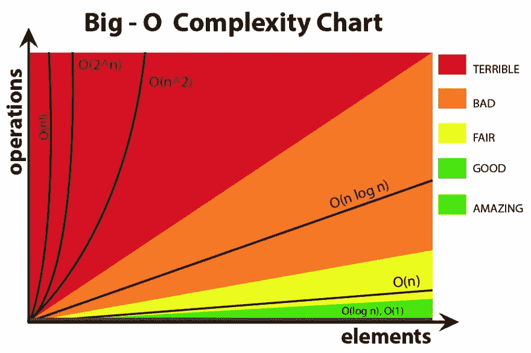

# 公元前 300 年的算法和良好的编程有什么关系？

> [https://dev . to/ericodex/o-que-um-算法-300-a-c-a-a-a-a-a-c-a-a-c-a-a-c-a-a-c-a-a-c-a-a-a-c-a-a-B- 3kk](https://dev.to/ericodex/o-que-um-algoritmo-de-300-a-c-tem-a-ver-com-boa-programacao-3kk)

### JavaScript 和 Python 中的算法采用纯粹的旧数学。

bom 算法是考虑所用处理时间和内存的算法。如果一个问题的复杂性呈指数级增长，那么解决该问题的代码即使在处理负载较重的情况下也需要优雅才能成功，下面的 euclidiana 方法就是明证。记住算法存在的原因是执行任务。考虑他们的资源是一种极好的做法，始终受到欢迎。

事实上，编程是极其强大的，即使你不知道如何解决一个问题，很有可能还是可以用计算机解决的。蛮力算法被广泛应用，是解决大部分问题的巨大锤子，就像计算中的许多其他东西一样，依靠摩尔定律，有效地找到了预期的结果。但是，它们通常不是降低计算成本的最有效方法，计算成本可以用程序运行的速度(“时间复杂性”)或所需的内存(“空间复杂性”)来衡量。

### 问题

最小公倍数是用编程的力量解决的一个奇妙的数学问题。我们很多人记得用铅笔和纸张解决 MMCs 和 MDCs。问题是编写一个程序，返回一组由最大和最小数字以及它们之间的所有整数组成的整数的最小公倍数。即 f_mmc(1，4)返回[1，2，3，4]的 mmc。作为可核查的控制对象，【18，19，20，21，22，23】的期望 MMC 为 60568020，而【15，16，18，19，20，21，22，23】的期望 MMC 为 411863760。

fora Bruta:

JavaScript - *错误的算法*:

`const {performance} = require('perf_hooks'); //Para contar o tempo var iter; // Contador de iterações. function f_mmc(x,y){ // Classifica x e y e encontra o menor e o maior let arr = [x,y]; arr.sort( (a,b)=>{return a>b}); // Cria 'arre' uma lista com todos os números inteiros entre X e Y inclusive. let arre = []; for(let i=arr[0];i<=arr[1];i++){ arre.push(i); } console.log('O MMC do conjunto: [' + arre + '] é:'); // Define (pior) como o produto de todos elementos do array let pior = arre.reduce( (a,b)=>{return a*b}); /** Verifica se o J q é múltiplo do maior elemento do conjunto é também múltiplo de todos os outros inteiros do conjunto, caso negativo J é incrementado pelo maior elemento do conjunto, se positivo J é o mínimo multiplicador comum. */ let v_lcm = false; iter = 0; for(let j=arre[arre.length-1];j<=pior;j+=arre[arre.length-1]){ let v_lcm = true; iter++; for(let e in arre){ iter++; if(j%arre[e]!==0){ v_lcm = false } } if(v_lcm==true){ return j; } } } // Marca início da execução var t0 = performance.now(); console.log(f_mmc(23,18)); // Marca final da execução var t1 = performance.now(); console.log("A execução de 'f_mmc' durou " + (t1 - t0) + " milissegundos."); console.log("A execução de 'f_mmc' teve " + iter + " iterações.");`

执行时间可能会因执行程式码的环境而有所不同。无论如何，过帐到活动循环中的迭代次数表示实现结果所需的计算成本。对我来说，一七七七毫秒到 1843380 次迭代，这看起来可能是一个几乎看不到的努力，但隐藏着一个可升级的危险。要从集合[15，16，17，18，19，20，21，22，23]返回 MMC，将需要 1.79 亿次迭代和大约 1 分钟的运行时间，直到使用此坏算法返回为止。

欧几里得的优雅:

对于这个提出的问题，欧几里得优雅是懂得关系的，比如:把两个整数之间的残片减去找到 MDC，用 MDC 找到 MMC 和经典的递归性。

JavaScript - *好算法*

`const {performance} = require('perf_hooks'); //Para registro do tempo var iter=0; // Contador de iterações. // Função recursiva q retorna o MDC de dois inteiros. function mdc(a,b){ iter++; if (b == 0){ return a; }else{ return mdc(b , a % b); } } // Função q utiliza o MDC para retornar o MMC de dois números inteiros. function mmc(a,b){ iter++; return ((a * b) / mdc(a,b)); } // Função com método recursivo que retorna o MMC de um conjunto de inteiros. function f_euclides_mmc(a,b){ // Ordena e cria (arre) com o conjunto de inteiros let arr = [a,b].sort( (a,b)=> a > b); let arre = []; for(let i=arr[0];i<=arr[1];i++){ arre.push(i); } console.log('O MMC do conjunto: [' + arre + '] é:'); // Função recursiva para retorno do MMC // Dado que mmc(a,b,c) = mmc(mmc(a,b)c) function f_mmc(cnj){ iter++; if (cnj.length == 2){ return mmc(cnj[0],cnj[1]); }else{ ar = [mmc(cnj[0],cnj[1]),...cnj.slice(2)]; return f_mmc(ar); } } return f_mmc(arre); } var t0 = performance.now(); console.log(f_euclides_mmc(23, 15)); var t1 = performance.now(); console.log('A execução de f_euclides_mmc durou '+ (t1-t0) + ' milissegundos.'); console.log("A execução de 'f_euclides_mmc' teve " + iter+ " iterações.");`

我用 Python 编写了同样的算法，可以在这台笔记本电脑上直接从浏览器编辑和运行这些算法。

单击“运行”运行这两个代码并检查结果。请注意，即使使用负荷较大的示例，euclidiana 数学函数也表现得异常高效，仅 49 次迭代即可正确返回[15，16，17，18，19，20，21，22，23]: 411863760(约 3 毫秒)。

这里最重要的不是装饰某个特定的算法或争夺数千秒的执行时间，而是理解解决任何问题的方法有数千种。欧几里得方法甚至可能不是解决这里提出的问题的最有效方法，但它考虑到了计算成本。找到优雅的方法取决于仔细观察与问题相符的现有数学关系。别搞错了，每个程序都是数学。

星球一棵树！