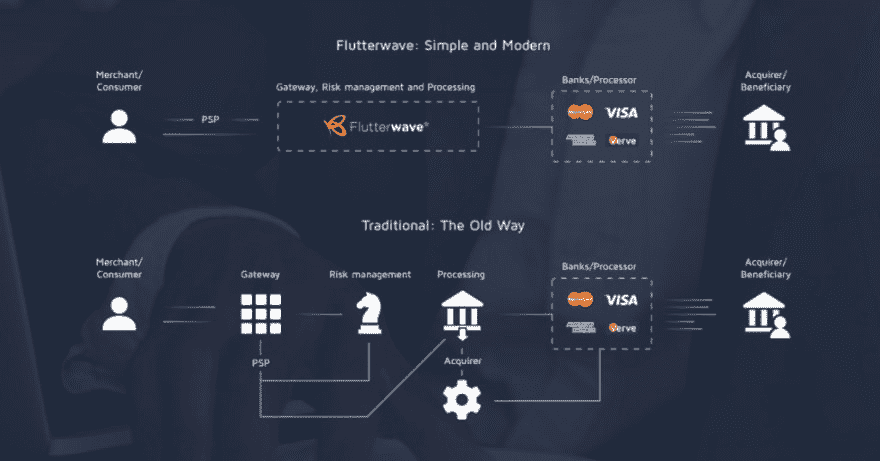
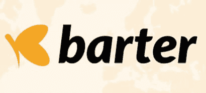

# flutter wave——通过支付技术改变非洲做生意的方式

> 原文:[https://dev . to/haanamiri/flutter wave-changing-the-way-the-Africa-doe-business-through-payment-technology-on3](https://dev.to/haanamiri/flutterwave-changing-the-way-the-africa-does-business-through-payment-technology-on3)

[T2】](https://res.cloudinary.com/practicaldev/image/fetch/s--b9Q4OZS_--/c_limit%2Cf_auto%2Cfl_progressive%2Cq_auto%2Cw_880/https://flutterwave.com/wp-content/uploads/2018/07/FLW-logo.svg)

[Flutterwave](https://flutterwave.com/ng) 是一个综合支付技术平台，目前由 25 名投资者资助，但由安德拉联合创始人[艾因·阿布耶吉](https://ng.linkedin.com/in/eaboyeji)与 Olugbenga Agboola 一起于 2016 年创立，它彻底改变了非洲企业与全球经济联系的方式。该公司获得了支付卡行业数据安全标准(PCI DSS)认证，是 Y Combinator 2016 年夏季批次的一部分，Y Combinator 是一家美国种子加速器，于 2005 年推出，并在推出初创公司方面发挥了重要作用，包括 Dropbox、Airbnb、Stripe、Reddit、Optimizely、Docker、Heroku。

非洲不是一个国家，但 flutter wave 旨在通过其支付 API 确保在她所在的任何地方做生意都像一个国家，该 API 使银行和企业更容易处理非洲大陆的支付，允许消费者用当地货币支付产品和服务。总部设在旧金山，在阿克拉、约翰内斯堡、拉各斯和内罗毕设有非洲办事处， [Flutterwave](https://flutterwave.com/ng) 极大地方便了在非洲经营的企业参与全球竞争。

所有这些在理论上听起来都很棒，但是这个自称为技术解决方案公司的实体是如何做到他们所声称的呢？

[T2】](https://res.cloudinary.com/practicaldev/image/fetch/s--4x-jIS7r--/c_limit%2Cf_auto%2Cfl_progressive%2Cq_auto%2Cw_880/https://blog.ycombinator.com/wp-content/uploads/2016/11/flutterwave-1024x537.png)

最终，他们不同于其他金融科技公司，如目前在尼日利亚科技领域的 Paystack，因为 flutterwave 为这些其他公司提供服务。简单来说？该公司将来自众多网关的支付服务整合在一个平台下，同时为银行、企业及其客户提供无缝、安全的支付解决方案，允许市场商户接受来自卡和银行账户的本地和国际汇款，因此企业不必承担费用和负担。他们的技术也为 PiggybankNG、Flywire、优步和许多其他公司提供服务。那么他们提供什么产品呢？

[T2】](https://res.cloudinary.com/practicaldev/image/fetch/s--MAjDoAvn--/c_limit%2Cf_auto%2Cfl_progressive%2Cq_auto%2Cw_880/https://meetanshi.com/media/catalog/product/cache/1/image/925f46717e92fbc24a8e2d03b22927e1/m/a/magento-2-rave-payment-gateway-354x.png)

[Rave by Flutterwave](https://flutterwave.com/ng/online-payments-products/rave/) 是一项由 mCASH(一种支付选项，允许消费者通过手机拨打 USSD 短码向商家支付)支持的服务，允许商家接受卡、银行账户和 USSD 的全球支付。它可以被整合到许多在线网站和平台，如 Megabet，甚至在 2017 年拉各斯的 jollof 音乐节上首次亮相。Rave 允许您接受一系列支付方式，包括来自世界各地客户的卡、银行账户和移动钱包支付，从而为您的业务带来更多机会。

[T2】](https://res.cloudinary.com/practicaldev/image/fetch/s--2TZ5yXHV--/c_limit%2Cf_auto%2Cfl_progressive%2Cq_auto%2Cw_880/https://static.wixstatic.com/media/77dce3_45c13b3b51154bc1bac3643810d371aa%257Emv2.jpg/v1/fill/w_410%2Ch_186%2Cal_c%2Cq_80%2Cusm_0.66_1.00_0.01/77dce3_45c13b3b51154bc1bac3643810d371aa%257Emv2.jpg)

他们的另一个产品是通过 flutter wave 实现的[易货，这是一个基于应用和网络的系统，允许用户在几秒钟内创建虚拟美元借记卡，用于一次性或定期使用，缩短了批准等待时间，只需要求提供工作电子邮件地址和电话号码，因为该服务依赖于用户银行已经获得的客户详细信息，并且通过他们新的附近功能，可以更容易地找到你附近的朋友并向他们汇款。](https://flutterwave.com/ng/online-payments-products/barter/)

在 Flutterwave 活跃的整整 3 年里，他们在非洲的技术和商业舞台上留下了自己的印记，一路赢得了赞誉。处理了超过 25 亿美元的支付，1 亿美元的交易，50 家非洲银行合作伙伴和 1200 多名开发人员，可以肯定地说 [Flutterwave](https://flutterwave.com/ng) 是人们认为不值得解决的问题的答案。Flutterwave 在 8 轮融资中筹集了总计 2040 万美元的资金，并在 2018 年 10 月成功完成了 A 轮融资，获得了万事达卡的投资，并欢迎 Visa 前董事长兼首席执行官乔·桑德斯(Joe Saunders)加入董事会。

金融行业内的主要合作伙伴关系，Arik Air、优步和 Flywire 等企业客户，包括 DusuPay(乌干达)、BroadPay(赞比亚)和 PennySmart(加纳)等新客户，以及 Rave 上信任他们帮助其发展业务的 26，000 家企业，都是 Flutterwave 取得“辉煌成就”的见证。它的年收入估计为 100 万美元，与 interswitch、gravity payments 和 CardFlight 等公司竞争。根据 PrivCo 的数据，截至 2017 年 7 月 31 日，Flutterwave 的估值在 1000 万至 5000 万美元之间。 [Flutterwave 获得了 2017 年在尼日利亚拉各斯举行的西非移动奖](https://eventschronicles.com/west-africa-mobile-awards-flutterwave-nairabox-others-win-at-2017-edition-photos-events/)最佳商业和零售服务奖。最近，他们[与中国电子商务公司阿里巴巴的支付宝](https://cyberblog.in/facebook/flutterwave-and-alipay-partner-on-payments-between-africa-and-china/)合作，提供非洲和中国之间的数字支付，继今年早些时候 Flutterwave 和 visa 之间的合作之后，推出了一款面向非洲的消费者支付产品，名为 GetBarter，帮助用户管理本币资金，提供关于消费模式的详细报告，并提供一个易于偿还的短期贷款选项，直接从应用程序中获得。

Flutter wave 在 techverse 上也非常明显，是培养有前途的开发人员的领导者之一，因为该公司非常以开发人员为导向，自称是年轻技术爱好者展示自己的最佳场所之一，难怪他们是大多数软件工程师想要实现的目标。

[T2】](https://res.cloudinary.com/practicaldev/image/fetch/s--bBHjiGXL--/c_limit%2Cf_auto%2Cfl_progressive%2Cq_auto%2Cw_880/https://i0.wp.com/cyberblog.in/wp-content/uploads/2019/07/Flutterwave-and-Alipay-partner-on-payments-between-Africa-and-China.jpg%3Fw%3D750%26ssl%3D1)

最近，flutterwave 为来自安德拉的下岗开发人员成功组织了一场招聘会，以吸引人才加入他们的队伍，并让他们接触到其他需要他们的公司。与所有技术解决方案公司一样；没有人能免于困难。由于不同的国家有他们自己的数字支付方式，由于系统的分散，这带来了不同的问题。如今，大多数非洲商人不接受数字支付，因为他们没有资源来整合不涉及现金的不同支付方式。尼日利亚政府咄咄逼人的反击和高昂的许可费已经以不小的方式表明了他们希望进一步扩大技术差距的立场。

不管怎样，未来对 [Flutterwave](https://flutterwave.com/ng) 来说更光明，因为他们的现在是光明的。非洲商业生态系统与数百万部手机产生的数据相互作用，青年人口增长和非洲大陆的多样性提供了大量资源， [Flutterwave](https://flutterwave.com/ng) 将毫不犹豫地利用这些资源来改变世界与非洲做生意的方式。

你可以在以下任何一个社交媒体平台上找到 flutter wave [Instagram](https://www.instagram.com/theflutterwave) 、 [Twitter](https://twitter.com/flutterwave?lang=en) 、 [LinkedIn](https://www.linkedin.com/company/flutterwave) 和[脸书](https://www.facebook.com/theFlutterwave/)。

金融科技行业将密切关注新项目，以及公司会创新多少和在哪些领域创新。用创始人艾因·阿博耶吉——*的话说，“解决一个真正的大问题是值得的”。*