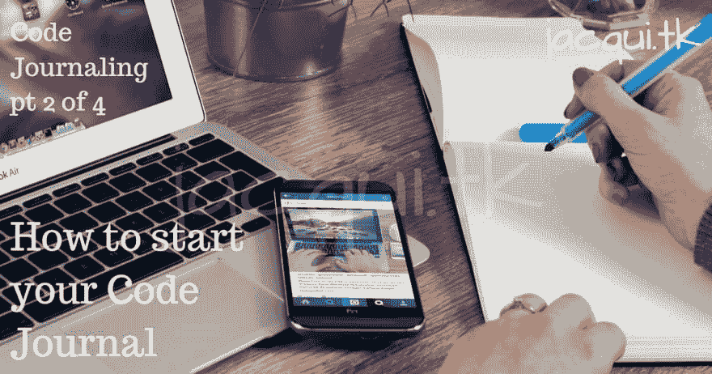

# 如何开始你的代码日志|代码日志第 2 部分，共 4 部分

> 原文：<https://dev.to/jacquibo/how-to-start-your-code-journal-code-journaling-pt-2-of-4-4p7n>

在我的代码日志系列的第二篇文章中，我将介绍如何开始你自己的代码日志。

## 选择你的媒介

你的代码日志的媒介是一个重要的决定。正如内容对你来说是个性化的一样，你对模拟或数字的偏好，以及在这些类别中对媒体的确切选择也是个性化的。

有些人可能已经在使用笔记本(模拟)了，有些人可能完全转而使用 Evernote(数字)做任何事情。以下是每一类的一些优点和缺点，以及每一类的一些非详尽选项:

> 模拟比数字更漂亮，真的，但我们追求舒适。
> 
> 安东·柯班

## 模拟

这一类别涵盖了不需要手机、平板电脑或电脑等设备就能访问的一切东西(即没有电)。

### 优点

*   你慢下来，想想你在写什么。
*   你不能被黑，也不能丢失数据。
*   写作能更好地刺激和吸引你的大脑，而且已经被证明比打字产生更多的内容，表达更多的想法，速度也更快。 [1](https://www.ncbi.nlm.nih.gov/pubmed/16390289)
*   它让你远离屏幕！

### 弊

*   如果你丢失了它，没有备份(除非你做一个备份)。
*   只有物理副本所在的地方才能访问它。

### 模拟选项

#### [B5 圆点笔记本](https://www.amazon.co.uk/ZenART-Faux-Leather-Dotted-Journal-Notebook/dp/B07MQ77JL5)

我发现这对于代码日志来说是一个很好的尺寸，不算太小，但是足够的空间并且不笨重。点状纸是最灵活的，因为你可以用它轻松地书写文本行、创建表格或绘制图表。我个人使用这个 [ZenArt 笔记本](https://www.amazon.co.uk/gp/product/B074GB54KS/)，但是他们的更新版本链接到上面。

#### [A5 圆点笔记本](https://www.amazon.co.uk/gp/product/B07GWF2H53/)

对于那些想要节省重量或空间的人来说，小一些，或者你的小笔迹可能会在较大的笔记本中丢失。还是那句话，我推荐 dotted，不过看你自己了。我曾亲自用一个[潦草的本子](https://www.amazon.co.uk/gp/product/B07GWF2H53/)为其他项目点题。

#### [A4 圆点笔记本](https://www.amazon.co.uk/Moleskine-Notebook-Extra-Dotted-Myrtle/dp/B07J33Q4CN)

对于那些希望页面上有更多空间的人。Moleskine 生产了一款[超大圆点笔记本](https://www.amazon.co.uk/Moleskine-Notebook-Extra-Dotted-Myrtle/dp/B07J33Q4CN)，我听说过它的好消息。

#### 带有可移动页面的笔记本或文件夹和纸垫

如果你喜欢移动你的内容来组织它，那么这些选项是适合你的(虽然我会告诉你所有关于使用索引，它否定了移动东西的需要，稍后)。

## 数字

有许多数字选项，有些在特定的物理设备上，有些在云中，无论你在哪里都可以访问。你可能已经在使用几台数码笔记本了。

### 优点

*   可以从多个地方进入。
*   易于备份。
*   快速搜索。
*   可以让你更容易坚持写日记的习惯，无论是哪一种。

### 弊

*   如果你的账户被黑了，你的数据可能会被盗或者全部丢失。
*   使用数字设备(电子邮件、脸书等)时会有很多干扰。

### 数字选项

#### [Evernote](https://evernote.com/)

非常适合组织您的编码日志，并且可以通过拥有多个笔记本同时用于其他事情。可通过文本和标签搜索，并可高度定制。

#### [博客](https://wordpress.org/)

自己主持或使用 WordPress.com。您可以控制帖子是公开的还是私人的。有很多插件可以进行大量的定制。

#### [迪亚洛](https://diaroapp.com/)

在线、安卓、iOS 和亚马逊均有售。一个非常灵活的日记 app。其他类似的 app 也有，但是这个是我用过的。

#### 一个单词，谷歌文档，或者另一个类似的在线文档

使用文件夹结构和适当类型的文件，在 Office Online、Google Docs、Zoho 或类似软件中创建一个适合你的系统。

## 我的偏好

对于我的代码日志，我目前使用的是一个 [ZenArt B5 点状笔记本](https://www.amazon.co.uk/gp/product/B074GB54KS/)。我发现它的大小正适合我想用它做的事情，而且质量好，物有所值。点状纸可灵活书写、表格或绘图。(现在[有了这款笔记本的新版本](https://www.amazon.co.uk/ZenART-Faux-Leather-Dotted-Journal-Notebook/dp/B07MQ77JL5)

我使用主索引和部分索引，所以我可以很容易地找到东西。它让我远离屏幕，让我放慢速度，断开连接，让写作流畅起来。

## 接下来呢？

在我的下一篇关于代码日志的文章中，我将会看看在你的代码日志中应该写些什么。

最初发表于 2019 年 9 月 16 日[http://www.jacqui.tk/blog](http://www.jacqui.tk/blog)。