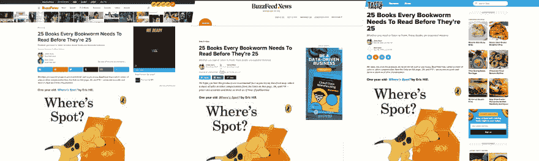

# 为什么我们在 BuzzFeed 使用微前端

> 原文：<https://dev.to/buzzfeedtech/why-we-use-micro-frontends-at-buzzfeed-1k9o>

“微前端”的定义可能还没有达成共识。DAZN 的聪明人认为它是由客户端编排器管理的一系列完整页面。其他方法，如 [OpenComponents](https://opencomponents.github.io/) ，由多个微前端组成单个页面。

BuzzFeed 的用例介于两者之间。我不会说我们有微前端架构；然而，我们确实在页面的一些部分利用了它们。如果 API 返回完全呈现的 html(和资产)，而不是一个`<html>`或`<body>`元素，我们认为它是一个微前端。

我们有三个微前端:标题组件、文章内容和我们的交互式嵌入。每一个都采用了微前端方法，因为它们提出了真实而独特的业务问题。

## 微前端#1:表头

*为什么？组件分布*

这是 buzzfeed.com 头球。它有一个轻量级的配置层以及合理数量的代码:肯定足以证明它值得抽象，而不是在我们所有的服务中重复它。

最初，我们进行了抽象，并将其提取到 npm 包中，服务将其作为构建过程的一部分导入。这使我们能够消除重复，并让服务将头文件捆绑为其自身构建流程的一部分(这意味着我们可以轻松地对常见代码和库进行重复数据删除)。

只有两三个服务，这种技术工作得很好，但我们有超过十个渲染服务支持 buzzfeed.com。这意味着每次我们想要对标题进行更改时，我们都必须对以下内容进行 10 次以上的更改:

*   更新标题中的代码
*   提出拉取请求
*   合并并发布到 npm
*   更新 service package.json
*   提出拉取请求
*   合并和部署服务

这变得非常耗时，并导致团队避免因此而改变标题。当然，我们可以用一些方法来改进这个工作流程(例如，使用松散的 semver 并重新构建服务，自动更新和创建服务 PRs ),但这些方法仍然是错误的。通过迁移到微前端模式，我们现在能够将报头即时分发到所有服务，并且在整个 buzzfeed.com 更新报头的工作流现在是:

*   更新标题中的代码
*   提出拉取请求
*   展开割台

## 微前端#2:发布内容(或者我们称之为:Subbuzzes)

*为什么？维护与 CMS 的合同*

我们的内容有几个不同的“目的地”(例如 BuzzFeed 和 BuzzFeed News)，但每个目的地都由一个 CMS 提供支持。每个目的地都有自己的服务(或多个服务),连接到我们的内容 API。这意味着我们有能力在多个目的地呈现相同的内容；然而，实际上我们选择不这样做。

这也意味着我们必须维护 CMS /内容 API 和呈现服务之间的契约。为了说明这一点，更容易关注一个例子。

当编辑想要在页面上添加图片时，他们在 CMS 中选择图片“subbuzz”并上传。然后，他们可以选择向该图像添加扩展。一个这样的扩展是将图像标记为显示图形内容的能力。添加这个扩展的目的是图像会变得模糊，用户必须选择加入才能看到它(这对于敏感的新闻内容尤其重要)。至于 CMS 所关心的，所有这一切都意味着是一个针对图像存储的布尔值。因为 CMS 依赖于渲染服务来添加一个模糊的覆盖图，所以我们最终得到了两者之间的隐式耦合。如果一个目的地不支持这一功能，那么用户将会接触到图形内容，我们将无法维护编辑的意图。

那么这和微前端有什么关系呢？

我们可以选择将这些 subbuzz 模板抽象成一个 npm 包，并在目的地之间共享它们；然而，当我们在 CMS 中改变对某些东西的支持时，我们需要渲染服务能够立即反映出来。CMS 是在未版本化的状态下部署的，内容 API 只公开主要版本号。使用 semver 将这些与 npm 包耦合并通过包部署会使它们更难保持同步。通过将 subbuzzes 移到 HTTP API 后面，我们可以跨所有目的地立即更新 rendering-cms 契约，并保证每个目的地都支持最新的 cms 特性。

## 微前端#3:嵌入式(Buzz 格式平台)

*为什么？独立于平台*

也许微前端最清晰的用例是:嵌入。我们托管了大量嵌入内容(Instagram、Twitter 等。)，包括第一方嵌入。我们称这些 BFP 代表 Buzz 格式平台，它们可以是任何东西，从时事通讯注册到可重复使用的测验格式或支持调查故事的定制格式。

嵌入的入口点通常是一个 iframe 或者一个 script 元素，所以它本身并不算是微前端。我们打破了这种模式(在可能的情况下),将它们呈现在服务器端，并将返回的 DOM 直接包含在页面中。我们这样做是为了以分布式格式呈现嵌入内容(比如我们的 BuzzFeed 移动应用或 Facebook 即时文章),并向搜索引擎爬虫展示内容。

BFP 提供了独立于平台的功能，让工程师有了在一个小组件上工作的感觉，而不必考虑更广泛的 BuzzFeed 生态系统。这种感觉是我们在创建开发者环境时一直试图达到的，微前端无疑提供了这种机会。

## 取舍

微前端架构可以给你很好的开发体验和很大的灵活性，但是它们不是免费的。你用它们来交换:

### 更大的客户端资产或更困难的编排

我们在浏览器中构建我们的微前端，这意味着没有单一的构建流程可以优化和删除共享依赖项。要在浏览器级别实现这一点，您需要对所有依赖项进行代码拆分，并确保使用相同的版本——或者构建在编排层中。

### 发布更新时风险较高

正如我们能够跨许多服务即时发布新的变更一样，我们也能够发布 bug 和错误。这些错误也会在运行时出现，而不是在构建时或 CI 中出现。我们将这种高风险作为一个机会，更多地关注测试并确保组件契约得到维护。

也有批评说，微前端使 UX 更难有凝聚力，但这不是我们经历过的。所有这些微前端都通过共享包继承了设计模式和更小的组件。

总的来说，微前端模式在这些用例中对 BuzzFeed Tech 来说工作得很好，并且在过去的一两年中得到了很好的测试。肯定会有一个转折点，如果有更多的组件，将需要更多的工作来抵消第一个权衡，但是，我们不认为我们还没有到那一步，也不预期很快会到那一步——将组件抽象为共享包对于我们的大多数情况来说都很好。在没有的地方，有另一个架构模式来实现是很好的。