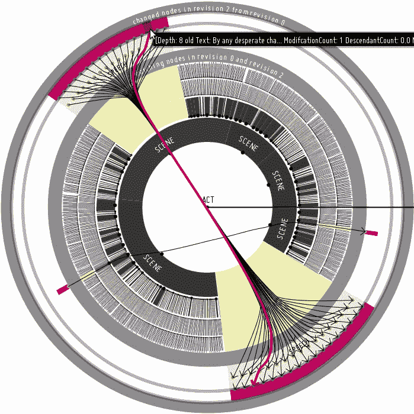
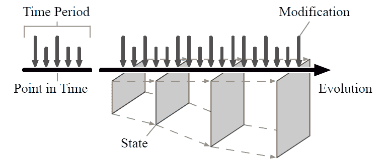
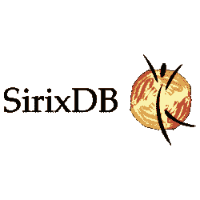
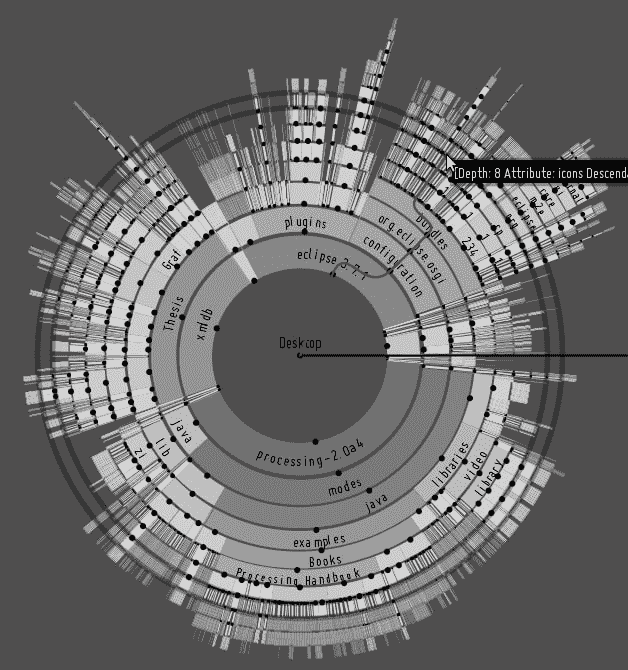

# 搜索贡献者(Hacktoberfest) /开源项目(SirixDB) /构建一个 Vue.js 和 D3.js 前端

> 原文:[https://dev . to/johanneslichtenberger/searching-contributors-open-source-project-Siri xdb-building-a-vue-js-and-D3-js-frontend-34 E4](https://dev.to/johanneslichtenberger/searching-contributors-open-source-project-sirixdb-building-a-vue-js-and-d3-js-frontend-34e4)

# SirixDB——XML 和 JSON 的版本化 NoSQL 数据存储

## [](#feel-free-to-contribute-on-github)随时投稿上 **[GitHub](https://github.com/sirixdb/sirix)** 💚

大家好，

**我刚刚创建了我的第一个 *Vue.js* 项目，为 [SirixDB](https://sirix.io) 构建一个 web 前端，并了解单页应用程序、TypeScript、D3.js、Vue.js 和一般的前端世界。**

请耐心听我说，我只是让帖子更具可读性:-)

我首先想说一些关于 SirixDB 的目的是什么以及为什么我们需要另一个(版本化的)数据库系统的事情。

[T2】](https://res.cloudinary.com/practicaldev/image/fetch/s--yoCr9B4j--/c_limit%2Cf_auto%2Cfl_progressive%2Cq_auto%2Cw_880/https://sirix.img/moves-cut.png)

## [](#sirixdb)SirixDB

**SirixDB 是关于数据的有效版本控制(目前 XML 和 JSON 以二进制格式存储)**。

也就是说，一方面，它通过一种新颖的*滑动快照算法*和*动态页面压缩*，降低了每次事务提交期间存储新版本的存储成本，同时平衡了读写性能。另一方面，SirixDB 支持简单的*时间旅行查询功能*，例如通过时间戳打开特定修订或通过给定时间跨度打开若干修订，导航到树结构中节点的未来或过去版本，等等。它基本上从不覆盖数据，批量写入并按顺序同步它们。它深受 ZFS 和吉特的启发。它借用了一些想法，并在子文件级别上进行测试。

[T2】](https://res.cloudinary.com/practicaldev/image/fetch/s--yePlsyUD--/c_limit%2Cf_auto%2Cfl_progressive%2Cq_auto%2Cw_880/https://sirix.img/evolution-of-state.png)

与其他方法形成鲜明对比的是，SirixDB 将写入时复制语义与数据库页面级版本控制相结合，并且不需要预写日志来实现一致性(当新版本提交到持久存储时，最后创建新的 UberPage)。

存储引擎是从头开始编写的，SirixDB 数据库中的资源基本上由 UberPage 下的许多基于哈希数组的尝试组成，这是主入口点。

这一切开始于 2006 年左右，是马克·克拉米斯的一个大学/博士项目。我从 2007 年就开始从事这个项目，并完成了我的学士论文、硕士论文、学士和硕士项目以及几个关于该项目的 HiWi-Jobs，我比以往任何时候都更渴望提出一个版本化的分析平台的想法，以根据数据的当前和历史执行分析任务。

## [Siri xdb](https://github.com/sirixdb)/[sirix](https://github.com/sirixdb/sirix)

### SirixDB 有助于高效地存储和查询时态数据。每次提交都会存储一个节省空间的快照。它是日志结构，从不覆盖数据。SirixDB 使用一种新颖的页面级版本控制方法，称为滑动快照。

<article class="markdown-body entry-content container-lg" itemprop="text">

[](https://travis-ci.org/sirixdb/sirix)[](https://raw.githubusercontent.com/sirixdb/sirix/master/#contributors)[](https://www.codefactor.io/repository/github/sirixdb/sirix)[](http://makeapullrequest.com)[](https://search.maven.org/search?q=g:io.sirix)[](https://coveralls.io/github/sirixdb/sirix?branch=master)

[T2】](https://raw.githubusercontent.com/sirixdb/sirix/master/logo.png)

[T2】](https://twitter.com/intent/tweet?text=SirixDB+-+a+storage+system%2C+which+creates+%28very+small-sized%29+snapshots+of+your+data+on+every+transaction-commit+through+the+implementation+of+a+novel+sliding+snapshot+algorithm.&url=http://sirix.io&via=sirix&hashtags=versioning,diffing,xml,kotlin,coroutines,vertx)

[T2】](https://twitter.com/sirixdb)

[下载 ZIP](https://github.com/sirixdb/sirix/archive/master.zip) | [加入我们的 Slack](https://join.slack.com/t/sirixdb/shared_invite/enQtNjI1Mzg4NTY4ODUzLTE3NmRhMWRiNWEzMjQ0NjAxNTZlODBhMTQzMWM2Nzc5MThkMjlmMzI0ODRlNGE0ZDgxNDcyODhlZDRhYjM2N2U) | [社区论坛](https://sirix.discourse.group/)

正在处理你的第一个拉动式请求？你可以从这个*免费*系列[中学习如何为 GitHub 上的开源项目做贡献](https://egghead.io/series/how-to-contribute-to-an-open-source-project-on-github)以及另一个教程:[如何为 OSS 做贡献，一个初学者指南](https://dev.to/itnext/how-you-can-contribute-to-oss-36id)

# 一个进化的、时态的 NoSQL 文档存储库

## 高效地存储和查询数据修订

> “记住你是幸运的，即使你不认为你是幸运的，因为总有一些事情是你可以感恩的。”——埃斯特·格雷斯伯爵([http://tswgo.org](http://tswgo.org))

我们目前支持 XML 和 JSON 数据的存储和(时间旅行)查询，我们的二进制编码是为支持版本控制而定制的。我们的索引结构和整个存储引擎都是从头开始编写的，以支持本地版本控制。将来，我们可能还会支持其他数据格式的存储和查询。

[T2】](https://raw.githubusercontent.com/sirixdb/sirix/master/showcase/screencast-three-revisions-faster.gif)

**注意:在**上工作…

</article>

[View on GitHub](https://github.com/sirixdb/sirix)

下面的时间旅行查询给出了一个可能的初步印象:

```
let  $doc  :=  jn:open('database','resource',  xs:dateTime('2019-04-13T16:24:27Z'))  let  $statuses  :=  $doc=>statuses  let  $foundStatus  :=  for  $status  in  bit:array-values($statuses)  let  $dateTimeCreated  :=  xs:dateTime($status=>created_at)  where  $dateTimeCreated  >  xs:dateTime("2018-02-01T00:00:00")  and  not(exists(jn:previous($status)))  order  by  $dateTimeCreated  return  $status  return  {"revision":  sdb:revision($foundStatus),  $foundStatus{text}} 
```

该查询打开一个数据库，并在其中打开一个基于时间戳(*2019–04–13t 16:24:27Z*)的特定修订版的资源。然后，它会搜索所有状态，这些状态的*创建时间为时间戳*，必须晚于 2018 年 2 月 1 日，并且在之前的版本中不存在。 *= >* 是一个解引用操作符，用于解引用 JSON 对象中的键。您可以使用函数 bit:array-values 或通过指定一个从零开始的索引来访问数组值: *array[[0]]* ，例如，指定数组的第一个值。

[T2】](https://res.cloudinary.com/practicaldev/image/fetch/s--5EPDdQWR--/c_limit%2Cf_auto%2Cfl_progressive%2Cq_auto%2Cw_880/https://sirix.img/sunburstview-cut.png)

### [](#design-goals)设计目标🔥

一些最重要的核心原则和设计目标是:

**Concurrent**

SirixDB contains very few locks and aims to be as suitable for multithreaded systems as possible

**Asynchronous**

operations can happen independently; each transaction is bound to a specific revision and only one read/write-transaction on a resource is permitted concurrently to N read-only-transactions

**Versioning/Revision history**

SirixDB stores a revision history of every resource in the database without imposing extra overhead

**Data integrity**

SirixDB, like ZFS, stores full checksums of the pages in the parent pages. That means that almost all data corruption can be detected upon reading in the future, we aim to partition and replicate databases in the future

**Copy-on-write semantics**

similarly to the file systems Btrfs and ZFS, SirixDB uses CoW semantics, meaning that SirixDB never overwrites data. Instead, database-page fragments are copied/written to a new location

**Per revision and per page versioning**

SirixDB does not only version on a per revision, but also on a per page-base. Thus, whenever we change a potentially small fraction of records in a data-page, it does not have to copy the whole page and write it to a new location on a disk or flash drive. Instead, we can specify one of several versioning strategies known from backup systems or a novel sliding snapshot algorithm during the creation of a database resource. The versioning-type we specify is used by SirixDB to version data-pages

**Guaranteed atomicity (without a WAL)**

the system will never enter an inconsistent state (unless there is hardware failure), meaning that unexpected power-off won't ever damage the system. This is accomplished without the overhead of a write-ahead-log ([WAL](https://en.wikipedia.org/wiki/Write-ahead_logging))

**Log-structured and SSD friendly**

SirixDB batches writes and syncs everything sequentially to a flash drive during commits. It never overwrites committed data

## [](#contributions)贡献

我已经在一些公开的问题上添加了 **#hacktoberfest** 标签，但我猜现在最有趣的部分将是 web 前端。我设想了某些交互的可能性，例如简单地查询 SirixDB 并显示结果，但也有交互的可视化来显示存储在 SirixDB 中的资源的版本之间的变化(基本上比较 XML 和 JSON)。甚至可能是一堆相互同步的视觉化图像。

我在一个 Java Swing GUI 中实现了一些想法，并通过处理构建了嵌入式可视化( [YouTube 截屏](http://www.youtube.com/watch?v=l9CXXBkl5vI)，而你可以在我的[硕士论文](https://github.com/JohannesLichtenberger/master-thesis/raw/master/Master/Thesis/thesis.pdf)中找到详细的解释和截屏)。正如你们中的一些人告诉我的，关于 web 前端，我喜欢将 d3js 与 Vue.js 结合使用，但我对前端的东西真的很陌生。

让我知道你的想法:-)社区努力将是有史以来最棒的事情。你会渴望帮助吗？尤其是因为我通常是后端工程师，可能会纠结很多次。

BTW:在不久的将来，另一个想法是用分布式日志来扩展 SirixDB，最有可能的是直接通过 Apache BookKeeper 或 Apache Pulsar 而不是 Kafka。

## [](#feel-free-to-contribute-on-github)随时投稿上 **[GitHub](https://github.com/sirixdb/sirix)**

子目〔t0〕约翰尼斯