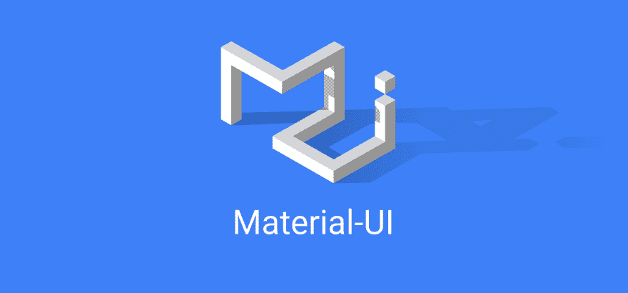
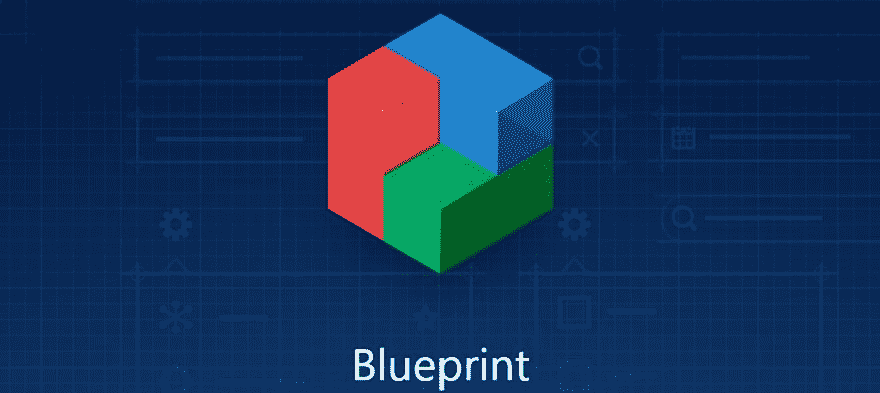
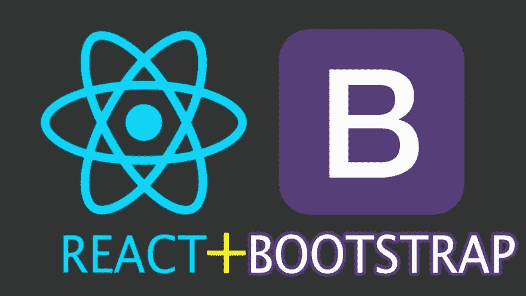
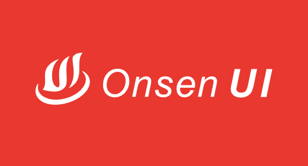
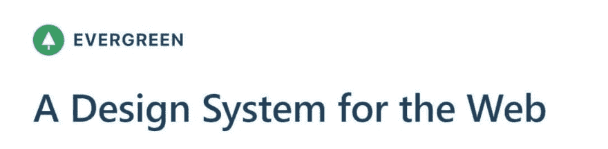
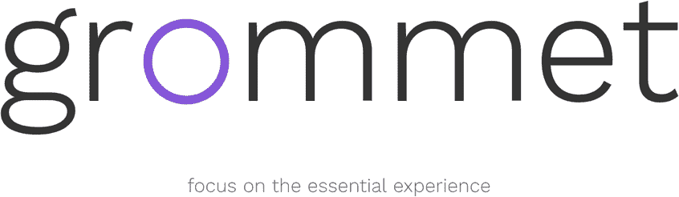
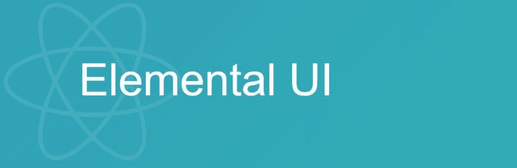

# 2019 年最佳和最受欢迎的 8 个 React 库

> 原文:[https://dev . to/x-team/8-best-and-most-popular-react-libraries-in-2019-3bi 9](https://dev.to/x-team/8-best-and-most-popular-react-libraries-in-2019-3bi9)

React 是当今最受欢迎的 web 框架之一。React 由脸书开发，于 2013 年发布，被开发人员广泛用于构建引人注目的用户界面。

React 由组件组成，这些组件是独立的、可重用的代码片段。这些组件的功能类似于 JavaScript 函数，只是它们独立工作并通过呈现函数返回 HTML。

鉴于 React 的开源性质，开发人员已经创建了惊人的 React UI 组件库，可以大大加快您的工作速度。这里有 8 个最好的和最受欢迎的。

### [Material-UI](https://github.com/mui-org/material-ui)

[T2】](https://res.cloudinary.com/practicaldev/image/fetch/s--yul8T8FO--/c_limit%2Cf_auto%2Cfl_progressive%2Cq_auto%2Cw_880/https://res.cloudinary.com/dukp6c7f7/image/upload/f_auto%2Cfl_lossy%2Cq_auto/s3-ghost/2019/09/Material-UI.png)

Material-UI 是最流行的 React UI 组件库。这是一组 React 组件，是根据谷歌的材料设计创建的。它简单、轻便、用户友好，并且仍然会频繁更新。

Material-UI 被 NASA、Capgemini、Bethesda、Uniqlo 和 J.P. Morgan 等公司广泛使用。

### [蚂蚁设计](https://github.com/ant-design/ant-design)

[T2】](https://res.cloudinary.com/practicaldev/image/fetch/s--UmHn5wrb--/c_limit%2Cf_auto%2Cfl_progressive%2Cq_auto%2Cw_880/https://res.cloudinary.com/dukp6c7f7/image/upload/f_auto%2Cfl_lossy%2Cq_auto/s3-ghost/2019/09/Ant-Design.svg)

Ant Design 是一个带有 React UI 库的设计系统，具有高质量的组件和交互式 UI 演示。它完全是用具有可预测静态类型的 TypeScript 编写的，因此很容易掌握和理解。

蚂蚁设计支持现代浏览器和 Internet Explorer 9+，以及服务器端渲染和电子。

### [蓝图](https://github.com/palantir/blueprint)

[T2】](https://res.cloudinary.com/practicaldev/image/fetch/s--MXH5xe8B--/c_limit%2Cf_auto%2Cfl_progressive%2Cq_auto%2Cw_880/https://res.cloudinary.com/dukp6c7f7/image/upload/f_auto%2Cfl_lossy%2Cq_auto/s3-ghost/2019/09/Blueprint.jpg)

Blueprint 是一个 React UI 工具包，由美国一家专门从事大数据分析的科技公司 Palantir 打造。该工具包包含 40 多个组件，主要用于运行在现代浏览器和 IE11 中的复杂和数据密集型桌面应用程序。

### [反应-自举](https://github.com/react-bootstrap/react-bootstrap)

[T2】](https://res.cloudinary.com/practicaldev/image/fetch/s--bjkgLjkf--/c_limit%2Cf_auto%2Cfl_progressive%2Cq_auto%2Cw_880/https://res.cloudinary.com/dukp6c7f7/image/upload/f_auto%2Cfl_lossy%2Cq_auto/s3-ghost/2019/09/React-Bootstrap.jpg)

React-Bootstrap 完全依赖于 Bootstrap 样式表，可以处理 Bootstrap 用户熟悉的数千个主题。每个组件都是从零开始构建的，作为一个真正的 React 组件，不需要像 jQuery 这样不必要的依赖。

因为 React 组件模型让您可以更好地控制每个组件的形式和功能，所以 React-Bootstrap 是在考虑可访问性的情况下构建的。结果是一组缺省可访问的组件，而普通的引导程序已经可以做到这一点。

### [温泉 UI](https://github.com/react-toolbox/react-toolbox)

[T2】](https://res.cloudinary.com/practicaldev/image/fetch/s--zKzayxAm--/c_limit%2Cf_auto%2Cfl_progressive%2Cq_auto%2Cw_880/https://res.cloudinary.com/dukp6c7f7/image/upload/f_auto%2Cfl_lossy%2Cq_auto/s3-ghost/2019/09/Onsen-UI.png)

如果你想构建跨平台的移动网络应用，Onsen UI 是一个很好的组件库。这是一个移动应用程序开发框架，使用 HTML5 和 JavaScript，并提供与 Angular、Vue 和 React 的集成。

Onsen UI 提供了标签页、侧边菜单、堆栈导航和许多其他组件，这些组件都有 iOS 和 Android 材质设计支持和自动样式，将根据平台的不同改变应用的外观。

### [常青](https://github.com/segmentio/evergreen)

[T2】](https://res.cloudinary.com/practicaldev/image/fetch/s--090NQ6RY--/c_limit%2Cf_auto%2Cfl_progressive%2Cq_auto%2Cw_880/https://res.cloudinary.com/dukp6c7f7/image/upload/f_auto%2Cfl_lossy%2Cq_auto/s3-ghost/2019/09/Evergreen.jpg)

Evergreen 的 UI 组件特别适合企业 web 应用程序。它的组件构建在 React UI 原语上，因此非常灵活。它们包括按钮、菜单、切换、覆盖、文本输入等等。

### [索环](https://github.com/grommet/grommet)

[T2】](https://res.cloudinary.com/practicaldev/image/fetch/s--MPa0yn0U--/c_limit%2Cf_auto%2Cfl_progressive%2Cq_auto%2Cw_880/https://res.cloudinary.com/dukp6c7f7/image/upload/f_auto%2Cfl_lossy%2Cq_auto/s3-ghost/2019/09/Grommet.png)

Grommet 是一个组件库，旨在提供响应迅速且可访问的移动优先 web 应用。它在一个小的包中提供了可访问性、模块化、响应性和主题化。它被网飞、通用电气、优步、波音等公司使用。

### [元素 UI](https://github.com/elementalui/elemental)

[T2】](https://res.cloudinary.com/practicaldev/image/fetch/s--J--pQ9dN--/c_limit%2Cf_auto%2Cfl_progressive%2Cq_auto%2Cw_880/https://res.cloudinary.com/dukp6c7f7/image/upload/f_auto%2Cfl_lossy%2Cq_auto/s3-ghost/2019/09/Elemental-UI.jpg)

Elemental UI 的开发人员认为，需要一组高质量的、模块化的 UI 脚手架组件和 React 控件，从一开始就构建这些组件和控件，以本机实现 React 模式。

因此，他们构建了 Elemental UI，帮助您使用 CSS、按钮、表单、微调器、模态和其他组件。该项目仍在开发中，但已经在 GitHub 上获得了 4000 多颗星。

* * *

你用其他的 React UI 库吗？哪些？请在评论中告诉我👇。