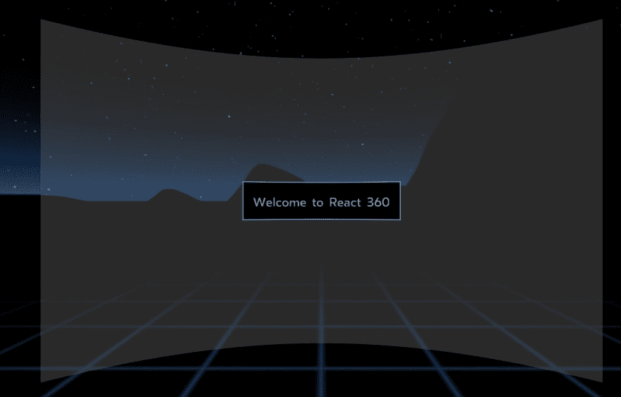
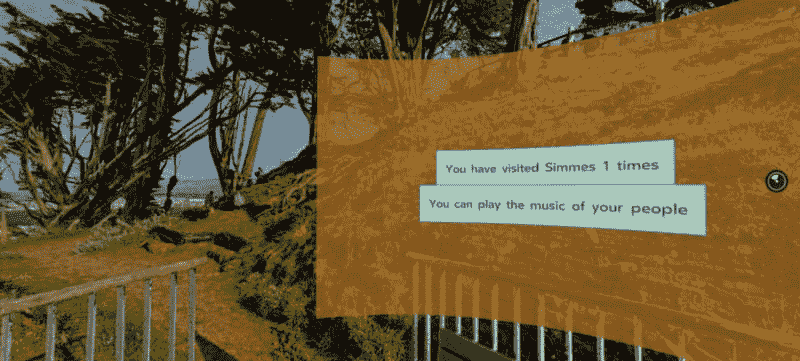

# 使用 React360 制作您的第一款虚拟现实应用

> 原文：<https://dev.to/flippedcoding/making-your-first-vr-app-with-react360-22f>

身处科技社区，不可能不知道虚拟现实或 VR 的兴起。游戏系统、移动应用程序和网络应用程序都利用了虚拟现实提供的功能。最棒的是，如果你熟悉 React 生态系统，那么你就可以直接开始构建 VR 应用了！React 360 是一个使用许多 React 原生功能来构建 VR 应用程序的库，这是作为 VR 开发人员的一个很好的入门方式。

我们将使用 React 360 完成一个简单的交互式 VR 应用程序的设置。到本教程结束时，你应该准备好开始增加你的 VR 应用程序的复杂性，并使其更加用户友好。我会在最后给你一些建议，以防你需要一个小小的启动。

## [T1】安装 React 360 CLI](#install-react-360-cli)

您需要做的第一件事是安装 React 360 CLI。这将为您提供构建 VR 应用程序所需的命令。因此，打开您的终端并导航到您想要创建这个项目的文件夹。然后运行这个命令。

```
npm install -g react-360-cli 
```

Enter fullscreen mode Exit fullscreen mode

这将在全局范围内安装它，因此您在以后的项目中不必再次这样做。您在项目文件夹中的唯一原因是使下一步更容易。现在，您将使用以下命令创建一个名为“vr-project”(非常有创意)的新 VR 项目。

```
react-360 init vr-project 
```

Enter fullscreen mode Exit fullscreen mode

现在你有了一个基于 React 360 打造的全新 VR 应用！要查看它在浏览器中的样子，您可以使用终端进入 vr-project 文件夹，然后运行 npm start。它应该会告诉你在浏览器中该去哪里，但如果没有，尝试导航到[http://localhost:8081/index . html](http://localhost:8081/index.html)。您应该会看到类似这样的内容。

[](https://res.cloudinary.com/practicaldev/image/fetch/s--UyzAblef--/c_limit%2Cf_auto%2Cfl_progressive%2Cq_auto%2Cw_880/https://miro.medium.com/max/1600/0%2AQSZfhmAIYwFAqEyr.png)

让我们浏览一下项目，讨论一下代码。您将关注的主要文件是 index.js 和 client . js。index . js 文件有四个主要部分:导入、类、样式和注册组件。我们导入 React，以便我们可以使用它的类功能，我们从 React 360 导入一些东西，以便我们创建我们的 VR 世界。

```
import React from 'react';

import {
  AppRegistry,
  StyleSheet,
  Text,
  View,
} from 'react-360';

export default class vr_project extends React.Component {
  render() {
    return (
      <View style={styles.panel}>
        <View style={styles.greetingBox}>
          <Text style={styles.greeting}>
            Welcome to React 360
          </Text>
        </View>
      </View>
    );
  }
};

const styles = StyleSheet.create({
  panel: {
    width: 1000,
    height: 600,
    backgroundColor: 'rgba(255, 255, 255, 0.4)',
    justifyContent: 'center',
    alignItems: 'center',
  },
  greetingBox: {
    padding: 20,
    backgroundColor: '#000000',
    borderColor: '#639dda',
    borderWidth: 2,
  },
  greeting: {
    fontSize: 30,
  },
});

AppRegistry.registerComponent('vr_project', () => vr_project); 
```

Enter fullscreen mode Exit fullscreen mode

React 中的类语法应该看起来很熟悉，组件与 React Native 中使用的组件相似。您使用视图组件来渲染 VR 环境的不同部分，并通过样式属性和样式表来更改它们的外观，这与 React Native 中使用的类似，感觉很像常规 CSS。

文本组件正是它听起来的样子。您可以向用户显示文本，并且该文本可以是动态的，以显示不同种类的数据。最后，您必须向客户端注册该类，这样它才能被呈现。在 client.js 文件中，您会注意到 init 函数为 VR 项目创建了一个新实例，并使用 index.js 文件中的类来设置项目的渲染方法。然后它将 VR 项目的环境设置为全景图像。最后，它在浏览器窗口中运行 init 函数。

```
import {ReactInstance} from 'react-360-web';

function init(bundle, parent, options = {}) {
  const r360 = new ReactInstance(bundle, parent, {
    fullScreen: true,
    ...options,
  });

  r360.renderToSurface(
    r360.createRoot('vr_project', { }),
    r360.getDefaultSurface()
  );

  r360.compositor.setBackground(r360.getAssetURL('simmes-start-screen.jpg'));
}

window.React360 = {init}; 
```

Enter fullscreen mode Exit fullscreen mode

现在，您已经了解了 React 360 应用程序的基本工作原理，可以开始制作自己的定制 VR 应用程序了。我们将讨论一些您可以添加到项目中的内容。

## 为背景添加资产

您可以将环境的背景更改为您想要的任何全景图像。我在这里找到了几张免费图片:[https://pixexid.com](https://pixexid.com)。将任何新图像添加到您的 static_assets 文件夹，因为 React 360 将在那里查找所有静态资产，如图像、声音和模型。可以像这样更新 client.js 文件中的环境背景。

```
r360.compositor.setBackground(r360.getAssetURL('simmes-start-screen.jpg')); 
```

Enter fullscreen mode Exit fullscreen mode

资产 URL 以前是 360_world.jpg，现在已经更新为我正在开发的一个 VR 应用程序的开始屏幕。有一件事我有点失望，那就是缺乏固有的基本形状。你不能只建造物体来放置在你的世界里。你必须在应用程序之外建立模型并导入它们。有一些免费资源，但它们不是最好的。所以要注意，你不能在 React 360 中建造盒子和球体。

## 添加一些与 app 的交互

任何 VR 应用程序的乐趣都在于与之互动。您可以使用 VrButton 组件来实现这一点。我们将把它添加到 index.js 文件的导入中，如下所示。

```
import {
  AppRegistry,
  StyleSheet,
  Text,
  View,
  VrButton
} from 'react-360'; 
```

Enter fullscreen mode Exit fullscreen mode

我们将制作一个简单的计数器来记录用户点击按钮的次数。为此，我们需要添加一些额外的功能。首先，我们将设置组件的初始状态，并将计数设置为 0。

```
state = {
  count: 0
}; 
```

Enter fullscreen mode Exit fullscreen mode

然后我们将创建一个函数，像这样递增计数。

```
_incrementCount = () => {
  this.setState({
    count: this.state.count + 1
  })
} 
```

Enter fullscreen mode Exit fullscreen mode

最后，我们需要向 render 方法添加 VrButton。

```
<View style={styles.panel}>
        <VrButton
          onClick={this._incrementCount}
          style={styles.greetingBox}>
          <Text style={styles.greeting}>
            {`You have visited Simmes ${this.state.count} times`}
          </Text>
        </VrButton> </View> 
```

Enter fullscreen mode Exit fullscreen mode

注意，我们有一个调用 _incrementCount 函数的 VrButton 的 onClick 事件。这就是我们处理用户输入的方式。然后我们给了按钮相同的样式，这些样式是在我们改变之前的视图中的文本。您会注意到的另一个变化是，我们已经将文本组件中的文本更新为模板字符串。我们将返回用户点击的次数，并让他们知道他们访问了 Simmes VR 世界的次数。

## 给 app 添加声音

并非每个 VR 应用都需要声音，但对于游戏或完全沉浸式的世界，你可能会希望包含声音。为了给这个项目添加声音，我们需要在 index.js 文件中从 React 360 导入一些东西。

```
import {
  asset,
  AppRegistry,
  NativeModules,
  StyleSheet,
  Text,
  View,
  VrButton
} from 'react-360'; 
```

Enter fullscreen mode Exit fullscreen mode

接下来，我们需要从 NativeModules 中获取 AudioModule，我们将通过创建一个新的 const 来实现这一点。

```
const { AudioModule } = NativeModules; 
```

Enter fullscreen mode Exit fullscreen mode

我们将要实现的音频功能将在用户点击按钮时播放一些声音，如果用户再次点击同一按钮，则停止播放声音。为了处理这个问题，我们将向状态添加一个布尔值。

```
state = {
  count: 0,
  playSound: false
}; 
```

Enter fullscreen mode Exit fullscreen mode

然后我们可以添加另一个函数来处理声音是如何播放的。

```
_playSound = () => {
    this.setState({
      playSound: !this.state.playSound
    });

    if (this.state.playSound) {
      AudioModule.createAudio('sza', {
        source: asset('brokenclocks.mp3'),
        volume: 0.5
      });

      AudioModule.play('sza');
    }
    else {
      AudioModule.stop('sza');
    }
  } 
```

Enter fullscreen mode Exit fullscreen mode

当这个函数被触发时，它做的第一件事是更新 playSound 状态，这个状态最初是假的。根据 playSound 的值，您可以开始播放声音，也可以停止播放。如果您需要开始播放声音，那么您可以创建一个音频实例来处理。createAudio 方法接受一个名称和您想要传入的任何选项。你至少需要传递一个源文件。这就是我们从 React 360 导入资产的原因。它让我们可以轻松地从 static_assets 文件夹中获取文件。

创建音频实例后，您可以通过引用分配给它的名称来播放它。playSound 为真时就是这样。当它为假时，你将停止声音，这将消除音频实例。这就是为什么每次 playSound 为真时我们都要制作一个新的。

最后，我们将添加一个播放或停止声音的按钮。

```
<View style={styles.panel}>
 <VrButton
    onClick={this._incrementCount}
    style={styles.greetingBox}>
    <Text style={styles.greeting}>
     {`You have visited Simmes ${this.state.count} times`}
  </Text>
 </VrButton>
 <VrButton
   onClick={this._playSound}
   style={styles.greetingBox}>
   <Text style={styles.greeting}>
     {'You can play the music of your people'}
   </Text>
  </VrButton> </View> 
```

Enter fullscreen mode Exit fullscreen mode

它只是另一个 VrButton，但这次 onClick 侦听器调用 _playSound 方法。除此之外，这几乎与其他 VrButton 相同。您可以根据 playSound 的值来改变播放/停止按钮中显示的文本。现在你已经添加了这个声音功能，我们完成了这个简单的应用程序！是时候建造它了。

## 运行 app 玩玩

运行 npm start 来看看你的新应用是什么样子的。它可能看起来和我有的不一样，但这是我的一张照片。

[](https://res.cloudinary.com/practicaldev/image/fetch/s--yZrcYvoW--/c_limit%2Cf_auto%2Cfl_progressive%2Cq_auto%2Cw_880/https://cdn-images-1.medium.com/max/800/1%2AFvvzZCrQ5aQj7f1q12o9Vw.png)

你有某种背景和两个按钮，其中一个是计数器，另一个是音频控制。现在你可以玩你的新世界，并开始思考你想添加的东西。你可以制作一个疯狂的虚拟现实游戏，或者你可以制作一些东西来帮助人们实现无障碍。通过一点创造力和想象力，你可以从这个项目中得到很多东西。

希望这为您使用 React 360 提供了一个良好的起点。这是一个很酷的库，可以用来进行 VR 开发。你不需要购买昂贵的耳机来测试你的应用。你可以在浏览器中完成。但是不要期望在 DevTools 中看到太多，因为它们都是在画布中呈现的。不像你想象的那样有单独的元素。

你认为 VR 会值得学习如何开发还是会成为一种时尚？如果有一个用于网络的增强现实图书馆，那将会很酷，但是那将如何工作呢？这些都是新的领域，它们现在非常开放。既然你知道你需要什么样的技能，试着把注意力放在你可以用虚拟现实软件创造的东西上。

* * *

嘿！你应该在推特上关注我，因为原因:[https://twitter.com/FlippedCoding](https://twitter.com/FlippedCoding)