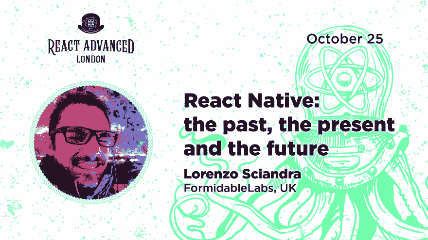
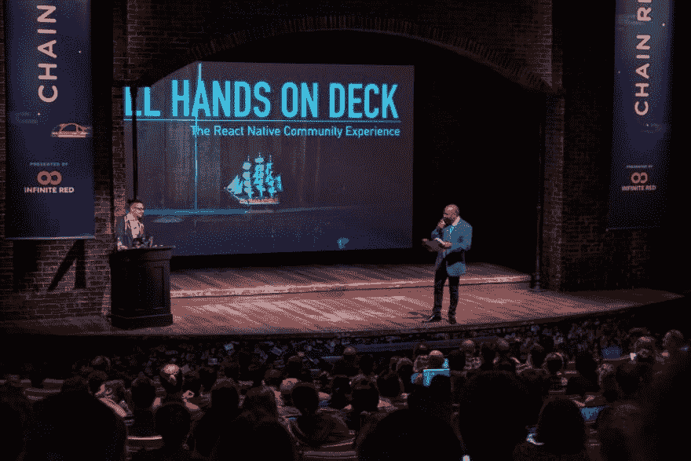

# 洛伦佐·西安德拉:React Native 并不完美，但它有着惊人的引力

> 原文:[https://dev . to/git nation/Lorenzo-sciandra-react-native-is not-perfect-but-it-has-an-amazing-gravity-power-3ede](https://dev.to/gitnation/lorenzo-sciandra-react-native-is-not-perfect-but-it-has-an-amazing-gravitational-power-3ede)

### 我们采访了 Lorenzo Sciandra，他是英国[强大实验室](https://formidable.com)的软件工程师，以前是 Drivetribe 的 React 原生开发人员，是 React 原生核心库为数不多的外部维护人员之一

Lorenzo Sciandra 是一名充满热情的 React 原生开发者，在 RN 社区中非常活跃:他帮助启动了[升级助手 web 应用](https://github.com/react-native-community/upgrade-helper)，维护核心库，参与了 React 原生社区组织，并计划很快在伦敦为开源维护者组织一次新的会议。在这次采访中，他分享了自己对 React Native 的热情以及保持社区活跃的奉献精神。10 月 25 日，Lorenzo 在伦敦的 [React Advanced](https://reactadvanced.com) 发表演讲。

[T2】](https://res.cloudinary.com/practicaldev/image/fetch/s--jOpvbt3_--/c_limit%2Cf_auto%2Cfl_progressive%2Cq_auto%2Cw_880/https://thepracticaldev.s3.amazonaws.com/i/z2bbfq1cc43kzvnb63i4.png)

#### 洛伦佐你好，欢迎来到 React Advanced 的访谈！请介绍一下你自己，告诉我们是什么让你对软件工程如此有热情。

嘿呀！感谢邀请我——我的名字叫 Lorenzo ( [@kelset](https://dev.to/kelset) ，我是[英国强大实验室](https://formidable.com)的软件工程师。老实说，我对编程的兴趣可能始于我 10 岁的时候，我父亲买了第一版的乐高思维风暴！在那之后，我有机会在高中做一些编程，但我只是在从物理工程转到软件工程硕士后才决定把它作为我的职业。

[T2】](https://res.cloudinary.com/practicaldev/image/fetch/s--UQTECj0C--/c_limit%2Cf_auto%2Cfl_progressive%2Cq_auto%2Cw_880/https://thepracticaldev.s3.amazonaws.com/i/knbxrw0pcuiovp4mxr9x.jpeg)

#### 能否请你简要描述一下你在目前职位上的工作经历？

大学毕业后，我加入了都灵的一家非常特别的咨询公司(我在那里当学生)——作为 Leva.io 的一部分，我可以探索 web 堆栈的不同部分(从后端到 DevOps 到移动设备)，并了解 React Native。然后，在那里呆了一年半后，我出于个人原因决定搬到伦敦，在初创企业圈子里工作了几年后，我有机会在今年 1 月加入了强大公司。

虽然我在 Drivetribe 学到了很多东西(直到今天，我仍然相信它是我工作过的最好的代码库之一)，但强大的公司文化和价值观太贴近我的心脏了，我不能不尽快加入他们。

#### 你现在在威猛做什么？有什么有趣的项目在进行中吗？你最喜欢你工作的哪一点？

我知道这听起来可能很假，但如果你在推特上关注我，你就会知道我喜欢在强大。我们有坚实的公司文化，我喜欢和我在那里的每一位同事在一起，无论是来自伦敦办公室还是美国办公室的同事。我主要是作为我们英国办公室的“反应本土专家”之一工作，目前为一家我喜欢多年的公司提供咨询——但我不被允许对这个项目说太多。

#### 你对开源有什么参与？哪些项目是你最喜欢的？他们中你最引以为豪的是谁？

在开源世界，我主要活跃在 React Native 生态系统中。目前，我是为数不多的核心库维护者之一(不为脸书工作)，这也是我(和迈克·格拉博斯基)管理发布的原因。除此之外，我还参与了 React 本地社区组织——这是我今年最关注的事情。如果我必须选择一个项目，那将是[升级助手 web 应用](https://github.com/react-native-community/upgrade-helper)，这是一个有用的工具，可以防止大多数 RN 开发人员可能经历过的旧升级痛苦。

10 月份，我还将在伦敦为开源维护者组织一次新的聚会，作为帮助我当地社区的一种方式。

液体错误:内部

#### 你对 React Native 的热情背后是什么？为什么反应原生的，而不是任何其他移动开发框架？

对我来说，它归结为一个事实，即 React Native 在我看来是有意义的:它的模式、整体代码语法以及编写一次就可以部署在多个平台上的想法。我不认为它是完美的，但它在我的大脑中很好地运转。我并不“不喜欢”其他移动框架，并且不时地探出头来看看其他堆栈中的东西是如何工作的——但我只是没有获得 RN 所拥有的相同的引力。

#### 在你看来，你人生中最大的三项成就是什么？

在我觉得可以提及的事情中，我认为(1)在 f1 工作，(2)搬到伦敦，(3)开始在我的演讲中(在聚会和 confs 上)谈论心理健康是最有意义的事情。

#### 你有没有觉得自己是个冒名顶替者？你对那些可能会经历冒名顶替综合症的初级开发人员有什么建议？

是也不是。意思是:我总是觉得有点“格格不入”，但我认为这主要是一件积极的事情，因为这意味着我总是有成长的空间！这种态度是我推荐给任何一个大三学生的:觉得自己“不够好”不适合这个角色应该是你想要学习更多的动力！

[https://www.youtube.com/embed/OVzMw3vYrDI](https://www.youtube.com/embed/OVzMw3vYrDI)

#### 你写些什么博客？你会很快离开灵媒吗？

我已经有一段时间没有写博客了，但是当我写博客的时候，大多数都是关于 React Native 的(还有一些关于开源的文章)。我想我最终会离开 Medium for dev.to，或者我的个人网站——原因是我有点厌倦了不得不与 Medium 付费墙“冲突”。

#### 你有什么爱好吗？它们是什么？

我有几个，主要是我喜欢电子竞技，我目前正在学习编剧。

#### 你对即将在伦敦召开的会议感到兴奋吗？你将谈论什么，你对这次活动有什么期望？

React Advanced 真的很炒作！自从这个组织主办的第一次聚会以来，我一直期待着一次“同样风格”的会议！

我的演讲将是关于 React Native re-architecture，这是一个相当具有挑战性的话题，因为它一直在发展(以纯粹的 RN 方式)，我希望能够更深入地探讨这种新方法将如何影响我们所有的 RN 开发人员。

> lo⚛️📲zo[@ kel set](https://dev.to/kelset)helloooooooo 我是今年[@ react advanced](https://twitter.com/ReactAdvanced)🥳
> 
> 的演讲者...是的，我会用今天早上在 [@react_native_eu](https://twitter.com/react_native_eu) 发布的所有新东西 [@emilyjanzer](https://twitter.com/emilyjanzer) 来更新我的超级演讲😂[twitter.com/ReactAdvanced/…](https://t.co/IH4dRCz4nR)2019 年 9 月 10:13AM-05React Advanced 伦敦[@ React Advanced](https://dev.to/reactadvanced)【React native】现在 4 岁。在此期间，我们观察到跨平台移动解决方案的愿景取得了很大进展。 [@kelset](https://dev.to/kelset) 将在深入未来之前探索这一历史:https://t.co/hx18YQKrjq https://t.co/8Orn5AiaPc

* * *

### [预订 React 高级会议席位](https://reactadvanced.com)

* * *

来自[Soshace.com](https://soshace.com/)的文案玛丽娜·沃龙索娃协助准备了这次采访。Soshace 是一个招聘网站开发者的平台:[招聘一个开发者](https://soshace.com/jobs)或者[申请一个远程工作](https://soshace.com/developers)。

* * *

## 关于 GitNation

GitNation 是一个通过组织关注开源软件的活动来促进技术发展的基金会。我们组织有意义且有趣的 JavaScript 会议，将有才华的工程师、研究人员和重要库和技术的核心团队联系起来。

除了提供[单个会议门票](https://gitnation.org/#events)，该组织还出售 GitNation Multipass，提供对多个[远程 JavaScript 会议和研讨会](https://portal.gitnation.org/multipass)的折扣访问。