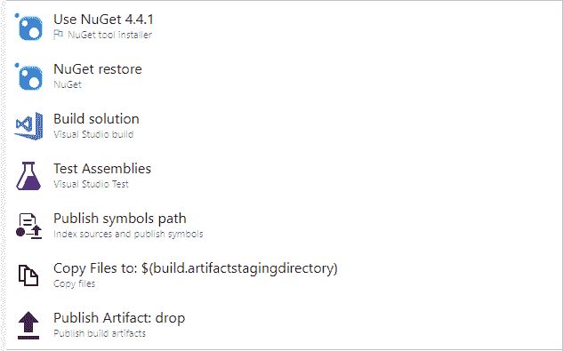
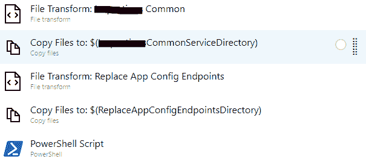

# 开发运维、发布渠道、控制台应用、替换端点

> 原文:[https://dev . to/elleattwell/devo PS-release-pipeline-console-app-replace-endpoints-359 o](https://dev.to/elleattwell/devops-release-pipeline-console-app-replace-endpoints-359o)

所以最近，我不得不在一个项目上工作，这个项目需要我在 Azure DevOps 上创建管道(构建、发布)。

我有一个简单的控制台应用程序，它调用两个 WCF 服务来进行安全认证、检索(即数据库)，然后给我一个我需要向其发送 SMS 的用户列表。

然后我创建了我的构建，这是它的样子。构建从上到下按顺序执行。

[T2】](https://res.cloudinary.com/practicaldev/image/fetch/s--fSRKpAQN--/c_limit%2Cf_auto%2Cfl_progressive%2Cq_auto%2Cw_880/https://thepracticaldev.s3.amazonaws.com/i/99rqk3koedfpsw1cjpoc.png)

然后我创建了我的发布管道，这是它的样子。

[T2】](https://res.cloudinary.com/practicaldev/image/fetch/s--uKFVT19k--/c_limit%2Cf_auto%2Cfl_progressive%2Cq_auto%2Cw_880/https://thepracticaldev.s3.amazonaws.com/i/2e5a7nfdibwd5d7fupvy.png)

文件转换任务基本上指向包或文件夹的文件路径，该路径指向 bin/Release 文件夹和需要转换为 XML 的目标文件，在本例中有两个文件(即 dll.config 和 exe.config)

将文件复制到任务指定文件转换后要复制的源文件夹，然后指定要复制到的目标文件夹。

最后一个任务是运行名为 Replace App Config Endpoints 的控制台应用程序项目的 PowerShell 脚本，它将替换所有的端点地址。

我以前做过一个普通网站的构建和发布，我所要做的就是创建一个 SetParameters.xml 文件，并定义我需要替换的所有标记/变量。

这就是我面临的问题，我在网上找不到任何可以帮我做这件事的东西，SetParameters.xml 取代了应用程序设置和连接字符串，我肯定有，但我的谷歌技能当时让我失望了。

问题:我需要替换特定环境(如 QA、生产)变量值的 WCF 端点地址。

解决方案:我创建了一个控制台应用程序来完成这项工作，它将由 PowerShell 脚本运行。

请注意，环境。GetEnvironmentVariable()将从当前进程中检索环境变量的值。我们可以根据环境是 QA 还是生产环境来指定不同的值。

这是它的样子

args 期望我们需要替换服务端点地址的配置的完整路径，例如" C:\ Users \ Projects \ project name 1 \ bin \ Debug \ project name 1 . exe . config "
" C:\ Users \ Projects \ project name 2 \ bin \ Debug \ project name 2 . exe . config "

```
 static void Main(string[] args)
    {
        try
        {
            foreach (var appConfigFilePath in args)
            {
                var doc = new XmlDocument();
                doc.Load(appConfigFilePath);
                XmlNodeList endpoints = doc.GetElementsByTagName("endpoint");

                foreach (XmlNode item in endpoints)
                {
                    doc.GetElementsByTagName("endpoint").Cast<XmlNode>()
                        .FirstOrDefault(n => n.Attributes["name"].Value == item.Attributes["name"].Value).Attributes["address"].Value = Environment.GetEnvironmentVariable(item.Attributes["name"].Value);
                }

                doc.Save(appConfigFilePath);
            }
        }
        catch (Exception)
        {
            // catch exception and log error
        }
    } 
```

如果任何人有不同的方法或可以扩展这一点，请随时给我指出正确的方向。