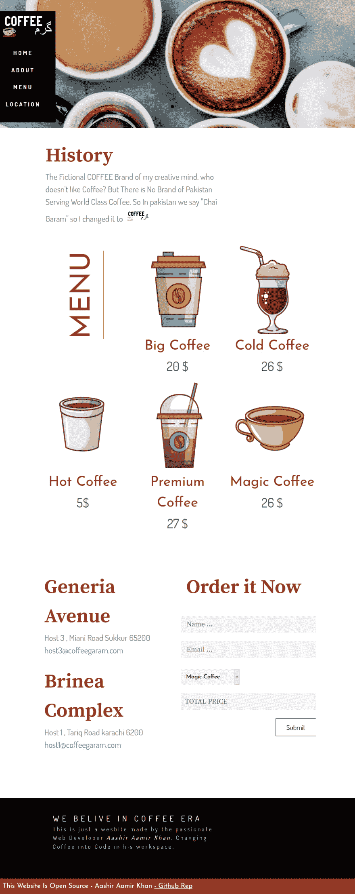

# 第 1 部分-设计方法，我正在使用我的网页设计项目-咖啡店网站

> 原文:[https://dev . to/justaashir/part-1-design-approach-I-am-using-right-now-for-my-web-design-projects-coffee-shop-website-1ni 6](https://dev.to/justaashir/part-1-design-approach-i-am-using-right-now-for-my-web-design-projects-coffee-shop-website-1ni6)

有很多工作，甚至在编写一行代码之前，但是许多人忽略了它，他们在项目期间真的很痛苦，他们也在浪费时间。他们过于关注细节，比如“我能用的最好的字体是什么？”或者“这个图像比另一个好吗？所以我在这里谈论我正在使用的设计方法，来简化我的工作，并且我不会在编码过程中被其他事情分心。

* * *

所以让我们假设我想为我自己虚构的“咖啡店”制作一个网站，最终会是这样的:  所以我有所有的创作自由去做任何事情，所以首先 ***我必须制作一个标志*** :

*   有很多网站可以让你免费轻松制作一个 logo。
*   我是一名设计师，所以我用了 [Pixlr X](https://pixlr.com/) ，这是我做的标志:
*   该徽标使用“LEADERSON”字体和一个免费图标“咖啡杯”。

#### 颜色

接下来是调色板，我更喜欢简单的调色板方法？？？

*   一种深黑色
*   一种白灰色调
*   一种原色

所以我选择简单的`Brown`作为我的主要颜色，使用`whitesmoke`作为灰色阴影，使用简单的`black`。

#### Fonts

我在我的项目中经常使用谷歌字体，所以我使用这种方法来节省我的时间并使用好的字体:

*   一种无衬线字体
*   一种衬线
*   一种创造性的特殊字体

所以我用这三种字体 [Source Serif Pro](https://fonts.google.com/specimen/Source+Serif+Pro) 作为衬线， [Dosis](https://fonts.google.com/specimen/Dosis) 作为无衬线， [Josefin Sans](https://fonts.google.com/specimen/Josefin+Sans) 作为特殊字体。

#### 字体系统

所以我只使用基本的字体大小和行高，就像这样

#### 收集所有资产

收集编码过程中需要的所有资源，如图像、视频和图标。
我使用了来自 [Pexels](https://www.pexels.com/) 的股票图片，以及来自 [Freepik](https://www.freepik.com/) 的这些向量

### 现在让我们开始编码

启动一个项目，其中包括简单的 HTML 样板和 CSS(SCSS ),并包括任何库或框架，如果你想要的。我正在使用[布尔玛 CSS](https://bulma.io/) 和 [FontAwesome](https://fontawesome.com/) ，并将其连接到 [Github](https://github.com/) 。

*   现在打开您的 Sass 或 CSS 文件，并将您的字体和颜色值存储在 CSS 或 Sass 变量中
*   在根`body`或`html`中指定字体大小和行高以及`color`
*   导入项目文件夹中的所有资源

现在，您可以轻松地编写代码，而不必为选择字体、颜色、类型系统和图像而分心。我会在下一篇文章中告诉你下一步是什么。

* * *

我已经发布了我的设计方法第 2 部分。你可以在这里阅读:[第二部分-我现在正在为我的网页设计项目使用的设计方法-咖啡店网站](https://dev.to/justaashir/part-2-design-approach-i-am-using-right-now-for-my-web-design-projects-coffee-shop-website-1ioa)。

* * *

*   我在推特上很活跃:[www.twitter.com/justaashir](//www.twitter.com/justaashir)
*   我的一些受欢迎的文章:
    *   [我在 Twitter 上找到的很棒的工具和资源-](https://dev.to/justaashir/awesome-tools-and-resources-i-found-on-twitter-3am8)
    *   [静态站点生成器不适合我！我和哲基尔、雨果和 NetlifyCMS 的经历](https://dev.to/justaashir/static-site-generators-are-not-for-me-my-experience-with-jekyll-hugo-and-netlifycms-4mo5)
    *   **最受欢迎的** - [布尔玛 CSS 框架时代最被低估的框架](https://dev.to/justaashir/bulma-the-most-underrated-framework-of-the-css-framework-era-2gj8)