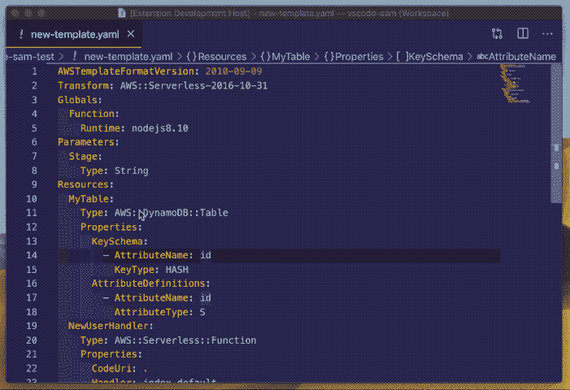
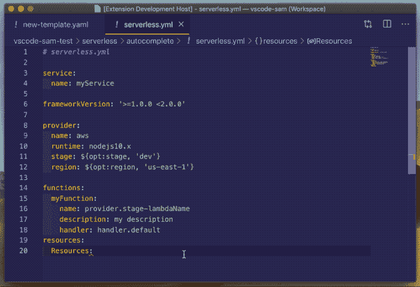

# 像专业人员一样编辑 VSCode 中的无服务器 YAML 模板

> 原文:[https://dev . to/pavelvlasov/edit-server less-YAML-templates-in-vs code-like-a-pro-4p kk](https://dev.to/pavelvlasov/edit-serverless-yaml-templates-in-vscode-like-a-pro-4pkk)

我非常喜欢无服务器技术，尤其是 AWS Lambda。如此快速地构建可靠且可扩展的基础架构是如此简单，令人难以置信。

但是有一个问题。不管你是使用[无服务器框架](https://serverless.com/)还是 [AWS SAM](https://github.com/awslabs/serverless-application-model) 你都必须处理 YAML 和云计算。

和 YAML 一起工作很难...

典型的无服务器应用程序开发周期是什么样的？

初始化
你从`serverless create`或者`sam init`开始组装一个模板。

## 配置

然后添加几个 lambda 函数，可能是 DynamoDB 表。哦，您可能忘记了如何创建 DynamoDB 流或如何启用服务器端加密。所以你需要打开文档。

去 google.com，键入`DynamoDB Cloudformation`点击`I'm Feeling Lucky`打开 AWS 文档，并在你的模板文件中做一些`CMD+C/CMD+V`。

## 部署

现在您可以开始部署了。

在这个阶段，部署框架将编译您的代码，将所有内容放在一个 zip 存档中，然后通过网络将其发送到 AWS。这是一项相当耗时的任务，可能需要一段时间。完成所有工作后，你会得到关于无效云模板的消息。

[T2】](https://res.cloudinary.com/practicaldev/image/fetch/s--T-sHb6UP--/c_limit%2Cf_auto%2Cfl_progressive%2Cq_auto%2Cw_880/https://i.kym-cdn.com/photimg/original/000/918/810/a22.jpg)

你必须再次执行第二步。

我已经纠结了一段时间了。我探索了多个选项和 VSCode 插件，但无法找到满足我需求的解决方案。所以我决定构建自己的 VSCode 插件。

## 解

我想给你介绍一下[无服务器 IDE](https://marketplace.visualstudio.com/items?itemName=ThreadHeap.serverless-ide-vscode) 。AWS [CloudFormation](https://aws.amazon.com/cloudformation/) 和 [SAM](https://docs.aws.amazon.com/lambda/latest/dg/serverless_app.html) 最先进的 VSCode 插件。

该项目一开始是一个硬分支 [vscode-yaml](https://github.com/redhat-developer/vscode-yaml) ，最终主要是为了更好地支持 CloudFormation 而被重写和调整。

主要功能有:

## 智能自动完成

除了属性和值完成之外，该插件还支持 AWS 资源的智能片段。它处理 AWS SAM 中的`Globals`模板部分，因此它将排除已经定义的字段。

[T2】](https://res.cloudinary.com/practicaldev/image/fetch/s--s6-f8b4G--/c_limit%2Cf_auto%2Cfl_progressive%2Cq_66%2Cw_880/https://raw.githubusercontent.com/threadheap/serverless-ide-vscode/master/packages/vscode/demo/autocomplete.gif)

## 定位到定义和参考

您可以通过`CMD+hover`越过`!Ref`内部函数引用在资源之间导航。

## 验证

无服务器 IDE 会验证您的模板并突出显示潜在的问题，包括无效的资源引用。
除此之外，它支持 [cfn-lint](https://github.com/aws-cloudformation/cfn-python-lint) 。

[T2】](https://res.cloudinary.com/practicaldev/image/fetch/s--1BD5GEmO--/c_limit%2Cf_auto%2Cfl_progressive%2Cq_66%2Cw_880/https://raw.githubusercontent.com/threadheap/serverless-ide-vscode/master/packages/vscode/demo/validation.gif)

## AWS 文档一览

这个是我最喜欢的。您可以在编辑器中轻松访问 AWS 文档。

[T2】](https://res.cloudinary.com/practicaldev/image/fetch/s--h76_L-TA--/c_limit%2Cf_auto%2Cfl_progressive%2Cq_66%2Cw_880/https://raw.githubusercontent.com/threadheap/serverless-ide-vscode/master/packages/vscode/demo/documentation.gif)

## 受限[无服务器框架](https://serverless.com/)支持

该插件提供了有限的无服务器框架支持，但它的外部导入还不被支持，一些插件的用例也可能不被支持。

[T2】](https://res.cloudinary.com/practicaldev/image/fetch/s--cidsi_ps--/c_limit%2Cf_auto%2Cfl_progressive%2Cq_66%2Cw_880/https://raw.githubusercontent.com/threadheap/serverless-ide-vscode/master/packages/vscode/demo/serverless_framework.gif)

源代码可以在 [github](https://github.com/threadheap/serverless-ide-vscode) 上获得。

感谢阅读！

* * *

嗨！我叫帕维尔，我是[无服务器端](https://marketplace.visualstudio.com/items?itemName=ThreadHeap.serverless-ide-vscode)的创造者。
如果你喜欢这个主意，试试看！
发现了 bug？这里提出一个问题。
有建议或问题吗？你可以随时在推特上给我发消息。

* * *

主图片来源:[https://unsplash.com/photos/tjX_sniNzgQ](https://unsplash.com/photos/tjX_sniNzgQ)