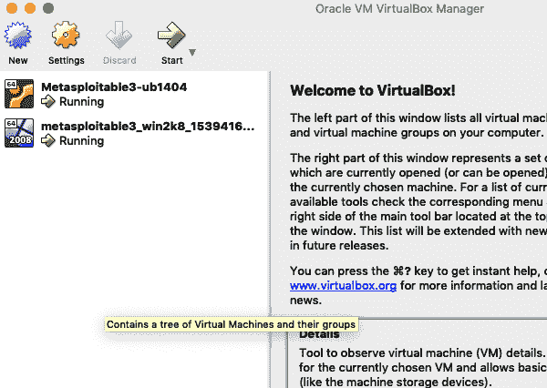
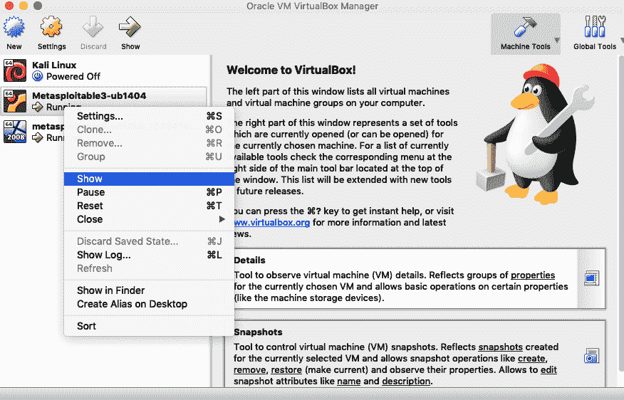
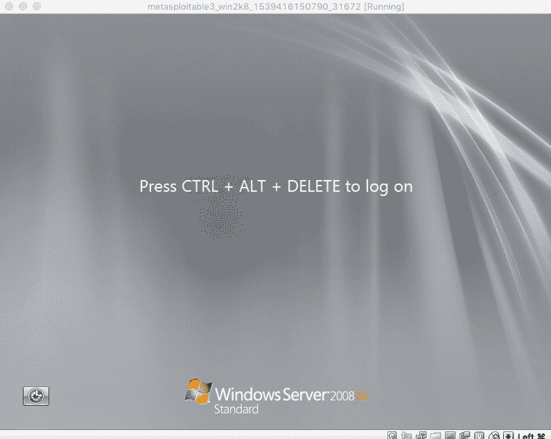
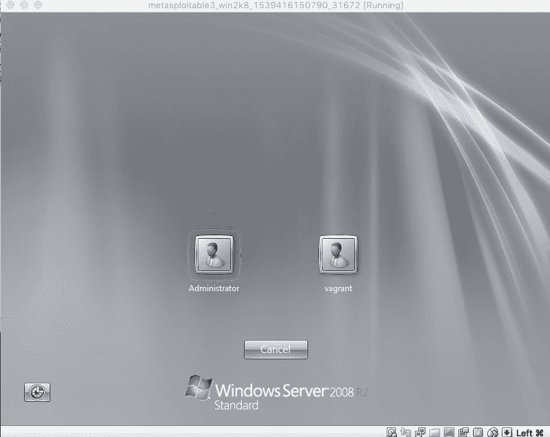
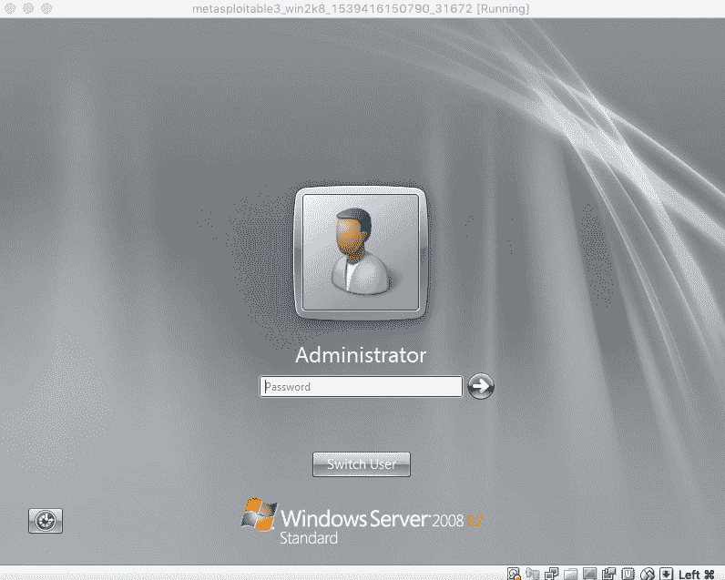
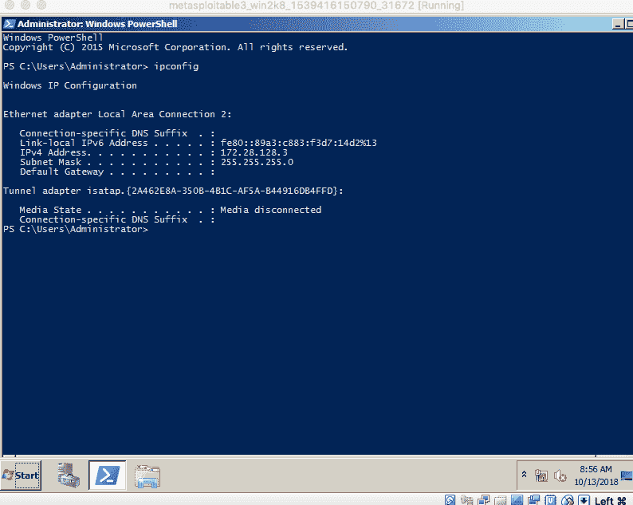
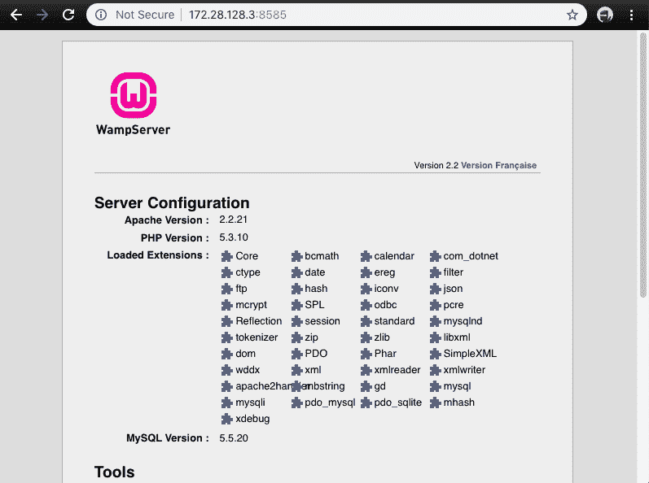

# 如何在 macOS Mojave 上设置 Metasploitable 3

> 原文:[https://dev . to/arbaoui _ Mehdi/how-to-set-up-metasplictable-3-on-MAC OS-mojave-55ao](https://dev.to/arbaoui_mehdi/how-to-set-up-metasploitable-3-on-macos-mojave-55ao)

在这篇博文中，我们将建立一个由虚拟机(ubuntu 和 windows)列表组成的环境，其中包括一些有意利用的漏洞，使用 Metasploitable 3 作为目标机器，Kali 作为攻击者，但在此之前，有一个您需要的需求列表:

# [](#software-requirements)软件需求

*   macOS Mojave(版本 10.14)
*   [虚拟盒](https://www.virtualbox.org/wiki/Downloads)
*   [打包机](https://www.packer.io/downloads.html)
*   [流浪者](https://www.vagrantup.com/downloads.html)

你可以从下面的链接手动安装 VirtualBox、Packer 和 vagger，也可以使用[https://brew.sh/](https://dev.tobrew):

```
brew cask install virtualbox
brew cask install vagrant
brew install packer 
```

<svg width="20px" height="20px" viewBox="0 0 24 24" class="highlight-action crayons-icon highlight-action--fullscreen-on"><title>Enter fullscreen mode</title></svg> <svg width="20px" height="20px" viewBox="0 0 24 24" class="highlight-action crayons-icon highlight-action--fullscreen-off"><title>Exit fullscreen mode</title></svg>

# [](#system-requirements)系统要求

*   推荐支持 VT-x/AMD-V 的处理器
*   驱动器上有 65 GB 可用空间
*   4.5 GB 内存

最终，我们的环境将拥有这两个虚拟机，一个运行 Ubuntu metasploitable3-ub1404，另一个运行 Windows metasploitable3-win2k8。

我们将手动构建机器，但是首先，您需要在 macOs 机器上的某个地方克隆 metasploitable 3 repo:

```
git clone https://github.com/rapid7/metasploitable3.git 
```

<svg width="20px" height="20px" viewBox="0 0 24 24" class="highlight-action crayons-icon highlight-action--fullscreen-on"><title>Enter fullscreen mode</title></svg> <svg width="20px" height="20px" viewBox="0 0 24 24" class="highlight-action crayons-icon highlight-action--fullscreen-off"><title>Exit fullscreen mode</title></svg>

安装`vagrant-reload`我们需要重新加载流浪者供应器:

```
vagrant plugin install vagrant-reload 
```

<svg width="20px" height="20px" viewBox="0 0 24 24" class="highlight-action crayons-icon highlight-action--fullscreen-on"><title>Enter fullscreen mode</title></svg> <svg width="20px" height="20px" viewBox="0 0 24 24" class="highlight-action crayons-icon highlight-action--fullscreen-off"><title>Exit fullscreen mode</title></svg>

然后将`cd`添加到 metasploitable3 文件夹:

```
cd metasploitable3 
```

<svg width="20px" height="20px" viewBox="0 0 24 24" class="highlight-action crayons-icon highlight-action--fullscreen-on"><title>Enter fullscreen mode</title></svg> <svg width="20px" height="20px" viewBox="0 0 24 24" class="highlight-action crayons-icon highlight-action--fullscreen-off"><title>Exit fullscreen mode</title></svg>

使用 packer 为 Ubuntu 构建基础虚拟机映像，第一个参数`--only`使用虚拟化平台的名称加上模板文件:

```
packer build --only=virtualbox-iso ./packer/templates/ubuntu_1404.json 
```

<svg width="20px" height="20px" viewBox="0 0 24 24" class="highlight-action crayons-icon highlight-action--fullscreen-on"><title>Enter fullscreen mode</title></svg> <svg width="20px" height="20px" viewBox="0 0 24 24" class="highlight-action crayons-icon highlight-action--fullscreen-off"><title>Exit fullscreen mode</title></svg>

为 Windows 构建基本虚拟机映像:

```
packer build --only=virtualbox-iso ./packer/templates/windows_2008_r2.json 
```

<svg width="20px" height="20px" viewBox="0 0 24 24" class="highlight-action crayons-icon highlight-action--fullscreen-on"><title>Enter fullscreen mode</title></svg> <svg width="20px" height="20px" viewBox="0 0 24 24" class="highlight-action crayons-icon highlight-action--fullscreen-off"><title>Exit fullscreen mode</title></svg>

这两个版本需要下载操作系统安装。

现在，在创建了流浪者盒子之后，你需要检查`vagrant box list` :
的结果

```
vagrant box list 
```

<svg width="20px" height="20px" viewBox="0 0 24 24" class="highlight-action crayons-icon highlight-action--fullscreen-on"><title>Enter fullscreen mode</title></svg> <svg width="20px" height="20px" viewBox="0 0 24 24" class="highlight-action crayons-icon highlight-action--fullscreen-off"><title>Exit fullscreen mode</title></svg>

这就是你的列表应该看起来的样子:

```
metasploitable3-ub1404 (virtualbox, 0)
metasploitable3-win2k8 (virtualbox, 0) 
```

<svg width="20px" height="20px" viewBox="0 0 24 24" class="highlight-action crayons-icon highlight-action--fullscreen-on"><title>Enter fullscreen mode</title></svg> <svg width="20px" height="20px" viewBox="0 0 24 24" class="highlight-action crayons-icon highlight-action--fullscreen-off"><title>Exit fullscreen mode</title></svg>

现在，让我们将每个创建的流浪者盒子添加到相应的流浪者环境中:

## [](#ubuntu-box)Ubuntu 盒子:

```
vagrant box add packer/builds/ubuntu_1404_virtualbox_0.1.12.box --name=metasploitable3-ub1404 
```

<svg width="20px" height="20px" viewBox="0 0 24 24" class="highlight-action crayons-icon highlight-action--fullscreen-on"><title>Enter fullscreen mode</title></svg> <svg width="20px" height="20px" viewBox="0 0 24 24" class="highlight-action crayons-icon highlight-action--fullscreen-off"><title>Exit fullscreen mode</title></svg>

## [](#windows-box)窗口框:

```
vagrant box add packer/builds/windows_2008_r2_virtualbox_0.1.0.box --name=metasploitable3-win2k8 
```

<svg width="20px" height="20px" viewBox="0 0 24 24" class="highlight-action crayons-icon highlight-action--fullscreen-on"><title>Enter fullscreen mode</title></svg> <svg width="20px" height="20px" viewBox="0 0 24 24" class="highlight-action crayons-icon highlight-action--fullscreen-off"><title>Exit fullscreen mode</title></svg>

现在，您必须分别启动每个虚拟机，运行安装程序并设置好一切，但在此之前，让我们编辑`VagrantFile`并更改这两个变量`ub1404.vm.box`和`win2k8.vm.box`T3 的值

```
ub1404.vm.box = "metasploitable3-ub1404"
win2k8.vm.box = "metasploitable3-win2k8" 
```

<svg width="20px" height="20px" viewBox="0 0 24 24" class="highlight-action crayons-icon highlight-action--fullscreen-on"><title>Enter fullscreen mode</title></svg> <svg width="20px" height="20px" viewBox="0 0 24 24" class="highlight-action crayons-icon highlight-action--fullscreen-off"><title>Exit fullscreen mode</title></svg>

## [](#starts-the-vms)启动虚拟机

启动 Ubuntu 虚拟机

```
vagrant up ub1404 
```

<svg width="20px" height="20px" viewBox="0 0 24 24" class="highlight-action crayons-icon highlight-action--fullscreen-on"><title>Enter fullscreen mode</title></svg> <svg width="20px" height="20px" viewBox="0 0 24 24" class="highlight-action crayons-icon highlight-action--fullscreen-off"><title>Exit fullscreen mode</title></svg>

启动 Ubuntu 虚拟机

```
vagrant up win2k8 
```

<svg width="20px" height="20px" viewBox="0 0 24 24" class="highlight-action crayons-icon highlight-action--fullscreen-on"><title>Enter fullscreen mode</title></svg> <svg width="20px" height="20px" viewBox="0 0 24 24" class="highlight-action crayons-icon highlight-action--fullscreen-off"><title>Exit fullscreen mode</title></svg>

如果一切正常，您可以在 VirtualBox 上看到每个虚拟机的列表:

[T2】](https://res.cloudinary.com/practicaldev/image/fetch/s--tA4JgyOj--/c_limit%2Cf_auto%2Cfl_progressive%2Cq_auto%2Cw_880/https://thepracticaldev.s3.amazonaws.com/i/9j27ukepjgpcy49d1wce.png)

## [](#get-the-windows-vm-ip)获取 Windows 虚拟机的 IP

现在，您必须按照以下步骤检查 windows 虚拟机的 IP:

1 -右击`metasploitable3-win2k8`并显示:

[T2】](https://res.cloudinary.com/practicaldev/image/fetch/s--PSHplPvm--/c_limit%2Cf_auto%2Cfl_progressive%2Cq_auto%2Cw_880/https://thepracticaldev.s3.amazonaws.com/i/m0bvzxvl801guq60rufe.png)

2–选择虚拟机，从 VirtualBox 顶部菜单点击输入，键盘，然后插入`Ctrl-Alt-Del (Host+suppr)`

[T2】](https://res.cloudinary.com/practicaldev/image/fetch/s--t2tUFE4H--/c_limit%2Cf_auto%2Cfl_progressive%2Cq_auto%2Cw_880/https://thepracticaldev.s3.amazonaws.com/i/k74rjqwnujhnpkbwj85v.png)

3–从用户列表中选择 Administrator 并输入默认密码`vagrant`，如果你有像我一样的 azerty 键盘，请小心，因为 VM 键盘默认设置为 qwerty。

[T2】](https://res.cloudinary.com/practicaldev/image/fetch/s--wIlM8E-n--/c_limit%2Cf_auto%2Cfl_progressive%2Cq_auto%2Cw_880/https://thepracticaldev.s3.amazonaws.com/i/ybk0m8nk4r77q7qvuq6k.png)

[T2】](https://res.cloudinary.com/practicaldev/image/fetch/s--QMXFE5m7--/c_limit%2Cf_auto%2Cfl_progressive%2Cq_auto%2Cw_880/https://thepracticaldev.s3.amazonaws.com/i/k2f310qpahmvmqp6nnsq.png)

4–打开 Powershell 并键入`ipconfig`

[T2】](https://res.cloudinary.com/practicaldev/image/fetch/s--3bFmJhDq--/c_limit%2Cf_auto%2Cfl_progressive%2Cq_auto%2Cw_880/https://thepracticaldev.s3.amazonaws.com/i/mu1q7a12bzitova34lwm.png)

5–获取 *ipv4 地址*的值，从您的计算机(macOs)而不是虚拟机，打开终端并使用`nmap`扫描`win2k8`虚拟机上打开的端口，您的情况下的 IP 地址应该不同:

```
sudo nmap -sV -p- -T4 172.28.128.3
Password:

Starting Nmap 7.31 ( https://nmap.org ) at 2018-10-13 16:57 WEST
Nmap scan report for 172.28.128.3
Host is up (0.00062s latency).
Not shown: 65517 filtered ports
PORT      STATE SERVICE       VERSION
22/tcp    open  ssh           OpenSSH 7.1 (protocol 2.0)
1617/tcp  open  nimrod-agent?
3000/tcp  open  http          WEBrick httpd 1.3.1 (Ruby 2.3.3 (2016-11-21))
4848/tcp  open  ssl/http      Oracle Glassfish Application Server
5985/tcp  open  http          Microsoft HTTPAPI httpd 2.0 (SSDP/UPnP)
8020/tcp  open  http          Apache httpd
8022/tcp  open  http          Apache Tomcat/Coyote JSP engine 1.1
8027/tcp  open  unknown
8080/tcp  open  http          Sun GlassFish Open Source Edition  4.0
8282/tcp  open  http          Apache Tomcat/Coyote JSP engine 1.1
8383/tcp  open  ssl/http      Apache httpd
8484/tcp  open  http          Jetty winstone-2.8
8585/tcp  open  http          Apache httpd 2.2.21 ((Win64) PHP/5.3.10 DAV/2)
9200/tcp  open  http          Elasticsearch REST API 1.1.1 (name: Dougboy; Lucene 4.7)
49153/tcp open  msrpc         Microsoft Windows RPC
49154/tcp open  msrpc         Microsoft Windows RPC
49179/tcp open  unknown
49182/tcp open  tcpwrapped
MAC Address: 08:00:27:BC:ED:80 (Oracle VirtualBox virtual NIC)
Service Info: OS: Windows; CPE: cpe:/o:microsoft:windows 
```

<svg width="20px" height="20px" viewBox="0 0 24 24" class="highlight-action crayons-icon highlight-action--fullscreen-on"><title>Enter fullscreen mode</title></svg> <svg width="20px" height="20px" viewBox="0 0 24 24" class="highlight-action crayons-icon highlight-action--fullscreen-off"><title>Exit fullscreen mode</title></svg>

现在，您可以从 nmap 命令结果中获取任何打开的 http 端口，例如使用`Apache httpd 2.2.21 ((Win64) PHP/5.3.10 DAV/2)`的`8585`，从您的计算机打开浏览器，并使用 [http://172.28.128.3:8585](http://172.28.128.3:8585) 访问它:

[T2】](https://res.cloudinary.com/practicaldev/image/fetch/s--FtRELm0K--/c_limit%2Cf_auto%2Cfl_progressive%2Cq_auto%2Cw_880/https://thepracticaldev.s3.amazonaws.com/i/rhjz6swg0ff06f3cpuw2.png)

对于 ubuntu `ub1404` VM，您可以遵循相同的步骤。

就这样，现在你有几个易受攻击的 web 应用程序准备被攻击了。