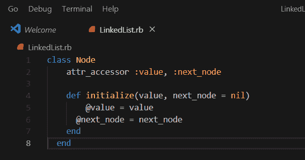
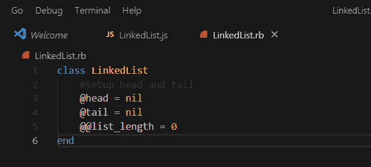
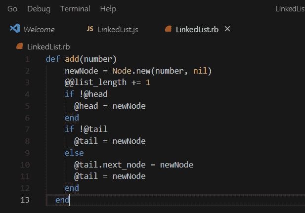

# JavaScript 和 Ruby 中的链表

> 原文:[https://dev . to/David 405/linked-lists-in-JavaScript-and-ruby-1795](https://dev.to/david405/linked-lists-in-javascript-and-ruby-1795)

链表是一种类似于数组、队列或堆栈的线性数据结构，其中称为节点的每个元素被顺序组织，并且每个节点包含其值的数据以及指向下一个节点的指针或引用。如果你还记得当我们还是孩子的时候，在小学甚至中学，我们总是在每天早上有一个学生大会，我们把我们的手放在邻居的肩膀上，回忆一下我们当时唯一关心的是我们自己(node.value ),然后我们的手放在我们旁边的人的肩膀上(next_node ),这应该给我们一个实际的例子来说明链表是什么样子的。

到目前为止，我们只讨论了一个链表，其中我们只有一个对前面节点的引用，如果我们还想保留一个指向后面节点的指针呢？这就是双向链表的用武之地，在双向链表中，每个节点都有三个信息，它的值，对下一个节点的引用，以及对前一个节点的引用，这意味着在双向链表中可以向前或向后遍历。

作为一名微服学生，Ruby 课程中的前三个编码挑战都是基于链表的，而你只需要在 Ruby 中解决这些挑战，我做了额外的努力来看看在 JavaScript 中实现链表和它的一些方法是什么样子的。所以让我们开始吧！

首先，让我们按顺序为我们的链表创建一个模型(双关语)；

*   定义节点类
*   定义链表类
*   创建添加方法

**定义节点类**
首先，我们必须定义一个节点对象，它将有一个数据值，并且还包含对 next_node 的引用，记住链表中的节点就是链表中的每个元素。

**红宝石实现**

**JavaScript**T2[T4](https://res.cloudinary.com/practicaldev/image/fetch/s--t4U9KT_a--/c_limit%2Cf_auto%2Cfl_progressive%2Cq_auto%2Cw_880/https://res.cloudinary.com/david405/image/upload/v1569490566/Personal/node-js_fyvglo.png)

我们将 next/next_node 默认设置为 nil/null，以防没有值作为参数传递，例如当当前节点是最后一个时。我们还可以看到我们的节点对象有两个属性。

**定义 LinkedList 类**
接下来我们要做的是创建一个 LinkedList 类，它将包含头部和尾部，头部是链表的入口点，尾部是链表的结尾。LinkedList 类应该包含我们将创建的方法。

**红宝石实现**

**JavaScript**T2[T4](https://res.cloudinary.com/practicaldev/image/fetch/s--xC8Rvm8S--/c_limit%2Cf_auto%2Cfl_progressive%2Cq_auto%2Cw_880/https://res.cloudinary.com/david405/image/upload/v1569490549/Personal/linkedlist-js_eiieah.png)

在 Ruby 中，我们还添加了一个类变量 list_length，这对创建一些方法很有用。

**创建添加方法**
现在我们已经设置了 Node 和 LinkedList 类，接下来我们要做的是创建一个 add 方法，它将允许我们向列表的末尾添加新的节点。为了实现这一点，我们将通过列表移动(遍历)到列表的末尾，找到尾节点，然后不是让尾节点指针指向 null，而是让它指向新创建的节点。

**红宝石实现**

**JavaScript**T2[T4](https://res.cloudinary.com/practicaldev/image/fetch/s--DygOqSl9--/c_limit%2Cf_auto%2Cfl_progressive%2Cq_auto%2Cw_880/https://res.cloudinary.com/david405/image/upload/v1569490527/Personal/add-js_mkw35h.png)

**结论**
今天到此为止，我们已经创建了 Node 和 LinkedList 类，还创建了一个向列表末尾添加新节点的方法。