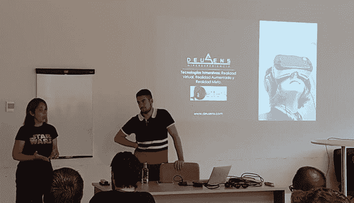
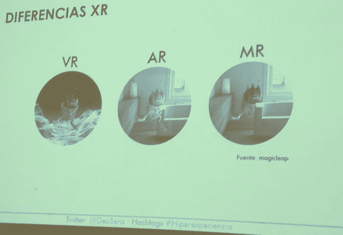
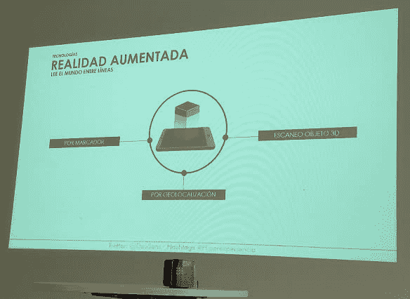
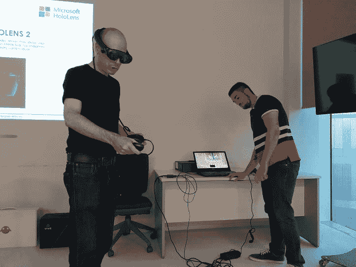
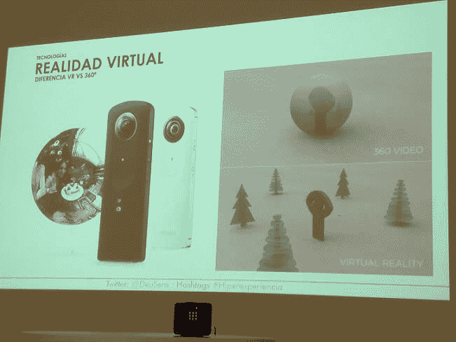
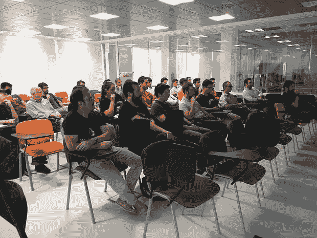

# 身临其境的技术:虚拟现实、增强现实和混合现实。

> [https://dev . to/dotnetters/技术-沉浸-现实-虚拟-现实-增强-y-现实-混合-3jl9](https://dev.to/dotnetters/tecnologias-inmersivas-realidad-virtual-realidad-aumentada-y-realidad-mixta-3jl9)

9 月 24 日星期二，我们迎来了@dotnetters zaragoza 的新赛季，阿尔瓦罗·蒙松的一手演讲谈到了“身临其境的技术:虚拟现实、扩增现实和混合现实”。

[T2】](https://res.cloudinary.com/practicaldev/image/fetch/s--LLrcUGik--/c_limit%2Cf_auto%2Cfl_progressive%2Cq_auto%2Cw_880/https://thepracticaldev.s3.amazonaws.com/i/xkn78kw72sbf6rqcttu4.jpg)

在发言开始时，阿尔瓦罗向我们简要概述了这三个现实，并表明了它们之间的差异。

[T2】](https://res.cloudinary.com/practicaldev/image/fetch/s--_FLHN-5f--/c_limit%2Cf_auto%2Cfl_progressive%2Cq_auto%2Cw_880/https://thepracticaldev.s3.amazonaws.com/i/zu9zzzsqlqd90d5j3kxk.jpg)

我们了解到有四(4)种增加的现实:

*   马卡多
*   地理位置
*   三维对象扫描
*   猛击

[T2】](https://res.cloudinary.com/practicaldev/image/fetch/s--MIkRf8Ve--/c_limit%2Cf_auto%2Cfl_progressive%2Cq_auto%2Cw_880/https://thepracticaldev.s3.amazonaws.com/i/uhn72d2ryxejyoyokgwk.jpg)

我们还讨论了一些技术:

*   Xamarin
*   Unity 3D
*   Xcode
*   自由报
*   机器人
*   IOS 等...

我们有机会做了一个小小的练习，我们的一位助理为了奖励他的高出席率而做的，事实是，他的知识令我们很惊讶，他说话也不感到羞愧。

[T2】](https://res.cloudinary.com/practicaldev/image/fetch/s--reqAj1PV--/c_limit%2Cf_auto%2Cfl_progressive%2Cq_auto%2Cw_880/https://thepracticaldev.s3.amazonaws.com/i/vpwsw2qr6g606k578ekk.jpg)

我们谈的是市场上目前存在的不同类型的眼镜，以及即将推出的新版本，如 hololens。

我们已经了解了虚拟现实和可视化之间的区别，根据客户的需求、时间、成本和信息的无穷无尽，为他们提供了不同的演示，这使我们大家都更希望进一步了解这些技术。

[T2】](https://res.cloudinary.com/practicaldev/image/fetch/s--thck9khC--/c_limit%2Cf_auto%2Cfl_progressive%2Cq_auto%2Cw_880/https://thepracticaldev.s3.amazonaws.com/i/8ptnxlwrfzm4a0tec142.jpg)

最后，我们看到了用不同技术制作的令人印象深刻的东西的几段录像，正如阿尔瓦罗·蒙松和他的团队制作的录像所示，他没有什么可羡慕的。

[https://www.youtube.com/watch?v=eDO9IacrVY8](https://www.youtube.com/watch?v=eDO9IacrVY8)

到目前为止，amig@s 可能还有第二部分，但要知道，你必须跟我们一起参加会议:

[https://www.meetup.com/es-ES/dotnetters/](https://www.meetup.com/es-ES/dotnetters/)

记住，你也可以在 Twitter 上跟踪我们:@dotnetters，这样你就能听到这些对话。

最后，我们要再次感谢阿尔瓦罗·蒙松、我们的助手和我们的同事@etopia，因为我们度过了一个没有虚拟、非常真实和非同寻常的下午！！！

[T2】](https://res.cloudinary.com/practicaldev/image/fetch/s--bln-JnPj--/c_limit%2Cf_auto%2Cfl_progressive%2Cq_auto%2Cw_880/https://thepracticaldev.s3.amazonaws.com/i/ekbc3svmuo9ye6t78uqq.jpg)