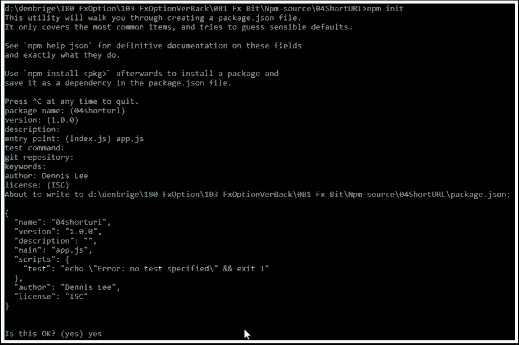
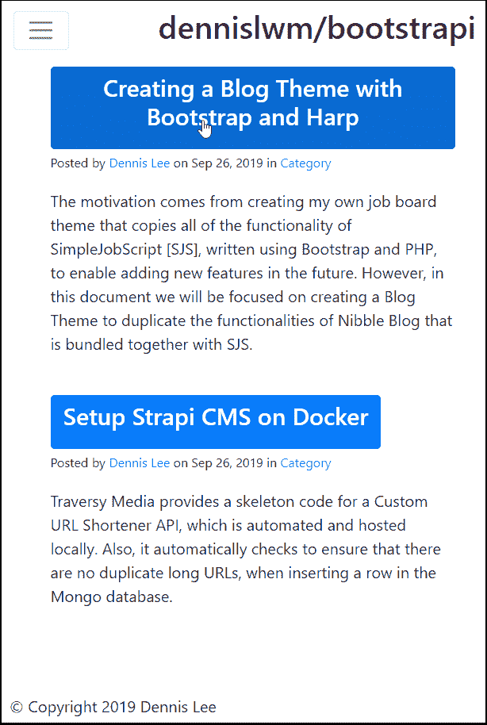

# 用 Bootstrap 和 Harp 创建博客主题

> 原文:[https://dev . to/Dennis lwm/creating-a-blog-theme-with-bootstrap-and-harp-1d 53](https://dev.to/dennislwm/creating-a-blog-theme-with-bootstrap-and-harp-1d53)

# [](#creating-a-blog-theme-with-bootstrap-and-harp)用 Bootstrap 和 Harp 创建博客主题

这是一个个人项目，以创建一个 GUI **头**是模块化的，可以开发任何“无头”CMS 后端。

**反应灵敏快速**

GUI 是使用 Bootstrap 4 和 Harp.js 开发的，它支持 EJS。当在移动设备上查看时，导航菜单折叠成一个*汉堡包*菜单。

**模块化**

包含可嵌入代码的部分存储在*布局*文件夹中，例如 *_header.ejs* 。

**头**

博客文章作为 *markdown* 文件存储在 *blog/* 文件夹中，而它们的元数据存储在同一个文件夹下的 *_data.json* 中。Harp 为每个 *markdown* 文件生成一个 *html* 。

索引页面从存储在*博客/_data.json* 中的*元数据*中动态填充所有文章的片段。

## [](#step-1-creating-a-new-nodejs-project)第一步:新建 Node.js 项目

(1)确保 *Node.js* 已经安装，接下来要做的就是创建一个新项目。

(2)在你的电脑上为这个项目创建一个文件夹，例如“*d:\ Theme-source \ 03 blogstrapi*”[“根文件夹”]

(3)打开上述文件夹中的命令["CMD"]提示符，输入该命令，创建" *package.json* "文件:

```
> npm init 
```

<svg width="20px" height="20px" viewBox="0 0 24 24" class="highlight-action crayons-icon highlight-action--fullscreen-on"><title>Enter fullscreen mode</title></svg> <svg width="20px" height="20px" viewBox="0 0 24 24" class="highlight-action crayons-icon highlight-action--fullscreen-off"><title>Exit fullscreen mode</title></svg>

您可以保留这些条目的默认值如下:

```
package name: (03blogstrapi)
 version: (1.0.0)
 description:
 entry point: (index.js)
 test command:
 git repository:
 keywords:
 author: 
 license: (ISC) 
```

<svg width="20px" height="20px" viewBox="0 0 24 24" class="highlight-action crayons-icon highlight-action--fullscreen-on"><title>Enter fullscreen mode</title></svg> <svg width="20px" height="20px" viewBox="0 0 24 24" class="highlight-action crayons-icon highlight-action--fullscreen-off"><title>Exit fullscreen mode</title></svg>

这些条目将存储在“ *package.json* 文件中。

```
03blogstrapi/ <-- Root of your project
   |- package.json <-- Node.js project entries 
```

<svg width="20px" height="20px" viewBox="0 0 24 24" class="highlight-action crayons-icon highlight-action--fullscreen-on"><title>Enter fullscreen mode</title></svg> <svg width="20px" height="20px" viewBox="0 0 24 24" class="highlight-action crayons-icon highlight-action--fullscreen-off"><title>Exit fullscreen mode</title></svg>

(4)在根文件夹中创建以下子文件夹:

```
> mkdir css mkdir js mkdir layout 
```

<svg width="20px" height="20px" viewBox="0 0 24 24" class="highlight-action crayons-icon highlight-action--fullscreen-on"><title>Enter fullscreen mode</title></svg> <svg width="20px" height="20px" viewBox="0 0 24 24" class="highlight-action crayons-icon highlight-action--fullscreen-off"><title>Exit fullscreen mode</title></svg>

(5)下载 ZIP 文件形式的引导程序发行版。
网址:[https://getbootstrap.com/docs/4.3/getting-started/download/](https://getbootstrap.com/docs/4.3/getting-started/download/)

(6)解压 zip 文件，并将“ *bootstrap.min.css* ”和“ *bootstrap.min.js* ”复制到各自的文件夹中，如下图所示。

```
03blogstrapi/
|- package.json
+- css/ <-- Holds any CSS or SCSS theme files
   |- bootstrap.min.css <-- At a minimum, the bootstrap CSS file
+- js/ <-- Holds any JS files
   |- bootstrap.min.js <-- At a minimum, the bootstrap JS file
+- layout/ <-- (Optional) Holds any user templates, prefix "_" 
```

<svg width="20px" height="20px" viewBox="0 0 24 24" class="highlight-action crayons-icon highlight-action--fullscreen-on"><title>Enter fullscreen mode</title></svg> <svg width="20px" height="20px" viewBox="0 0 24 24" class="highlight-action crayons-icon highlight-action--fullscreen-off"><title>Exit fullscreen mode</title></svg>

[T2】](https://res.cloudinary.com/practicaldev/image/fetch/s--wM1SWycp--/c_limit%2Cf_auto%2Cfl_progressive%2Cq_auto%2Cw_880/http://tldr.pro/blog/blimg/creating-a-blog-theme-with-bootstrap-and-harp/step-1--creating-a-new-nodejs-project-.png)

## [](#step-2-installing-helper-libraries)第二步:安装助手库

(1)确保您在项目的根文件夹中，然后键入以下命令:

```
> npm install -g harp 
```

<svg width="20px" height="20px" viewBox="0 0 24 24" class="highlight-action crayons-icon highlight-action--fullscreen-on"><title>Enter fullscreen mode</title></svg> <svg width="20px" height="20px" viewBox="0 0 24 24" class="highlight-action crayons-icon highlight-action--fullscreen-off"><title>Exit fullscreen mode</title></svg>

*   Harp:允许使用基本模板，你可以将你的正文内容载入其中。任何带有下划线的文件，如“_header.ejs”将被编译成另一个文件，并在复制到生产目录(如“www”)时被忽略。

*   注意:我们建议将软件包作为全局("-g ")软件包安装，以确保这些库不会在每个项目文件夹中重复。

*   注意:我们使用 Harp 的可嵌入 JavaScript ["EJS"]，而不是 Jade，因此，我们不会执行 Harp 的" init "函数来生成默认的 Harp 文件。

(2)在根文件夹下创建一个名为 _harp.json 的文件，插入以下代码:

```
{
     "_comment": "global settings and variables that will be used across the entire blog",
     "globals": {
         "siteTitle": "Creating a Blog Theme with Bootstrap and Harp.js"
     }
 } 
```

<svg width="20px" height="20px" viewBox="0 0 24 24" class="highlight-action crayons-icon highlight-action--fullscreen-on"><title>Enter fullscreen mode</title></svg> <svg width="20px" height="20px" viewBox="0 0 24 24" class="highlight-action crayons-icon highlight-action--fullscreen-off"><title>Exit fullscreen mode</title></svg>

(3)在根文件夹中创建一个名为“_data.json”的文件，并插入以下代码:

```
{
     "_comment": "template-specific variables and settings; we'll set up one variable for each page template which will hold the name of the page.",
     "index": {
       "pageTitle": "Home"
     }
 } 
```

<svg width="20px" height="20px" viewBox="0 0 24 24" class="highlight-action crayons-icon highlight-action--fullscreen-on"><title>Enter fullscreen mode</title></svg> <svg width="20px" height="20px" viewBox="0 0 24 24" class="highlight-action crayons-icon highlight-action--fullscreen-off"><title>Exit fullscreen mode</title></svg>

您的项目文件夹应该如下所示:

```
03blogstrapi/
   |- package.json
   |- _harp.json <-- Global variables goes here
   |- _data.json <-- Page variables goes here
   +- css/                  
      |- bootstrap.min.css  
   +- js/                   
      |- bootstrap.min.js   
   +- layout/ 
```

<svg width="20px" height="20px" viewBox="0 0 24 24" class="highlight-action crayons-icon highlight-action--fullscreen-on"><title>Enter fullscreen mode</title></svg> <svg width="20px" height="20px" viewBox="0 0 24 24" class="highlight-action crayons-icon highlight-action--fullscreen-off"><title>Exit fullscreen mode</title></svg>

## [](#step-3-creating-a-new-layoutejs)第三步:创建新布局. ejs

(1)如前所述，我们将使用 Visual Studio ["VS"]编辑器在我们的项目文件夹中创建一个新文件" _layout.ejs "。

“_layout.ejs”文件是一个全局模板，它包装了我们站点中的每个页面。

比如每个页面都会有一个标题——“pageTitle | siteTitle”——其中变量“page title”取自包含页面变量的“_data.json”文件，变量“site title”取自包含全局变量的“_harp.json”文件。

(2)在上述文件中键入以下代码:

```
<!DOCTYPE html> 
 <html lang="en"> 
   <head> 
     <!-- Required meta tags always come first --> 
     <meta charset="utf-8"> 
     <meta name="viewport" content="width=device-width, initial-scale=1, shrink-to-fit=no"> 
     <meta http-equiv="x-ua-compatible" content="ie=edge"> 

     <title><%- pageTitle %> | <%- siteTitle %></title> 

     <!-- Bootstrap CSS first, then Mytheme CSS --> 
     <link rel="stylesheet" href="css/bootstrap.min.css">
     <link href="https://maxcdn.bootstrapcdn.com/font-awesome/4.7.0/css/font-awesome.min.css" rel="stylesheet">
   </head> 
   <body> 

     <%- partial("layout/_header") %> 

     <%- yield %>

     <%- partial("layout/_footer") %> 

     <!-- jQuery first, then Bootstrap JS. --> 
     <script src="https://ajax.googleapis.com/ajax/libs/jquery/2.1.4/jquery.min.js"></script> 
     <script src="js/bootstrap.min.js"></script> 
   </body> 
 </html> 
```

<svg width="20px" height="20px" viewBox="0 0 24 24" class="highlight-action crayons-icon highlight-action--fullscreen-on"><title>Enter fullscreen mode</title></svg> <svg width="20px" height="20px" viewBox="0 0 24 24" class="highlight-action crayons-icon highlight-action--fullscreen-off"><title>Exit fullscreen mode</title></svg>

注意:Bootstrap 4 中已经删除了 Glyphicon，因此我们在文件“_layout.ejs”中包含了免费的 FontAwesome CSS 样式表，位于下面的行之后:

```
<link rel="stylesheet" href="css/bootstrap.min.css"> 
```

<svg width="20px" height="20px" viewBox="0 0 24 24" class="highlight-action crayons-icon highlight-action--fullscreen-on"><title>Enter fullscreen mode</title></svg> <svg width="20px" height="20px" viewBox="0 0 24 24" class="highlight-action crayons-icon highlight-action--fullscreen-off"><title>Exit fullscreen mode</title></svg>

您的项目文件夹应该如下所示:

```
03blogstrapi/              
   |- package.json
   |- _harp.json             
   |- _data.json
   |- _layout.ejs <-- Layout for each page in the root folder
   +- css/                  
      |- bootstrap.min.css
   +- js/                    
      |- bootstrap.min.js
   +- layout/ 
```

<svg width="20px" height="20px" viewBox="0 0 24 24" class="highlight-action crayons-icon highlight-action--fullscreen-on"><title>Enter fullscreen mode</title></svg> <svg width="20px" height="20px" viewBox="0 0 24 24" class="highlight-action crayons-icon highlight-action--fullscreen-off"><title>Exit fullscreen mode</title></svg>

## [](#step-4-creating-other-partial-ejs-files)第四步:创建其他部分 EJS 文件

(1)在“layout”子文件夹中，新建一个文件“_header.ejs”，插入以下代码:

```
<nav class="navbar navbar-expand-md navbar-light bg-faded">
   <button class="navbar-toggler" type="button" data-toggle="collapse" data-target="#navbarTogglerDemo03" aria-controls="navbarTogglerDemo03" aria-expanded="false" aria-label="Toggle navigation">
     <span class="navbar-toggler-icon"></span>
   </button>
   <a class="navbar-brand" href="#"><h2>dennislwm/bootstrapi</h2></a>
   <div class="collapse navbar-collapse" id="navbarTogglerDemo03">
     <div class="input-group pull-xs-right">
       <input type="text" class="form-control" placeholder="Search this blog">
       <div class="input-group-append">
         <button class="btn btn-secondary" type="button">
           <i class="fa fa-search"></i>
         </button>
       </div>
     </div>
     <div class="navbar-nav float-left text-left pr-3">
       <a class="nav-item nav-link" href="index.html">Home <span class="sr-only">(current)</span></a>
       <a class="nav-item nav-link" href="about.html">About</a>
       <a class="nav-item nav-link" href="contact.html">Contact</a>
     </div>
   </div>
 </nav> 
```

<svg width="20px" height="20px" viewBox="0 0 24 24" class="highlight-action crayons-icon highlight-action--fullscreen-on"><title>Enter fullscreen mode</title></svg> <svg width="20px" height="20px" viewBox="0 0 24 24" class="highlight-action crayons-icon highlight-action--fullscreen-off"><title>Exit fullscreen mode</title></svg>

注意:在头文件的第一行中，关键字“navbar-expand-md”将确保导航菜单水平列出，而不是默认情况下垂直列出。

(2)可选地，您可以在列表中的第一个“nav-item”之后插入关键字“active ”,以将第一个链接高亮显示为默认链接。

(3)在“布局”子文件夹中，新建一个文件“_footer.ejs”，插入以下代码:

```
<!-- 
 I'm using the .container class to wrap the entire footer, which will set a max width of 1140 px for the layout. The navbar wasn't placed into a container so it will stretch to the full width of the page. The .container class will also set a left and right padding of .9375rem to the block. It's important to note that Bootstrap 4 uses REMs for the main unit of measure. EMs has been deprecated with the upgrade from version 3\. If you're interested in learning more about REMs, you should read this blog post: [http://snook.ca/archives/html_and_css/font-size-with-rem](http://snook.ca/archives/html_and_css/font-size-with-rem) .
 It's also important to note that the column classes have NOT changed from Bootstrap 3 to 4\. This is actually a good thing if you are porting over a project, as it will make the migration process much easier. I've set the width of the footer to be the full width of the container by using the .col-lg-12 class.
 -->
 <!-- footer //--> 
 <div class="container"> 
     <div class="row"> 
        <div class="col-lg-12"> 
           &copy; Copyright 2019 Dennis Lee
        </div> 
     </div> 
  </div> 
```

<svg width="20px" height="20px" viewBox="0 0 24 24" class="highlight-action crayons-icon highlight-action--fullscreen-on"><title>Enter fullscreen mode</title></svg> <svg width="20px" height="20px" viewBox="0 0 24 24" class="highlight-action crayons-icon highlight-action--fullscreen-off"><title>Exit fullscreen mode</title></svg>

您的项目文件夹应该如下所示:

```
03blogstrapi/              
   |- package.json
   |- _harp.json             
   |- _data.json
   |- _layout.ejs 
   +- css/                  
      |- bootstrap.min.css
   +- js/                    
      |- bootstrap.min.js
   +- layout/
      |- _header.ejs <-- Header layout, i.e. called by partial() function
      |- _footer.ejs <-- Footer layout, i.e. called by partial() function 
```

<svg width="20px" height="20px" viewBox="0 0 24 24" class="highlight-action crayons-icon highlight-action--fullscreen-on"><title>Enter fullscreen mode</title></svg> <svg width="20px" height="20px" viewBox="0 0 24 24" class="highlight-action crayons-icon highlight-action--fullscreen-off"><title>Exit fullscreen mode</title></svg>

## [](#step-5-creating-a-new-indexejs)第五步:新建 Index.ejs

(1)在根文件夹中，创建一个新文件“index.ejs”并插入以下代码。

```
<div class="container"> 
     <!-- page body //--> 
     <!-- One card per Blog snippet, which is read from the blog/_data.json file -->
     <% for(var varBlog in public.blog._data) { %>
         <div class="row m-t-3"> 
             <div class="col-md-9"> 
                 <div class="card "> 
                     <div class="card-block"> 
                         <a href="blog/<%= varBlog %>" class="btn btn-primary"><h4 class="card-title"><%= public.blog._data[varBlog].pageTitle %></h4></a>
                         <p><small>Posted by <a href="#"><%= public.blog._data[varBlog].author %></a> on <%= public.blog._data[varBlog].date %> in <a href="#">Category</a></small></p> 
                         <p class="card-text"><%= public.blog._data[varBlog].snippet %></p> 
                     </div> 
                 </div> 
             </div> 
         </div> 
     <% }; %>
     <!-- End of One card per Blog snippet -->
 </div> 
```

<svg width="20px" height="20px" viewBox="0 0 24 24" class="highlight-action crayons-icon highlight-action--fullscreen-on"><title>Enter fullscreen mode</title></svg> <svg width="20px" height="20px" viewBox="0 0 24 24" class="highlight-action crayons-icon highlight-action--fullscreen-off"><title>Exit fullscreen mode</title></svg>

注意:由于这个文件前面没有下划线，harp 将生成一个文件“index.html”。

(index.file 从“blog/_data.json”文件中读取元数据，该文件包含除我们文章内容以外的所有信息。

我们使用 Harp 变量“public.blog._data”，其中“public”是根文件夹，“blog”是子文件夹，“_data”是 json 文件。

我们使用 for 循环遍历所有文章，并将每篇文章分配给我们的自定义变量“varBlog”。

然后，我们可以访问每篇文章的元数据，例如“public.blog._data[varBlog]。页面标题”，其中“页面标题”是我们文章的自定义元数据。

(3)在根文件夹中创建以下子文件夹:

```
> mkdir blog 
```

<svg width="20px" height="20px" viewBox="0 0 24 24" class="highlight-action crayons-icon highlight-action--fullscreen-on"><title>Enter fullscreen mode</title></svg> <svg width="20px" height="20px" viewBox="0 0 24 24" class="highlight-action crayons-icon highlight-action--fullscreen-off"><title>Exit fullscreen mode</title></svg>

(4)在子文件夹“blog”中，新建一个文件“_data.json”，复制粘贴以下代码:

```
{
     "creating-a-blog-theme-with-bootstrap-and-harp": {
         "pageTitle": "Creating a Blog Theme with Bootstrap and Harp",
         "date": "Sep 26, 2019",
         "author": "Dennis Lee",
         "snippet": "The motivation comes from creating my own job board theme that copies all of the functionality of SimpleJobScript [SJS], written using Bootstrap and PHP, to enable adding new features in the future. However, in this document we will be focused on creating a Blog Theme to duplicate the functionalities of Nibble Blog that is bundled together with SJS."
     },
     "creating-a-custom-url-shortener-api-in-node": {
         "pageTitle": "Setup Strapi CMS on Docker",
         "date": "Sep 26, 2019",
         "author": "Dennis Lee",
         "snippet": "Traversy Media provides a skeleton code for a Custom URL Shortener API, which is automated and hosted locally. Also, it automatically checks to ensure that there are no duplicate long URLs, when inserting a row in the Mongo database."
     }
 } 
```

<svg width="20px" height="20px" viewBox="0 0 24 24" class="highlight-action crayons-icon highlight-action--fullscreen-on"><title>Enter fullscreen mode</title></svg> <svg width="20px" height="20px" viewBox="0 0 24 24" class="highlight-action crayons-icon highlight-action--fullscreen-off"><title>Exit fullscreen mode</title></svg>

对于上面“blog/_data.json”文件中的每个 slug，我们都应该有一个对应的 Markdown 文件”。md”同名。

例如，文件“creating-a-custom-URL-shortener-API-in-node . MD”也应该在“blog/”文件夹中。

每个 slug 还应该具有这四(4)个元数据的值:

1.  页面标题:文章的标题
2.  日期:文章日期
3.  作者:文章作者
4.  片段:出现在 index.html 页面的文章片段。

您的项目文件夹应该如下所示:

```
03blogstrapi/              
   |- package.json
   |- _harp.json             
   |- _data.json
   |- _layout.ejs 
   |- index.ejs <-- Home page of your blog, Harp will produce a html
   +- css/                  
      |- bootstrap.min.css
   +- js/                    
      |- bootstrap.min.js
   +- layout/
      |- _header.ejs         
      |- _footer.ejs         
   +- blog/
      |- _data.json <-- Our articles' metadata goes here 
```

<svg width="20px" height="20px" viewBox="0 0 24 24" class="highlight-action crayons-icon highlight-action--fullscreen-on"><title>Enter fullscreen mode</title></svg> <svg width="20px" height="20px" viewBox="0 0 24 24" class="highlight-action crayons-icon highlight-action--fullscreen-off"><title>Exit fullscreen mode</title></svg>

## [](#step-6-running-our-home-page)第六步:运行我们的主页！

(1)在根文件夹中，键入以下命令:

```
> harp compile 
```

<svg width="20px" height="20px" viewBox="0 0 24 24" class="highlight-action crayons-icon highlight-action--fullscreen-on"><title>Enter fullscreen mode</title></svg> <svg width="20px" height="20px" viewBox="0 0 24 24" class="highlight-action crayons-icon highlight-action--fullscreen-off"><title>Exit fullscreen mode</title></svg>

如果一切正常，终端中将出现一个新的空行。这很好！否则，编译器会抛出一个错误。

**重要提示**:应该有一个新的“www”文件夹，保存您的项目的所有编译的 HTML、CSS 和 Javascript 文件。当您准备好将项目部署到生产 web 服务器时，您可以使用 FTP 复制这些文件。每次编辑代码时，都应该运行 harp compile 命令。

(2) Harp 有一个内置的 web 服务器，由 Node.js 支持。在您的根文件夹中，键入以下命令:

```
> harp server 
```

<svg width="20px" height="20px" viewBox="0 0 24 24" class="highlight-action crayons-icon highlight-action--fullscreen-on"><title>Enter fullscreen mode</title></svg> <svg width="20px" height="20px" viewBox="0 0 24 24" class="highlight-action crayons-icon highlight-action--fullscreen-off"><title>Exit fullscreen mode</title></svg>

1.  可以导航到以下网址查看: [http://localhost:9000](http://localhost:9000)

注意:您可以在 harp server 命令中使用- port 参数指定不同的端口，例如- port 9001。

[T2】](https://res.cloudinary.com/practicaldev/image/fetch/s--NjHMzHio--/c_limit%2Cf_auto%2Cfl_progressive%2Cq_auto%2Cw_880/http://tldr.pro/blog/blimg/creating-a-blog-theme-with-bootstrap-and-harp/step-6--running-our-home-page-.png)

## 第七步:扩展你的主题

(1)在我们编写第一个 Flexbox 网格(包含在 Bootstrap 中)之前，我们需要向我们的项目添加一个自定义 CSS 主题。在“css”文件夹中，创建一个名为“mytheme.css”的新文件。目前，该文件可以是空白的。

(2)更新文件“_layout.ejs”以包含主题文件，如下:

```
<!-- Bootstrap CSS first, then MyTheme CSS -->
 <link rel="stylesheet" href="css/bootstrap.min.css">
 <link href="https://maxcdn.bootstrapcdn.com/font-awesome/4.7.0/css/font-awesome.min.css" rel="stylesheet">
 <link rel="stylesheet" href="css/mytheme.css"> 
```

<svg width="20px" height="20px" viewBox="0 0 24 24" class="highlight-action crayons-icon highlight-action--fullscreen-on"><title>Enter fullscreen mode</title></svg> <svg width="20px" height="20px" viewBox="0 0 24 24" class="highlight-action crayons-icon highlight-action--fullscreen-off"><title>Exit fullscreen mode</title></svg>

(3)在子文件夹“css”中，新建一个文件“mytheme.css”并插入以下代码:

```
/* Footer flushed at bottom of page */
 html {
     position: relative;
     min-height: 100%;
 }
 body {
     margin-bottom: 60px; /* Margin bottom by footer height */
 }
 .footer {
     position: absolute;
     bottom: 0;
     height: 60px; /* Set the fixed height of the footer here */
     line-height: 60px; /* Vertically center the text there */
 }
 /* End of Footer */
 /* Cards */
 .card {
     border: none /* Remove border around cards */
 }
 .card-block {
     padding-bottom: 50px /* Padding between cards */
 }
 /* End of Cards */ 
```

<svg width="20px" height="20px" viewBox="0 0 24 24" class="highlight-action crayons-icon highlight-action--fullscreen-on"><title>Enter fullscreen mode</title></svg> <svg width="20px" height="20px" viewBox="0 0 24 24" class="highlight-action crayons-icon highlight-action--fullscreen-off"><title>Exit fullscreen mode</title></svg>

您的项目文件夹应该如下所示:

```
03blogstrapi/              
   |- package.json
   |- _harp.json             
   |- _data.json
   |- _layout.ejs 
   |- index.ejs              
   +- css/                  
      |- bootstrap.min.css
      |- mytheme.css <-- Our custom CSS theme goes here
   +- js/                    
      |- bootstrap.min.js
   +- layout/
      |- _header.ejs         
      |- _footer.ejs         
   +- blog/
      |- _data.json 
```

<svg width="20px" height="20px" viewBox="0 0 24 24" class="highlight-action crayons-icon highlight-action--fullscreen-on"><title>Enter fullscreen mode</title></svg> <svg width="20px" height="20px" viewBox="0 0 24 24" class="highlight-action crayons-icon highlight-action--fullscreen-off"><title>Exit fullscreen mode</title></svg>

## [](#step-8-working-with-layouts)步骤 8:使用布局

有两种类型的容器可以选择使用:(a)容器-流体；和(b)容器。

*   container-fluid:一个全宽框，它将拉伸布局以适合浏览器窗口的整个宽度

*   容器:基于你设备的视口大小的固定宽度:(I)xs(<544px); (ii) sm (>544 px)；(三)纵向(> 720 像素)；㈣LG(> 940 像素)；(五)XL(> 1140 像素)。

下一步是至少插入一行列。每个容器类中可以嵌套一行或多行。一行定义了水平列的集合，这些列最多可以被拆分十二(12)次。

(1)将根文件夹中的文件“_layout.ejs”复制到子文件夹“blog”中，修改如下代码:

```
<!-- Change relative path for both CSS and JS files below -->
 <link rel="stylesheet" href="../css/bootstrap.min.css">
 <link href="https://maxcdn.bootstrapcdn.com/font-awesome/4.7.0/css/font-awesome.min.css" rel="stylesheet">
 <link rel="stylesheet" href="../css/mytheme.css">ner"> 
```

<svg width="20px" height="20px" viewBox="0 0 24 24" class="highlight-action crayons-icon highlight-action--fullscreen-on"><title>Enter fullscreen mode</title></svg> <svg width="20px" height="20px" viewBox="0 0 24 24" class="highlight-action crayons-icon highlight-action--fullscreen-off"><title>Exit fullscreen mode</title></svg>

(2)对 JS 文件做同样的操作:

```
<!-- jQuery first, then Bootstrap JS. --> 
     <script src="https://ajax.googleapis.com/ajax/libs/jquery/2.1.4/jquery.min.js"></script> 
     <script src="../js/bootstrap.min.js"></script> 
```

<svg width="20px" height="20px" viewBox="0 0 24 24" class="highlight-action crayons-icon highlight-action--fullscreen-on"><title>Enter fullscreen mode</title></svg> <svg width="20px" height="20px" viewBox="0 0 24 24" class="highlight-action crayons-icon highlight-action--fullscreen-off"><title>Exit fullscreen mode</title></svg>

这是必要的，因为“blog/_layout.ejs”是根文件夹下的一级，我们对 js 和 CSS 文件的引用是基于根文件夹的。

“blog/_layout.ejs”将应用于我们的子文件夹“blog”中的每个文件，其中将包含 Markdown 中写的文章。竖琴会产生一种”。html“for every”。md”文件。

注意”的内容。md "文件是使用 Harp 变量"访问的。

(3)修改文件“blog/_layout.ejs ”,将行“”替换为:

```
<!-- Variable yield outputs the content of each Markdown blog file ".md" wrapped in a Card class -->
 <div class="container"> 
    <div class="row m-t-3"> 
       <div class="col-md-9"> 
           <div class="card "> 
               <div class="card-block"> 
                   <%- yield %>
               </div> 
           </div> 
       </div> 
   </div> 
 </div> 
```

<svg width="20px" height="20px" viewBox="0 0 24 24" class="highlight-action crayons-icon highlight-action--fullscreen-on"><title>Enter fullscreen mode</title></svg> <svg width="20px" height="20px" viewBox="0 0 24 24" class="highlight-action crayons-icon highlight-action--fullscreen-off"><title>Exit fullscreen mode</title></svg>

与“index.ejs”不同，我们不能修改任何降价文件“*”。md”，因此我们的 HTML 代码必须包含在“blog/_layout.ejs”中。

您的项目文件夹应该如下所示:

```
03blogstrapi/              
   |- package.json
   |- _harp.json             
   |- _data.json
   |- _layout.ejs 
   |- index.ejs              
   +- css/                  
      |- bootstrap.min.css
      |- mytheme.css         
   +- js/                    
      |- bootstrap.min.js
   +- layout/
      |- _header.ejs         
      |- _footer.ejs         
   +- blog/
      |- _data.json
      |- _layout.ejs <-- Layout that apply to each page in folder blog/ 
```

<svg width="20px" height="20px" viewBox="0 0 24 24" class="highlight-action crayons-icon highlight-action--fullscreen-on"><title>Enter fullscreen mode</title></svg> <svg width="20px" height="20px" viewBox="0 0 24 24" class="highlight-action crayons-icon highlight-action--fullscreen-off"><title>Exit fullscreen mode</title></svg>

## [](#get-the-source-code)获取源代码

你可以从 GitHub 下载上面的源代码。
网址:[https://github.com/dennislwm/blogstrapi/](https://github.com/dennislwm/blogstrapi/)

## [](#vote-for-next-article-or-leave-a-comment)为下一篇文章投票或发表评论

对于我的下一篇文章，你可以在下面的评论中留下你的投票:

1.  与 MT4 外汇交易专家顾问建立电报聊天
2.  用 Bootstrap 和 Harp 创建一个管理 CMS 主题