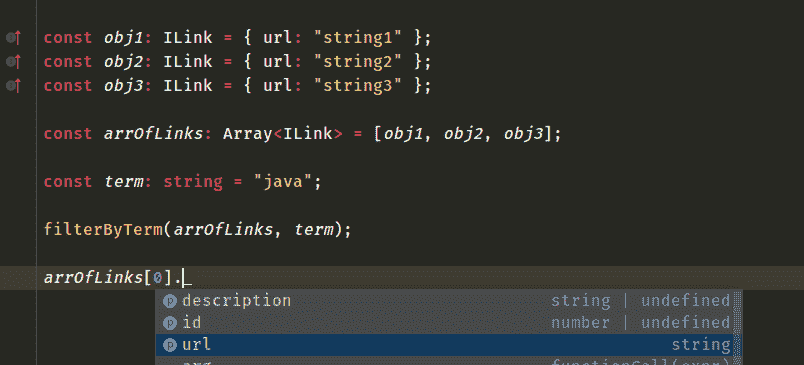

# 面向初学者的 TypeScript 教程:缺失的指南-第 2 部分

> 原文:[https://dev . to/valentinogagliardi/typescript-tutorial-for-初学者-the-missing-guide-part-2-3 ahh](https://dev.to/valentinogagliardi/typescript-tutorial-for-beginners-the-missing-guide-part-2-3ahh)

**刚刚越过 dev.to 上的 5k follower！谢谢大家！多么神奇的社区啊！谁也在推特上？下面连线= > [我在这里](https://twitter.com/gagliardi_vale)** 。

什么是 TypeScript，为什么您可能想使用它？通过这篇面向初学者的 TypeScript 教程了解更多信息，并开始向您的 JavaScript 代码添加类型！

*原载于[valentinog.com/blog](https://www.valentinog.com/blog/typescript/)T3】*

## [](#in-this-episode)本集:

*   类型脚本类型
*   类型脚本接口
*   键入变量

## [](#dipping-our-toes-into-typescript-types)把我们的脚趾伸进打字稿中

TypeScript 围绕着**类型**，看起来我们的代码根本没有类型。是时候补充一些了。我们将首先修正函数参数。通过观察这个函数是如何被调用的，它似乎把字符串作为参数:

```
filterByTerm("input string", "java"); 
```

<svg width="20px" height="20px" viewBox="0 0 24 24" class="highlight-action crayons-icon highlight-action--fullscreen-on"><title>Enter fullscreen mode</title></svg> <svg width="20px" height="20px" viewBox="0 0 24 24" class="highlight-action crayons-icon highlight-action--fullscreen-off"><title>Exit fullscreen mode</title></svg>

我们确定吗？让我们将第一个**类型注释**添加到函数中。下面是方法:

```
function filterByTerm(input: string, searchTerm: string) {
    // omitted
}

// omitted 
```

<svg width="20px" height="20px" viewBox="0 0 24 24" class="highlight-action crayons-icon highlight-action--fullscreen-on"><title>Enter fullscreen mode</title></svg> <svg width="20px" height="20px" viewBox="0 0 24 24" class="highlight-action crayons-icon highlight-action--fullscreen-off"><title>Exit fullscreen mode</title></svg>

就是这样！通过向参数添加类型，我们将代码从纯 JavaScript 迁移到 TypeScript。但是如果你尝试编译代码:

```
npm run tsc 
```

<svg width="20px" height="20px" viewBox="0 0 24 24" class="highlight-action crayons-icon highlight-action--fullscreen-on"><title>Enter fullscreen mode</title></svg> <svg width="20px" height="20px" viewBox="0 0 24 24" class="highlight-action crayons-icon highlight-action--fullscreen-off"><title>Exit fullscreen mode</title></svg>

下面是发生的情况:

```
filterByTerm.ts:5:16 - error TS2339: Property 'filter' does not exist on type 'string'. 
```

<svg width="20px" height="20px" viewBox="0 0 24 24" class="highlight-action crayons-icon highlight-action--fullscreen-on"><title>Enter fullscreen mode</title></svg> <svg width="20px" height="20px" viewBox="0 0 24 24" class="highlight-action crayons-icon highlight-action--fullscreen-off"><title>Exit fullscreen mode</title></svg>

你能看出 TypeScript 是如何引导你的吗？过滤函数有问题:

```
function filterByTerm(input: string, searchTerm: string) {
    // omitted
  return input.filter(function(arrayElement) {
    return arrayElement.url.match(regex);
  });
} 
```

<svg width="20px" height="20px" viewBox="0 0 24 24" class="highlight-action crayons-icon highlight-action--fullscreen-on"><title>Enter fullscreen mode</title></svg> <svg width="20px" height="20px" viewBox="0 0 24 24" class="highlight-action crayons-icon highlight-action--fullscreen-off"><title>Exit fullscreen mode</title></svg>

我们告诉 TypeScript“input”是一个字符串，但是在后面的代码中，我们对它调用了 [filter 方法](https://developer.mozilla.org/en-US/docs/Web/JavaScript/Reference/Global_Objects/Array/filter)，它属于数组。相反，我们真正想要的是将“输入”标记为某个数组，也许是字符串数组？

为此，您有两种选择。带字符串[]的选项 1:

```
function filterByTerm(input: string[], searchTerm: string) {
    // omitted
} 
```

<svg width="20px" height="20px" viewBox="0 0 24 24" class="highlight-action crayons-icon highlight-action--fullscreen-on"><title>Enter fullscreen mode</title></svg> <svg width="20px" height="20px" viewBox="0 0 24 24" class="highlight-action crayons-icon highlight-action--fullscreen-off"><title>Exit fullscreen mode</title></svg>

或者如果你喜欢这种语法，用数组:
选择 2

```
function filterByTerm(input: Array<string>, searchTerm: string) {
    // omitted

} 
```

<svg width="20px" height="20px" viewBox="0 0 24 24" class="highlight-action crayons-icon highlight-action--fullscreen-on"><title>Enter fullscreen mode</title></svg> <svg width="20px" height="20px" viewBox="0 0 24 24" class="highlight-action crayons-icon highlight-action--fullscreen-off"><title>Exit fullscreen mode</title></svg>

我个人更喜欢选项 2。现在让我们再次尝试编译(npm 运行 tsc ),这里是:

```
filterByTerm.ts:10:14 - error TS2345: Argument of type '"input string"' is not assignable to parameter of type 'string[]'.

filterByTerm("input string", "java"); 
```

<svg width="20px" height="20px" viewBox="0 0 24 24" class="highlight-action crayons-icon highlight-action--fullscreen-on"><title>Enter fullscreen mode</title></svg> <svg width="20px" height="20px" viewBox="0 0 24 24" class="highlight-action crayons-icon highlight-action--fullscreen-off"><title>Exit fullscreen mode</title></svg>

我猜 TypeScript 不想丢下我们不管。不要责怪它，**我们将 input 标记为一个字符串数组，现在我们试图传入一个字符串**。这很容易解决！让我们用**传递一个字符串数组来代替** :

```
filterByTerm(["string1", "string2", "string3"], "java"); 
```

<svg width="20px" height="20px" viewBox="0 0 24 24" class="highlight-action crayons-icon highlight-action--fullscreen-on"><title>Enter fullscreen mode</title></svg> <svg width="20px" height="20px" viewBox="0 0 24 24" class="highlight-action crayons-icon highlight-action--fullscreen-off"><title>Exit fullscreen mode</title></svg>

这里是目前为止完整的代码:

```
function filterByTerm(input: Array<string>, searchTerm: string) {
  if (!searchTerm) throw Error("searchTerm cannot be empty");
  if (!input.length) throw Error("input cannot be empty");
  const regex = new RegExp(searchTerm, "i");
  return input.filter(function(arrayElement) {
    return arrayElement.url.match(regex);
  });
}

filterByTerm(["string1", "string2", "string3"], "java"); 
```

<svg width="20px" height="20px" viewBox="0 0 24 24" class="highlight-action crayons-icon highlight-action--fullscreen-on"><title>Enter fullscreen mode</title></svg> <svg width="20px" height="20px" viewBox="0 0 24 24" class="highlight-action crayons-icon highlight-action--fullscreen-off"><title>Exit fullscreen mode</title></svg>

我觉得不错。但是如果你编译它不是(npm 运行 tsc):

```
filterByTerm.ts:6:25 - error TS2339: Property 'url' does not exist on type 'string'. 
```

<svg width="20px" height="20px" viewBox="0 0 24 24" class="highlight-action crayons-icon highlight-action--fullscreen-on"><title>Enter fullscreen mode</title></svg> <svg width="20px" height="20px" viewBox="0 0 24 24" class="highlight-action crayons-icon highlight-action--fullscreen-off"><title>Exit fullscreen mode</title></svg>

好的打字稿，很公平。我们传入了一个字符串数组，但是在代码的后面，我们试图访问一个名为“url”的属性:

```
return arrayElement.url.match(regex); 
```

<svg width="20px" height="20px" viewBox="0 0 24 24" class="highlight-action crayons-icon highlight-action--fullscreen-on"><title>Enter fullscreen mode</title></svg> <svg width="20px" height="20px" viewBox="0 0 24 24" class="highlight-action crayons-icon highlight-action--fullscreen-off"><title>Exit fullscreen mode</title></svg>

这意味着我们想要一个对象数组，而不是字符串数组。让我们在下一节中解决这个问题！

## [](#typescript-tutorial-for-beginners-typescript-objects-and-interfaces)初学者的 TypeScript 教程:TypeScript 对象和接口

我们带着 TypeScript 的抱怨(多么令人惊讶)离开，因为 filterByTerm 已经被传递了一个字符串数组。“url”属性在类型字符串上不存在。让我们通过传递一个对象数组来帮助 TypeScript，其中每个对象都有所需的 url 属性:

```
filterByTerm(
  [{ url: "string1" }, { url: "string2" }, { url: "string3" }],
  "java"
); 
```

<svg width="20px" height="20px" viewBox="0 0 24 24" class="highlight-action crayons-icon highlight-action--fullscreen-on"><title>Enter fullscreen mode</title></svg> <svg width="20px" height="20px" viewBox="0 0 24 24" class="highlight-action crayons-icon highlight-action--fullscreen-off"><title>Exit fullscreen mode</title></svg>

当你在那里的时候，更新函数签名，使它接受一个**对象数组** :

```
function filterByTerm(input: Array<object>, searchTerm: string) {
    // omitted
} 
```

<svg width="20px" height="20px" viewBox="0 0 24 24" class="highlight-action crayons-icon highlight-action--fullscreen-on"><title>Enter fullscreen mode</title></svg> <svg width="20px" height="20px" viewBox="0 0 24 24" class="highlight-action crayons-icon highlight-action--fullscreen-off"><title>Exit fullscreen mode</title></svg>

现在我们来编译代码:

```
npm run tsc 
```

<svg width="20px" height="20px" viewBox="0 0 24 24" class="highlight-action crayons-icon highlight-action--fullscreen-on"><title>Enter fullscreen mode</title></svg> <svg width="20px" height="20px" viewBox="0 0 24 24" class="highlight-action crayons-icon highlight-action--fullscreen-off"><title>Exit fullscreen mode</title></svg>

并赞叹输出:

```
filterByTerm.ts:6:25 - error TS2339: Property 'url' does not exist on type 'object'. 
```

<svg width="20px" height="20px" viewBox="0 0 24 24" class="highlight-action crayons-icon highlight-action--fullscreen-on"><title>Enter fullscreen mode</title></svg> <svg width="20px" height="20px" viewBox="0 0 24 24" class="highlight-action crayons-icon highlight-action--fullscreen-off"><title>Exit fullscreen mode</title></svg>

又来了！这是有意义的，至少在 TypeScript 中是这样的:通用的 [JavaScript 对象](https://www.valentinog.com/blog/objects/)没有任何名为“url”的属性。对我来说，这是打字稿真正开始发光的**。**

 **那么 JavaScript 和 TypeScript 之间真正的**区别是什么呢？**不是 JavaScript 没有类型。 **JavaScript 有类型，但它们是“松散的”、动态的**。换句话说，您可以在代码的后面更改变量的类型，或者为(几乎)任何对象分配新的属性。

现在，起初它看起来像陌生的语法，但是一旦你习惯了**接口**，你就会开始到处使用它们。但是顺便问一下，接口是什么？TypeScript 中的一个**接口就像一个契约**。或者换句话说，**界面就像是你的实体**的“模型”。

通过查看我们的代码，我们可以想到一个名为 Link 的简单“模型”,它的形状应该符合以下模式:

*   它必须有一个**类型字符串**的 **url** 属性

在 TypeScript 中，你可以用一个接口来定义这个“模型”，就像这样(把下面的代码放在 **filterByTerm.ts** 的顶部:

```
interface ILink {
  url: string;
} 
```

<svg width="20px" height="20px" viewBox="0 0 24 24" class="highlight-action crayons-icon highlight-action--fullscreen-on"><title>Enter fullscreen mode</title></svg> <svg width="20px" height="20px" viewBox="0 0 24 24" class="highlight-action crayons-icon highlight-action--fullscreen-off"><title>Exit fullscreen mode</title></svg>

对于接口声明，我们说“从现在开始，我想在我的 TypeScript 代码中使用该形状”。这当然不是有效的 JavaScript 语法，在编译过程中会被去掉。

提示:用大写字母 I 作为接口的前缀是个好主意，这是 TypeScript 中的惯例

现在我们可以使用我们的接口 ILink，它实际上也是一个**自定义类型脚本类型**，通过固定参数“input”:

```
function filterByTerm(input: Array<ILink>, searchTerm: string) {
    // omitted
} 
```

<svg width="20px" height="20px" viewBox="0 0 24 24" class="highlight-action crayons-icon highlight-action--fullscreen-on"><title>Enter fullscreen mode</title></svg> <svg width="20px" height="20px" viewBox="0 0 24 24" class="highlight-action crayons-icon highlight-action--fullscreen-off"><title>Exit fullscreen mode</title></svg>

有了这个修正，我们说 TypeScript“期望 ILink 的数组”作为该函数的输入。下面是完整的代码:

```
interface ILink {
  url: string;
}

function filterByTerm(input: Array<ILink>, searchTerm: string) {
  if (!searchTerm) throw Error("searchTerm cannot be empty");
  if (!input.length) throw Error("input cannot be empty");
  const regex = new RegExp(searchTerm, "i");
  return input.filter(function(arrayElement) {
    return arrayElement.url.match(regex);
  });
}

filterByTerm(
  [{ url: "string1" }, { url: "string2" }, { url: "string3" }],
  "java"
); 
```

<svg width="20px" height="20px" viewBox="0 0 24 24" class="highlight-action crayons-icon highlight-action--fullscreen-on"><title>Enter fullscreen mode</title></svg> <svg width="20px" height="20px" viewBox="0 0 24 24" class="highlight-action crayons-icon highlight-action--fullscreen-off"><title>Exit fullscreen mode</title></svg>

此时，所有的错误都应该消失，您可以运行:

```
npm run tsc 
```

<svg width="20px" height="20px" viewBox="0 0 24 24" class="highlight-action crayons-icon highlight-action--fullscreen-on"><title>Enter fullscreen mode</title></svg> <svg width="20px" height="20px" viewBox="0 0 24 24" class="highlight-action crayons-icon highlight-action--fullscreen-off"><title>Exit fullscreen mode</title></svg>

编译步骤将在项目文件夹中生成一个名为 **filterByTerm.js** 的文件，其中包含普通的 JavaScript 代码。您可以签出该文件，并查看如何剥离特定于 TypeScript 的声明。

由于“alwaysStrict”被设置为 true，TypeScript 编译器也在 **filterByTerm.js** 的顶部发出“use strict”。

你的第一个打字稿代码做得很好！在下一节中，我们将更深入地探讨接口。

## [](#typescript-tutorial-for-beginners-interfaces-and-fields)新手打字教程:界面和字段

TypeScript 接口是该语言最强大的构造之一。接口有助于塑造应用程序中的“模型”,这样任何开发人员都可以选择模型，并在编写代码时**遵循它**。

到目前为止，我们定义了一个简单的接口，ILink:

```
interface ILink {
  url: string;
} 
```

<svg width="20px" height="20px" viewBox="0 0 24 24" class="highlight-action crayons-icon highlight-action--fullscreen-on"><title>Enter fullscreen mode</title></svg> <svg width="20px" height="20px" viewBox="0 0 24 24" class="highlight-action crayons-icon highlight-action--fullscreen-off"><title>Exit fullscreen mode</title></svg>

如果你想在接口中添加更多的字段，只需要在块中声明它们:

```
interface ILink {
  description: string;
  id: number;
  url: string;
} 
```

<svg width="20px" height="20px" viewBox="0 0 24 24" class="highlight-action crayons-icon highlight-action--fullscreen-on"><title>Enter fullscreen mode</title></svg> <svg width="20px" height="20px" viewBox="0 0 24 24" class="highlight-action crayons-icon highlight-action--fullscreen-off"><title>Exit fullscreen mode</title></svg>

现在，任何 ILink 类型的对象都必须“实现”新字段，否则会出现错误。实际上通过编译代码用:

```
npm run tsc 
```

<svg width="20px" height="20px" viewBox="0 0 24 24" class="highlight-action crayons-icon highlight-action--fullscreen-on"><title>Enter fullscreen mode</title></svg> <svg width="20px" height="20px" viewBox="0 0 24 24" class="highlight-action crayons-icon highlight-action--fullscreen-off"><title>Exit fullscreen mode</title></svg>

打字稿冲着你尖叫:

```
filterByTerm.ts:17:4 - error TS2739: Type '{ url: string; }' is missing the following properties from type 'ILink': description, id 
```

<svg width="20px" height="20px" viewBox="0 0 24 24" class="highlight-action crayons-icon highlight-action--fullscreen-on"><title>Enter fullscreen mode</title></svg> <svg width="20px" height="20px" viewBox="0 0 24 24" class="highlight-action crayons-icon highlight-action--fullscreen-off"><title>Exit fullscreen mode</title></svg>

问题在于我们函数的参数:

```
filterByTerm(
  [{ url: "string1" }, { url: "string2" }, { url: "string3" }],
  "java"
); 
```

<svg width="20px" height="20px" viewBox="0 0 24 24" class="highlight-action crayons-icon highlight-action--fullscreen-on"><title>Enter fullscreen mode</title></svg> <svg width="20px" height="20px" viewBox="0 0 24 24" class="highlight-action crayons-icon highlight-action--fullscreen-off"><title>Exit fullscreen mode</title></svg>

TypeScript 能够通过查看函数声明推断出参数是 ILink 的数组类型。因此**数组中的任何对象必须拥有(实现)接口 ILink** 中定义的所有字段。

大多数时候，这远非最佳。毕竟我们不知道是否每一个 ILink 类型的新对象都有所有的字段。别担心，为了让编译通过，我们可以用问号 :
来**声明接口的字段是可选的**

```
interface ILink {
  description?: string;
  id?: number;
  url: string;
} 
```

<svg width="20px" height="20px" viewBox="0 0 24 24" class="highlight-action crayons-icon highlight-action--fullscreen-on"><title>Enter fullscreen mode</title></svg> <svg width="20px" height="20px" viewBox="0 0 24 24" class="highlight-action crayons-icon highlight-action--fullscreen-off"><title>Exit fullscreen mode</title></svg>

现在编辑器和编译器都可以了。然而，TypeScript 接口可以做得更多，在下一节中，我们将看到如何扩展它们。但是首先要简单说明一下 TypeScript 中的变量。

## [](#typescript-tutorial-for-beginners-typing-variables)新手打字教程:输入变量

到目前为止，您已经看到了如何**向函数的参数** :
添加类型

```
function filterByTerm(input: Array<ILink>, searchTerm: string) {
    //
} 
```

<svg width="20px" height="20px" viewBox="0 0 24 24" class="highlight-action crayons-icon highlight-action--fullscreen-on"><title>Enter fullscreen mode</title></svg> <svg width="20px" height="20px" viewBox="0 0 24 24" class="highlight-action crayons-icon highlight-action--fullscreen-off"><title>Exit fullscreen mode</title></svg>

TypeScript 并不局限于此，当然你也可以给任何变量添加类型。为了举例说明，让我们一个一个地提取函数的参数。首先我要提取每一个物体:

```
const obj1: ILink = { url: "string1" };
const obj2: ILink = { url: "string2" };
const obj3: ILink = { url: "string3" }; 
```

<svg width="20px" height="20px" viewBox="0 0 24 24" class="highlight-action crayons-icon highlight-action--fullscreen-on"><title>Enter fullscreen mode</title></svg> <svg width="20px" height="20px" viewBox="0 0 24 24" class="highlight-action crayons-icon highlight-action--fullscreen-off"><title>Exit fullscreen mode</title></svg>

注意**我如何对 TypeScript 说 obj1、obj2 和 obj3 是 ILink** 类型。在“普通”的 JavaScript 中，你可以写:

```
const obj1 = { url: "string1" };
const obj2 = { url: "string2" };
const obj3 = { url: "string3" }; 
```

<svg width="20px" height="20px" viewBox="0 0 24 24" class="highlight-action crayons-icon highlight-action--fullscreen-on"><title>Enter fullscreen mode</title></svg> <svg width="20px" height="20px" viewBox="0 0 24 24" class="highlight-action crayons-icon highlight-action--fullscreen-off"><title>Exit fullscreen mode</title></svg>

接下来我们可以这样定义 ILink 的数组:

```
const arrOfLinks: Array<ILink> = [obj1, obj2, obj3]; 
```

<svg width="20px" height="20px" viewBox="0 0 24 24" class="highlight-action crayons-icon highlight-action--fullscreen-on"><title>Enter fullscreen mode</title></svg> <svg width="20px" height="20px" viewBox="0 0 24 24" class="highlight-action crayons-icon highlight-action--fullscreen-off"><title>Exit fullscreen mode</title></svg>

最后是搜索词:

```
const term: string = "java"; 
```

<svg width="20px" height="20px" viewBox="0 0 24 24" class="highlight-action crayons-icon highlight-action--fullscreen-on"><title>Enter fullscreen mode</title></svg> <svg width="20px" height="20px" viewBox="0 0 24 24" class="highlight-action crayons-icon highlight-action--fullscreen-off"><title>Exit fullscreen mode</title></svg>

下面是完整的代码:

```
interface ILink {
  description?: string;
  id?: number;
  url: string;
}

function filterByTerm(input: Array<ILink>, searchTerm: string) {
  if (!searchTerm) throw Error("searchTerm cannot be empty");
  if (!input.length) throw Error("input cannot be empty");
  const regex = new RegExp(searchTerm, "i");
  return input.filter(function(arrayElement) {
    return arrayElement.url.match(regex);
  });
}

const obj1: ILink = { url: "string1" };
const obj2: ILink = { url: "string2" };
const obj3: ILink = { url: "string3" };

const arrOfLinks: Array<ILink> = [obj1, obj2, obj3];

const term: string = "java";

filterByTerm(arrOfLinks, term); 
```

<svg width="20px" height="20px" viewBox="0 0 24 24" class="highlight-action crayons-icon highlight-action--fullscreen-on"><title>Enter fullscreen mode</title></svg> <svg width="20px" height="20px" viewBox="0 0 24 24" class="highlight-action crayons-icon highlight-action--fullscreen-off"><title>Exit fullscreen mode</title></svg>

好吧，我理解你。与 JavaScript 相比，TypeScript 看起来更加冗长，有时甚至是多余的。但是随着时间的推移，你会发现**你添加的类型越多，你的代码就越健壮**。

通过添加类型注释来帮助 TypeScript 理解代码的意图越多，以后就越好。您的开发者体验将会突飞猛进。

例如，现在 arrOfLinks 与正确类型(ILink 的数组)相关联，您的编辑器能够推断出数组中的每个对象都有一个名为 **url** 的属性，如接口 ILink:

[T2】](https://res.cloudinary.com/practicaldev/image/fetch/s--1D5QJvUT--/c_limit%2Cf_auto%2Cfl_progressive%2Cq_auto%2Cw_880/https://thepracticaldev.s3.amazonaws.com/i/bk0911wc10l8sfxhs6f6.png)

现在告诉我这不是很棒，因为确实很棒。除了字符串、数组和数字，TypeScript 还有更多类型。

有**布尔，元组，“any”，never，枚举**。假以时日，你会全部学会的。如果你很好奇，可以查看一下基本类型的[文档。](https://www.typescriptlang.org/docs/handbook/basic-types.html)

现在让我们继续讨论**扩展接口**。

* * *

敬请关注第三部分！**