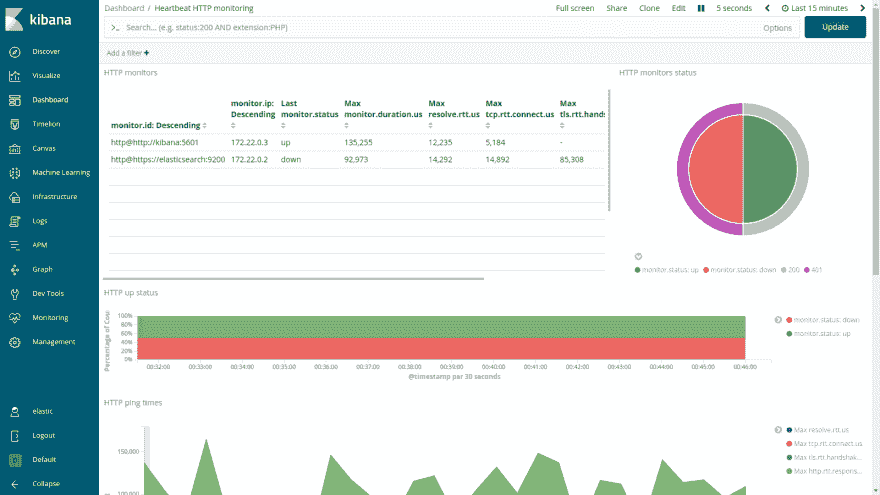
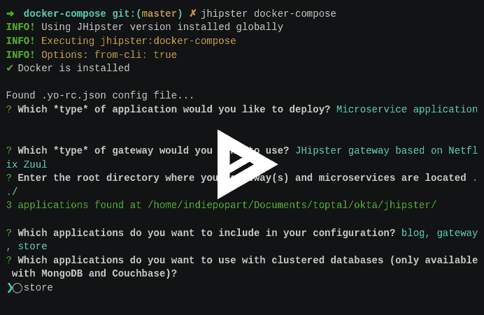
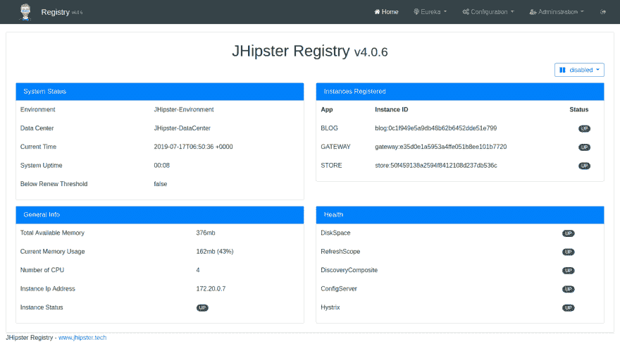
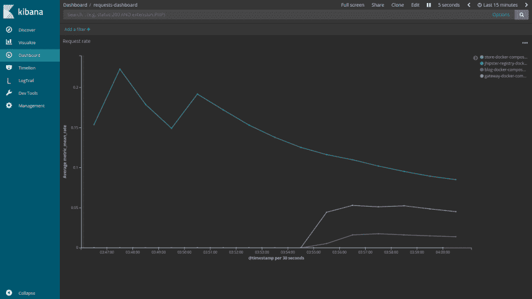
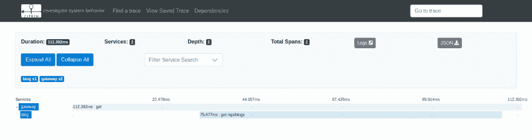

# 从 ELK 堆栈开始

> 原文:[https://dev.to/oktadev/get-started-with-the-elk-stack-52p3](https://dev.to/oktadev/get-started-with-the-elk-stack-52p3)

好的设计原则要求微服务架构是可观察的，并提供集中的监控工具。该工具允许开发团队验证整个系统的健康状况，检查日志和错误，并在部署后获得反馈。那么，什么是弹性(或 ELK)堆栈，为什么它是满足这一需求的绝佳选择？

在这篇教程文章中，你将学习如何…

*   在 Docker 容器中设置并运行 ELK 堆栈
*   设置 JHipster 控制台以监控微服务基础设施
*   用 JHipster 创建微服务架构
*   启用 JHipster 控制台监控
*   为微服务配置 OpenID 连接身份验证

## [](#the-evolution-of-the-elastic-stack)弹性叠加的演变

首字母缩写 ELK 代表 *Elasticsearch、Logstash 和 Kibana* ，这三个开源项目形成了一个强大的堆栈，用于日志摄取和可视化、日志搜索、事件分析以及监控应用程序的有用可视化指标。

这个堆栈的核心是:一个基于 JSON 的搜索和分析引擎，是分布式的，可扩展的。它构建在 Apache Lucene 之上，提供 JSON REST API、集群管理、高可用性和容错。

***L** ogstash* 是一个 ETL(提取、转换、加载)工具，用来丰富文档，运行数据处理管道。这些管道从多个来源摄取数据，转换并将其发送到 Elasticsearch。

***K** ibana* 提供了可视化前端，一个进入弹性堆栈的窗口。借助仪表盘和可视化元素，可以探索、汇总和分析存储在 Elasticsearch 中的数据。

从版本 7 开始，ELK Stack 改名为 [Elastic Stack](https://www.elastic.co/elk-stack) 并在 Stack 中加入了 Beats。Beats 是一个轻量级数据传送器家族，与 Elasticsearch 和 Logstash 一起工作。

## [](#set-up-the-elastic-stack)设置弹性堆栈

Elastic 已经发布了一个 Docker Compose 配置,来演示单个机器上的堆栈组件。安装[对接器](https://docs.docker.com/install/)和[对接器组合](https://docs.docker.com/compose/install/)，按照以下步骤启动堆栈:

> Windows 用户必须配置 2 个环境变量，查看[**stack-docker**github repository](https://github.com/elastic/stack-docker)上的说明。
> 
> 允许容器至少有 4GB 的内存，同时查看您的环境的说明。

*   克隆`stack-docker`存储库

```
 git clone https://github.com/elastic/stack-docker.git 
```

*   使用 Docker Compose 设置堆栈

```
 cd stack-docker
 docker-compose -f setup.yml up 
```

当设置完成后，会输出**弹性**用户的**密码**。在慢速连接上，这可能需要 20 分钟。当它完成时，您将看到以下日志:

```
 setup_1 | Setup completed successfully. To start the stack please run:
 setup_1 | docker-compose up -d
 setup_1 |
 setup_1 | If you wish to remove the setup containers please run:
 setup_1 | docker-compose -f docker-compose.yml -f docker-compose.setup.yml down --remove-orphans
 setup_1 |
 setup_1 | You will have to re-start the stack after removing setup containers.
 setup_1 |
 setup_1 | Your 'elastic' user password is: Z8GFVXu9UVsBrM6nup5fHw==
 stack-docker_setup_1 exited with code 0 
```

*   启动堆栈

在前台启动堆栈来查看容器日志:

```
 docker-compose up 
```

当您看到 Kibana 记录对 Beats 家族发送的健康检查请求的响应，并且在日志中看到至少一个心跳条目时，您可以尝试登录:

```
 kibana | {"type":"response","@timestamp":"2019-09-23T20:38:47Z","tags":[],"pid":1,"method":"get","statusCode":200,"req":{"url":"/login?next=%2F","method":"get","headers":{"host":"kibana:5601","user-agent":"Go-http-client/1.1","referer":"http://kibana:5601"},"remoteAddress":"172.25.0.9","userAgent":"172.25.0.9","referer":"http://kibana:5601"},"res":{"statusCode":200,"responseTime":30,"contentLength":9},"message":"GET /login?next=%2F 200 30ms - 9.0B"}
 ...
 heartbeat | 2019-09-23T20:38:52.213Z   INFO    [monitoring]    log/log.go:144  Non-zero metrics in the last 30s    {"monitoring": {"metrics": {"beat":{"cpu":{"system":{"ticks":160,"time":{"ms":50}},"total":{"ticks":430,"time":{"ms":120},"value":430},"user":{"ticks":270,"time":{"ms":70}}},"handles":{"limit":{"hard":1048576,"soft":1048576},"open":9},"info":{"ephemeral_id":"d8d4f6a2-39fa-41cb-9e9c-520438d49a9e","uptime":{"ms":93132}},"memstats":{"gc_next":4194304,"memory_alloc":3365792,"memory_total":12191384,"rss":327680}},"libbeat":{"config":{"module":{"running":0}},"output":{"events":{"acked":24,"batches":6,"total":24},"read":{"bytes":5970},"write":{"bytes":16878}},"pipeline":{"clients":4,"events":{"active":0,"published":24,"total":24},"queue":{"acked":24}}},"system":{"load":{"1":4.83,"15":2.43,"5":3.44,"norm":{"1":1.2075,"15":0.6075,"5":0.86}}}}}} 
```

> 您可能会注意到日志输出中的异常。对于本演示，可以安全地忽略它们。如果你在 docker 上遇到任何问题，你可以重新开始:
> 
> ```
> docker container ls -a | cut -c1-12 | xargs docker container rm --force
> docker images | cut -c69-80 | xargs docker rmi
> docker system prune -a 
> ```
> 
> **注意:**这会破坏所有 docker 容器、图像和网络，所以使用风险自担。

*   前往 [http://localhost:5601](http://localhost:5601/) 登录 Kibana。

登录后(使用上面捕获的 **elastic** 用户和密码),通过左侧的菜单从仪表板部分浏览已安装的仪表板。Heartbeat 是 beat 服务之一，它从提供的 URL 列表中监控您的服务的正常运行时间。打开仪表板 *Heartbeat HTTP monitoring* ，查看数据可视化堆栈的强大功能。

[T2】](https://res.cloudinary.com/practicaldev/image/fetch/s--AhTaM7Z---/c_limit%2Cf_auto%2Cfl_progressive%2Cq_auto%2Cw_880/https://d33wubrfki0l68.cloudfront.net/72ead612a4bddcce64c6d7d1e4732572362733f0/dff94/assets-jekyll/blog/getting-started-with-elk/http-heartbeat-035b09e1def6d90ce65a7547cb58a481e05e8693ea8275d20eefa41d1800f786.png)

## JHipster 控制台

Jhipster 控制台是一个基于弹性堆栈的出色监控解决方案，它允许随时可视化和分析 JHipster 应用程序指标。控制台提供预配置的仪表盘来监控微服务基础架构。您可以在[j ipster 控制台的文档](https://www.jhipster.tech/monitoring/#jhipster-console)中查看完整的功能列表。

从 JHipster 控制台开始的一个更简单的方法是部署应用程序，并使用 [docker-compose 子生成器](https://www.jhipster.tech/docker-compose/)启用监控。您将使用它来:

*   用 JHipster 创建微服务架构
*   启用 JHipster 控制台监控
*   配置 OpenID Connect 以对微服务进行身份验证

## [](#create-a-java-microservices-architecture-with-jhipster)用 JHipster 打造 Java 微服务架构

> 要安装可以在这里工作的 JHipster 版本，您需要安装 [Node.js](https://nodejs.org/) 。

### [](#install-jhipster)安装 JHipster

```
npm install -g generator-jhipster@6.3.1
jhipster --version 
```

version 命令应该输出类似这样的内容:

```
INFO! Using JHipster version installed globally
6.3.1 
```

为项目创建一个目录:

```
mkdir jhipster
cd jhipster 
```

用 JHipster 领域语言(JDL)创建`apps.jh`来定义商店、博客和网关微服务。在本教程中，我们将重新创建在之前构建的基于 Java 的微服务架构示例[。](https://developer.okta.com/blog/2019/05/23/java-microservices-spring-cloud-config) 

```
application  {  config  {  baseName  gateway,  packageName  com.okta.developer.gateway,  applicationType  gateway,  authenticationType  oauth2,  prodDatabaseType  postgresql,  serviceDiscoveryType  eureka,  testFrameworks  [protractor]  }  entities  Blog,  Post,  Tag,  Product  }  application  {  config  {  baseName  blog,  packageName  com.okta.developer.blog,  applicationType  microservice,  authenticationType  oauth2,  prodDatabaseType  postgresql,  serverPort  8081,  serviceDiscoveryType  eureka  }  entities  Blog,  Post,  Tag  }  application  {  config  {  baseName  store,  packageName  com.okta.developer.store,  applicationType  microservice,  authenticationType  oauth2,  databaseType  mongodb,  devDatabaseType  mongodb,  prodDatabaseType  mongodb,  enableHibernateCache  false,  serverPort  8082,  serviceDiscoveryType  eureka  }  entities  Product  }  entity  Blog  {  name  String  required  minlength(3),  handle  String  required  minlength(2)  }  entity  Post  {  title  String  required,  content  TextBlob  required,  date  Instant  required  }  entity  Tag  {  name  String  required  minlength(2)  }  entity  Product  {  title  String  required,  price  BigDecimal  required  min(0),  image  ImageBlob  }  relationship  ManyToOne  {  Blog{user(login)}  to  User,  Post{blog(name)}  to  Blog  }  relationship  ManyToMany  {  Post{tag(name)}  to  Tag{post}  }  paginate  Post,  Tag  with  infinite-scroll  paginate  Product  with  pagination  microservice  Product  with  store  microservice  Blog,  Post,  Tag  with  blog 
```

现在，在你的`jhipster`文件夹中，运行 [**import-jdl** 生成器](https://www.jhipster.tech/jdl/#importingjdl)。

```
jhipster import-jdl apps.jh 
```

### [](#deploy-monitoring-using-raw-dockercompose-endraw-)部署监控使用`docker-compose`

在项目文件夹中，为`docker-compose`配置创建一个子文件夹，并运行子生成器。

```
mkdir docker-compose
cd docker-compose
jhipster docker-compose 
```

生成器将要求您定义以下配置:

1.  应用类型:**微服务应用**
2.  网关类型:**基于 Zuul 的 j ipster**
3.  包括哪些应用:**博客**、**网关**、**商店**
4.  如果数据库是集群化的:**否**
5.  如果必须启用监控:**是，使用 JHipster 控制台**
6.  用于监控的附加技术: **Zipkin**
7.  JHipster 注册表的密码:**默认为**

[T2】](https://asciinema.org/a/261254)

当生成器几乎完成时，输出中显示一条警告:

```
WARNING! Docker Compose configuration generated, but no Jib cache found
If you forgot to generate the Docker image for this application, please run:
To generate the missing Docker image(s), please run:
  ./mvnw package -Pprod verify jib:dockerBuild in /home/indiepopart/jhipster/blog
  ./mvnw package -Pprod verify jib:dockerBuild in /home/indiepopart/jhipster/gateway
  ./mvnw package -Pprod verify jib:dockerBuild in /home/indiepopart/jhipster/store 
```

您可以按照上面的说明创建微服务映像，或者创建一个聚合器`pom.xml`并使用一个命令来构建所有映像，如我们在 Java 微服务上的帖子[中所述。](https://developer.okta.com/blog/2019/05/23/java-microservices-spring-cloud-config)

### [](#setup-okta-openid-connect-oidc-authentication-for-your-microservices)为您的微服务设置 Okta OpenID Connect (OIDC)认证

默认情况下，微服务架构根据 Keycloak 进行身份验证。更新设置以使用 [Okta](https://developer.okta.com) 作为认证提供者:

首先去 Okta 办一个[免费开发者账号](https://developer.okta.com/signup/)。

一旦你登录，点击**你的组织**，它将带你到**开发者控制台**。转到**应用程序**部分，添加一个新的 **Web 应用程序**。设置以下身份验证设置:

*   名称:为您的应用程序命名
*   基地 URIs: `http://localhost:8761`和`http://localhost:8080`
*   登录重定向 URIs: `http://localhost:8080/login/oauth2/code/oidc`和`http://localhost:8761/login/oauth2/code/oidc`
*   允许的授权类型:授权码和刷新令牌

> 为简单起见，本教程仅创建 Web App，其凭证将用于所有服务。在真实环境中，每个服务必须用自己的凭证来标识自己，您应该在 Okta 控制台中为每个服务创建一个 Web 应用程序或服务。

复制**客户端 ID** 和**客户端秘密**，因为我们将在应用程序的设置中使用它。在 Okta 仪表盘的右上角找到**组织的网址**。

用以下内容创建一个`docker-compose/.env`文件:

```
OIDC_CLIENT_ID=<client_id>
OIDC_CLIENT_SECRET=<client_secret>
RESOURCE_ISSUER_URI=<org_url>/oauth2/default 
```

编辑`docker-compose/docker-compose.yml`并更新`blog-app`、`gateway-app`和`store-app` :
服务的`SECURITY_*`设置

```
SPRING_SECURITY_OAUTH2_CLIENT_PROVIDER_OIDC_ISSUER_URI=${RESOURCE_ISSUER_URI}
SPRING_SECURITY_OAUTH2_CLIENT_REGISTRATION_OIDC_CLIENT_ID=${OIDC_CLIENT_ID}
SPRING_SECURITY_OAUTH2_CLIENT_REGISTRATION_OIDC_CLIENT_SECRET=${OIDC_CLIENT_SECRET} 
```

必须为 JHipster 注册中心设置相同的身份验证。编辑`docker-compose/jhipster-registry.yml`并设置与`gateway-app`的环境部分相同的值。

JHipster 应用程序需要 ID 令牌中声明的特定用户角色`ROLE_USER`和`ROLE_ADMIN`。在 Okta 开发者控制台中，转到**用户** > **组**并为每个 JHipster 角色创建一个组，并将用户添加到每个组中。

现在转到 **API** > **授权服务器**，选择**默认**服务器和**添加声明**，设置如下:

1.  名称:组
2.  包括在令牌类型中:ID 令牌，始终
3.  值类型:组
4.  过滤器:匹配正则表达式，将正则表达式设置为`.*`

### [](#enable-debug-logs-and-zipkin)启用调试日志和 Zipkin

要将调试日志发送到 JHipster 控制台，让我们更新 prod 配置文件中的日志级别。编辑`src/main/resources/config/application-prod.yml`将`com.okta.developer.*`记录器的每个服务(`blog-app`、`store-app`和`gateway-app`)的级别设置为**调试**。例如，在博客的`application-prod.yml` :

```
logging:
    level:
        com.okta.developer.blog: DEBUG 
```

此外，对于每个服务，更新`LoggingAspectConfiguration`以在 prod 概要文件激活时加载。更改`@Profile`注释:

```
@Configuration
@EnableAspectJAutoProxy
public class LoggingAspectConfiguration {

    @Bean
    @Profile({JHipsterConstants.SPRING_PROFILE_DEVELOPMENT, JHipsterConstants.SPRING_PROFILE_PRODUCTION})
    public LoggingAspect loggingAspect(Environment env) {
        return new LoggingAspect(env);
    }
} 
```

Zipkin 是一个分布式跟踪系统，有助于解决微服务架构中的延迟问题。随着 traceId 从一个服务传播到另一个服务，对不同服务的调用可以作为同一个流的一部分进行关联和分析。Zipkin 服务器和 UI 随 JHipster 控制台提供，JHipster 应用可以通过 [Spring Cloud Sleuth](https://cloud.spring.io/spring-cloud-sleuth/reference/html/#sleuth-with-zipkin-via-http) 与 Zipkin 集成。要启用 Zipkin 跟踪，将`zipkin`配置文件添加到`docker-compose/docker-compose.yml`中的`blog-app`、`gateway-app`和`store-app`。

```
- SPRING_PROFILES_ACTIVE=prod,swagger,zipkin 
```

您还需要使用以下 Maven 命令为`blog-app`、`store-app`和`gateway-app`重建带有`zipkin`概要文件的 Docker 映像:

```
./mvnw package -Pprod -Pzipkin verify jib:dockerBuild -DskipTests 
```

> ProTip:如果您使用的是 bash shell 系统，比如 Linux 或 MacOs，您可以从`jhipster`文件夹中一次构建每个项目:
> 
> ```
> for i in blog gateway store
> do 
> cd $i 
> ./mvnw package -Pprod -Pzipkin verify jib:dockerBuild -DskipTests
> cd ..
> done 
> ```

### [](#run-the-monitored-microservices-architecture)运行被监控的微服务架构

你准备好了吗？转到`docker-compose`文件夹，用下面的命令启动服务:

```
docker-compose up 
```

在每个服务启动时，您会看到大量的日志记录。

```
jhipster-registry_1 | ----------------------------------------------------------
jhipster-registry_1 | Application 'jhipster-registry' is running! Access URLs:
jhipster-registry_1 | Local: http://localhost:8761
jhipster-registry_1 | External: http://172.20.0.2:8761
jhipster-registry_1 | Profile(s): [composite, dev, swagger, oauth2]
jhipster-registry_1 | ---------------------------------------------------------- 
```

使用 Okta 用户凭证在`http://localhost:8761`登录 JHipster 注册中心，并检查服务的健康状况。

[T2】](https://res.cloudinary.com/practicaldev/image/fetch/s--ZMtcuIq2--/c_limit%2Cf_auto%2Cfl_progressive%2Cq_auto%2Cw_880/https://d33wubrfki0l68.cloudfront.net/342b9f032ef0e3b986eea8f216af7e6517271ebf/9b9e3/assets-jekyll/blog/getting-started-with-elk/registry-7ee3d98030a1808568ec18b06931d2348140cda7be6add80664a02219310dbe9.png)

一旦所有服务都启动了，登录到网关应用程序，创建一些博客和帖子来产生流量。为此，使用应用程序左上角的**实体**菜单。回家的通道在`http://localhost:8080`。

有趣的部分！在`http://localhost:5601`访问 JHipster 控制台。转到仪表板部分，打开**请求-仪表板**。您应该会看到一些漂亮的曲线:

[T2】](https://res.cloudinary.com/practicaldev/image/fetch/s--lkvictcb--/c_limit%2Cf_auto%2Cfl_progressive%2Cq_auto%2Cw_880/https://d33wubrfki0l68.cloudfront.net/90d48fa35b1a90465fdc7931d8ddc49e422e0820/84f1c/assets-jekyll/blog/getting-started-with-elk/requests-dashboard-149c81b627dceb51460dacc9f02ead1dfd5fed0b7d2ae279192a0d73bd2bae62.png)

因为您将 JHipster 控制台与 Zipkin UI 集成在一起，所以在 traces-dashboard 中，您可以在左侧找到最长的跟踪持续时间。如果您单击右边的 traceId，它将在 UI 中打开跟踪，您将能够检查流。

[T2】](https://res.cloudinary.com/practicaldev/image/fetch/s--j2zzkU4G--/c_limit%2Cf_auto%2Cfl_progressive%2Cq_auto%2Cw_880/https://d33wubrfki0l68.cloudfront.net/9b4580fa95d1aa3f39c55f4b4682adda17e6e9ae/4ead5/assets-jekyll/blog/getting-started-with-elk/zipkin-ui-ff18b2fb146f66da5f8265a42da16f6e2bd0f8853a66e93823b863fc6a6054ba.png)

## [](#learn-more-about-jhipster-and-elastic-stack)了解 JHipster 和 Elastic Stack 的更多信息

我希望你喜欢这篇教程，以及用于监控微服务架构的**弹性堆栈**和 **JHipster 控制台**的强大功能。要继续扩展您在 JHipster 监控和 Okta 与 Elastic Stack 集成方面的知识，请查看以下链接:

*   [Github 上的 JHipster 控制台](https://github.com/jhipster/jhipster-console)
*   [j ipster 监控文档](https://www.jhipster.tech/monitoring/)
*   [SAML 认证和弹性堆栈](https://www.elastic.co/blog/how-to-enable-saml-authentication-in-kibana-and-elasticsearch)
*   [基巴纳认证](https://www.elastic.co/guide/en/kibana/current/kibana-authentication.html)

如果你喜欢这篇文章，你可能会喜欢我们关于 JHipster 和微服务的其他文章:

*   [更好、更快、更轻便的 Java 与 Java 12 和 JHipster 6](https://developer.okta.com/blog/2019/04/04/java-11-java-12-jhipster-oidc)
*   通过升级 Spring 安全 OAuth 和 JUnit 测试👀一个 Java 潮人的
*   [Java 微服务与 Spring Boot 和春云](https://developer.okta.com/blog/2019/05/22/java-microservices-spring-boot-spring-cloud)
*   [采用 Spring Cloud Config 和 JHipster 的 Java 微服务](https://developer.okta.com/blog/2019/05/23/java-microservices-spring-cloud-config)
*   [通过 Spring Cloud Gateway 保护反应式微服务](https://developer.okta.com/blog/2019/08/28/reactive-microservices-spring-cloud-gateway)

为了在我们发布新帖子时得到通知，[在 Twitter 上关注@ okta dev](https://twitter.com/oktadev)。我们还定期向[我们的 YouTube 频道](https://www.youtube.com/c/oktadev)发布截屏。

[T2】](https://res.cloudinary.com/practicaldev/image/fetch/s--qX0f-pbv--/c_limit%2Cf_auto%2Cfl_progressive%2Cq_auto%2Cw_880/http://feeds.feedburner.com/%257Er/OktaDeveloperBlog/%257E4/s86SIvj5TeE)