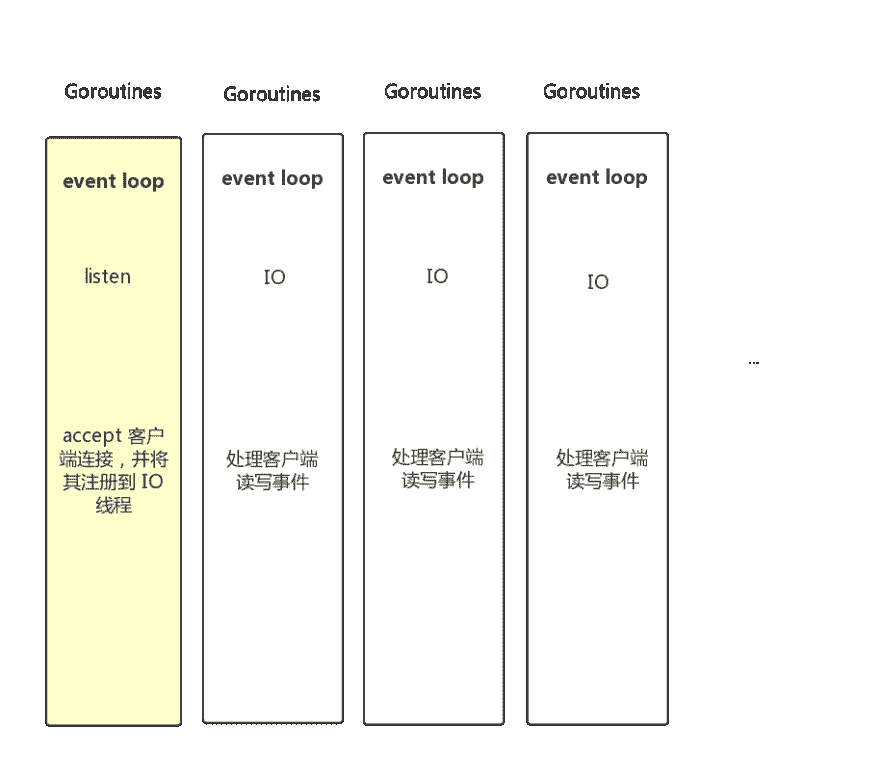
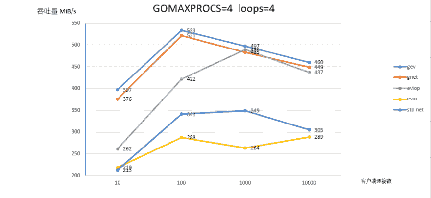
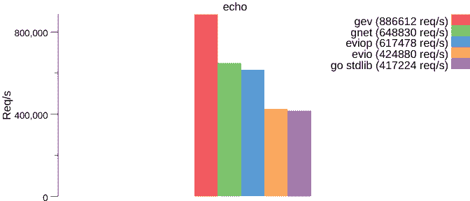
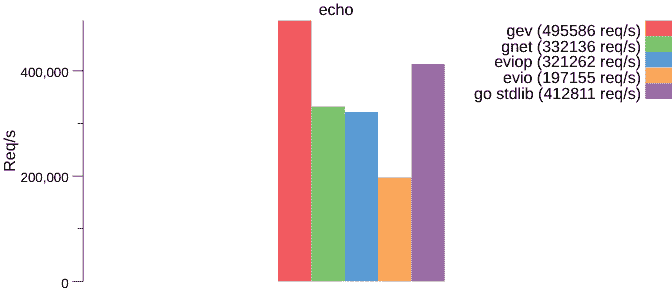
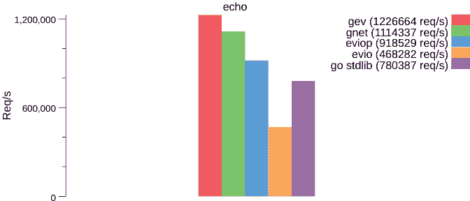

# 基于 Reactor 模式的轻量级、快速、无阻塞的 Golang 网络库

> 原文：<https://dev.to/allenxuxu/gev-a-lightweight-fast-non-blocking-golang-network-library-based-on-reactor-mode-i51>

https://github.com/Allenxuxu/gev➡️➡️

`gev`是一个基于 Reactor 模式的轻量级、快速无阻塞的 TCP 网络库。

## 特性

*   基于 epoll 和 kqueue 的高性能事件循环
*   支持多核和多线程
*   用环形缓冲区实现读写缓冲区的动态扩展
*   异步读写
*   SO_REUSEPORT 端口重用支持

## 网络模型

仅使用几个 goroutines，其中一个监听连接，另一个(工作协程)处理连接客户端的读写事件。工作协程的数量是可配置的，默认情况下是主机 CPU 的核心数量。

[](https://res.cloudinary.com/practicaldev/image/fetch/s--27zS8IRL--/c_limit%2Cf_auto%2Cfl_progressive%2Cq_auto%2Cw_880/https://github.com/Allenxuxu/gev/raw/master/benchmarks/out/reactor.png)

## 性能测试

> 测试环境:Ubuntu18.04 | 4 个虚拟 CPUs | 4.0 GiB

### 吞吐量测试

limit GOMAXPROCS=1(单线程)，1 个工作线程

[](https://res.cloudinary.com/practicaldev/image/fetch/s--vvyt87a0--/c_limit%2Cf_auto%2Cfl_progressive%2Cq_auto%2Cw_880/https://github.com/Allenxuxu/gev/raw/master/benchmarks/out/gev11.png)

极限 GOMAXPROCS=4，4 工作 goroutine

[](https://res.cloudinary.com/practicaldev/image/fetch/s--ABHuHRR5--/c_limit%2Cf_auto%2Cfl_progressive%2Cq_auto%2Cw_880/https://github.com/Allenxuxu/gev/raw/master/benchmarks/out/gev44.png)

### 其他测试

对比同类库的简单性能，压力测量方法与 evio 项目相同。

*   gnet
*   eviop
*   这房子
*   网络(标准库)

极限 GOMAXPROCS=1，1 工作 goroutine

[](https://res.cloudinary.com/practicaldev/image/fetch/s--qKH_R9Rt--/c_limit%2Cf_auto%2Cfl_progressive%2Cq_auto%2Cw_880/https://github.com/Allenxuxu/gev/raw/master/benchmarks/out/echo-1c-1loops.png)

极限 GOMAXPROCS=1，4 工作 goroutine

[](https://res.cloudinary.com/practicaldev/image/fetch/s--RyQvlkuV--/c_limit%2Cf_auto%2Cfl_progressive%2Cq_auto%2Cw_880/https://github.com/Allenxuxu/gev/raw/master/benchmarks/out/echo-1c-4loops.png)

极限 GOMAXPROCS=4，4 工作 goroutine

[](https://res.cloudinary.com/practicaldev/image/fetch/s--S3SG41AI--/c_limit%2Cf_auto%2Cfl_progressive%2Cq_auto%2Cw_880/https://github.com/Allenxuxu/gev/raw/master/benchmarks/out/echo-4c-4loops.png)

## 安装

```
go get -u github.com/Allenxuxu/gev 
```

## 获取开始

```
package main

import (
    "log"

    "github.com/Allenxuxu/gev"
    "github.com/Allenxuxu/gev/connection"
    "github.com/Allenxuxu/ringbuffer"
)

type example struct{}

func (s *example) OnConnect(c *connection.Connection) {
    log.Println(" OnConnect ： ", c.PeerAddr())
}

func (s *example) OnMessage(c *connection.Connection, buffer *ringbuffer.RingBuffer) (out []byte) {
    log.Println("OnMessage")
    first, end := buffer.PeekAll()
    out = first
    if len(end) > 0 {
        out = append(out, end...)
    }
    buffer.RetrieveAll()
    return
}

func (s *example) OnClose(c *connection.Connection) {
    log.Println("OnClose")
}

func main() {
    handler := new(example)

    s, err := gev.NewServer(handler,
        gev.Address(":1833"),
        gev.NumLoops(2),
        gev.ReusePort(true))
    if err != nil {
        panic(err)
    }

    s.Start()
} 
```

*Handler* 是程序必须实现的接口。

```
type Handler interface {
    OnConnect(c *connection.Connection)
    OnMessage(c *connection.Connection, buffer *ringbuffer.RingBuffer) []byte
    OnClose(c *connection.Connection)
}

func NewServer(handler Handler, opts ...Option) (server *Server, err error) { 
```

当消息到达时，`gev`将通过调用 OnMessage 将一个片内的数据发送回客户端。

```
func (s *example) OnMessage(c *connection.Connection, buffer *ringbuffer.RingBuffer) (out []byte) 
```

还有一个 *Send* 方法可以用来发送数据。但是 *Send* 将数据放入事件循环，并调用它来发送数据，而不是自己立即发送数据。

查看示例[服务器定时推送](https://github.com/Allenxuxu/gev/tree/master/example/pushmessage/main.go)以获得详细信息。

```
func (c *Connection) Send(buffer []byte) error 
```

*ShutdownWrite* 用于将连接状态恢复为 false 并关闭连接。

查看示例[最大连接数](https://github.com/Allenxuxu/gev/tree/master/example/maxconnection/main.go)以获取详细信息。

```
func (c *Connection) ShutdownWrite() error 
```

[RingBuffer](https://github.com/Allenxuxu/ringbuffer) 是循环缓冲区的动态扩展实现。

https://github.com/Allenxuxu/gev➡️➡️