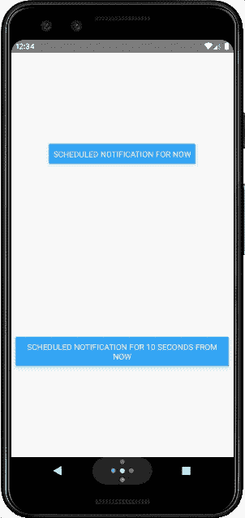
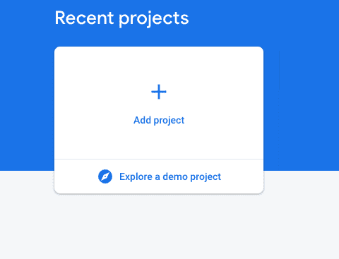
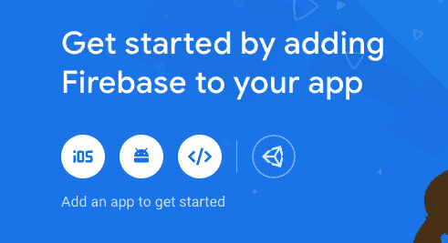
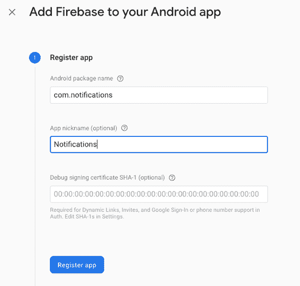
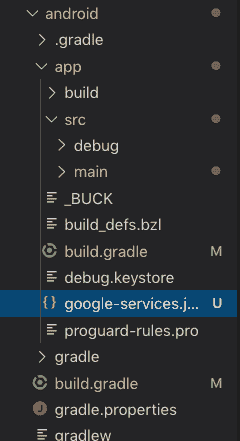
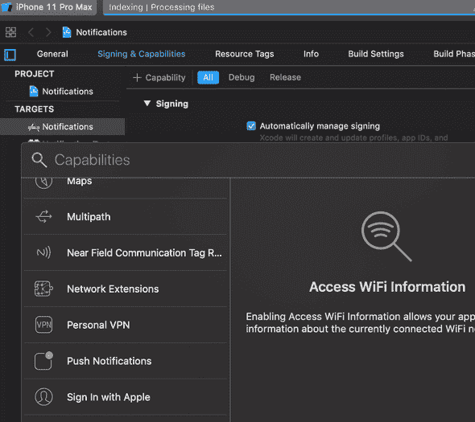
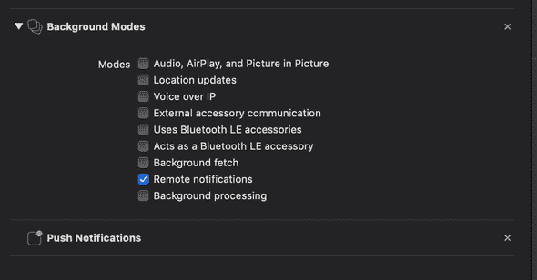

# iOS 和 Android 通知

> 原文：<https://dev.to/thefinnomenon/ios-and-android-notifications-2l8o>

在 React-Native 应用中有各种库来处理通知，但对 iOS 和 Android 的支持各不相同。官方的 React-Native 解决方案，[React-Native-push-notifications-ios](https://github.com/react-native-community/react-native-push-notification-ios)只支持 iOS 和最受欢迎的社区库，[React-Native-push-notification](https://github.com/zo0r/react-native-push-notification)目前似乎没有被维护。在尝试了最流行的之后，我最终使用了 [react-native-firebase](https://github.com/invertase/react-native-firebase) ，它得到了很好的支持并且有很好的文档。

[](https://res.cloudinary.com/practicaldev/image/fetch/s--n0Saaxbx--/c_limit%2Cf_auto%2Cfl_progressive%2Cq_66%2Cw_880/https://thefinnternet.com/3f3c1ec3df7897f78073efa4f0924f3e/demo.gif)

# 项目设置

对于这个应用程序，我不会使用 Expo，而是使用`react-native-cli`,我将使用 TypeScript，而不是普通的 JavaScript。

你可以点击下面的链接[开始使用](https://facebook.github.io/react-native/docs/getting-started)，而不是在这里重复脸书提供的说明。

```
npx react-native init notifications --template react-native-template-typescript
// Start an Android Simulator
cd notifications && react-native run-android
git init
git add -A
git commit -m "fresh react-native init" 
```

# 创建 Firebase 项目

## [创建新的 Firebase 项目](https://console.firebase.google.com/u/0/)

[](https://res.cloudinary.com/practicaldev/image/fetch/s--oiI-G1w1--/c_limit%2Cf_auto%2Cfl_progressive%2Cq_auto%2Cw_880/https://thefinnternet.com/static/5c9a91c7e6e006e80935cf165d34f952/782f4/create_project.png)

## 添加应用程序

[](https://res.cloudinary.com/practicaldev/image/fetch/s--61zDo_Fw--/c_limit%2Cf_auto%2Cfl_progressive%2Cq_auto%2Cw_880/https://thefinnternet.com/static/7c51faa74315345e378c5c29c165e7d0/3bb78/add_app.png)

### 注册安卓

> Android 包名可以在/android/app/build.grade 中找到，名为 applicationId。默认为 com.project_name

[](https://res.cloudinary.com/practicaldev/image/fetch/s--NugTdNHL--/c_limit%2Cf_auto%2Cfl_progressive%2Cq_auto%2Cw_880/https://thefinnternet.com/static/6be90f0d5c41813bd048830e351f6cbe/b9e4f/register_android.png)

### [下载 google-services.json](#download-googleservicesjson)

下载`google-services.json`并添加到你的 Android 项目的 app 文件夹中。

[](https://res.cloudinary.com/practicaldev/image/fetch/s--BFWxE9hI--/c_limit%2Cf_auto%2Cfl_progressive%2Cq_auto%2Cw_880/https://thefinnternet.com/static/b965d3dc9e57bfe4ab250388ff125eb8/0783d/android_dir.png)

### 注册 iOS

本质上与 Android 相同，但在 XCode 中从项目中获取包 id。

# 安卓

### 添加项目依赖关系

```
// android/build.gradle

buildscript {
    //...
    dependencies {
       //...
        classpath 'com.google.gms:google-services:4.2.0'
    //...
    }
}
//... 
```

### 添加应用依赖关系

```
// android/app/build.gradle

//...
dependencies {
    //...
    implementation "com.google.android.gms:play-services-base:17.0.0"
    implementation "com.google.firebase:firebase-core:17.0.1"
    implementation "com.google.firebase:firebase-messaging:19.0.0"
    implementation 'me.leolin:ShortcutBadger:1.1.21@aar'
    //...
}
//...

apply plugin: 'com.google.gms.google-services' 
```

### 在主应用程序中添加包

```
// android/app/src/main/java/com/notifications/MainApplication.java

//...

import io.invertase.firebase.messaging.RNFirebaseMessagingPackage;
import io.invertase.firebase.notifications.RNFirebaseNotificationsPackage;

//...

protected List<ReactPackage> getPackages() {
    @SuppressWarnings("UnnecessaryLocalVariable")
    List<ReactPackage> packages = new PackageList(this).getPackages();
    //...
    packages.add(new RNFirebaseMessagingPackage());
    packages.add(new RNFirebaseNotificationsPackage());

    return packages;
} 
```

### 修改 Android 清单

```
// android/app/src/main/AndroidManifest.xml

<uses-permission android:name="android.permission.INTERNET" />
<uses-permission android:name="android.permission.RECEIVE_BOOT_COMPLETED" />
<uses-permission android:name="android.permission.VIBRATE" />

...
<application>
    ...
    <activity
        android:name=".MainActivity"
        ...
        android:launchMode="singleTop">
        ...
    </activity>
    <service android:name="io.invertase.firebase.messaging.RNFirebaseMessagingService">
        <intent-filter>
          <action android:name="com.google.firebase.MESSAGING_EVENT" />
        </intent-filter>
    </service>

    <service android:name="io.invertase.firebase.messaging.RNFirebaseBackgroundMessagingService" />

    <!-- Scheduled Notification Receivers -->
   <receiver android:name="io.invertase.firebase.notifications.RNFirebaseNotificationReceiver"/>
   <receiver android:enabled="true" android:exported="true" android:name="io.invertase.firebase.notifications.RNFirebaseNotificationsRebootReceiver">
        <intent-filter>
        <action android:name="android.intent.action.BOOT_COMPLETED"/>
          <action android:name="android.intent.action.QUICKBOOT_POWERON"/>
          <action android:name="com.htc.intent.action.QUICKBOOT_POWERON"/>
          <category android:name="android.intent.category.DEFAULT" />
        </intent-filter>
    </receiver>

    <!-- Set custom default icon. This is used when no icon is set for incoming notification messages.
       See README(https://goo.gl/l4GJaQ) for more. -->
    <meta-data
        android:name="com.google.firebase.messaging.default_notification_icon"
        android:resource="@drawable/ic_stat_ic_notification" />
    <!-- Set color used with incoming notification messages. This is used when no color is set for the incoming notification message. See README(https://goo.gl/6BKBk7) for more. -->
    <meta-data
        android:name="com.google.firebase.messaging.default_notification_color"
        android:resource="@color/colorAccent" />
    <!-- Set default notification channel. This is used when incoming messages do not explicitly set a notification channel. -->
    <meta-data
    android:name="com.google.firebase.messaging.default_notification_channel_id"
    android:value="@string/default_notification_channel_id"/>
</application> 
```

# iOS

### 添加功能

在 Xcode 中，启用以下功能:

*   推送通知
*   后台模式>远程通知

[](https://res.cloudinary.com/practicaldev/image/fetch/s--memZVAi4--/c_limit%2Cf_auto%2Cfl_progressive%2Cq_auto%2Cw_880/https://thefinnternet.com/static/66f37761afb791a5e38d1516e8e129ad/b9e4f/xcode_capabilities.png)

[](https://res.cloudinary.com/practicaldev/image/fetch/s--bsIfjDZG--/c_limit%2Cf_auto%2Cfl_progressive%2Cq_auto%2Cw_880/https://thefinnternet.com/static/a275ef2c1da7e0615bd0c3127793bf28/b9e4f/xcode_capabilities_added.png)

### 添加荚

```
// ios/Podfile

...

pod 'Firebase/Core', '~> 6.3.0'
pod 'Firebase/Messaging', '~> 6.3.0' 
```

### 修改 AppDelegate

```
// ios/Notifications/AppDelegate.m

#import <Firebase.h>
#import "RNFirebaseNotifications.h"
#import "RNFirebaseMessaging.h"

//...

@implementation AppDelegate

- (BOOL)application:(UIApplication *)application didFinishLaunchingWithOptions:(NSDictionary *)launchOptions
{
  //...
  [FIRApp configure];
  [RNFirebaseNotifications configure];
  //...
}

//...

- (void)application:(UIApplication *)application didReceiveLocalNotification:(UILocalNotification *)notification {
  [[RNFirebaseNotifications instance] didReceiveLocalNotification:notification];
}

- (void)application:(UIApplication *)application didReceiveRemoteNotification:(nonnull NSDictionary *)userInfo
fetchCompletionHandler:(nonnull void (^)(UIBackgroundFetchResult))completionHandler{
  [[RNFirebaseNotifications instance] didReceiveRemoteNotification:userInfo fetchCompletionHandler:completionHandler];
}

- (void)application:(UIApplication *)application didRegisterUserNotificationSettings:(UIUserNotificationSettings *)notificationSettings {
  [[RNFirebaseMessaging instance] didRegisterUserNotificationSettings:notificationSettings];
}

//...

@end 
```

# Javascript

### 添加反应-原生-燃烧酶

react-native-firebase 对 v6 进行了重大重写，但不幸的是，我们感兴趣的通知模块是唯一一个尚未更新的模块，因此我们仍停留在 v5 上。当它最终完成时，我会更新这个帖子！

`yarn add react-native-firebase@5.5.6`

> 如果您使用 react-native v0.60 或更高版本，您不需要运行 link，它将自动链接。

### 通知类

```
import firebase from "react-native-firebase"
import { Alert } from "react-native"

export class NotificationService {
  onTokenRefreshListener = null
  messageListener = null
  notificationDisplayedListener = null
  onNotificationListener = null
  onNotificationOpenedListener = null

  async getToken() {
    const fcmToken = await firebase.messaging().getToken()
    console.log(`Retrieved new token: ${fcmToken}`)
  }

  async checkPermission() {
    const enabled = await firebase.messaging().hasPermission()
    if (enabled) {
      console.log("Messaging permissions enabled")
      this.getToken()
    } else {
      this.requestPermission()
    }
  }

  async requestPermission() {
    console.log("Requesting messaging permissions")
    try {
      await firebase.messaging().requestPermission()
      this.getToken()
    } catch (error) {
      console.log("Messaging permission rejected")
    }
  }

  async createListeners() {
    this.onTokenRefreshListener = firebase
      .messaging()
      .onTokenRefresh(async fcmToken => {
        console.log(`Retrieved new token: ${fcmToken}`)
      })

    this.messageListener = firebase.messaging().onMessage(message => {
      console.log("on Message")
      console.log(message)
    })

    this.notificationDisplayedListener = firebase
      .notifications()
      .onNotificationDisplayed(notification => {
        // ANDROID: Remote notifications do not contain the channel ID. You will have to specify this manually if you'd like to re-display the notification.
        console.log("onNotificationDisplayed")
        console.log(notification)
      })

    this.onNotificationListener = firebase
      .notifications()
      .onNotification(notification => {
        console.log("onNotification")
        console.log(notification)

        // UNCOMMENT IF YOU WANT ANDROID TO DISPLAY THE NOTIFICATION
        notification.android.setChannelId("default").setSound("default")
        firebase.notifications().displayNotification(notification)

        Alert.alert(
          "Push Notification",
          notification.body,
          [{ text: "OK", onPress: () => console.log("OK Pressed") }],
          { cancelable: false }
        )
      })

    this.onNotificationOpenedListener = firebase
      .notifications()
      .onNotificationOpened(notification => {
        console.log("onNotificationOpened")
        console.log(notification)

        Alert.alert(
          "Push Notification",
          `${notification.action},${notification.notification},${notification.results}`,
          [{ text: "OK", onPress: () => console.log("OK Pressed") }],
          { cancelable: false }
        )
      })
  }

  async scheduleNotification(date) {
    const notification = new firebase.notifications.Notification()
      .setNotificationId("1")
      .setTitle("Test notification")
      .setBody("This is a test notification")
      .android.setPriority(firebase.notifications.Android.Priority.High)
      .android.setChannelId("default")
      .android.setAutoCancel(true)

    firebase
      .notifications()
      .scheduleNotification(notification, {
        fireDate: date.getTime(),
      })
      .catch(err => console.error(err))
  }

  configure() {
    const channel = new firebase.notifications.Android.Channel(
      "default",
      "default channel",
      firebase.notifications.Android.Importance.Max
    )
    firebase.notifications().android.createChannel(channel)
    this.checkPermission()
    this.createListeners()
  }

  wasOpenedByNotification() {
    firebase
      .notifications()
      .getInitialNotification()
      .then(notificationOpen => {
        if (notificationOpen) {
          // App was opened by a notification
          // Get the action triggered by the notification being opened
          const action = notificationOpen.action
          // Get information about the notification that was opened
          const notification = notificationOpen.notification

          console.log("App was opened by a notification")
          console.log(action)
          console.log(notification)

          Alert.alert(
            "Push Notification",
            `${action},${notification}`,
            [{ text: "OK", onPress: () => console.log("OK Pressed") }],
            { cancelable: false }
          )
        } else {
          console.log("App was NOT opened by a notification")
        }
      })
  }
}

const Notification = new NotificationService()
export default Notification 
```

### App

```
import React, { useEffect } from "react"
import Notifications from "./notifications"
import { SafeAreaView, StyleSheet, View, Button } from "react-native"

export const App = () => {
  useEffect(() => {
    Notifications.configure()
  }, [])

  Notifications.wasOpenedByNotification()

  const sendLocalNotification = delay_seconds => {
    const date = new Date()
    date.setSeconds(date.getSeconds() + delay_seconds)
    Notifications.scheduleNotification(date)
  }

  return (
    <SafeAreaView style={{ flex: 1 }}>
      <View style={styles.container}>
        <Button
          onPress={() => sendLocalNotification(1)}
          title="Scheduled notification for now"
        />
        <Button
          onPress={() => sendLocalNotification(10)}
          title="Scheduled notification for 10 seconds from now"
        />
      </View>
    </SafeAreaView>
  )
}

const styles = StyleSheet.create({
  container: {
    flex: 1,
    alignItems: "center",
    justifyContent: "space-around",
    padding: 8,
  },
})

export default App 
```

# 测试推送通知

从控制台获取您设备的令牌，前往 Firebase 控制台，点击云消息，并使用设备令牌向您的设备发送通知。

# 结论

我为即将发布的 react-native-firebase V6 感到兴奋，它应该消除了许多手动本机设置步骤。你还应该关注一下 react-native-push-notifications-IOs，因为如果他们包含 Android 支持，我认为这将是一个更好的库选择。

[在 Github 上查看该项目的代码](https://github.com/thefinnomenon/react-native-notifications)