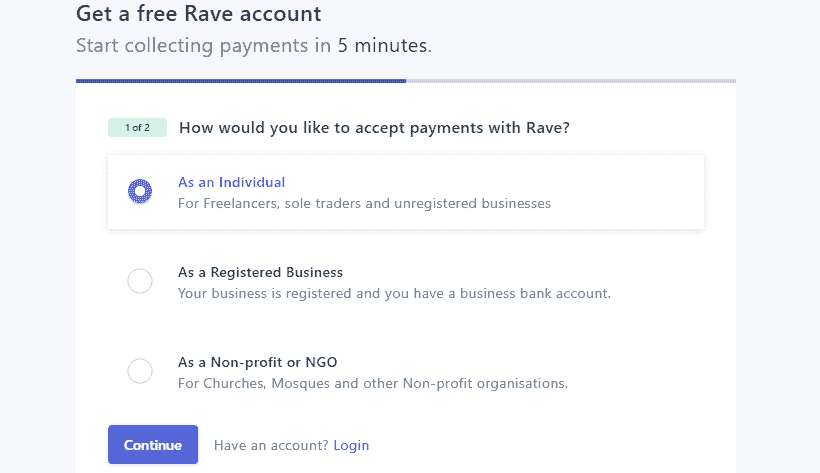
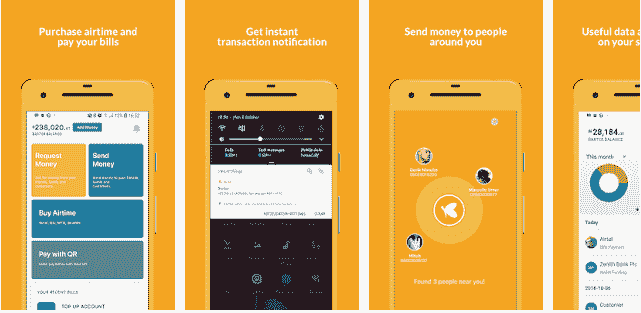

# 非洲在线空间对在线支付平台的需求

> 原文:[https://dev . to/numi nousc/the-need-for-online-payment-platforms-in-the-Africa-online-space-1opo](https://dev.to/numinousc/the-need-for-online-payment-platforms-in-the-african-online-space-1opo)

## 案例研究:Flutterwave

### 介绍

面对非洲国家增加年度国内生产总值的迫切需要，当地商人有必要抓住一切机会做生意，并在当地和国际上完成财政交易。商人还必须迎合现代顾客的需求，他们的日程安排非常繁忙，这是可以理解的。

这些需求导致了制定快速、方便、通融且可能是虚拟的支付系统的愿望；因为这样的系统将有利于商人、顾客和作为资本实体的国家。下面讨论了其中的一些好处。

### 在线支付系统的一些好处

毫无疑问，在线支付门户对大多数企业和交易都有巨大的好处。对于商家来说，它提高了交易速度，并提供了多种支付途径。从而改善客户体验并提高客户忠诚度，这对于维持强大的客户基础是必要的。支付系统还帮助商家更好地管理订阅、交易记录和支付纠纷。

说到顾客，我们都知道，如果可能的话，我们喜欢在家里购买任何东西并付款。便捷是在线支付门户的主要优势之一。与传统的支付方式相比，它的易用性令人耳目一新。在线交易还有助于客户将总体购买成本降至最低。

是的，网上商品的价格可能没有什么不同，但是从你现在的位置付款可以省去运输费用。我们不要忘记提到在线支付提供的无现金能力；这使得购买者在购买过程中很难将钱输给黑社会的人。

网上支付也为商家和消费者提供了广泛的产品。某些产品不能在网下销售。还有一些只能在特定的地点进行实物买卖。但是，互联网已经为几乎每个地方创造了大门，就像数据或互联网连接是地球上每个地方的钥匙一样，在线支付门户代表着通过互联网向商店收取现金的窗口。

好吧，关于网上支付及其好处，有很多文章可以写，但如果你是打算使用这种系统的商家或买家，我鼓励你多研究一下好处。有关在线支付门户优势的更多信息，请点击此处…

虽然确定需求非常重要，但为需求做准备更重要。在这种情况下，如果不同时讨论一个可能的条款或解决方案，谈论需求或写下需求是没有帮助的。这就把我们带到了这次讨论的案例研究——flutter wave。

### 扑腾扑腾进来了！

Flutterwave 是一家支付技术公司，成立的前提是每个非洲人都可以而且应该参与全球经济并在其中蓬勃发展。Flutterwave 于 2014 年在其创始人=**Iyinoluwa ABO yeji**&**Olugbenga Agboola**的构思下出现。

Flutterwave 的愿景是让非洲人更容易建立可以在任何地方进行和接受支付的全球企业，这促使该公司建立了一个可信的支付基础设施，允许消费者和商家(非洲和国际)以方便的无国界方式进行和接收支付。这一创新使该公司在激励非洲新一轮繁荣的使命中迈出了积极的步伐。

#### Flutterwave 的一些产品

Flutterwave 确实交付了一些知名产品，让非洲网络空间的生活变得更加轻松。她的产品被证明是可靠的，并帮助改善了非洲许多受欢迎的企业的服务，包括银行和政府半国营企业。

*   咆哮
*   Rave Express (Android/iOS)
*   Rave POS (Android/iOS)
*   易货
*   GetBarter (Android/iOS)

#### 咆哮

Rave 是一款 Flutterwave 产品，是非洲在线业务最前沿的服务之一。Rave 是一个在线支付网关。这是一种允许卖家或商家通过互联网收款的服务。Rave 很容易使用，作为一个商家，你所要做的就是创建一个服务帐户，并在一个简单的验证过程后将其连接到你的银行帐户。该平台包含如何在您的网站上实现 rave 的简单指导。

尽管许多商家证明了 Rave 的优雅和高效，但也有一些抱怨。例如，在今年某个时候与杜克网络技术有限公司首席执行官 Henry Johnson 先生的一次采访中，他宣布了他对 flutter wave Rave 的热爱和偏爱，并讲述了它是他的员工在为客户建立网站时使用的主要支付网关。他说他的偏爱源于易用性。但他也表示，存在一些定制问题，可能会影响外行人使用该应用程序的方式。

总之，有了 Rave，商家可以通过各种形式接受客户的支付，从而让客户可以选择通过借记卡或信用卡、银行转账、移动钱包甚至直接从银行账户支付。

要开始使用 rave，您可以点击此链接。创建一个帐户，并按照网站的指示进行操作。您还可以从谷歌 Play 商店获得适用于您的移动设备的应用程序 Rave Express。

[T2】](https://res.cloudinary.com/practicaldev/image/fetch/s--kLqNhz4M--/c_limit%2Cf_auto%2Cfl_progressive%2Cq_auto%2Cw_880/https://res.cloudinary.com/blannkard/image/upload/v1569632901/Article%2520pics/rave_1_tvkooc.png)

#### 易货

易货是 Flutterwave 的另一个优秀产品。易货可以归类为财务管理应用程序，因为它可以帮助用户管理和控制现金分配。易货应用程序还可以帮助用户跟踪费用，并接收现金礼物和付款。

有了易货，你可以创建虚拟借记卡，在任何选择的平台上进行网上交易。易货网上提供的卡有 Visa 卡、Master Card e.t.c。你可以通过访问谷歌 Play 商店或 apple 的 App Store 开始使用 GetBarter。

[T2】](https://res.cloudinary.com/practicaldev/image/fetch/s--uT9I_ml4--/c_limit%2Cf_auto%2Cfl_progressive%2Cq_auto%2Cw_880/https://res.cloudinary.com/blannkard/image/upload/v1569632887/Article%2520pics/barter_1_bj6aon.png)

Flutterwave 在非洲推广全球业务的努力中取得了长足的进步；创建在线支付平台，协助银行完成交易，并全面推广在线业务。这是不平凡的壮举。但是，尽管已经做了这么多，还可以做得更多

### 其他支付门户

其他一些值得注意的支付门户是 PayU、PayStack、GtPay、eTranzact 和 Interswitch。

### 结论

在线支付门户对非洲国家的经济至关重要。它们可以作为均衡器，在电子商务市场上给商家平等的机会，从而使更多的企业家有能力迫使一些现金流向非洲。