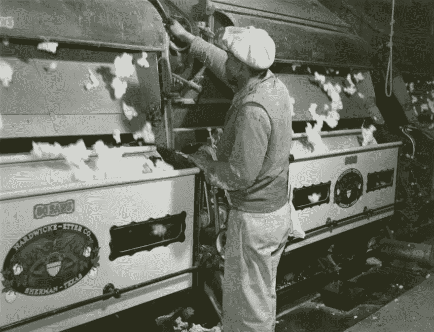

# 如何使用批处理用更少的时间做更多的事情

> 原文:[https://dev . to/edwardgunawan/how-to-do-more-things with-less-time-by-using-batch-processing-3hb 6](https://dev.to/edwardgunawan/how-to-do-more-things-with-less-time-by-using-batch-processing-3hb6)

[T2】](https://res.cloudinary.com/practicaldev/image/fetch/s--DsYo8NMm--/c_limit%2Cf_auto%2Cfl_progressive%2Cq_auto%2Cw_880/https://images.unsplash.com/photo-1562672195-af1d58e7be5e%3Fixlib%3Drb-1.2.1%26ixid%3DeyJhcHBfaWQiOjEyMDd9%26auto%3Dformat%26fit%3Dcrop%26w%3D1254%26q%3D80)

在这个时代，我们每天能够学到的知识比人类历史的总和还要多。据《华尔街日报》报道，入门级工作不再被视为技能入门，因为自动化已经接管了许多较低的任务。因此，新员工没有足够的时间来培养员工的韧性和专业精神，而这通常是通过经历入门级职位的磨砺而获得的。公司越来越希望新人才能够快速起步，从一开始就自学，并迅速做出贡献。

因此，几乎每个人都同意的一件事是，一天中没有足够的时间。不管你有多富有，我们买不到的东西就是时间。

你是如何在短时间内完成很多事情的？一个人如何在抚养孩子的同时创建多家公司？你是如何腾出时间去做突出的任务的？

乍一看，多任务处理似乎是快速完成很多事情并同时学习很多东西的最佳选择。尽管感觉上我们正在做很多事情，约书亚·鲁宾斯坦、杰弗里·埃文斯和大卫·迈耶在 2001 年进行的一项研究表明，我们的大脑并不像我们认为的那样擅长处理多任务。

这就是为什么我提出了一种替代多任务处理的方法，一种叫做批处理的方法，这种方法实际上是高效的。在生活中实现批处理可以帮助你腾出时间，提高生产力。在本文中，我们将讨论关于批处理的一切，包括在生活中什么时候应该或不应该使用它来使您的工作效率提高 10 倍。

## 什么是批处理？

批处理在传统上是一个过程，通过它计算机成批地完成作业，通常是同时不间断地，并按顺序进行。批量就是批量做事情。在软件中，批处理被设计成在程序开始运行之前预先选择所有的输入数据，以便它能够运行一次直到完成。

批处理过程的主要目的是通过批量处理来节省系统能量，并通过使用自动化来提高效率。例如，银行将使用批处理每小时操作一次所有交易，而不是立即处理每一笔交易。在机器学习中，批处理过程被广泛用于转换、提取、加载(ETL)数据，通过等待直到数据达到足够大的批量来进行操作，而不是被动地将连续数据处理到管道中。

我们潜意识里已经在日常工作和许多日常任务中使用批处理。批处理是将所有相似的作业组合在一起，然后在指定的时间内不间断地完成它们的过程。例如，邮局将等待一段特定的时间来收集大量的邮件，然后将它们投递到一个家庭，而不是每次有新的信件到达邮局时都单独投递每一封信。

## 批处理为什么会起作用？

批处理以两种方式工作:1)它减少了设置时间，2)它有助于腾出更多的时间来关注深层工作。

### 减少启动和减速时间

每当我们转移注意力做某事时，平均需要 15 分钟才能完全集中注意力。所以，一天内多次做同一类型的任务，会累积在浪费的能量消耗上；剩下更少的精力去关注其他事情。在你能够重新获得焦点状态之前，你从一个任务转换到另一个任务所花费的时间会增加大量的加载时间。

### 有助于腾出更多时间做更深入的工作

深度工作是在不受干扰的集中状态下进行一项活动，将你的认知能力推向极限。通过使用批处理来处理更平凡的任务，你可以将更多的时间专注于你的副业项目、忙碌、任何创造性或创业性的追求。

## 什么时候要用批处理？

### 自动化任务

类似于软件中的批处理如何以最少的交互操作，您希望尽可能自动化所有重复的任务，以释放更多的空间。

投资可以使用批处理来完成。投资者可能犯的最大错误是起步晚。所以，你每个月都可以把财务自动化，把它放在自动驾驶仪上，用自动转账。首先，评估你的每月预算。然后，开一个多重储蓄账户和支票账户来直接存款。例如，我评估我每个月会花多少钱。然后，我会开一个支票账户直接存入我的子账户。这个子账户可以用来支付房租、任何与交通相关的费用、旅游费用、为生日礼物存钱，并且没有负罪感。然后，我会开始自动化我的财务，每个月直接存入每个子账户。一旦我这样做了，我就再也不需要看我的钱了，因为它是自动的。然而，我会重新评估我的开支，并每六个月改变一次所有的百分比，以采用任何新的投资或任何需要改变的东西。通过这样做，我不需要担心我将要支付的账单，我也不需要担心我买鳄梨吐司时还剩多少钱，因为这都是自动处理的。

寻找新闻出口可以用批处理来完成。不要每天去寻找每日新闻，让故事向你走来。你可以使用媒体收集系统来学习你的阅读习惯，收集你想读的文章。像 Skimm 这样的服务，每天将全球新闻的浏览版本发送到你的收件箱，可以帮助减少搜索交流的所有时间，并有更多的时间阅读新闻。

### 做最省力的工作

通常需要最少努力的任务是经常重复的任务，完成这些任务不需要独特的解决问题的技能。为了把我们每天的时间赚回来，我们可以用批处理来操作那些任务。

洗碗和做杂事可以使用批处理来完成。尽管完成这些任务只需要很少的时间，但是如果我们经常操作这些任务，它会很快积累开销时间。使用批处理可以释放更多的时间。

洗衣通常是分批进行的。有些人可能每天都洗衣服，但是一旦积累了足够的衣服，大多数人每周或每两周洗一次。每天洗衣服消耗我们的精力把要洗的衣服收拢，放入洗涤剂，等待洗涤周期结束，把衣服放入烘干机，把洗好的衣服叠好放回去。它还消耗水和电能源，这些都是要花钱的。通过在一次会议中积累轻松的任务，我们可以节省设置成本的努力，并利用这些时间完成更多的事情。

最后，回复邮件和电话可以使用批处理操作。我每天有一个小时专门回复邮件。然后，我会关闭我的电子邮件，专注于其他优先事项。我只会在紧急情况下回复他们。

## 什么时候不应该使用批处理？

注意过度使用和/或过度扩展批处理的目的。我们做的一些任务不会受到批处理的积极影响。即使我们能够对这些类型的函数使用批处理技术，也不意味着我们应该这样做。

过度使用它们可能会导致精疲力竭。

### 在一个设置中创建批量内容

有些人可能能够实现批处理来创建各种材料，但一次生成多种内容会导致质量下降和精神疲劳。

你需要了解你的能量模式是如何工作的，尤其是当任务需要质量而不是数量的时候。总的来说，批处理在创建深度内容时不会影响您的能源预算，因为它是将所有工作合并到一个设置中，而不是将它们分开。它不会改变你在工作中投入的精力。如果你热衷于通过较小的迭代来创建高质量的内容，我建议不要成批地做。我通常在每天或每周的时间表中为创造性的追求制定一个惯例，因为它提供了产生新想法的时间，帮助我平衡现有的想法，对我来说这是一个整体上更好的能量管理策略。

不要一口气把你所有的想法都冲出来，最好是在你注意到你的精力和注意力下降时停下来，等你的思维回到原来的专注和高效状态时再继续。关于如何写书，欧内斯特·海明威提出的一个建议是，如果你知道接下来会发生什么，就在写作的中间句子停下来。这样，你可以确保你不会耗尽你的创造力和想象力。

### 在一个环境中解决多个复杂的任务

当你在处理具有精神挑战性和复杂的任务时，你不想批量操作这些功能，因为这会造成大脑疲惫，导致倦怠。例如，处理各种复杂的算法特性或为特定的业务需求设计软件系统需要大量的精力和注意力，才能创造出卓越的成果。做多个复杂的解决问题的任务会导致你“效率宿醉”，导致休息日，或者长时间无所事事。

当某人在长时间间隔内做一项复杂的任务，同时感受到压力和慢性压力时，往往会出现倦怠。很多时候，解决问题的任务需要高度的专注才能取得好的结果。在深度工作上花费太长时间会耗尽你的精力，导致你精神上和情感上的疲惫。

所以，把一个高度复杂的任务分成多个小块。这样做，你可以更高质量地完成任务，也能更快地为下一项工作充电。

总结为了在快节奏的环境中创造更多的时间，我们可以使用批处理来减少设置成本，从而增加更多的时间来专注于高效、深入的工作。批处理技术已经融入了我们的许多日常生活和日常事务中。例如，我们一周洗一次衣服，邮局每天送一次邮件。这些是通过批处理执行的任务，以创建更高效的系统。然而，要注意过度优化生产力，因为它会导致倦怠和疲劳。

最后，这一切都要追溯到对我们个人能量管理系统的理解。我们需要磨练自己的直觉，从这个角度来看待任务，“这个任务如何与我的能量结合？它会在我的生活中创造更多的生产力，是批量生产还是一口吃掉？”有了这些，我们就可以知道批处理任务是否会帮助我们完成更多的事情。

### 参考文献

*   给毕业生敲响了警钟:入门级的工作不再是入门级的了——华尔街日报
*   [生产力黑客:通过分配时间来提高工作效率](https://www.brazen.com/blog/archive/career-growth/productivity-hack-work-more-efficiently-by-batching-your-time/)
*   [如何使用批处理提高效率](https://michaelhyatt.com/how-to-use-batching-to-become-more-productive/)
*   [对您的工作进行“批处理”的权威指南](http://www.asianefficiency.com/productivity/definitive-guide-batching-work/)
*   [批处理节省时间的 10 种方法](https://www.wisebread.com/10-ways-to-save-time-with-batch-processing)
*   [当糟糕的任务批处理导致倦怠时(以及如何避免)](https://workbrighter.co/batching-burnout/)
*   [多任务:转换成本](https://www.apa.org/research/action/multitask)