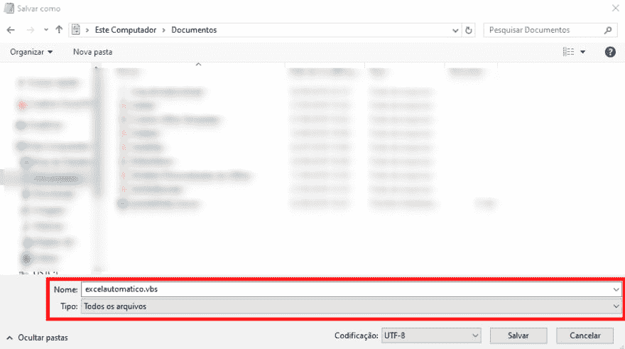
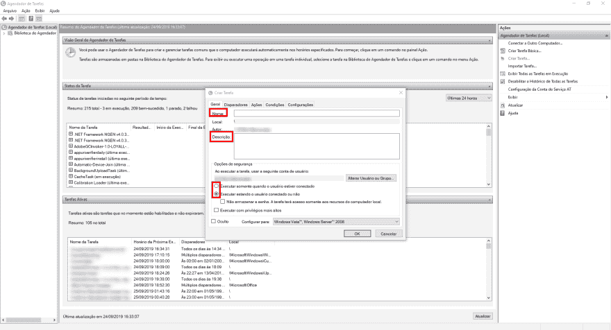
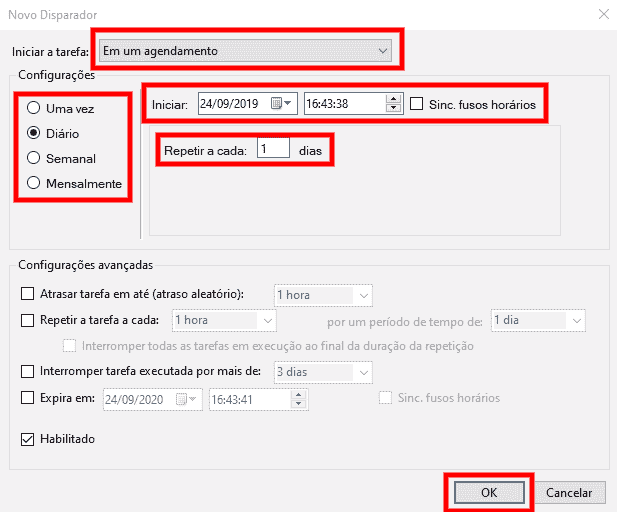
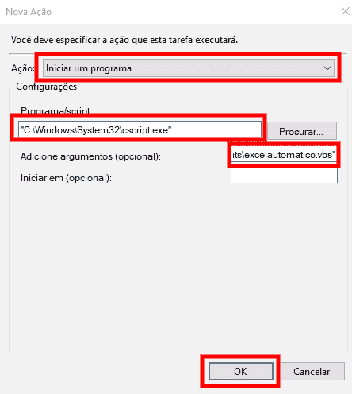

# 如何在 Windows 中使用 VBA 宏每天自动运行 Excel 电子表格

> [https://dev . to/shadow lik/how-run-daily-e-automatic-excel-com-VBA-no-windows-2 iphone](https://dev.to/shadowlik/como-executar-diariamente-e-automaticamente-planilhas-do-excel-com-vba-macro-no-windows-2iph)试算表

您是否需要每天滚动 Excel 电子表格？我最近遇到了这种情况，作为一个懒惰的程序员，我想:不可能不自动化吧！我找到了一个比较简单的解决办法，决定记录下来。

> **我总是选择懒惰的人来做困难的工作……因为她会找到一个容易做的方法。**
> <cite>比尔盖茨</cite>

我将说明如何使用**(windows task scheduler–已经安装)**来做到这一点:打开；运行 VBA 宏：保存；保存：关闭 Excel。此解决方案支持多种调度设置！

**要使程序员操作电脑需要接通**

## [](#pr%C3%A9requisitos)先决条件

默认情况下，所有先决条件都已安装在 Windows 中:

*   任务调度器(Windows 任务调度器)
*   记事本(或任何中性文本编辑器)
*   CScript**(C:\ Windows \ System32 \ CScript . exe)**

## [](#criando-o-arquivo-vbs)创建 VBS 文件

实现所有魔法的文件将是 visual basic script(VBS)脚本。如果您熟悉 VBA，则可以很容易地理解脚本命令。

打开*记事本*并复制以下内容:

```
'Caminho completo para a planilha excel 
CaminhoArquivoExcel = "C:\Users\henrique\Documents\nome_da_planilha.xlsm" 

'Escopo e nome completo da macro para executar 
CaminhoMacro = "Module1.NomeDaMacro" 

'Criamos uma instância do excel 
Set ExcelApp = CreateObject("Excel.Application") 

'Você deseja que essa instância fique visível? 
ExcelApp.Visible = True  'or "False" 

'Previne que o Excel mostre alertas
ExcelApp.DisplayAlerts = False 

'Abrimos o arquivo excel 
Set wb = ExcelApp.Workbooks.Open(CaminhoArquivoExcel) 

'Executamos a macro 
ExcelApp.Run CaminhoMacro

'Salvamos o arquivo excel após a execução da macro 
wb.Save 

'Voltamos com o parâmetro de alertas para evitar problemas com outras planilhas 
ExcelApp.DisplayAlerts = True 

'Fechamos o arquivo Excel 
wb.Close 

'Fechamos a instância do Excel 
ExcelApp.Quit 

'Alerta para avisar quando a planilha for executada com sucesso 
MsgBox "Sua planilha foi executada automaticamente com sucesso às:" & TimeValue(Now), vbInformation 
```

现在我们需要替换一些信息:

1.  将变量“**”的值**转换为要打开的 Excel 文件的确切位置。正确的名称和扩展名都很重要。
2.  将变量**宏路径**的值更改为要旋转的宏的确切值。
3.  在 **ExcelApp.Visible** 中，您可以决定应用程序是打开可见的实例 **(true)** 还是在后台运行 **(false)。** **一些** **插件在后台不起作用。**
4.  **MsgBox** :如果宏成功运行，且您不想仅删除此行，则向用户显示消息警报。

我们将使用扩展名“**. VBS**”保存此文件:在保存时的记事本中，在“文件名”字段中键入类似于:**exceptomatic . VBS**的内容，然后在“文件类型”中选择:**所有文件**。如果所有路径都正确，请将此文件保存到安全的位置，这样就不会有人意外删除此文件。记下保存文件的路径，因为我们以后需要它！

[T2】](https://marquesfernandes.com/wp-content/uploads/2019/09/image.png)

## [](#criando-o-agendamento-com-o-agendador-de-tarefas)用任务调度器创建调度

要查找程序，只需在“开始”菜单搜索中键入“”任务调度器“”。

[T2】](https://marquesfernandes.com/wp-content/uploads/2019/09/image-1.png)

要创建新任务，只需单击右侧的按钮:创建任务…

[T2】](https://trello-attachments.s3.amazonaws.com/561604bf662a944db46d79d2/5d8a68c16ff6e127a13d7129/ca63bcb61328d843bcc4d5199d845ee6/screenshot-marquesfernandes.com-2019.09.24-16_39_54.png)

### [](#criar-tarefa-aba-geral)创建任务-“常规”选项卡

[T2】](https://trello-attachments.s3.amazonaws.com/561604bf662a944db46d79d2/5d8a68c16ff6e127a13d7129/ec8ed4c4d718fadfac9c908f76d213dc/screenshot-marquesfernandes.com-2019.09.24-16_41_55.png)

在* *一般标签** 中，您将填写调度名称及其说明。

*提示:描述是可选的，但是良好的做法，以便您或其他人将来能够了解这种安排到底是干什么的。亲身体验，创建客观描述！*

在此标签中，我们还可以设置是否要在用户未登录计算机时运行调度，再次提醒用户，要使计算机正常运行，必须始终打开“”。我假设您仍然要在锁定计算机的情况下运行:选择**在登录用户或未登录用户的情况下运行**，然后输入您的用户名和密码以验证此选项。

### [](#criar-tarefa-aba-disparadores)创建任务-“触发器”标签

在“**”选项卡的“触发器**”中，配置任务调度，单击* *新建〖t1〗按钮，创建并配置新调度。在下面的示例中，我们创建了一条规则，每天下午 4:43 运行我们的计划:**

[T2】](https://trello-attachments.s3.amazonaws.com/5d8a68c16ff6e127a13d7129/617x512/a9aae6c23cf29987b1719a0b8fa745bf/screenshot-marquesfernandes.com-2019.09.24-16_44_36.png)

您可以为每个排程建立多个规则。

### [](#criar-tarefa-aba-a%C3%A7%C3%B5es)创建任务-“操作”标签

在动作标签中，我们将映射要执行的动作。要运行在教程开始时创建的脚本，我们需要使用名为“**cscscript * *”的本地 Windows 程序来运行我们的文件* * . VBS**:

没有 campo "Programa/script "选项:**" C:\ Windows \ System32 \ cscript . exe "**

现在让我们转到“**cscscript * *”的参数，我们希望它运行哪个文件。粘贴我们在开始时创建的* * VBS**文件的完整路径:

no Campo " Adicione argumentos(opcional)" troque OS valores e Adicione algo parecido com:**" C:**** Users ********Henrique ********excelautomatico *** *。vbs"* *

**两个设置都必须用引号括起来。**

[T2】](https://trello-attachments.s3.amazonaws.com/5d8a68c16ff6e127a13d7129/444x496/54ca5124a4c8a2022389264752fab181/screenshot-marquesfernandes.com-2019.09.24-16_46_38.png)

### [](#criar-tarefa-outras-abas)创建任务–其他选项卡

其他选项卡上可能会提供一些其他设置，因此，我建议您查看是否需要其他设置来满足您的需求。

post 如何在 Windows 中使用 VBA 宏每天自动运行 Excel 电子表格，首先出现在 [Henrique Marques Fernandes](https://marquesfernandes.com) 。