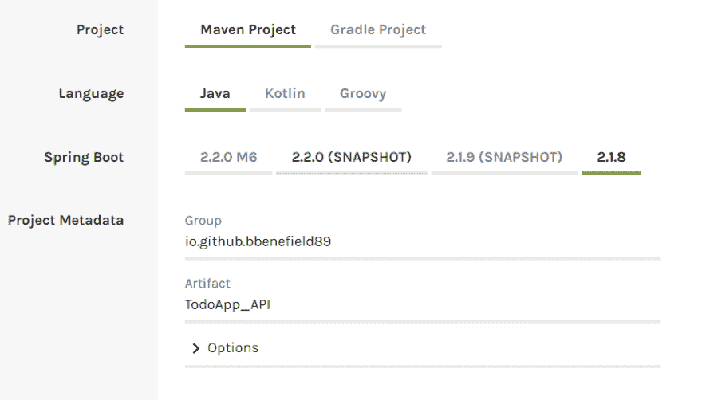
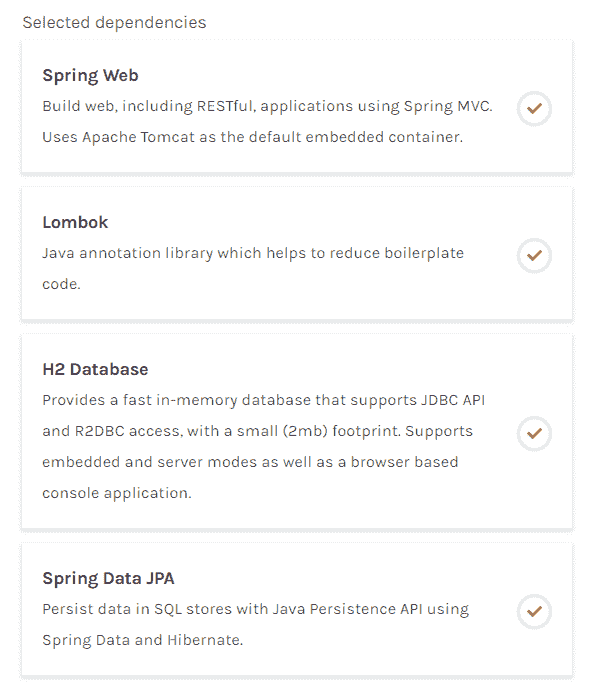
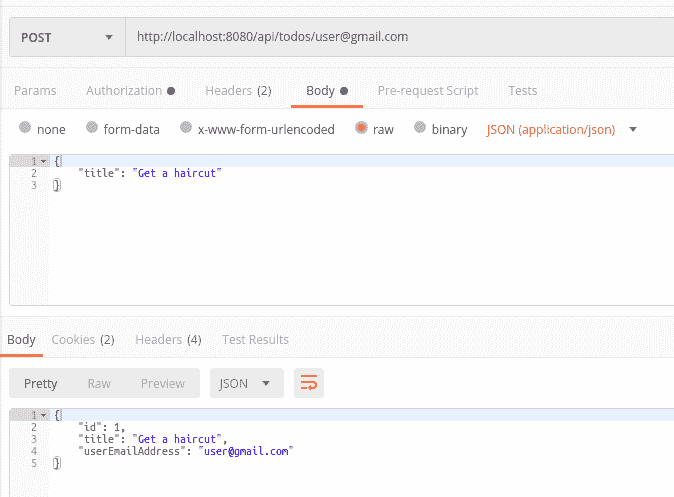
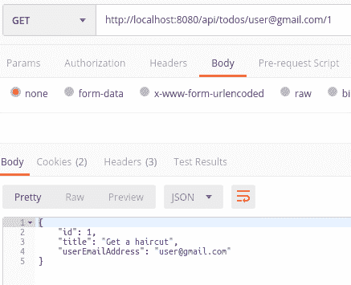
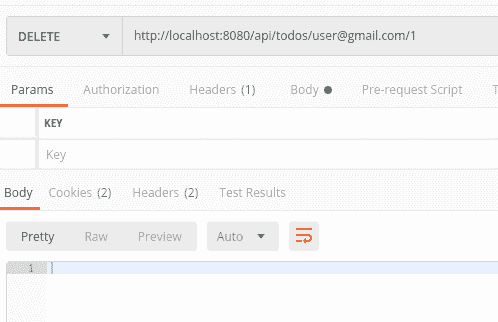

# 使用 Auth0 Pt 保护微服务。2(资源服务)

> 原文:[https://dev . to/bbenefield 89/securing-micro services-with-auth 0-pt-2-2c 23](https://dev.to/bbenefield89/securing-microservices-with-auth0-pt-2-2c23)

这是名为**用 Auth0** 保护微服务系列文章的第二部分。如果你错过了[之前的帖子](https://dev.to/bbenefield89/securing-your-microservices-with-auth0-20e3)，我建议你先回去看看那个帖子。

# [](#overview)概述

在使用 Auth0 系列保护微服务的**部分，我们将创建**资源服务**微服务。**资源服务**将是我们的应用 **REST API** ，并将对特定用户 **Todos** 执行 **CRUD** 操作。我的意思是，我们将能够:**

*   **C** :创建(过账)
*   **R** :读取(GET)
*   **U** :更新(补丁)
*   **D** :删除(Delete)

首先，这个服务是不安全的，不需要任何类型的认证。重要的是，我们要从开发人员和用户的角度来看待不安全的应用程序所带来的问题。在创建了我们的**授权服务**之后，这将是本系列另一篇文章中不同的**微服务**，我们将对发送到我们的**资源服务**的请求执行**授权**。

你也可以继续玩[这个帖子的代码](https://github.com/bbenefield89/SpringTodo/tree/bbenefield89/tutorial_pt2)。这个分支`bbenefield89/tutorial_pt2`，是 UI 部分和不安全的 RESTful API ( **资源服务**)。

# [](#creating-the-resource-service)创建资源服务

对于这个系列，我已经决定用 [Spring 框架](https://spring.io/)来创建我们的后端。**微服务**是**而不是** **Java/Spring 框架**特定的，我们可以用任何语言轻松地创建我们的**微服务**，它能够创建 web 服务器并发出 HTTP 请求。这意味着我们可能使用 [Express 节点 Web 框架](https://expressjs.com/)创建我们的**资源服务**，然后使用[Django Python Web 框架](https://www.djangoproject.com/)创建我们的**授权服务**。这是在创建应用时使用**微服务架构**的众多优势之一。

说够了，该行动了！让我们前往 [Spring Initializr](https://start.spring.io) ，在这里您可以快速地为您的 **Spring** 应用程序创建样板代码。

当你登陆到 **Spring Initializr** 页面时，继续输入你的项目的基本信息。例如，我的项目信息将如下所示:

[T2】](https://res.cloudinary.com/practicaldev/image/fetch/s--PyCDMkxB--/c_limit%2Cf_auto%2Cfl_progressive%2Cq_auto%2Cw_880/https://thepracticaldev.s3.amazonaws.com/i/vb2qa20lubwgjts0s6b9.PNG)

我选择的依赖项是:

[T2】](https://res.cloudinary.com/practicaldev/image/fetch/s--Vj8AaWEf--/c_limit%2Cf_auto%2Cfl_progressive%2Cq_auto%2Cw_880/https://thepracticaldev.s3.amazonaws.com/i/x2cbg1tvyffv7907m4r7.PNG)

继续点击底部标有`Generate the project`的绿色按钮。这将提示你下载你的项目作为一个 **zip** 文件夹。

[T2】](https://res.cloudinary.com/practicaldev/image/fetch/s--gYIsnGhh--/c_limit%2Cf_auto%2Cfl_progressive%2Cq_auto%2Cw_880/https://thepracticaldev.s3.amazonaws.com/i/eth1pxnsg9b233njwjpw.PNG)

解压缩您的项目，随意丢弃压缩的文件夹，让我们在我们最喜欢的 IDE 中打开我们的项目并开始工作。

# [](#inside-our-resource-service)我们的资源服务里面

现在我们已经准备好了，让我们在`TodoApp_API/src/main/resources/application.properties`找到我们的第一个文件，并将其重命名为`application.yml`，因为当谈到 **Springs** 配置属性时，我是`YAML`的粉丝。

在我们的`application.yml`文件中，你会注意到它是空的。继续将以下文本放入其中:

```
server:
  port: 8080 
```

不多，老实说 **Spring** 默认是**端口**到 **8080** 但是我喜欢尽可能说清楚，尤其是当我们有多个服务用于同一个应用程序的时候。

## [](#creating-the-raw-todo-endraw-entity)创建`Todo` **实体**

我们已经讨论了应用程序，是的，这将是另一个 todo 应用程序，但我相信在学习新技术时，创建一些你熟悉的东西是最好的。还不如关注技术而不是逻辑。

在`TodoApp_API/src/main/java/${}/${}/TodoApp_API`创建一个新的**包**，命名为**实体** ( `TodoApp_API/src/main/java/${}/${}/TodoApp_API/Entities`)。在这个包中，我们将创建所有的**实体**，它们基本上只是 DB 中一行的 **Java** 表示。

在**实体**文件夹中，创建一个新的 **Java** 文件，并将其命名为`Todo.java`，在其中放置以下代码(用您自己的路径填充${})。请务必阅读注释，我会在后面解释一些代码。

**Todo.java**T2】

```
package ${}.${}.TodoApp_API.Entities;

import lombok.Data;

import javax.persistence.Entity;
import javax.persistence.GeneratedValue;
import javax.persistence.GenerationType;
import javax.persistence.Id;

/**
 * This annotation comes from "Lombok" and allows us to forget about writing
 * a lot of boilerplate code like "Constructors/Getters/Setter"
 */
@Data
// Creates this class as a Bean to be picked up by Spring
@Entity
public class Todo {

    // Lets JPA know this is the unique identifier for our DB
    @Id
    // Sets the value that should be automatically generated for our ID in the DB
    @GeneratedValue(strategy = GenerationType.IDENTITY)
    private Long id;

    private String title;

    // We'll use the users' email address to find a user's todos
    private String userEmailAddress;

    /**
     * Notice we don't have to write anything else
     * Lombok will take care of this for us
     */

} 
```

## [](#creating-the-raw-todorepository-endraw-repository)创建`TodoRepository`【知识库】

一个**实体**的**库**将是一个接口，它将扩展另一个接口，该接口带有大量有用的方法来执行我们所有的 **CRUD** 操作。

创建另一个名为`TodoRepositories`的包，并将其放在`TodoApp_API/src/main/java/${}/${}/TodoApp_API/Repositories`处。在里面创建一个名为`TodoRepository.java`的新文件，并在里面放置以下代码:

**TodoRepository.java**T2】

```
package ${}.${}.TodoApp_API.Repositories;

import ${}.${}.TodoApp_API.Entities.Todo;
import org.springframework.data.jpa.repository.JpaRepository;
import org.springframework.stereotype.Repository;

import java.util.List;

/**
 * Sets this interface up to be found by Spring
 * Later on we'll be taking advantage of the @Autowired annotation where this interface will then become a
 * concrete class
 */
@Repository
/**
 * Our repository interface needs to extend the JpaRepository interface and pass along two arguments
 * 1\. The Entity class that this repository is responsible for
 * 2\. The id data type we chose for the Entity this Repository is responsble for
 * In this example, we've chosen to create our id as a Long data type
 */
public interface TodoRepository extends JpaRepository<Todo, Long> {

    /**
     * This is a custom method we'll be using to get a list of todos depending on the users email address
     * JPA supports a type of DSL where we can create methods that relate to an Entity by using keywords
     * 1\. "findAll": returns a List of Todo
     * 2\. "By": This signifies that we are going to be giving something specific to look for in the DB
     * 3\. "UserEmailAddress": Find a Todo that contains the correct "userEmailAddress" in the DB
     */
    public List<Todo> findAllByUserEmailAddress(String userEmailAddress);

    /**
     * Another custom method. This method will take the ID of a Todo and the users email address to return a
     * single Todo
     */
    public Todo findByIdAndUserEmailAddress(Long todoId, String userEmailAddress);

    /**
     * This custom method will delete a single Todo depending on the ID and the userEmailAddress
     */
    public void deleteByIdAndUserEmailAddress(Long todoId, String userEmailAddress);

} 
```

这就是我们的**库**的内容。我们只添加了一些方法，但是 **JpaRepository** 仍然会给我们提供更多我们没有定义的内部方法。

## [](#creating-the-raw-todoservice-endraw-service)创建`TodoService`【服务】

在这个上下文中，**服务**背后的想法是在**控制器**和**存储库**之间架起一座桥梁。这也是您编写业务逻辑的地方。像这样分割你的代码使事情变小，通常更容易推理。

继续创建另一个名为`Services`的包，并将其放在`TodoApp_API/src/main/java/${}/${}/TodoApp_API/Services`处。在里面，创建一个名为`TodoService.java`的文件。

**TodoService.java**T2】

```
package ${}.${}.TodoApp_API.Services;

import ${}.${}.TodoApp_API.Entities.Todo;
import ${}.${}.TodoApp_API.Repositories.TodoRepository;
import org.springframework.beans.factory.annotation.Autowired;
import org.springframework.stereotype.Service;

import java.util.List;

/**
 * Lets Spring know to pick this up at runtime
 * You've probably noticed that so far we haven't really told Spring when to use any of our classes and that's
 * because of "Component Scanning". To learn more about the Component Scanning go to the following URL
 * https://www.baeldung.com/spring-component-scanning
 */
@Service
public class TodoService {

    TodoRepository todoRepository;

    /**
     * @Autowired annotation sets this constructor to be called when booting our application and will automagically
     * inject any dependencies that we specify in the arguments
     * This is also known as "Dependency Injection" and is one of the more attractive aspects of the Spring Framework
     */
    @Autowired
    public TodoService(TodoRepository todoRepository) {
        this.todoRepository = todoRepository;
    }

    // Returns a List of all of a users Todos
    public List<Todo> findAllByUserEmailAddress(String userEmailAddress) {
        return todoRepository.findAllByUserEmailAddress(userEmailAddress);
    }

    // Return a single Todo
    public Todo findByIdAndUserEmailAddress(Long todoId, String userEmailAddress) {
        return todoRepository.findByIdAndUserEmailAddress(todoId, userEmailAddress);
    }

    // Create/Update a new Todo and returns that Todo
    public Todo save(String userEmailAddress, Todo todo) {
        todo.setUserEmailAddress(userEmailAddress);
        return todoRepository.save(todo);
    }

    // Delete a Todo
    public void deleteByIdAndUserEmailAddress(Long todoId, String userEmailAddress) {
        todoRepository.deleteByIdAndUserEmailAddress(todoId, userEmailAddress);
    }

} 
```

## [](#creating-the-raw-todocontroller-endraw-rest-controller)创建`TodoController`“休息控制器”

好了，我们差不多完成了对我们的**资源服务**的第一次传递。我们只需要创建**控制器**，它将决定我们的**服务的** URL 端点。

创建名为`Controllers`的最终包，并将其放在`TodoApp_API/src/main/java/${}/${}/TodoApp_API/Controllers`处。在里面，创建另一个文件并将其命名为`TodoController.java`,并将下面的代码放入其中。

**TodoController.java**T2】

```
package io.github.bbenefield89.TodoApp_API.Controllers;

import io.github.bbenefield89.TodoApp_API.Entities.Todo;
import io.github.bbenefield89.TodoApp_API.Services.TodoService;
import org.springframework.beans.factory.annotation.Autowired;
import org.springframework.web.bind.annotation.*;

import java.util.List;

@RestController
@RequestMapping("/api/todos")
public class TodoController {

    private TodoService todoService;

    @Autowired
    public TodoController(TodoService todoService) {
        this.todoService = todoService;
    }

    // Returns a List of Todos
    @GetMapping("/{userEmailAddress}")
    public List<Todo> findAllByUserEmailAddress(@PathVariable String userEmailAddress) {
        return todoService.findAllByUserEmailAddress(userEmailAddress);
    }

    // Returns a single Todo
    @GetMapping("/{userEmailAddress}/{todoId}")
    public Todo findByIdAndUserEmailAddress(@PathVariable String userEmailAddress, @PathVariable Long todoId) {
        return todoService.findByIdAndUserEmailAddress(todoId, userEmailAddress);
    }

    // Creates a new Todo
    @PostMapping("/{userEmailAddress}")
    public Todo save(@PathVariable String userEmailAddress, @RequestBody Todo todo) {
        return todoService.save(userEmailAddress, todo);
    }

    // Deletes a single Todo
    @DeleteMapping("/{userEmailAddress}/{todoId}")
    public void deleteByIdAndUserEmailAddress(@PathVariable String userEmailAddress, @PathVariable Long todoId) {
        todoService.deleteByIdAndUserEmailAddress(todoId, userEmailAddress);
    }

} 
```

# [](#manually-testing-our-endpoints)手动测试我们的端点

既然我们已经编写了端点，是时候测试它们以确保一切正常。我会建议下载 [Postman](https://www.getpostman.com/downloads/) 进行 API 测试。

让我们开始发出一些 HTTP 请求。

### [](#post-raw-localhost8080apitodosusergmailcom-endraw-create-todo)发布`localhost:8080/api/todos/user@gmail.com`(创建待办事项)

**例题请求**

```
{  "title":  "Get a haircut",  "userEmailAddress":  "user@gmail.com"  } 
```

**举例回应**

```
{  "id":  1,  "title":  "Get a haircut",  "userEmailAddress":  "user@gmail.com"  } 
```

[T2】](https://res.cloudinary.com/practicaldev/image/fetch/s--UilY12JS--/c_limit%2Cf_auto%2Cfl_progressive%2Cq_auto%2Cw_880/https://thepracticaldev.s3.amazonaws.com/i/yf6ef9m05zuefzbvaq5h.PNG)

### [](#get-raw-localhost8080apitodosusergmailcom-endraw-get-all-todos)获取`localhost:8080/api/todos/user@gmail.com`(获取所有待办事项)

**例题请求**

```
Nothing required 
```

**举例回应**

```
[  {  "id":  1,  "title":  "Get a haircut",  "userEmailAddress":  "user@gmail.com"  }  ] 
```

[T2】](https://res.cloudinary.com/practicaldev/image/fetch/s--imKC-ko0--/c_limit%2Cf_auto%2Cfl_progressive%2Cq_auto%2Cw_880/https://thepracticaldev.s3.amazonaws.com/i/tmp5rkjznq5zvageph6s.PNG)

### [](#get-raw-localhost8080apitodosusergmailcom1-endraw-get-a-single-todo)获取`localhost:8080/api/todos/user@gmail.com/1`(获取单个待办事项)

**例题请求**

```
Nothing required 
```

**举例回应**

```
{  "id":  1,  "title":  "Get a haircut",  "userEmailAddress":  "user@gmail.com"  } 
```

[T2】](https://res.cloudinary.com/practicaldev/image/fetch/s--ayXCE_qn--/c_limit%2Cf_auto%2Cfl_progressive%2Cq_auto%2Cw_880/https://thepracticaldev.s3.amazonaws.com/i/tqz4o49c2z6mcxpdcl81.PNG)

### [](#delete-raw-localhost8080apitodosusergmailcom1-endraw-delete-a-single-todo)删除`localhost:8080/api/todos/user@gmail.com/1`(删除单个待办事项)

**例题请求**

```
Nothing required 
```

**举例回应**

```
Nothing returned 
```

[T2】](https://res.cloudinary.com/practicaldev/image/fetch/s--_29Bas6Z--/c_limit%2Cf_auto%2Cfl_progressive%2Cq_auto%2Cw_880/https://thepracticaldev.s3.amazonaws.com/i/4ky5mdktnswi3ce0pj3z.PNG)

太好了，一切正常！现在唯一的问题是我们的终端不安全(公平地说，我们*也没有真正的*用户)。这意味着，你作为用户`hacker_man@gmail.com`可以很容易地访问我的数据，反之亦然。

# [](#conclusion)结论

在这篇文章中，你没有学到太多关于 Spring 或 T2 的知识，但是你学到了创建 RESTful 端点，这是这个过程中重要的一步。更不用说，您现在看到了不安全的端点被错误的人访问是多么容易。

在本系列的下一部分(链接即将推出)，您将了解如何创建一个非常简单的**身份验证服务**，它使用:

*   **Spring Security** :防止未经授权的用户访问

*   **Prehandle** :一种拦截对端点的请求的方法，我们可以用它在所有请求之前运行逻辑(我们的 **auth** 的秘方)