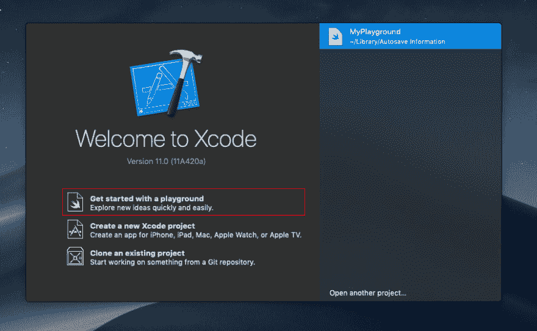
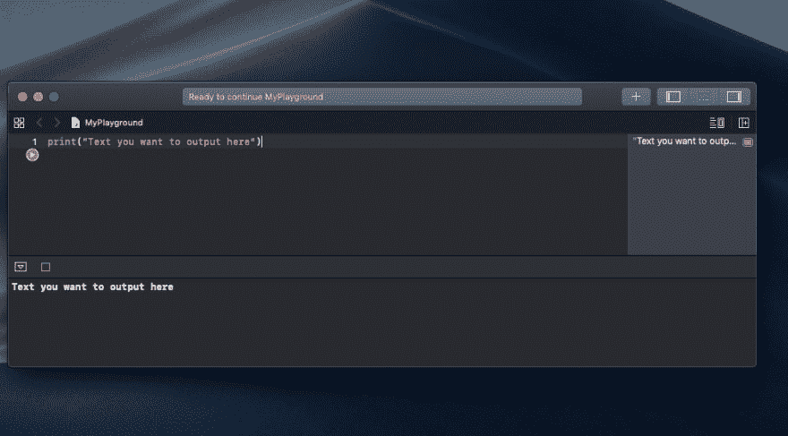
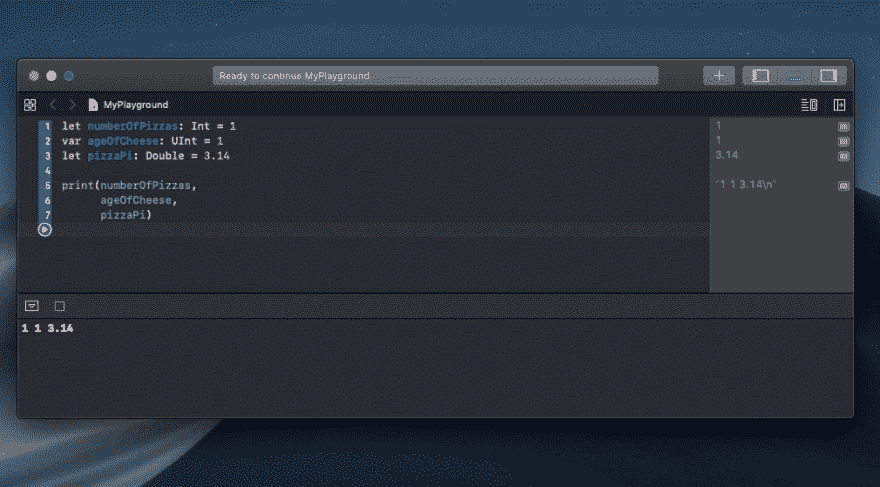

# Swift 简介:常量和变量

> 原文:[https://dev.to/josh/intro-to-swift-1d50](https://dev.to/josh/intro-to-swift-1d50)

这一课是我的 Twitter ✨Intro 到 Swift✨速成班的同伴-看看吧！👌

> Joshua Rutkowski@ joshuarutkowski你是一个 [#CodeNewbie](https://twitter.com/hashtag/CodeNewbie) 还是一直想学 [#SwiftLanguage](https://twitter.com/hashtag/SwiftLanguage) 却一直抽不出时间？
> 
> 这里有一个🔥快速速成班🔥来解决这个问题。
> 
> 有了这个教训，我还赠送 Swift 的《黑客》1 本(作者 [@twostraws](https://twitter.com/twostraws) )！只要 RT &跟随就有机会赢！🎉20:10PM-2019 年 9 月 25 日[](https://twitter.com/intent/tweet?in_reply_to=1176952198334439425)[](https://twitter.com/intent/retweet?tweet_id=1176952198334439425)0[](https://twitter.com/intent/like?tweet_id=1176952198334439425)0

本课程向您介绍 Swift 编程语言，主要涵盖常量和变量以及打印语句。

本课的目标:

*   学习使用 Xcode 创建游乐场
*   学会使用`print()`向控制台输出文本
*   学会使用常量(`let`)存储值
*   学会使用变量(`var`)来存储和改变值
*   了解何时使用`var`与`let`
*   学会使用不同类型的变量和常数，包括`Int`、`Float`、`Bool`等。

本课以以下挑战结束:

> 为你的各个部分创建变量和常量，比如你的名字，你的家乡，你最喜欢的颜色和食物，以及任何你认为有人会有兴趣了解你的东西。想想这些里面哪些应该是变量，哪些应该是常量。试着想出总共至少 8 个常量和变量。
> 
> 使用`print()`语句并在括号中插入变量或常量来打印这些内容。

*注:本课程遵循 Lambda School 的 iOS 101 课程前期工作。关于 Lambda School 的 iOS 开发课程的更多信息，[点击这里](https://lambdaschool.com/courses/ios-development)。*

# [](#learn-to-use-xcode-to-create-a-playground)学会使用 Xcode 创建游乐场

Xcode 包括一个名为 playgrounds 的功能。Playgrounds 提供了一个实时渲染开发者代码的测试平台。

若要开始一个新的游乐场，请打开 Xcode 并选择“游乐场入门”没有 macOS 或者 Xcode？别担心，直接去[回复](https://repl.it)

[T2】](https://res.cloudinary.com/practicaldev/image/fetch/s--cvNuMtit--/c_limit%2Cf_auto%2Cfl_progressive%2Cq_auto%2Cw_880/https://thepracticaldev.s3.amazonaws.com/i/9hnzspp43wl4bb19x90e.png)

# [](#learn-to-use-raw-print-endraw-to-output-text-to-the-console)学会使用`print()`向控制台输出文本

最简单的打印语句如下:

```
print("Text you want to output here") 
```

在 Xcode 中，`print()`函数在 Xcode 的“控制台”面板中打印其输出，如下所示。

[T2】](https://res.cloudinary.com/practicaldev/image/fetch/s--WoJ-7XK---/c_limit%2Cf_auto%2Cfl_progressive%2Cq_auto%2Cw_880/https://thepracticaldev.s3.amazonaws.com/i/e6z306s81gqxkvm32zp0.png)

## [](#learn-to-use-constants-raw-let-endraw-to-store-values)学会使用常数(`let`)存储值

常量将名称(如`numberOfPizzaSlicesEaten`或`welcomeMessage`)与特定类型的值(如数字 4 或字符串“Hello”)相关联。常量的值一旦设置就不能更改。

常量必须在使用前声明。你用关键字`let`声明常量:

```
let numberOfPizzaSlicesEaten = 8 
```

这段代码可以读作:“声明一个名为`numberOfPizzaSlicesEaten`的新常数，并赋予其值 8。”

关于命名的注意事项:您可以将常量命名为您喜欢的任何名称，但有一些小的限制。需要记住的最重要的一点是常量名称不能以数字开头(尽管它们可以在其他地方包含数字)。您为常数选择的名称很重要。编写你(和其他人)容易阅读和理解的代码是成为一名优秀程序员的重要组成部分。因此，选择简洁但非常清楚地传达了常数的目的的名称。你应该避免缩写名字的诱惑。一个写得不好的常量的例子:

```
let numberOfZaSlicesEaten = 8 
```

您可能理解“Za”的意思是“Pizza”——然而，对于另一个审查您的代码的人来说，理解这种引用可能是困难的。还有，没有自尊的人会用“扎”。🍕

# [](#learn-to-use-variables-raw-var-endraw-to-store-and-change-values)学会使用变量(`var`)来存储和改变值

像常量一样，变量将名称与特定类型的值相关联。与常量不同，变量可以在程序运行时被赋予新的值。要创建一个变量，使用一个`var`语句。

下面是一个例子，说明如何使用常量和变量来跟踪用户吃了多少比萨饼:

```
let numberOfPizzaSlicesEaten = 8
var currentPizzaSlice = 2 
```

在这个例子中，允许吃的比萨饼切片的最大数量被声明为一个常数，因为最大值从不改变。当前的比萨饼切片计数器被声明为一个变量，因为这个值必须在每个切片被吃掉后递增。

# [](#learn-when-to-use-raw-var-endraw-vs-raw-let-endraw-)学习何时使用`var` vs `let`

经验法则:如果你有一个值需要改变，你应该使用变量。如果你有一个永远不变的值，使用一个常量。

你可能认为总是使用变量是有意义的，因为如果需要的话你可以改变它们，或者保持它们不变。其实很多语言都没有常量，只用变量。然而，这在实践中并不是一个好主意。

事实上，当你读和写得越来越快时，你会注意到变量实际上很少被使用。根据经验，您应该始终用`let`使您的值保持不变。当且仅当，你确实需要一个可以改变的值，你应该把你的值改变为一个变量。

> 如果你有一个值需要改变，你应该使用一个变量。如果你有一个永远不变的值，使用一个常量。

# [](#learn-to-use-different-types-of-variables-and-constants-including-int-float-bool-etc)学会使用不同类型的变量和常量，包括 Int、Float、Bool 等。

通常， [Swift 能够根据上下文](https://docs.swift.org/swift-book/LanguageGuide/TheBasics.html#ID322)计算出或推断出值的类型。很明显 42 是一个整数，或者说`Int`，而不是一个字符串。同样，“你好”显然不是一个数字，是一个`String`。这个特性被称为类型推断，是使 Swift 简洁和易于编写的原因之一。

您可以在声明常量或变量时提供类型注释，以明确常量或变量可以存储的值的种类。通过在常量或变量名称后放置一个冒号，后跟一个空格，再后跟要使用的类型名称来编写类型批注。

### [](#string)字符串

这个例子为一个名为`typeOfPizzaEaten`的变量提供了一个类型注释，以表明该变量可以存储字符串值:

```
var typeOfPizzaEaten: String = "margherita" 
```

声明中的冒号意味着“……类型的……”所以上面的代码可以理解为:“声明一个名为`typeOfPizzaEaten`的变量，它的类型是`String`，并给它赋值`"margherita"`”

短语“字符串类型”意味着“可以存储任何字符串值”把它想成是可以储存的“东西的类型”(或“东西的种类”)。

### [](#number-types)数字类型

实际上有多种号码类型，包括`Int`、`UInt`、`Float`和`Double`。`Int`是 integer 的缩写，是一个可以是正数也可以是负数的整数。`UInt`是无符号整数，是整数但只能是正数。换句话说，它不能有负号。您会看到 Swift 中使用了这两种类型，但是`Int`更常见，并且是默认的。`Float`和`Double`都是浮点数的一种。

浮点数是带有小数点的数字，如 3.14。`Float`和`Double`的区别在于它们的精度，以及它们能存储的最大值。`Double`比`Float`更精确，可以存储更大的数字。然而，它占用的内存空间是`Float`的两倍。您会看到 Swift 中使用了这两种类型，但是`Double`更常见，并且是默认的。

[T2】](https://res.cloudinary.com/practicaldev/image/fetch/s--WhlcQHIz--/c_limit%2Cf_auto%2Cfl_progressive%2Cq_auto%2Cw_880/https://thepracticaldev.s3.amazonaws.com/i/2mje90cgigxirncg5agi.png)

### [](#boolean)布尔

另一种常见的类型是`Bool`，是 boolean 的简称。布尔值只能为真或假。我们可以像这样创建一个布尔变量:

```
let pizzaIsAwesome = true 
```

# [](#challenge)挑战

让我们把常量、变量和类型注释的知识放在一起，看看我们能否完成这个挑战:

> 为你的各个部分创建变量和常量，比如你的名字，你的家乡，你最喜欢的颜色和食物，以及任何你认为有人会有兴趣了解你的东西。想想这些里面哪些应该是变量，哪些应该是常量。试着想出总共至少 8 个常量和变量。
> 
> 使用`print()`语句并在括号中插入变量或常量来打印这些内容。

向下滚动前先试一试！😉

```
var myAge: UInt = 78 
let myFavoriteColor: String = "Aquamarine Blue"
let myFavoriteFood: String = "Sushi"
let firstName: String = "Arthur"
let lastName: String = "Curry"
let birthYear: Int = 1941
let homeTown: String = "Atlantis"
let university: String = "School of Hard Knocks"
let occupation: String = "Lighthouse Keeper"

print(firstName)
print(lastName)
print(birthYear)
print(myFavoriteFood)
print(myFavoriteColor)
print(homeTown)
print(university)
print(occupation) 
```

# [](#bonus-challenge)奖励挑战

现在轮到你了！

> 创建一个名为`introduction`的常数。这应该是一个可读的句子或段落，包括您创建的所有常量和变量，并将它们组合成一个字符串。
> 
> 提示:在 Swift 中查找字符串插值，了解如何将变量转换为文本。谷歌是你的朋友。😉
> 
> 注意:我们将在后面的课程中详细介绍[字符串插值](https://docs.swift.org/swift-book/LanguageGuide/StringsAndCharacters.html#ID292)，所以如果您还不知道它，或者一开始觉得它很混乱，请不要担心。

#### [](#like-this-post)喜欢这个帖子？

你可以在 twitter 上关注我，了解更多信息😄: [@joshuarutkowski](https://twitter.com/joshuarutkowski)

感谢阅读！