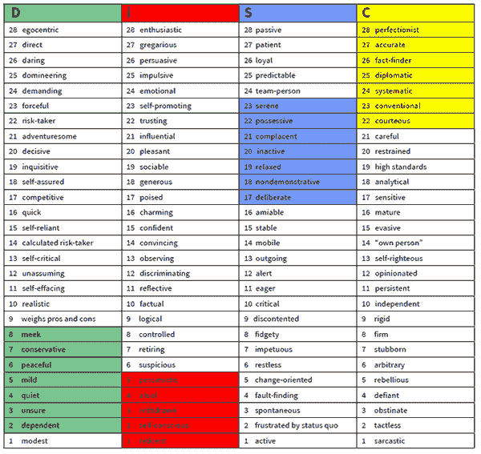
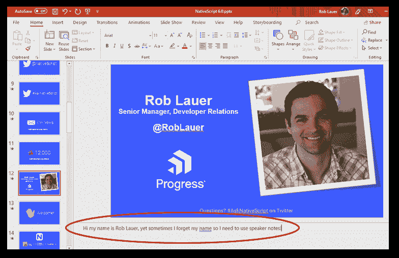
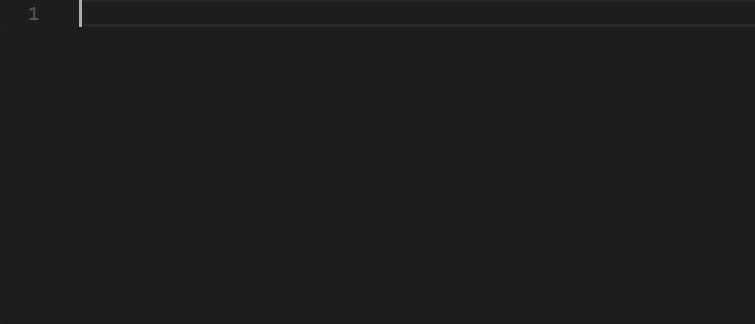

# 做你的第一次技术演讲？嗯，祝你好运！

> 原文:[https://dev . to/rdlauer/giving-your-first-tech-talk-well-good-luck-4379](https://dev.to/rdlauer/giving-your-first-tech-talk-well-good-luck-4379)

你是那些疯狂的科技极客中的一员吗？你想就一个与你的心息息相关的话题进行首次公开演讲吗？

啊，太贴心了！😘我真心祝福你。祝你好运，还有...好吧，回头见！

[T2】](https://res.cloudinary.com/practicaldev/image/fetch/s--xMQjTOpX--/c_limit%2Cf_auto%2Cfl_progressive%2Cq_66%2Cw_880/https://raw.githubusercontent.com/rdlauer/articles/master/misc/first-talk/big-gulps.gif)

那是什么？你确定吗？你知道你在给自己找什么麻烦吗？

你还在这里做什么？

[T2】](https://res.cloudinary.com/practicaldev/image/fetch/s--ifuiZeP---/c_limit%2Cf_auto%2Cfl_progressive%2Cq_66%2Cw_880/https://raw.githubusercontent.com/rdlauer/articles/master/misc/first-talk/still-here.gif)

我已经断断续续地从事了大约六年的开发人员关系工作。我有时也非常害羞，是一个内向的人，宁愿坐在我潮湿的地下室里也不愿和你说话，在我的[光盘简介](https://www.discprofile.com/what-is-disc/overview/)上被评为“高 C”。

> 没听说过碟？这就像迈尔斯-布里格斯性格测试，但实际上是对你的可观察行为的测量。

*这是我几年前的完整唱片简介:*

[T2】](https://res.cloudinary.com/practicaldev/image/fetch/s--QrkQVWCL--/c_limit%2Cf_auto%2Cfl_progressive%2Cq_auto%2Cw_880/https://raw.githubusercontent.com/rdlauer/articles/master/misc/first-talk/disc.png)

“C”代表“工作中的责任心”。这意味着我重视质量和准确性、专业知识和能力。

实际上，我不喜欢在小组会议上发言，除非我确切地知道我想说什么，并且我确信我的信息清晰简洁。我相信部分也非常重要。考虑到隐喻形式的短语“准备，瞄准，开火”，像我这样的“高 C”更像是“准备，瞄准，瞄准，瞄准，瞄准”。我们很难扣动扳机，直到我们知道我们想要传达的确切信息！

这一切都是为了告诉你，作为一个多年前的演讲新手，我对开始公开演讲感到有些尴尬。我第一次重要的演讲是在 2013 年阿姆斯特丹的 PhoneGap 日。你敢在 YOUTUBE 上查这个！

当我生命中那半屈辱的 20 分钟结束时，我认为我做了一件体面的工作。我没有僵住。我没有太多地说错话。我有点自信。没有人嘲笑我。

[T2】](https://res.cloudinary.com/practicaldev/image/fetch/s--NsE5Yuul--/c_limit%2Cf_auto%2Cfl_progressive%2Cq_66%2Cw_880/https://raw.githubusercontent.com/rdlauer/articles/master/misc/first-talk/nelson-haha.gif)

但是，后来回去看的时候，我惊骇的说了多少次“嗯，啊，嗯”。你好，小飞侠！📣公众演讲 101！📣

所以，亲爱的读者，我给你一些提示和技巧，我会发现它们有助于把自己塑造成你今天看到的这位充满活力、令人惊叹、引人入胜、鼓舞人心的演讲者。 **LOL！我还是很烂！**但至少我吸的更自信了！

[T2】](https://res.cloudinary.com/practicaldev/image/fetch/s--54IO7b7j--/c_limit%2Cf_auto%2Cfl_progressive%2Cq_66%2Cw_880/https://raw.githubusercontent.com/rdlauer/articles/master/misc/first-talk/archer-phrasing.gif)

## 你只知道你知道的

当你看到一个真正吸引人的演示时，很可能演示者对他们演讲的主题有热情，并且有相对较好的理解。所以你觉得 Vue.js 很酷，但是还没在现实世界的 app 里用过？厉害！但是，这是你第一次科技演讲的最佳主题吗？

对于你的第一次演讲，我希望你保持简单。如果你认为 Vue.js 很酷，很可能你已经建立在现有 JavaScript 或其他前端技术知识的基础之上。在应用程序开发、编程语言、测试、硬件修补等方面，有没有什么*让你觉得自己是相关领域的专家？*

不要低估自己！虽然你可能认为没人想知道你使用 Bootstrap 的经历，但你可能会惊讶有多少人*不知道你所知道的事情(实际上很想知道！).我是认真的。[伯克·霍兰德曾经提到](https://www.freecodecamp.org/news/what-500-blog-posts-taught-me-about-writing-great-articles/)Lea Verou 做了一个关于*单一 CSS 属性*的完整演讲。结果棒极了:*

[https://www.youtube.com/embed/b9HGzJIcfDE](https://www.youtube.com/embed/b9HGzJIcfDE)

解决了这个问题...你心中有一个主题，但需要一个标题吗？查看[portnet 的内容创意生成器](https://www.portent.com/tools/title-maker)！乍一看可能很可笑。好吧，一开始是完全荒谬的。但是也许 20 次尝试中有 1 次，这些想法听起来有点酷！

## 幻灯片、幻灯片和幻灯片

所以你有一个主题，标题，以及你想谈论的大概内容。你知道它的前前后后，里里外外。您已经准备好分享您所知道的关于 JavaScript 中的 spread 语法的一切，以及它如何允许一个 iterable(如数组表达式或字符串)在应该有零个或多个参数(对于函数调用)或元素(对于数组文字)的地方展开，或者允许一个对象表达式在应该有零个或多个键值对(对于对象文字)的地方展开。

哈哈，那是复制粘贴。

好了，说真的，你已经准备好开始制作 100 张幻灯片了。

**在哪里。**

幻灯片很棒！我的意思是他们可以！当你想分散观众对你的注意力时，他们是一个很好的依靠。但是 Powerpoint 演示的第一条规则是不要让*感觉*像 Powerpoint 演示。

[T2】](https://res.cloudinary.com/practicaldev/image/fetch/s--5Wo5LuVg--/c_limit%2Cf_auto%2Cfl_progressive%2Cq_auto%2Cw_880/https://raw.githubusercontent.com/rdlauer/articles/master/misc/first-talk/confused-nick-young.jpg)

我想说的是，你不希望人们不得不盯着幻灯片看。你也不希望他们不得不阅读太多的文本。

> 查看 TJ VanToll 的帖子，[我的 5 大科技演讲技巧](https://dev.to/progress/my-top-5-tech-speaking-tips-4dej)

同样，用这些经验法则保持简单:

1.  尽量少放幻灯片。尽量少用文字。
2.  不要逐字读出幻灯片上的文字。总结一下。你的观众会自己填补空白。
3.  使用一个好看的幻灯片模板(使用谷歌，找到一个好的模板，然后付钱——非常值得！).

> 哦，给你的幻灯片添加一些漂亮的图片！查看 Brian Rinaldi 关于免费股票图片的 5 种选择的帖子。

## 继续操作之前，请先备份

我的意思不是“把你的卡带拷贝到 USB 驱动器，以防你的笔记本电脑没电”(我的意思是是的，你完全应该这么做！).我的意思是，万一你陷入困境，你会想给自己一个“出路”。这意味着在幻灯片中添加注释/演讲者注释，当您处于“演讲者模式”时，这些注释/演讲者注释会显示出来:

[T2】](https://res.cloudinary.com/practicaldev/image/fetch/s--P2dj0lET--/c_limit%2Cf_auto%2Cfl_progressive%2Cq_auto%2Cw_880/https://raw.githubusercontent.com/rdlauer/articles/master/misc/first-talk/rob-speaker-notes.png)

你的评论应该简洁。它们应该坚持高等级点，允许你和一起工作*，而不是直接从*读取*。当你开始阅读幻灯片上的内容或演讲者的笔记时，你的观众会注意到，而你会失去你所赢得的宝贵的参与。*

**只有项目符号。明白了吗？**

## 不住码

是的，我说了。现场编码是最糟糕的。没有人，我的意思是没有人，希望看到你像一个晃来晃去的“，”一样摆弄你的 JavaScript。至少对于你的第一次演讲，跳过它。

但我不是说*跳码*。相反，我喜欢整天看代码，而不是枯燥重复的幻灯片。

幸运的是，有很多方法可以显示代码，而不需要*实际编写*所说的代码:

### 使用代码片段

为什么要重新发明轮子？您已经编写了一次代码，所以只需复制并粘贴它(就像您已经从堆栈溢出中做的那样！).

全球最受欢迎的代码编辑器 Visual Studio Code 允许您轻松保存和重用[代码片段](https://code.visualstudio.com/docs/editor/userdefinedsnippets)！

[T2】](https://res.cloudinary.com/practicaldev/image/fetch/s--B4OS9CKC--/c_limit%2Cf_auto%2Cfl_progressive%2Cq_66%2Cw_880/https://raw.githubusercontent.com/rdlauer/articles/master/misc/first-talk/ajax-snippet.gif)

当你想假装知道自己在做什么时，这非常有用。这些天我们几乎都是这样。

### 幻灯片编码

如果你真的想从等式中去掉变量(没有双关语的意思？)，添加一些特别易读的代码文本/图像，并以这种方式遍历您的代码。

是出轨吗？我不知道，我们在被测试吗？

**PRO 提示:**我是 [Carbon](https://carbon.now.sh/) 生成代码截图的忠实粉丝。以及 [BrowserFrame](https://browserframe.com/) 查看浏览器视图截图。

## 熟能生巧...？

话题？✅幻灯片？✅演示/代码？✅练习过吗？😟

你就快到了！你已经写好了演讲的草稿，可以开始排练了。

我的建议是，至少自己在中运行*3-5 次。一个人。浏览幻灯片，记住:*

*   这要花多长时间？(记住，当你在公共场合讲话时，可能会更快！)
*   有哪些部分你会停顿或犹豫？如果有，为什么？也许你需要在演讲笔记中澄清一些幻灯片或要点。
*   你在讲一个好故事吗？还是只是吐槽信息？如果是这样的话，你可能需要回头走几步！

如果你对在*隐姓埋名模式*下的谈话感到足够舒服，你就可以进入下一步了:

## 从小做起

在你在一群人面前演讲之前，你需要在一个人面前练习。抱歉，这可能有点尴尬，但在你准备好向世界展示之前，你需要一双洞察你灵魂的眼睛。

可能是技术朋友(也可能是只想帮忙的非技术朋友！).也许是同事。也许是一个重要的人在取笑你的怪话！没关系。你只需要在活生生的人面前演讲的经验。

> 抱歉，猫不算！😿

你如何从一个私人练习环节扩大规模？这取决于你的最终目标。如果你的第一次演讲是在当地的聚会上，面对 10 个人，我会说你已经成功了。然而，如果你要在 100+面前演讲。呀！我建议你尽最大努力去找一个当地的聚会来做演讲...给你一次梦幻般的彩排(也更有效地传播你演讲的福音)。

## 考虑一个替代方案

我们认为演讲的方式仅限于聚会和技术会议。今天，虽然有其他的选择来让你的双脚沾湿说话。你可能会考虑像 [Twitch](https://www.twitch.tv/) 或 [Mixer](https://mixer.com/) 这样的流媒体服务。这些可以让你在陌生人面前说话，而不会在陌生人面前表现出真正的 T4。当然，找到一个观众可能需要一些时间，所以利用你拥有的任何公司或个人社交媒体可以让你获得一群观众。

流媒体服务还有一个额外的好处，那就是可以自动录制谈话内容，让你可以把它们发布到 YouTube 上，以便进一步传播。还有以后尴尬的回忆！嘿，你没有看我的 PHONEGAP DAY TALK 吧？

## 接受我的虚拟拥抱

记住这一点:如果像我这样内向的人能做到，你也能。🤗

选择一个你喜欢的话题。练习一下。找一群人。用你的知识释放世界。你成功了！