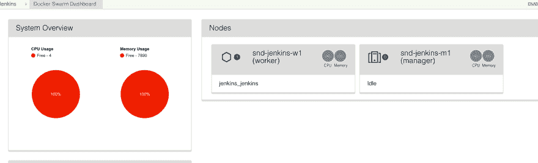
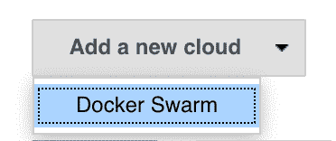
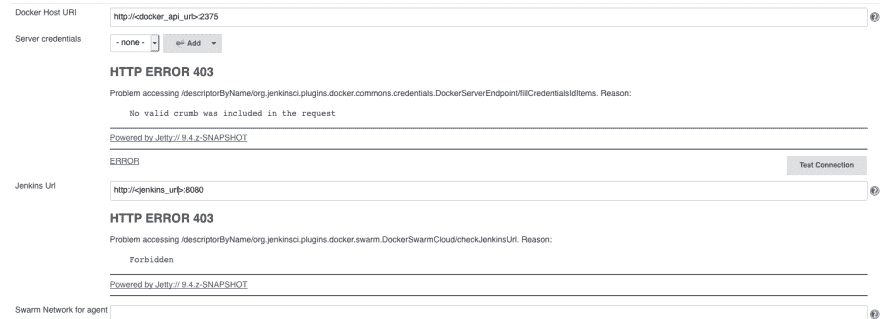
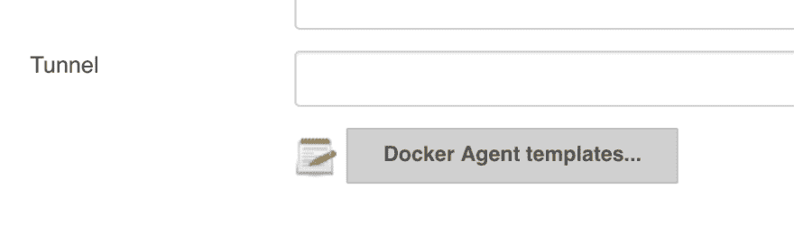
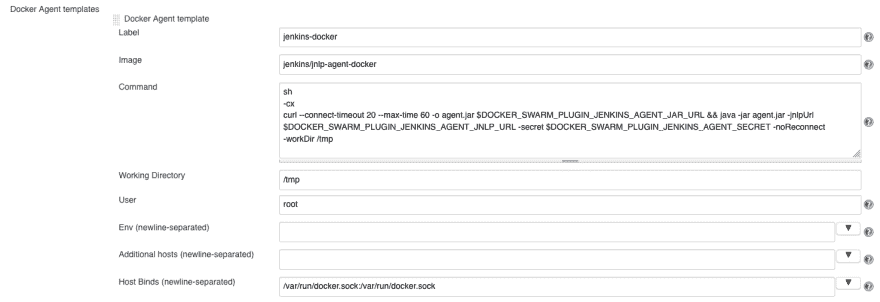

# Jenkins 将代理构建为 Docker 群服务

> 原文：<https://dev.to/roylarsen/jenkins-build-agents-as-docker-swarm-services-9b4>

最近我一直在(重新)学习 Jenkins，学习如何使用他们的管道功能。

我们已经在$curr_job 设置了一个 Jenkins 服务器，以从 Bamboo 中卸载一些潜在的工作，这也是因为我们作为一个 DevOps 团队正在尝试远离 Bamboo，因为我们对它不太满意。

* * *

### 码头工人蜂拥而来

首先，让我们解决房间里的一万磅重的大象:Docker Swarm 没有 Kubernetes 酷。

对于小型、易于在内部设置/管理的 Docker 集群，Docker Swarm 是很好的选择，并且非常易于维护。默认情况下，所有节点/管理器的已发布端口的自动负载平衡非常灵活。

也就是说，并不是一切都很好。要做到这一点，你需要公开 Docker Swarm API，而这样做是相当难看的。我不打算保护它，因为这是一个实验室设置。

以不安全的方式暴露蜂群是相当直接的。找到 systemd 单元文件并将其添加到 ExecStart 行的末尾，然后重新启动服务:-H tcp://0.0.0.0:2375

### 詹金斯服务

这是我的 docker-compose.yml，我用来部署它:

<figure>

```
version: '3'

services:
  jenkins:
    image: jenkins/jenkins
    ports:
      - 8080:8080
      - 50000:50000
    restart: always
    volumes:
      - /usr/bin/docker:/usr/bin/docker
    environment:
      - "JENKINS_SLAVE_AGENT_PORT=50000" 
```

<figcaption>This is *far* from a production service</figcaption>

</figure>

除了 Docker/Swarm 之外，我不会进入 Jenkins 配置。对于一般的 Jenkins 配置和使用，有大量的文档。

我不能强调这不是一个生产服务。没有什么是持久的。

### 詹金斯 Docker 蜂群插件

接下来的两段最烦。当文档存在时，它肯定是缺少的。

要在 Jenkins 中启用 Docker Swarm 访问，需要安装‘Docker Swarm 插件’，然后重新加载 Jenkins。

这给詹金斯增加了一些东西。首先也是最重要的，Docker Swarm 仪表盘:

[](https://res.cloudinary.com/practicaldev/image/fetch/s--kALrqDAq--/c_limit%2Cf_auto%2Cfl_progressive%2Cq_auto%2Cw_880/http://www.roylarsen.xyz/conteimg/2019/09/Screen-Shot-2019-09-25-at-3.31.31-PM.png)

更重要的是，在管理 Jenkins ->配置系统中，底部有一个添加云的选项:

[](https://res.cloudinary.com/practicaldev/image/fetch/s--wtz5T2_K--/c_limit%2Cf_auto%2Cfl_progressive%2Cq_auto%2Cw_880/http://www.roylarsen.xyz/conteimg/2019/09/Screen-Shot-2019-09-25-at-3.34.16-PM.png)

这方面的配置非常简单:

<figure>[](https://res.cloudinary.com/practicaldev/image/fetch/s--ttlyatsh--/c_limit%2Cf_auto%2Cfl_progressive%2Cq_auto%2Cw_880/http://www.roylarsen.xyz/conteimg/2019/09/Screen-Shot-2019-09-25-at-12.15.36-PM.png) 

<figcaption>忽略 403 的，我明显改了 FQDNs</figcaption>

</figure>

在我看来,“测试”按钮有点奇怪，你可能需要保存你的配置才能成功。

### 詹金斯·JNLP 特工

这是最有趣的部分。我说的有趣，是指令人沮丧。这就是文档真正缺乏的地方，我碰巧发现了一篇博客文章，其中快速解释了这一切是如何工作的。

当您在上面配置集群时，您会看到一个添加模板的按钮:

[](https://res.cloudinary.com/practicaldev/image/fetch/s--4tnqJFfi--/c_limit%2Cf_auto%2Cfl_progressive%2Cq_auto%2Cw_880/http://www.roylarsen.xyz/conteimg/2019/09/Screen-Shot-2019-09-25-at-3.53.10-PM.png)

点击那个按钮会给你这个:

<figure>[](https://res.cloudinary.com/practicaldev/image/fetch/s--__x8GGIt--/c_limit%2Cf_auto%2Cfl_progressive%2Cq_auto%2Cw_880/http://www.roylarsen.xyz/conteimg/2019/09/Screen-Shot-2019-09-25-at-12.13.04-PM.png) 

<figcaption>总体来说，很酷，附带说明</figcaption>

</figure>

标签是你可以用来定位的东西，图片是你可以从中提取的 Docker 容器。他们实际上提供了一些容器来使用:[https://github.com/jenkinsci/jnlp-agents](https://github.com/jenkinsci/jnlp-agents)

docker 映像不同于其他容器，它的工作方式与示例配置一致。关于它应该如何工作的一般想法是，当容器启动时，它对 Jenkins 主服务器执行 curl 并下载 JNLP 代理，以确保没有版本不匹配。

据我所知，其他代理映像都不是这样工作的。它们都基于自己的语言/工具集 alpine image，没有安装 curl 或 git 之类的工具，但是在 docker 文件中，Jenkins 复制了代理。来自基本 JNLP 代理映像的 jar。

jnlp 坞站命令:

```
sh  
-cx  
curl --connect-timeout 20 --max-time 60 -o agent.jar $DOCKER\_SWARM\_PLUGIN\_JENKINS\_AGENT\_JAR\_URL && java -jar agent.jar -jnlpUrl $DOCKER\_SWARM\_PLUGIN\_JENKINS\_AGENT\_JNLP\_URL -secret $DOCKER\_SWARM\_PLUGIN\_JENKINS\_AGENT\_SECRET -noReconnect -workDir /tmp 
```

jnlp-python 命令:

```
sh  
-cx  
apk -u add git && java -jar /usr/share/jenkins/agent.jar -jnlpUrl $DOCKER\_SWARM\_PLUGIN\_JENKINS\_AGENT\_JNLP\_URL -secret $DOCKER\_SWARM\_PLUGIN\_JENKINS\_AGENT\_SECRET -noReconnect -workDir /tmp 
```

我花了一点时间进行调试和挖掘，找出两个容器映像之间的不同之处，并找出为什么我的 Docker 容器可以工作，而我的 Python 容器却不行。

我遇到的另一个大问题是，容器需要以 root 用户身份运行，否则将无法启动。对于 docker，您还需要确保将/var/run/docker.sock 从主机挂载到容器中，这样容器中的 Docker 客户机就有了一个 Docker 守护进程。

### Jenkinsfile

```
pipeline{
    agent { label 'jenkins-docker' }

    stages {
        stage('Print Test'){
            agent { label 'jenkins-docker' }
            steps {
                sh "uname -a"
                sh "docker run hello-world"
            }
        }
        stage('Schedule Tests'){
            agent { label 'jenkins-python' }
            steps{
                sh 'python --version'
                sh 'ls .'
                sh 'printenv'
            }
         }
    }
} 
```

上面的 Jenkinsfile 是一个工作示例，其中我有管道级别和每个阶段的代理(作业生成第一个代理，然后为每个阶段生成代理)。

<figure>[](https://res.cloudinary.com/practicaldev/image/fetch/s--2aQZvmMa--/c_limit%2Cf_auto%2Cfl_progressive%2Cq_auto%2Cw_880/http://www.roylarsen.xyz/conteimg/2019/09/Screen-Shot-2019-09-25-at-2.03.09-PM.png) 

<figcaption>岗位运行，各阶段代理</figcaption>

</figure>

我不打算在 API 调用上设置构建，再说一遍，这在 Jenkins 文档中是很好的，有很多。

* * *

希望这有所帮助。以后自己有这个参考就好了。