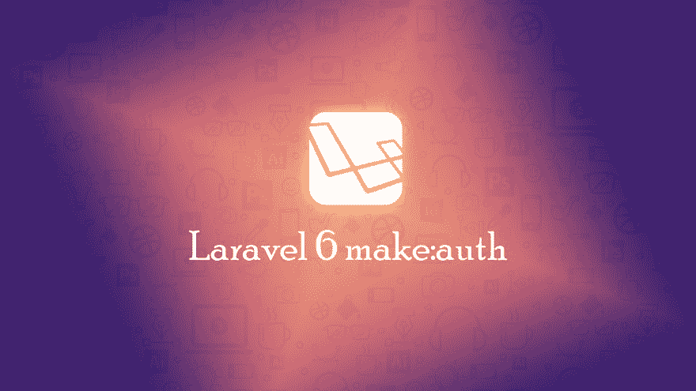

# 如何在 Laravel 6 中使用 Make Auth

> 原文：<https://dev.to/erpankajsood/how-to-use-make-auth-in-laravel-6-5cdl>

在本文中，我们将讨论“如何在 Laravel 6 中使用 make auth”。官方的 Laravel 6 现在已经可以使用了，但是这里的一些变化是意料之中的。因为你正在读这篇文章，所以我假设你还不熟悉 Laravel 6。注意，这是 LTS 版的拉勒维尔。如果[……]

关于如何在 Laravel 6 中使用 Make Auth 的帖子[首先出现在](https://codebriefly.com/how-to-use-make-auth-in-laravel-6/)[代码上，简要介绍](https://codebriefly.com)。