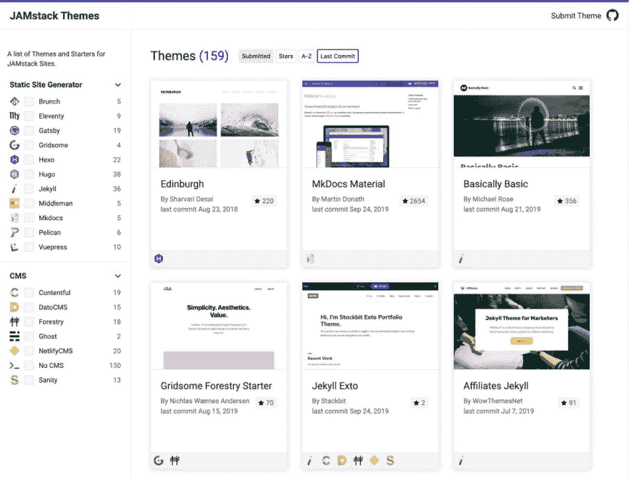

# Jamstack 站点的主题和开始列表

> 原文:[https://dev . to/ohadpr/a-list-of-themes-and-starters-for-jam stack-sites-1 LHD](https://dev.to/ohadpr/a-list-of-themes-and-starters-for-jamstack-sites-1lhd)

## 【https://jamstackthemes.dev/】T2

我们刚刚为每个想建立 Jamstack 站点的人发布了一个资源。您可以找到各种静态站点生成器的主题和启动器，如 Gatsby/Hugo/Jekyll/11ty/等，以及现代 CMS，如 content ful/Forestry/Sanity/DatoCMS/NetlifyCMS/等。

该网站由 Github repo 提供支持，因此您可以随意提交新主题:

## [stack bithq](https://github.com/stackbithq)/[jamstackthemes](https://github.com/stackbithq/jamstackthemes)

### JAMstack 站点的主题和开始列表。

<article class="markdown-body entry-content container-lg" itemprop="text">

# Jamstack 主题

JAMstack 站点的主题和开始列表。[https://jamstackthemes . dev](https://jamstackthemes.dev)

## 提交主题

任何人都可以使用 PR 向画廊提交开源主题。

1.  派生此回购并在`content/theme`文件夹中创建一个新的降价`.md`文件。例如`hugo-air-.md`
2.  如下所示，用所需的前置内容编辑降价文件。
3.  提交标题为**主题提交:主题名称**的拉请求
4.  你**不**需要生成 Github 星星或者主题截图。请在 PR 中提交降价文件。

降价文件应包含以下主要内容。

```
---
title: "My Theme Name"
github: https://github.com/username/repo
demo: https://www.demo.com # Please make sure this links to the theme demo and not your personal/business site
author: authorname
date: 2019-08-20 # Enter the date you submitted the theme YYYY-MM-DD
github_branch: master # Specify the repos default branch
ssg
  - Gridsome #
```

…</article>

[View on GitHub](https://github.com/stackbithq/jamstackthemes)

目前名单上有 161 个，我们希望在未来几周内接近 500 个。

这是我们宣布网站的推文:

> stack bit@ stack bithq就这么办吧👉[jamstackthemes . dev](https://t.co/XXGod8yq75)2019 年 9 月 25 日上午 02:03[](https://twitter.com/intent/tweet?in_reply_to=1176678632955273216)[](https://twitter.com/intent/retweet?tweet_id=1176678632955273216)43[](https://twitter.com/intent/like?tweet_id=1176678632955273216)121