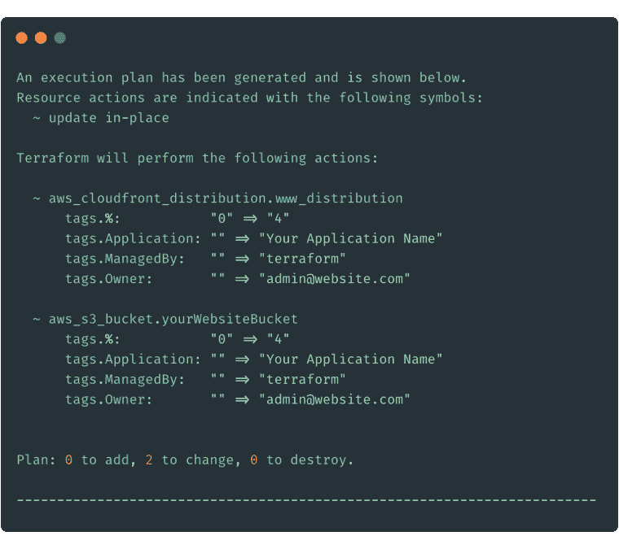

# 作为代码的声明性与命令性基础结构

> 原文:[https://dev . to/loujaybee/declarative-vs-important-infra structure-as-code-2p 8](https://dev.to/loujaybee/declarative-vs-imperative-infrastructure-as-code-2p8)

并不是所有的代码基础设施都是生来平等的。一些代码形式的基础设施给我们带来了很大的好处——而其他类型的基础设施可能会带来很多麻烦。

[T2】](https://res.cloudinary.com/practicaldev/image/fetch/s--2Su7nUGp--/c_limit%2Cf_auto%2Cfl_progressive%2Cq_auto%2Cw_880/https://i2.wp.com/www.thedevcoach.co.uk/wp-content/uploads/2019/08/terraform-planning.png%3Ffit%3D760%252C675%26ssl%3D1)

将良好的[基础设施写成代码](https://www.thedevcoach.co.uk/infrastructure-as-code-ultimate-guide/)并不意味着简单地将创建基础设施的代码捆绑到一个存储库中，然后离开。了解作为代码的声明性和命令性基础设施可能意味着是过上轻松的生活还是彻底的噩梦。

到本文结束时，你将知道作为代码的声明性和命令性基础设施之间的区别，为什么它很重要，以及何时应该使用它们。

## 陈述句与祈使句:有什么区别？

首先，让我们从讨论术语声明性和命令性的含义开始。

声明性指令可以是.."*周一早上 9 点我可以在办公桌上喝杯咖啡吗*"然而命令的命令版本可能是…“*去那台机器，然后拿玻璃罐，装满水，然后放回机器*”…你明白了。

好的——一个例子看起来更长更罗嗦，但是使用一种风格的指令而不是另一种风格的指令的真正含义是什么？

在命令式例子(较长的例子)中，如果中途出现问题——假设玻璃罐不在机器上，你认为会发生什么？如果你是一个计算机程序，你会崩溃的。为什么？因为你会试图执行一个不存在或甚至不可能的动作。

命令式示例的明确性使它变得脆弱。而声明性给回旋余地和推断留下了余地。

现在我知道你在想什么…“这很抽象，在现实世界中如何应用呢”？让我给你一些使用基础设施的真实例子。

## 陈述性与命令性:一个代码示例

我知道有时候很难抽象地理解概念。下面我们有两个创建相同基础设施的示例方法。在这种情况下，我们创建了一个 S3 桶，首先是用 [Terraform](https://www.thedevcoach.co.uk/the-six-fundamentals-of-terraform/) ，一个声明性的基础设施作为代码工具。其次是剧本。在我们看完这些例子之后，我们将讨论这些风格之间的主要区别以及何时使用它们。

首先，以地形为例。