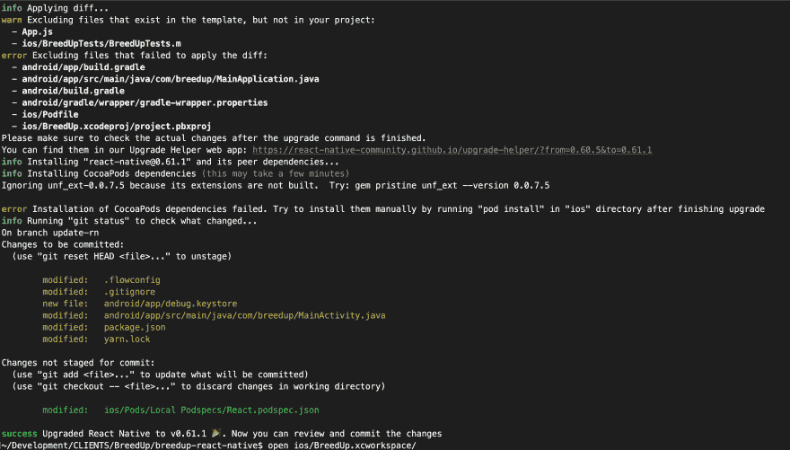
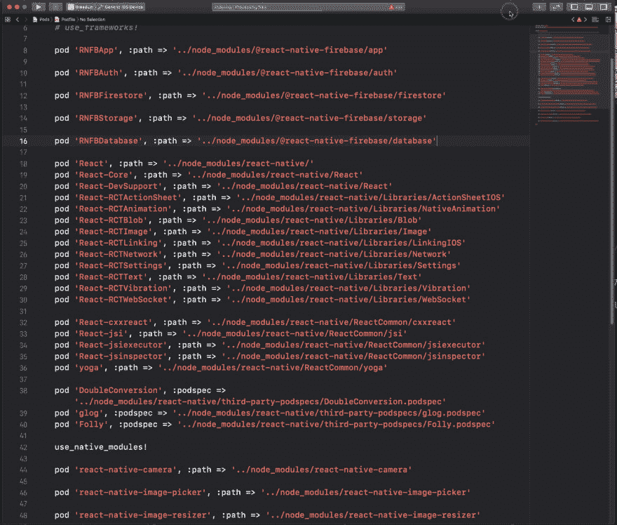
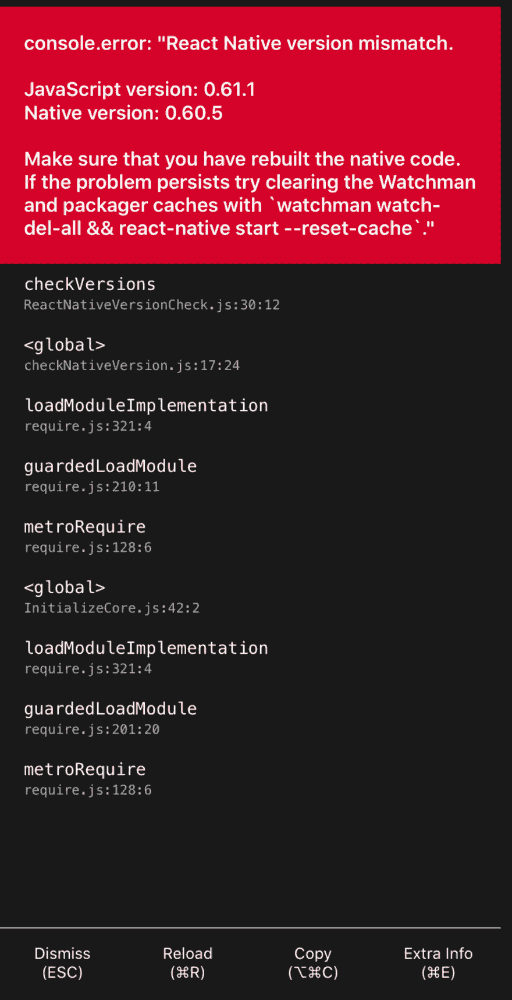
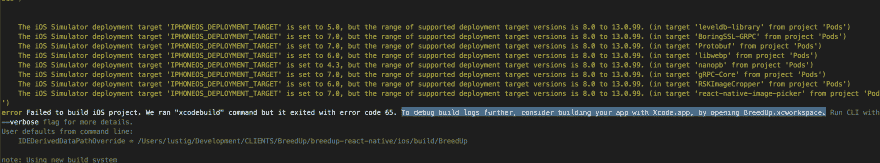
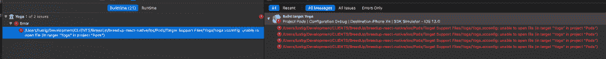

# 快速刷新~ React Native 61 ~将 React Native 从 60.5 升级到 61.1 并测试快速刷新！[直播流]

> 原文:[https://dev . to/techno Plato/upgrading-react-native-from-60-5-to-61-1-and-testing-fast-refresh-live-stream-1ma 9](https://dev.to/technoplato/upgrading-react-native-from-60-5-to-61-1-and-testing-fast-refresh-live-stream-1ma9)

我喜欢记录 React Native 的升级过程，以便其他人可以找到他们遇到的问题的修复方法，或者学习一些有用的资源。

下面是带有时间戳和在此过程中发生的错误的视频。你可以点击一张图片，它会带你到视频中发生错误的时间，这样你就可以实时观看我修复错误。

如果有人遇到任何不同的问题，请告诉我，我们可以帮助每个人调试它们！

[YouTube](https://www.youtube.com/c/michaellustig?sub_confirmation=1)|[dev . to](https://dev.to/technoplato)|[Twitter](https://twitter.com/technoplato/)|[Github](https://github.com/technoplato)|[Medium](https://medium.com/@michaellustig)|[Reddit](https://www.reddit.com/user/halfjew22)

## 视频

[T2】](https://www.youtube.com/watch?v=ggOFxI9fFeY)

### 📋 👓react-原生升级结果@ [8:56](https://youtu.be/ggOFxI9fFeY?t=536)

[T2】](https://youtu.be/ggOFxI9fFeY?t=536)

## 升级过程中出现错误(点击查看修复)

### 修复 Podfile @ [13:34](https://youtu.be/ggOFxI9fFeY?t=814)

[T2】](https://youtu.be/ggOFxI9fFeY?t=814)

### 🔢❌反应原生版本不匹配@ [26:22](https://youtu.be/ggOFxI9fFeY?t=1582)

[T2】](https://youtu.be/ggOFxI9fFeY?t=1582)

### 👨‍💻 😦xcodebuild 失败@ [30:17](https://youtu.be/ggOFxI9fFeY?t=1817)

[T2】](https://youtu.be/ggOFxI9fFeY?t=1817)

### 📁❗无法打开文件瑜伽@ [31:57](https://youtu.be/ggOFxI9fFeY?t=1917)

[T2】](https://youtu.be/ggOFxI9fFeY?t=1917)

* * *

[升级时反应原生文件](https://facebook.github.io/react-native/docs/upgrading)

[React 原生升级助手](https://react-native-community.github.io/upgrade-helper/?from=0.60.5&to=0.61.0)

[React Native 61 博文](https://facebook.github.io/react-native/blog/2019/09/18/version-0.61)

[React 原生 61.1 Podfile](https://raw.githubusercontent.com/react-native-community/rn-diff-purge/release/0.61.1/RnDiffApp/ios/Podfile)

* * *

我将开始一系列视频，在这些视频中，我尝试在代码中做一些事情，以显示所有的错误以及调试这些错误的思维过程。我会尽可能彻底地解释为什么我认为狗屎击中了风扇。我会想尽一切办法让事情运转起来。