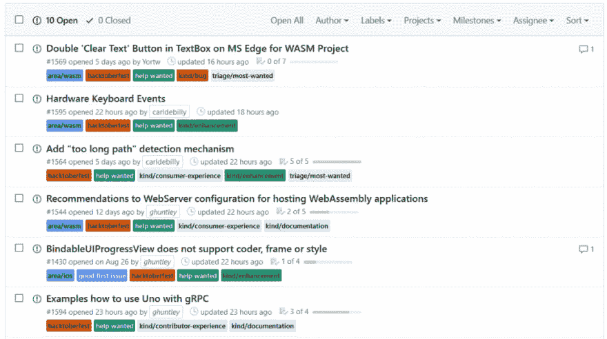
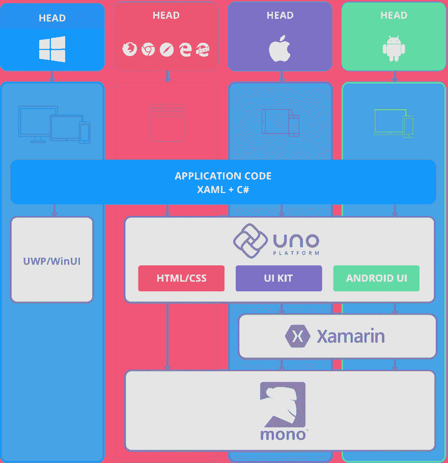

# Uno 将参加 2019 年的 Hacktoberfest

> 原文:[https://dev . to/uno-platform/uno-is-joining-hacktoberfest-2019-o3j](https://dev.to/uno-platform/uno-is-joining-hacktoberfest-2019-o3j)

我们很高兴地宣布，Uno 平台将参加今年的#Hacktoberfest，任何在 10 月 1 日至 10 月 31 日期间在 GitHub 上向 Uno 平台提交 [pull 请求的人都将获得一件 Uno 平台 t 恤和一些限量版 swag。](http://github.com/unoplatform/)

## 如何参与

*   注册参加 [Hacktoberfest 活动](https://hacktoberfest.digitalocean.com/register)。
*   通过[这份表格与 Uno 平台团队](https://forms.office.com/Pages/ResponsePage.aspx?id=Ye9TbdG2UEGuC0O5DnXgzai0HkTgxONNjPmzuZ5zgdRUQzFJMVBPSU8xWDBUUlNOTExCWFUwQjNBNy4u)分享您的联系方式，以便我们知道在 Hacktoberfest 结束后将您的赠品发送到哪里。
*   向[提出拉动请求，以改进项目代码或文档](http://github.com/unoplatform/)。欢迎所有的贡献，没有贡献太小。

我们使用两个标签[帮助招聘](https://github.com/unoplatform/uno/issues?q=is%3Aopen+is%3Aissue+label%3A%22help+wanted%22+sort%3Aupdated-desc)和[好的第一期](https://github.com/unoplatform/uno/issues?q=is%3Aopen+is%3Aissue+label%3A%22good+first+issue%22+sort%3Aupdated-desc)来标识专门为新贡献者策划的问题。`good first issue`标签是`help wanted`标签的子集，表示成员已经承诺为新的贡献者提供额外的帮助。所有的`good first issue`物品也都有`help wanted`标签。标有`good first issue`标签的项目是为首次投稿者准备的。

[T2】](https://res.cloudinary.com/practicaldev/image/fetch/s--jVFLPfBY--/c_limit%2Cf_auto%2Cfl_progressive%2Cq_auto%2Cw_880/https://s3.amazonaws.com/uno-website-assets/wp-content/uploads/2019/09/25121946/hacktoberfest-2019-1024x573.png)

## 关于 Uno 平台

Uno 平台使您能够利用现有的技能(C#和 XAML)来创建 UI 丰富的 WebAssembly 和原生移动应用程序——这是目前唯一可以做到这一点的平台。在 iOS 和 Android 上，Uno 平台广泛依赖于 Xamarin 原生堆栈。在 WebAssembly 上，Uno 平台直接依赖于 Mono-Wasm 运行时。

[T2】](https://res.cloudinary.com/practicaldev/image/fetch/s--OYF2Tz1A--/c_limit%2Cf_auto%2Cfl_progressive%2Cq_auto%2Cw_880/https://s3.amazonaws.com/uno-website-assets/wp-content/uploads/2019/08/21141002/diagram-991x1024.png)

开始使用 Uno 平台的最佳方式是查看最近在 [UnoConf](https://platform.uno/unoconf-2019-recap-with-video) 开源的 [Uno Bootcamp workshop](https://github.com/unoplatform/workshops/blob/master/uno-bootcamp/README.md) 。在研讨会中，你会发现软件开发者在使用 Uno 平台开发应用时需要了解的一切。[模块# 7——与 Uno 合作](https://github.com/unoplatform/workshops/tree/master/uno-bootcamp/modules/07-Working-with-Uno)包含了贡献者对 Uno 如何在幕后工作、源代码级调试以及如何修补 Uno 内部的见解。

Uno 平台是一个开放源码项目，可以在 Apache 2 许可下使用。如果您的组织需要我们社区支持之外的更深层次的支持，请[联系我们](https://platform.uno/contact/)。我们的专业支持不仅仅是一份合同，它是您项目成功的共同责任。我们的工程团队将与您合作，确保您的项目取得成功，我们在 [nventive](https://nventive.com/) 的定制应用开发团队也可以提供专业知识。

帖子 [Uno 正在加入 Hacktoberfest 2019](https://platform.uno/uno-is-joining-hacktoberfest-2019/) 最早出现在 [Uno 平台](https://platform.uno)。