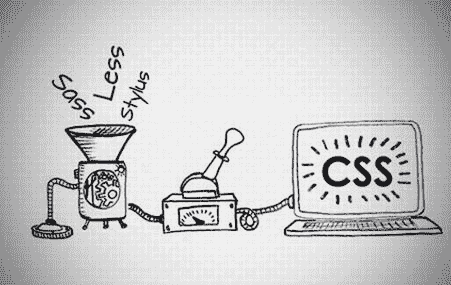

# 如何用 SASS 编写可重用的 CSS

> 原文：<https://dev.to/bnevilleoneill/how-to-write-reusable-css-with-sass-30k7>

**作者:[奥比纳](https://blog.logrocket.com/author/obinnaekwuno/)埃克乌诺** ✏️

Sass 是一个 CSS 预处理器，在前端工程师的工具箱中变得至关重要。Sass 之所以流行，是因为它修复了一些 CSS 缺陷。

这也是 [Bootstrap 4](https://getbootstrap.com) 运行的基础。这意味着学习 Sass 将非常有助于理解如何操作引导代码，而不是重写代码(这是大多数开发人员的定制方法)。理解 Sass 有助于更好地理解源代码级别的工具。

当使用 CSS 时，我们经常在一个全局的世界中工作，可能会错误地设计元素的样式。

自定义 CSS(即使有 CSS 变量)还是很多余的。CSS 不是为我们今天拥有的那种复杂架构而设计的，我们会遇到在另一个样式表中导入一个样式表的问题，这可能会导致一个非常大的样式库，如果没有适当的文档，可能无法理解。

## TL；速度三角形定位法(dead reckoning)

在本文中，我们将关注预处理器为什么重要，特别强调 SASS 及其组合规则的能力。使用 Sass 为设计现代 web 组件提供了一种更符合逻辑的方法。

我们还将看看为什么我们使用这些预处理程序，并通过演示例子展示我们如何将样式分解成更小的特定组件，而不会强迫用户下载大量不需要的 CSS 文件。

## 先决条件

在我们进一步讨论之前，本文假设:

*   [Node.js ≥v6](https://nodejs.org/) 安装在您的机器上
*   您的机器上安装了 npm
*   您的机器上安装了 Sass
*   [Create-react-app](https://www.npmjs.com/package/create-react-app) 已安装在您的机器上
*   你对 CSS 有一个基本的了解

[](https://logrocket.com/signup/)

## 入门

Sass 可以以多种方式添加到你的项目中，你可以在这里找到所有的分期付款选项。出于本文的考虑，我们将通过运行
来使用 [npm](https://www.npmjs.com/)

```
npm install -g sass 
```

<svg width="20px" height="20px" viewBox="0 0 24 24" class="highlight-action crayons-icon highlight-action--fullscreen-on"><title>Enter fullscreen mode</title></svg> <svg width="20px" height="20px" viewBox="0 0 24 24" class="highlight-action crayons-icon highlight-action--fullscreen-off"><title>Exit fullscreen mode</title></svg>

## CSS 有什么问题？

在学习 web 开发的基础知识时，我们会接触到传统的 CSS，它涉及到使用类或 id 等标识符来处理和操作 HTML。

在使用 CSS 的时候，我们经常不得不改变样式，让它看起来像我们想要的样子。组织大型样式表真的很有压力。保持类的范围以避免以非预期的方式设计东西几乎是很累的。

即使引入了 CSS 变量来减少声明的重复，这个概念还是有一些问题可以通过使用预处理器来解决。例如使用长变量名。

即使有了 CSS3，我们仍然需要依靠技术(基本上是黑客)来设计用户界面。我们还可以注意到，在编写 HTML 时，有一个清晰的嵌套和可视化的层次结构，这是常规 CSS 所不允许的。

让我们看看 CSS 中缺少的特性的“解决方案”。

## CSS 预处理器是什么？

这些基本上可以被认为是一个程序，让您从预处理程序自己独特的语法生成 CSS。CSS 预处理器一般会增加一些纯 CSS 中没有的特性，比如 [mixin](https://sass-lang.com/documentation/at-rules/mixin) 、[嵌套选择器](http://thesassway.com/beginner/the-inception-rule)、[继承选择器](https://github.com/webplatform/webplatform.github.io/blob/master/docs/tutorials/inheritance_and_cascade/index.html)。同时也为我们提供了一种非常结构化的编写样式表的方法。CSS 预处理器的例子包括 [LESS](http://lesscss.org) 、 [stylus](http://stylus-lang.com) 、 [Sass](https://sass-lang.com) 、[postscs](https://postcss.org)。如前所述，本文主要关注作为预处理器的 Sass。

[](https://res.cloudinary.com/practicaldev/image/fetch/s--0AwwPbAZ--/c_limit%2Cf_auto%2Cfl_progressive%2Cq_auto%2Cw_880/https://blog.logrocket.com/wp-content/uploads/2019/09/csspreprocessor-nocdn.jpeg)

## 萨斯还是 SCSS？

现在，如果你不熟悉 Sass 这个概念，你可能会想，“如果 Sass 是预处理器，那么 SCSS 是什么？”因为缺少分号`;`和花括号`{}`，使用 Sass 会有点混乱，所以用制表符和空格来代替。

在 Sass 的版本 3 中，SCSS 语法作为 Sass 的主要语法被引入，它包含了 CSS 的所有特性，但是允许使用 Sass 的特性。在我看来，这两种语法在样式化时都有效，没有一种比另一种更好。对 SCSS 的需求是使 Sass 的学习曲线和实现更快并且没有错误。

萨斯:

```
$font-stack:    Helvetica, sans-serif
$primary-color: #333

body
  font: 100% $font-stack
  color: $primary-color 
```

<svg width="20px" height="20px" viewBox="0 0 24 24" class="highlight-action crayons-icon highlight-action--fullscreen-on"><title>Enter fullscreen mode</title></svg> <svg width="20px" height="20px" viewBox="0 0 24 24" class="highlight-action crayons-icon highlight-action--fullscreen-off"><title>Exit fullscreen mode</title></svg>

SCSS:

```
$font-stack:    Helvetica, sans-serif;
$primary-color: #333;

body {
  font: 100% $font-stack;
  color: $primary-color;
} 
```

<svg width="20px" height="20px" viewBox="0 0 24 24" class="highlight-action crayons-icon highlight-action--fullscreen-on"><title>Enter fullscreen mode</title></svg> <svg width="20px" height="20px" viewBox="0 0 24 24" class="highlight-action crayons-icon highlight-action--fullscreen-off"><title>Exit fullscreen mode</title></svg>

在上面的代码示例中，我们注意到了萨斯和 SCSS 写作风格的不同。注意，它们都使用`$`来声明一个变量。

## SCSS 概念

### 嵌套和作用域

当设计 HTML 文件的样式时，SCSS 可以让你在样式表中拥有和 HTML 相同的视觉层次，这样你就可以用一种更容易理解的方式来设计你的样式。例如，样式化这个`index.html` :

```
<nav class = 'sidebar'>
  <ul>
    <li> <a> </a></li>
  </ul>
</nav> 
```

<svg width="20px" height="20px" viewBox="0 0 24 24" class="highlight-action crayons-icon highlight-action--fullscreen-on"><title>Enter fullscreen mode</title></svg> <svg width="20px" height="20px" viewBox="0 0 24 24" class="highlight-action crayons-icon highlight-action--fullscreen-off"><title>Exit fullscreen mode</title></svg>

CSS:

```
nav ul {
  margin: 0;v
  padding: 0;
  list-style: none;
}
nav li {
  display: inline-block;
}
nav a {
  display: block;
  padding: 6px 12px;
  text-decoration: none;
} 
```

<svg width="20px" height="20px" viewBox="0 0 24 24" class="highlight-action crayons-icon highlight-action--fullscreen-on"><title>Enter fullscreen mode</title></svg> <svg width="20px" height="20px" viewBox="0 0 24 24" class="highlight-action crayons-icon highlight-action--fullscreen-off"><title>Exit fullscreen mode</title></svg>

SCSS:

```
nav {
  ul {
    margin: 0;
    padding: 0;
    list-style: none;
  }

  li { display: inline-block; }

  a {
    display: block;
    padding: 6px 12px;
    text-decoration: none;
  }
} 
```

<svg width="20px" height="20px" viewBox="0 0 24 24" class="highlight-action crayons-icon highlight-action--fullscreen-on"><title>Enter fullscreen mode</title></svg> <svg width="20px" height="20px" viewBox="0 0 24 24" class="highlight-action crayons-icon highlight-action--fullscreen-off"><title>Exit fullscreen mode</title></svg>

从上面的 CSS 代码示例中我们可以看到，我们能够推导出 HTML 文件的结构，同时保持实现简短。这样做的另一个好处是，它有助于避免拼写错误，另外，您可以看到，我们已经确定了一些规则的范围，因此它们只适用于`nav`。

后代风格规则适用于 SCSS，例如:

```
.container{
.left-area{
  ...
}
} 
```

<svg width="20px" height="20px" viewBox="0 0 24 24" class="highlight-action crayons-icon highlight-action--fullscreen-on"><title>Enter fullscreen mode</title></svg> <svg width="20px" height="20px" viewBox="0 0 24 24" class="highlight-action crayons-icon highlight-action--fullscreen-off"><title>Exit fullscreen mode</title></svg>

这意味着拥有`class = "left-area"`的容器类的所有后代都将受到规则的影响。基本的 CSS 选择器仍然适用于 SCSS，例如:

## 直系子孙(>)

```
.container{
  > .left-area{
   ...
 }
} 
```

<svg width="20px" height="20px" viewBox="0 0 24 24" class="highlight-action crayons-icon highlight-action--fullscreen-on"><title>Enter fullscreen mode</title></svg> <svg width="20px" height="20px" viewBox="0 0 24 24" class="highlight-action crayons-icon highlight-action--fullscreen-off"><title>Exit fullscreen mode</title></svg>

现在，只有容器 div 的直接子类才会获得样式。

## 父选择器(&)

如果我们想通过添加一个类来修改一个类，我们可以利用父选择器，它主要用于添加辅助样式改变元素样式的情况。这也将起到改性剂的作用。

```
.container{
  & .right-area{
   background-color : #0000
 }
} 
```

<svg width="20px" height="20px" viewBox="0 0 24 24" class="highlight-action crayons-icon highlight-action--fullscreen-on"><title>Enter fullscreen mode</title></svg> <svg width="20px" height="20px" viewBox="0 0 24 24" class="highlight-action crayons-icon highlight-action--fullscreen-off"><title>Exit fullscreen mode</title></svg>

我们还可以使用父选择器将角色范围扩展到另一个类，如下所示:

```
button{
  color:#349;
  .theme-dark &{
    color: #fff
}
} 
```

<svg width="20px" height="20px" viewBox="0 0 24 24" class="highlight-action crayons-icon highlight-action--fullscreen-on"><title>Enter fullscreen mode</title></svg> <svg width="20px" height="20px" viewBox="0 0 24 24" class="highlight-action crayons-icon highlight-action--fullscreen-off"><title>Exit fullscreen mode</title></svg>

在代码示例中，由于父选择器的原因，颜色`#fff`仅适用于`.theme-dark`类。

## 变量

通常，在 CSS 中，我们通过使用`@import`将另一个样式表引入主 CSS 来链接各种样式表。这对用户意味着什么？这意味着必须下载额外的 CSS 文件。

如果有一种方法可以使用 SCSS 将所有这些输入解析到一个 CSS 文件中会怎么样呢？CSS 中变量的概念来自 JavaScript 方法。

请注意，SCSS 的`@import`用于将部分内容放入其他 SCSS 文件，但它们不会变成 CSS 文件。它们通过在名称前加上`_`来表示。

## 使用 SCSS 变量

**全局变量:**顾名思义，这些是可以在一个 CSS 块中访问的变量。如果你熟悉 JavaScript 中的作用域，你就会理解[全局变量](https://funprogramming.org/50-What-are-global-and-local-variables.html)。

SCSS 的变量总是以美元符号`$`开头。

```
$color: #f002
.color{
  $text_color: #ddd;
  background-color: $color;
  color: $text_color;
  text-shadow:0 0 2px darken($text_color, 40%);
} 
```

<svg width="20px" height="20px" viewBox="0 0 24 24" class="highlight-action crayons-icon highlight-action--fullscreen-on"><title>Enter fullscreen mode</title></svg> <svg width="20px" height="20px" viewBox="0 0 24 24" class="highlight-action crayons-icon highlight-action--fullscreen-off"><title>Exit fullscreen mode</title></svg>

从上面的代码中，我们注意到`$text_color`只能在代码块中被访问。

## Mixins

SCSS 的另一个令人敬畏的特性是它能够将可重用的样式打包在一起，并允许按需导入到另一个样式块中，以减少代码中的冗余。

## 申报

创建一个 mixin 就像在样式块前添加一个`@mixin`后跟 mixin 名称一样简单，就像这样:

```
@mixin {insert name} {
     //write CSS code here
} 
```

<svg width="20px" height="20px" viewBox="0 0 24 24" class="highlight-action crayons-icon highlight-action--fullscreen-on"><title>Enter fullscreen mode</title></svg> <svg width="20px" height="20px" viewBox="0 0 24 24" class="highlight-action crayons-icon highlight-action--fullscreen-off"><title>Exit fullscreen mode</title></svg>

## 用法

要在代码块中使用 mixin，我们必须使用`@include`，后跟 mixin 的名称，然后是分号。这有助于在代码块中使用预定义的 mixin】

```
.nav {
   @include {mixin name}
} 
```

<svg width="20px" height="20px" viewBox="0 0 24 24" class="highlight-action crayons-icon highlight-action--fullscreen-on"><title>Enter fullscreen mode</title></svg> <svg width="20px" height="20px" viewBox="0 0 24 24" class="highlight-action crayons-icon highlight-action--fullscreen-off"><title>Exit fullscreen mode</title></svg>

使用 mixin 的另一种方式是使用参数，就像 JavaScript 中的函数一样，我们可以声明一个全局变量，并将其设置为 mixin 的参数:

```
@mixin text-color($color){
  background-color: $color;
  color: white;
}

//import 
.name{
  @include text-color(orange);
}
.background{
  @include text-color(white)
} 
```

<svg width="20px" height="20px" viewBox="0 0 24 24" class="highlight-action crayons-icon highlight-action--fullscreen-on"><title>Enter fullscreen mode</title></svg> <svg width="20px" height="20px" viewBox="0 0 24 24" class="highlight-action crayons-icon highlight-action--fullscreen-off"><title>Exit fullscreen mode</title></svg>

现在想象一下，如果我们想要一个 mixin 的默认值，并在不同的代码块中改变或重新分配这个值，我们将使用一些参数。为了说明这一点，我将重构前面的代码示例:

```
@mixin text-color($color : #fff){
  background-color: $color;
  color: white;
}

//import 
.name{
  @include text-color(orange);
}
.background{
  @include text-color($color: white)
} 
```

<svg width="20px" height="20px" viewBox="0 0 24 24" class="highlight-action crayons-icon highlight-action--fullscreen-on"><title>Enter fullscreen mode</title></svg> <svg width="20px" height="20px" viewBox="0 0 24 24" class="highlight-action crayons-icon highlight-action--fullscreen-off"><title>Exit fullscreen mode</title></svg>

这样做的是，它为 mixin 设置一个默认的颜色作为基础，但是它可以通过重新分配来修改。我们也可以将值设置为`null`，以便在 mixin:
中只使用我们需要的参数

```
@mixin text-color($color : null){
  background-color: $color;
  color: #038;
}

//import 
.name{
  @include text-color();
}
.background{
  @include text-color(#fff)
} 
```

<svg width="20px" height="20px" viewBox="0 0 24 24" class="highlight-action crayons-icon highlight-action--fullscreen-on"><title>Enter fullscreen mode</title></svg> <svg width="20px" height="20px" viewBox="0 0 24 24" class="highlight-action crayons-icon highlight-action--fullscreen-off"><title>Exit fullscreen mode</title></svg>

这样做的目的是使显示为 null 的值在`@include`导入中没有值，但默认显示其他值。

通过减速块:

```
@mixin text-color($color){
  color: $color;
  .extra{
  @content
  }
}

//import 
.name{
  @include text-color(#fff){
    color: blue;
  }
} 
```

<svg width="20px" height="20px" viewBox="0 0 24 24" class="highlight-action crayons-icon highlight-action--fullscreen-on"><title>Enter fullscreen mode</title></svg> <svg width="20px" height="20px" viewBox="0 0 24 24" class="highlight-action crayons-icon highlight-action--fullscreen-off"><title>Exit fullscreen mode</title></svg>

代码块基本上允许我们通过样式化父类和定义内部类来保持样式化的简单。

## 值得注意的信息

*   Mixins 并不评估为 CSS 文件，它们是被设计用来消费的，所以在 SCSS 你通常会把它们看作是[部分](https://dev.to/sarah_chima/using-sass-partials-7mh)
*   Mixins 前面不需要带点(。)

## 功能

SCSS 中的函数是 SASS 特性的一个重要部分，它们允许你定义复杂的操作，这些操作在你的样式表中是可重用的。有许多内置的 Sass 函数可以提供帮助。查看[文档](https://sass-lang.com/documentation/at-rules/function)了解更多信息。

这里列出了一些您应该熟悉的功能

*   [变亮($color，$amount)](http://sass-lang.com/documentation/Sass/Script/Functions.html#lighten-instance_method) :使颜色变亮
*   [变暗($color，$amount)](http://sass-lang.com/documentation/Sass/Script/Functions.html#darken-instance_method) :使颜色变暗
*   [调整-色调($color，$degrees)](http://sass-lang.com/documentation/Sass/Script/Functions.html#adjust_hue-instance_method) :改变颜色的色调
*   [mix($color1，$color2，$weight)](http://sass-lang.com/documentation/Sass/Script/Functions.html#mix-instance_method) :混合颜色+第一个/也低于颜色返回值的权重，用于条件
*   [hue($color)](http://sass-lang.com/documentation/Sass/Script/Functions.html#hue-instance_method) :获取颜色的色相成分
*   [饱和度($color)](http://sass-lang.com/documentation/Sass/Script/Functions.html#saturation-instance_method) :获取颜色的饱和度分量
*   [明度($color)](http://sass-lang.com/documentation/Sass/Script/Functions.html#lightness-instance_method) :获取颜色的明度分量

我们也可以编写自己的 Sass 函数:

```
$width: 4px;
@function double($x){
  @return 2 * $x;
}
.thin-border{
  border-width: $width
}
.thick-border{
  broder-width:double($width)
} 
```

<svg width="20px" height="20px" viewBox="0 0 24 24" class="highlight-action crayons-icon highlight-action--fullscreen-on"><title>Enter fullscreen mode</title></svg> <svg width="20px" height="20px" viewBox="0 0 24 24" class="highlight-action crayons-icon highlight-action--fullscreen-off"><title>Exit fullscreen mode</title></svg>

当使用正常宽度作为参数调用函数时，上面的函数只是将值加倍。

## 带控制流的条件样式

这个特性很棒，因为它允许我们使用`@if`和`@else`声明，基于另一个样式的值来替换一个特定的样式。例如，为不同的字体大小值动态增加行高。

```
@mixin modify($size){
 font-size: $size;
 @if $size > 18{
 line-height: $size;
 }
}

//import 
.name{
 @include modify(24px)
 } 
```

<svg width="20px" height="20px" viewBox="0 0 24 24" class="highlight-action crayons-icon highlight-action--fullscreen-on"><title>Enter fullscreen mode</title></svg> <svg width="20px" height="20px" viewBox="0 0 24 24" class="highlight-action crayons-icon highlight-action--fullscreen-off"><title>Exit fullscreen mode</title></svg>

## 其他一些特性要注意

*   注释–SCSS 中的多行注释在 CSS 中以同样的方式显示，但是行内注释被移除。它们可以用于字符串插值(知道 CSS 中实际显示的是什么值)
*   Sass 还附带了用于迭代的`@for`和用于混合和函数的[控制流](https://sass-lang.com/documentation/at-rules/control)

## 结论

在这篇文章中，我们试图理解用 SCSS 编写函数式 CSS 的基础知识，同时也大致了解了一些萨斯/SCSS 原则。我希望我们将这些实践用于为我们的应用程序编写更轻松、更优化的样式。编码快乐！[😄](https://s.w.oimg/core/emoji/12.0.0-1/72x72/1f604.png)

* * *

**编者按:**看到这个帖子有问题？你可以在这里找到正确的版本。

## Plug: [LogRocket](https://logrocket.com/signup/) ，一款适用于网络应用的 DVR

[](https://res.cloudinary.com/practicaldev/image/fetch/s--6FG5kvEL--/c_limit%2Cf_auto%2Cfl_progressive%2Cq_auto%2Cw_880/https://i2.wp.com/blog.logrocket.com/wp-content/uploads/2017/03/1d0cd-1s_rmyo6nbrasp-xtvbaxfg.png%3Fresize%3D1200%252C677%26ssl%3D1)

[log rocket](https://logrocket.com/signup/)是一个前端日志工具，让你重放问题，就像它们发生在你自己的浏览器中一样。LogRocket 不需要猜测错误发生的原因，也不需要向用户询问截图和日志转储，而是让您重放会话以快速了解哪里出错了。它可以与任何应用程序完美配合，不管是什么框架，并且有插件可以记录来自 Redux、Vuex 和@ngrx/store 的额外上下文。

除了记录 Redux 动作和状态，LogRocket 还记录控制台日志、JavaScript 错误、stacktraces、带有头+体的网络请求/响应、浏览器元数据、自定义日志。它还使用 DOM 来记录页面上的 HTML 和 CSS，甚至为最复杂的单页面应用程序重新创建像素级完美视频。

[免费试用](https://logrocket.com/signup/)。

* * *

帖子[如何用 SASS](https://blog.logrocket.com/how-to-write-reusable-css-with-sass/) 编写可重用的 CSS 最先出现在[博客](https://blog.logrocket.com)上。