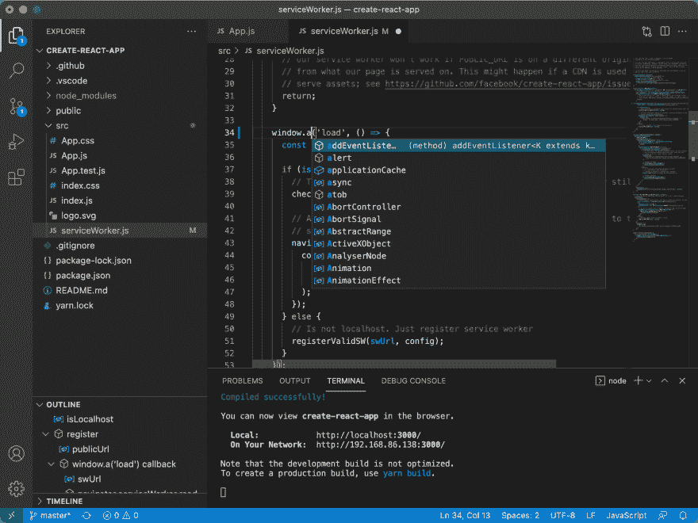

# 伟大的黑客啤酒节项目

> 原文:[https://dev . to/fultonbrowne/great-hacktoberfest-projects-NMP](https://dev.to/fultonbrowne/great-hacktoberfest-projects-nmp)

首先我的项目(对不起不对不起😉)

## [](#ara)Ara

Ara 是用 java 和 Kotlin 编写的开源语音助手。android 客户端:

##  [富尔顿布朗](https://github.com/FultonBrowne) / [阿拉-安卓](https://github.com/FultonBrowne/Ara-android)

### 几乎所有安卓手机的虚拟助手。

<article class="markdown-body entry-content container-lg" itemprop="text">

# 欢迎来到 Ara for Android <g-emoji class="g-emoji" alias="wave" fallback-src="https://github.githubassets.cimg/icons/emoji/unicode/1f44b.png">👋</g-emoji>

By Andromeda Software

一个几乎适用于任何安卓手机的人工智能助手应用，它关心隐私和工作效率 [](https://play.google.com/store/apps/details?id=com.andromeda.ara&pcampaignid=pcampaignidMKT-Other-global-all-co-prtnr-py-PartBadge-Mar2515-1) [ ](https://github.com/FultonBrowne/Ara-androidfastlane/metadata/android/en-img/1.png)

[](https://circleci.com/gh/FultonBrowne/Ara-android/tree/master)[](https://snyk.io/test/github/FultonBrowne/Ara-android%7D)[](https://www.codacy.com/app/FultonBrowne/Ara-android?utm_source=github.com&utm_medium=referral&utm_content=FultonBrowne/Ara-android&utm_campaign=Badge_Grade?style=flat-square)[](https://gitter.im/Arabyandromeda/community?utm_source=badge&utm_medium=badge&utm_campaign=pr-badge)[](https://en.cryptobadges.io/donate/0xe7D960Ee16d6fCddeB66B0AFBBfa051f61ef0e6C)[](http://makeapullrequest.com)[](https://www.buymeacoffee.com/28EcqNL)

## 使用

*   在 android studio 中打开，使用正常步骤运行

###### 或者

*   `./gradlew test`运行单元测试
*   `./gradlew install`安装应用程序

## 作者

<g-emoji class="g-emoji" alias="bust_in_silhouette" fallback-src="https://github.githubassets.cimg/icons/emoji/unicode/1f464.png">👤</g-emoji>T2【富尔顿】布朗

*   Github: [@FultonBrowne](https://github.com/FultonBrowne)

## <g-emoji class="g-emoji" alias="handshake" fallback-src="https://github.githubassets.cimg/icons/emoji/unicode/1f91d.png">🤝</g-emoji>贡献

欢迎投稿、问题和功能请求！
请随时查看[问题页面](https://github.com/andromeda-software/Ara-android/issues)。如果您参与，请提交一个新的分支，并在您的拉取请求中而不是提交中解释详细信息。

如果你想成为一名积极的贡献者，请点击这里。

[T2】](https://gitpod.io/#https://github.com/fultonbrowne/ara-android)

## 表示你的支持

如果这个项目对你有帮助，给一个⭐️奖吧！

## <g-emoji class="g-emoji" alias="memo" fallback-src="https://github.githubassets.cimg/icons/emoji/unicode/1f4dd.png">📝</g-emoji>许可证

版权所有 2020 [富尔顿布朗](https://github.com/fultonbrowne)。
该项目获得 [GPL-3.0](https://www.gnu.org/licenses/gpl-3.0.en.html) 许可。

* * *

*本自述由[自述-MD-生成器](https://github.com/kefranabg/readme-md-generator)* 用 <g-emoji class="g-emoji" alias="heart" fallback-src="https://github.githubassets.cimg/icons/emoji/unicode/2764.png">❤️</g-emoji> 生成

</article>

[View on GitHub](https://github.com/FultonBrowne/Ara-android)

服务器:

##  [富尔顿布朗](https://github.com/FultonBrowne) / [阿拉-服务器](https://github.com/FultonBrowne/Ara-Server)

### Ara 的服务器。

<article class="markdown-body entry-content container-lg" itemprop="text">

# 欢迎来到阿拉的服务器<g-emoji class="g-emoji" alias="wave" fallback-src="https://github.githubassets.cimg/icons/emoji/unicode/1f44b.png">👋</g-emoji>

By Andromeda Software

为 ara 语音助手提供反馈、人工智能搜索和技能的服务器

[T2】](https://github.com/FultonBrowne/Ara-Serverdocs/scrs1.png)

[](https://snyk.io/test/github/FultonBrowne/Ara-Server%7D)[](https://www.codacy.com/app/FultonBrowne/Ara-Server?utm_source=github.com&utm_medium=referral&utm_content=FultonBrowne/Ara-Server&utm_campaign=Badge_Grade)[](https://en.cryptobadges.io/donate/0xe7D960Ee16d6fCddeB66B0AFBBfa051f61ef0e6C)[](https://circleci.com/gh/FultonBrowne/Ara-Server)[](https://www.buymeacoffee.com/28EcqNL)

## 正在运行(未完成)

按件制造

生成测试以运行测试(注意，您可能需要将 nlp 位置导出到生成文件之外)

## 作者

<g-emoji class="g-emoji" alias="bust_in_silhouette" fallback-src="https://github.githubassets.cimg/icons/emoji/unicode/1f464.png">👤</g-emoji>T2【富尔顿】布朗

*   Github: [@FultonBrowne](https://github.com/FultonBrowne)

## <g-emoji class="g-emoji" alias="handshake" fallback-src="https://github.githubassets.cimg/icons/emoji/unicode/1f91d.png">🤝</g-emoji>贡献

欢迎投稿、问题和功能请求！
请随时查看[问题页面](https://github.com/andromeda-software/Ara-server/issues)。如果您参与，请提交一个新的分支，并在您的拉取请求中而不是提交中解释详细信息。

[T2】](https://gitpod.io/#https://github.com/fultonbrowne/ara-server)

如果你想成为一名积极的贡献者，请点击这里。

## 表示你的支持

如果这个项目对你有帮助，给一个⭐️奖吧！

## <g-emoji class="g-emoji" alias="memo" fallback-src="https://github.githubassets.cimg/icons/emoji/unicode/1f4dd.png">📝</g-emoji>许可证

版权 2019 [富尔顿布朗](https://github.com/fultonbrowne)。
该项目获得 [GPL-3.0](https://www.gnu.org/licenses/gpl-3.0.en.html) 许可。

* * *

*本自述由[自述-MD-生成器](https://github.com/kefranabg/readme-md-generator)* 用 <g-emoji class="g-emoji" alias="heart" fallback-src="https://github.githubassets.cimg/icons/emoji/unicode/2764.png">❤️</g-emoji> 生成

</article>

[View on GitHub](https://github.com/FultonBrowne/Ara-Server)

note I will make the READMEs better before October

One thing this really needs is an IOS client if anyone wants to help, please tell me.

## [](#devto)开发到

这个平台是我用过的最好的开发者社交媒体，可以在这里找到:

##  [ forem ](https://github.com/forem) / [ forem](https://github.com/forem/forem)

### 为社区赋权🌱

<article class="markdown-body entry-content container-lg" itemprop="text">

# Forem <g-emoji class="g-emoji" alias="seedling" fallback-src="https://github.githubassets.cimg/icons/emoji/unicode/1f331.png">🌱</g-emoji>

**For Empowering Community**

[](https://travis-ci.com/forem/forem)[](https://camo.githubusercontent.com/64b9f7c7c5f41ec22113b61235256435cd61779a0554b0595b88b6011f94c60b/68747470733a2f2f696d672e736869656c64732e696f2f6769746875622f636f6d6d69742d61637469766974792f772f666f72656d2f666f72656d)[](https://github.com/forem/forem/issues?q=is%3Aissue+is%3Aopen+label%3A%22ready+for+dev%22)[T11】](https://gitpod.io/from-referrer/)

欢迎来到 [Forem](https://forem.com) 代码库，这个平台为[开发到](https://dev.to)提供动力。我们很高兴你能来。在你们的帮助下，我们可以增强 Forem 的可用性、可伸缩性和稳定性，从而更好地为我们的社区服务。

## 什么是 Forem？

Forem 是用于构建社区的开源软件。为你的同行、客户、粉丝、家人、朋友以及任何其他需要聚集在一起成为集体一员的时间和空间的社区[参见我们的公告帖子](https://dev.to/devteam/for-empowering-community-2k6h)以获得 Forem 是什么的高级概述。

[dev.to](https://dev.to) (或者只是 dev)由 Forem 托管。这是一个软件开发人员的社区，他们撰写文章，参与讨论，并建立自己的专业档案。我们重视支持性和建设性的对话，为所有成员追求伟大的准则和职业发展。该生态系统涵盖从初学者到高级开发人员，欢迎所有人找到自己的位置…

</article>

[View on GitHub](https://github.com/forem/forem)

## [](#deckdeckgo)DeckDeckgo

前几天在 dev 上发现了这个，我建议你去看看。

##  [德克戈](https://github.com/deckgo) / [德克德克戈](https://github.com/deckgo/deckdeckgo)

### 用于演示的 web 开源编辑器

<article class="markdown-body entry-content container-lg" itemprop="text">[](https://deckdeckgo.com)

用于演示的开源 web 编辑器

使用我们的[在线编辑器](https://deckdeckgo.com)或开发工具包<g-emoji class="g-emoji" alias="fire" fallback-src="https://github.githubassets.cimg/icons/emoji/unicode/1f525.png">制作幻灯片🔥</g-emoji>。

通过[遥控器](https://deckdeckgo.app) <g-emoji class="g-emoji" alias="iphone" fallback-src="https://github.githubassets.cimg/icons/emoji/unicode/1f4f1.png">与你的卡牌互动📱</g-emoji>。

[](https://camo.githubusercontent.com/e488863d12a5c5eae0bb204256c823336eb0496bd1a2459fc3b7c6f9ec9b5ef8/68747470733a2f2f696d672e736869656c64732e696f2f776562736974653f6c6162656c3d456469746f722675726c3d68747470732533412532462532466465636b6465636b676f2e636f6d)[](https://camo.githubusercontent.com/e74d9dbb389436d044f3af42b9dc5e0c92d20aa27bc71dba85eb3d7be39f730a/68747470733a2f2f696d672e736869656c64732e696f2f776562736974653f6c6162656c3d52656d6f747265253230636f6e74726f6c2675726c3d68747470732533412532462532466465636b6465636b676f2e617070)[](https://github.com/deckgo/deckdeckgo/releases/latest)[](https://join.slack.com/t/deckdeckgo/shared_invite/enQtNzM0NjMwOTc3NTI0LTBlNmFhODNhYmRkMWUxZmU4ZTQ2MDJiNjlmYWZiODNjMDU5OGRjYThlZmZjMTc5YmQ3MzUzMDlhMzk0ZDgzMDY)[](https://twitter.com/intent/tweet?url=https%3A%2F%2Fdeckdeckgo.com&text=DeckDeckGo%20-%20The%20web%20open%20source%20editor%20for%20presentations%20%F0%9F%9A%80%20%40deckdeckgo)

* * *

## 目录

*   [入门](https://github.com/deckgo/deckdeckgo#getting-started)
*   [特性](https://github.com/deckgo/deckdeckgo#features)
*   [文档](https://github.com/deckgo/deckdeckgo#documentation)
*   [投稿](https://github.com/deckgo/deckdeckgo#contributing)
*   [社区](https://github.com/deckgo/deckdeckgo#community)
*   [支持](https://github.com/deckgo/deckdeckgo#supporting)
*   [应用程序](https://github.com/deckgo/deckdeckgo#applications)
*   [网页组件](https://github.com/deckgo/deckdeckgo#web-components)
*   [模板](https://github.com/deckgo/deckdeckgo#templates)
*   [基础设施](https://github.com/deckgo/deckdeckgo#infrastructure)
*   [供应商](https://github.com/deckgo/deckdeckgo#providers)
*   [Utils](https://github.com/deckgo/deckdeckgo#utils)
*   [其他](https://github.com/deckgo/deckdeckgo#others)

## 入门指南

使用我们的<g-emoji class="g-emoji" alias="point_right" fallback-src="https://github.githubassets.cimg/icons/emoji/unicode/1f449.png">开始您的新演示👉</g-emoji> [在线编辑](https://deckdeckgo.com) <g-emoji class="g-emoji" alias="point_left" fallback-src="https://github.githubassets.cimg/icons/emoji/unicode/1f448.png">👈</g-emoji>或通过遵循快速[入门指南](https://docs.deckdeckgo.com/docs)使用我们的开发套件。

## 特征

我们不断开发新的功能，并且总是乐于听到很酷的想法。

*   以渐进式网络应用程序的形式创建、展示和分享您的幻灯片
*   通过实时投票与您的观众互动
*   使用预定义的丰富和响应模板
*   搜索 Unsplash 和 Tenor GIFs
*   轻松集成 YouTube 视频
*   展示您最好的开发人员代码片段
*   使用遥控器与您的演示文稿互动
*   离线演示和工作
*   将在线幻灯片的源代码推送到 GitHub
*   导入…

</article>

[View on GitHub](https://github.com/deckgo/deckdeckgo)

## [](#postwoman)女邮递员

我每天都会用到的一个很棒的工具，可以在这里找到:

## 跳绳 / [跳绳](https://github.com/hoppscotch/hoppscotch)

### 👽开源 API 开发生态系统- https://hoppscotch.io

<article class="markdown-body entry-content container-lg" itemprop="text">[](https://hoppscotch.io) 

### **跳绳**

**开源 API 开发生态系统**

[](https://github.com/hoppscotch/hoppscotchCODE_OF_CONDUCT.md)[](https://hoppscotch.io)[](https://github.com/hoppscotch/hoppscotch/actions)[T11】](https://twitter.com/share?text=%F0%9F%91%BD%20Hoppscotch%20%E2%80%A2%20Open%20source%20API%20development%20ecosystem%20-%20Helps%20you%20create%20requests%20faster,%20saving%20precious%20time%20on%20development.&url=https://hoppscotch.io&hashtags=hoppscotch&via=hoppscotch_io)

 <sub>由
 [贡献者](https://github.com/hoppscotch/hoppscotch/graphs/contributors)</sub> 
用❤︎建成

 [](https://hoppscotch.io/#gh-light-mode-only) 
 [](https://hoppscotch.io/#gh-dark-mode-only) 

#### **支持**

[](https://hoppscotch.io/discord)[](https://hoppscotch.io/telegram)[](https://github.com/hoppscotch/hoppscotch/discussions)

### **特性**

<g-emoji class="g-emoji" alias="heart" fallback-src="https://github.githubassets.cimg/icons/emoji/unicode/2764.png">❤️</g-emoji> **轻量级:**极简 UI 设计。

<g-emoji class="g-emoji" alias="zap" fallback-src="https://github.githubassets.cimg/icons/emoji/unicode/26a1.png">⚡️</g-emoji> **快速:**实时发送请求并获取/复制响应。

**HTTP 方法**

*   `GET` -请求检索资源信息
*   `POST` -服务器在数据库中创建新条目
*   `PUT` -更新现有资源
*   `PATCH` -与`PUT`非常相似，但是对资源进行了部分更新
*   `DELETE` -删除资源或相关组件
*   `HEAD` -检索与 GET 请求相同的响应头，但没有响应体。
*   `CONNECT` -建立到由目标资源识别的服务器的隧道
*   `OPTIONS` -描述目标资源的通信选项
*   `TRACE` -沿着到目标资源的路径执行消息环回测试
*   `<custom>`——有些 API 使用定制的请求方法，比如`LIST`。键入您的自定义方法。

<g-emoji class="g-emoji" alias="rainbow" fallback-src="https://github.githubassets.cimg/icons/emoji/unicode/1f308.png">🌈</g-emoji> **把它变成你的:** …

</article>

[View on GitHub](https://github.com/hoppscotch/hoppscotch)

## [](#nano-httpd)纳米 httpd

我在服务器工作中使用的一个小 sdk

## [NanoHttpd](https://github.com/NanoHttpd)/[NanoHttpd](https://github.com/NanoHttpd/nanohttpd)

### 小型的，易于嵌入 Java 的 HTTP 服务器。

<article class="markdown-body entry-content container-lg" itemprop="text">

## NanoHTTPD——Java 中的微型 web 服务器

NanoHTTPD 是一个轻量级的 HTTP 服务器，设计用于嵌入到其他应用程序中，在修改的 BSD 许可下发布。

它正在 Github 上开发，使用 Apache Maven 进行构建和单元测试:

*   建造状态: [](https://travis-ci.org/NanoHttpd/nanohttpd)
*   覆盖状态: [](https://coveralls.io/r/NanoHttpd/nanohttpd)
*   当前中央发布版本: [](https://maven-badges.herokuapp.com/maven-central/org.nanohttpd/nanohttpd)

## 快速启动

我们将使用 Maven 为 build/dep 系统创建一个定制的 HTTP 服务器项目。本教程假设您正在使用一个 Unix 变种和一个 shell。首先，安装 Maven 和 Java SDK(如果还没有安装的话)。然后运行:

```
mvn compile
mvn exec:java -pl webserver -Dexec.mainClass="org.nanohttpd.webserver.SimpleWebServer" 
```

现在应该有一个 HTTP 文件服务器运行在 [http://localhost:8080/](http://localhost:8080/) 上。

### 自定义 web 应用程序

接下来让我们提高标准，构建一个定制的 web 应用程序:

```
mvn archetype:generate -DgroupId=com.example -DartifactId=myHellopApp -DinteractiveMode=false
cd myHellopApp 
```

编辑`pom.xml`，并将此添加到<的依赖关系>之间:

```
<dependency>
    <groupId>org.nanohttpd</groupId> <!-- <groupId>com.nanohttpd</groupId> for 2.1.0 and earlier -->
    <artifactId>nanohttpd</artifactId>
    <version>2.2.0</version>
</dependency> 
```

编辑`src/main/java/com/example/App.java`并替换…

</article>

[View on GitHub](https://github.com/NanoHttpd/nanohttpd)

## [](#haxe)Haxe

这是一个我喜欢玩的很棒的小程序语言。

##  [哈克斯基金会](https://github.com/HaxeFoundation) / [哈克斯](https://github.com/HaxeFoundation/haxe)

### haxe——跨平台工具包

<article class="markdown-body entry-content container-lg" itemprop="text">

[T2】](https://haxe.org/ "haxe.org")

[](https://github.com/HaxeFoundation/haxe/actions)[](https://saucelabs.com/u/haxe)[](https://gitter.im/HaxeFoundation/haxe?utm_source=badge&utm_medium=badge&utm_campaign=pr-badge)[T11】](https://discordapp.com/invite/0uEuWH3spjck73Lo)

Haxe 是一个开源工具包，允许您轻松构建跨平台的工具和应用程序，这些工具和应用程序面向许多主流平台。Haxe 工具包包括:

*   Haxe 编程语言，一种现代的、高级的、严格类型的编程语言
*   Haxe 交叉编译器，一个最先进的、针对许多目标的闪电般速度的编译器
*   Haxe 标准库，一个完整的、跨平台的通用功能库

Haxe 允许您针对以下目标进行编译:

*   Java Script 语言
*   C++
*   C#
*   Java 语言(一种计算机语言，尤用于创建网站)
*   虚拟机（Java Virtual Machine 的缩写）
*   左上臂
*   PHP 7
*   python3
*   [HashLink](https://hashlink.haxe.org/)
*   [NekoVM](https://nekovm.org/)
*   Flash (SWF 字节码)
*   和它自己的[解释器](https://haxe.org/blog/eval/)

你可以在[try.haxe.org](https://try.haxe.org)直接从你的浏览器尝试 hax！

想了解更多关于 haaxe 的信息，请访问 haaxe 官方网站。

## 许可证

Haxe 项目有几个许可证，覆盖了项目的不同部分。

*   Haxe 编译器是在 GNU 通用公共许可证版本 2 或任何更高版本下发布的。
*   Haxe 标准库是在 MIT 许可下发布的。
*   …

</article>

[View on GitHub](https://github.com/HaxeFoundation/haxe)

## [](#vs-code)VS 代码

我们都用它，让我们帮助 MS。

##  [微软](https://github.com/microsoft) / [ vscode](https://github.com/microsoft/vscode)

### Visual Studio 代码

<article class="markdown-body entry-content container-lg" itemprop="text">

# Visual Studio 代码-开源(“代码- OSS”)

[](https://github.com/microsoft/vscode/issues?q=is%3Aopen+is%3Aissue+label%3Afeature-request+sort%3Areactions-%2B1-desc)[](https://github.com/microsoft/vscode/issues?utf8=%E2%9C%93&q=is%3Aissue+is%3Aopen+label%3Abug)[](https://gitter.im/Microsoft/vscode)

## 仓库

这个库(“`Code - OSS`”)是我们(微软)与社区一起开发 [Visual Studio 代码](https://code.visualstudio.com)产品的地方。我们不仅在这里处理代码和问题，我们还发布我们的[路线图](https://github.com/microsoft/vscode/wiki/Roadmap)、[月度迭代计划](https://github.com/microsoft/vscode/wiki/Iteration-Plans)，以及我们的[收尾计划](https://github.com/microsoft/vscode/wiki/Running-the-Endgame)。在标准的[麻省理工学院许可](https://github.com/microsoft/vscode/blob/main/LICENSE.txt)下，每个人都可以获得这个源代码。

## Visual Studio 代码

[T2】](https://user-images.githubusercontent.com/35271042/118224532-3842c400-b438-11eb-923d-a5f66fa6785a.png)

[Visual Studio 代码](https://code.visualstudio.com)是在传统的[微软产品许可](https://code.visualstudio.com/License/)下发布的带有微软特定定制的`Code - OSS`库的发行版。

Visual Studio 代码结合了代码编辑器的简单性和开发人员核心的编辑-构建-调试周期的需要。它提供了全面的代码编辑、导航和理解支持，以及轻量级调试、丰富的可扩展性模型和与现有工具的轻量级集成。

Visual Studio 代码每月更新一次，包含新功能和错误修复…

</article>

[View on GitHub](https://github.com/microsoft/vscode)

如果你想添加你的项目或建议其他人在评论中告诉我，将会有第二部分。