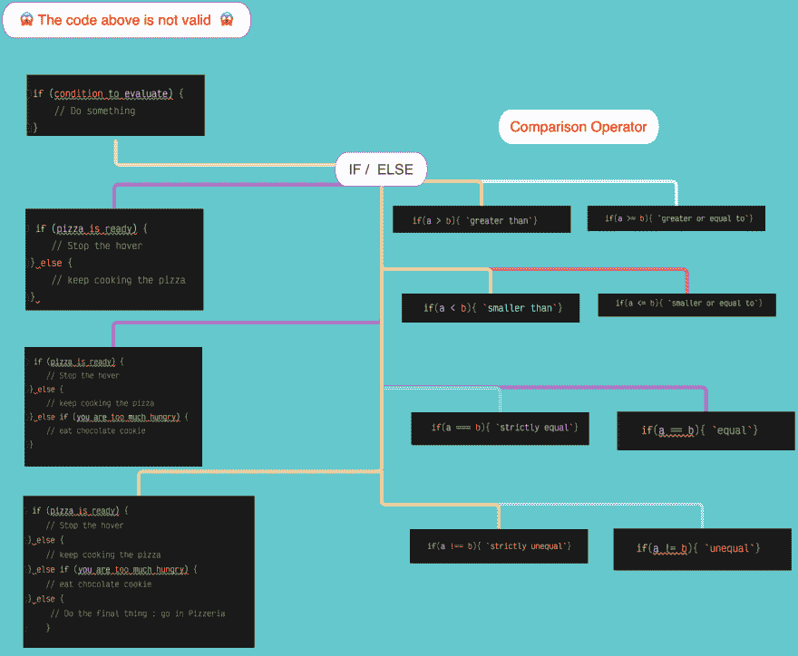

# IF / ELSE

> 原文:[https://dev.to/giandodev/if-else-3jg6](https://dev.to/giandodev/if-else-3jg6)

## if / else 语句

[T2】](https://res.cloudinary.com/practicaldev/image/fetch/s--NDYANe3r--/c_limit%2Cf_auto%2Cfl_progressive%2Cq_auto%2Cw_880/https://thepracticaldev.s3.amazonaws.com/i/tgdo8jh2tcz9o6a9u0cp.png)