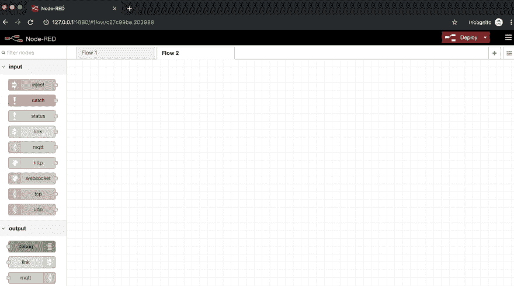
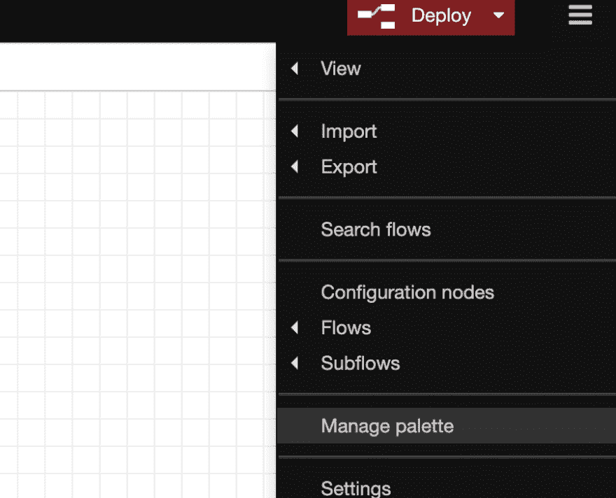
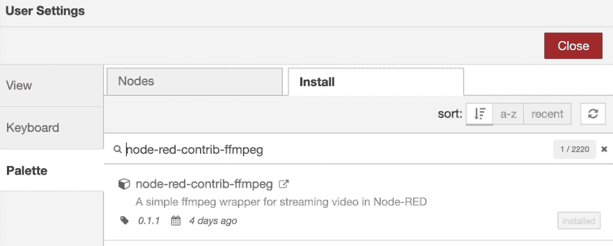
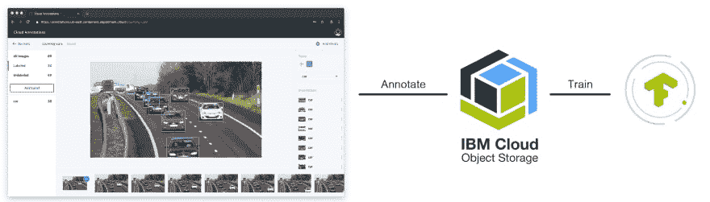

# 用泰洛无人机探测物体

> 原文：<https://dev.to/poojamakes/detecting-objects-with-a-tello-drone-38np>

你曾经想要使用无人机的实时视频流来检测物体吗？如果是这样，现在有了这个教程你就可以了！

液体错误:内部

# **我们开始吧**

在本教程中，我们将使用[节点红色](https://nodered.org/about/)。由 IBM 设计和建造的 **Node-RED** 是一个免费的开源逻辑引擎，允许任何级别的程序员互连物联网、基于云的系统、web 服务、数据库、API 等！

### **第一步:**从本地安装 Node-RED 开始

你可以查看关于如何在你的本地计算机上安装 Node-RED 的教程，或者按照下面的命令:

`sudo npm install -g --unsafe-perm node-red`

这应该会安装 Node-RED，安装后运行以下命令:

`node-red`

这应该会将您指向一个红色节点 URL `http://127.0.0.1:1880/`,您可以将它放入浏览器中查看红色节点编辑器

*注意:在后面的步骤中，我们将调整安装 Node-RED* 时出现的 settings.js 文件

*浏览器中的红色节点编辑器*

### **第二步:**在本地电脑上安装 [FFMpeg](https://ffmpeg.org/)

**[FFMpeg](https://www.hongkiat.com/blog/ffmpeg-guide/)** 是一个非常强大的命令行工具，用于对音频和视频文件执行各种转换操作。这个工具将是视频流的面包和黄油！它可以免费使用，适用于 Windows、Linux 和 Mac 操作系统

如果你有一台苹果电脑，最好的安装方式是使用自制软件。

运行:`brew install ffmpeg`将 FFmpeg 本地安装到您的计算机上。

这对于查看从本地计算机流入的数据流至关重要！

### **第三步:**在 Node-RED 中安装 [FFMpeg 节点](https://github.com/bourdakos1/node-red-contrib-ffmpeg)

有两种方法可以安装此节点

1.  在安装 node-RED(来自步骤 1)的同一个目录中执行`npm install node-red-contrib-ffmpeg`

2.  打开红色节点浏览器，在管理托盘中找到`node-red-contrib-ffmpeg`

*打开右手边的汉堡菜单>管理调色板*

*点击 install，你应该会在你的面板中看到 ffmpeg 节点*

### **第四步:**训练一个模型

按照[本教程](https://github.com/cloud-annotations/training/)训练一个物体检测模型。

一旦你完成了这个教程，你应该会得到一个`model_web`文件夹。

### **第五步:**将`model_web`复制到 Node-RED 中并调整设置

一旦您有了一个包含您训练过的对象模型的`model_web`目录，您将需要把它复制到您安装 Node-RED 的目录中

然后，我们将调整 node-RED director 中的 settings.js 文件

打开`settings.js`，搜索并取消注释以下

`httpAdminRoot: '/editor',
httpStatic: '<path to model web directory >',`

我将`httpAdminRoot`的端点设置为编辑器，所以现在当你运行`node-red`命令来查看你的节点红色编辑器时，你将转到这个 url `http://127.0.0.1:1880/editor`

`httpStatic`将包括您的 model_web 文件夹的位置

### **第六步:**配置你的[泰洛无人机](https://www.ryzerobotics.com/tello)

在您使用您的泰洛无人机之前，您必须在泰洛无人机官方应用程序中激活它。一旦你的无人机被激活，你就可以连接到它的 WiFi 网络 TELLO-XXXXXX，并通过 UDP 向它发送命令

### **第七步:**导入流程到节点-红色

在本地启动 Node-RED 并导入以下流: