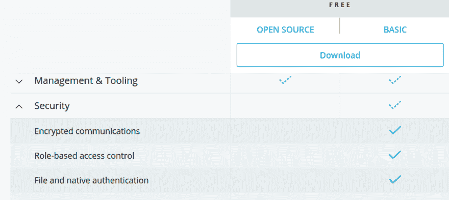
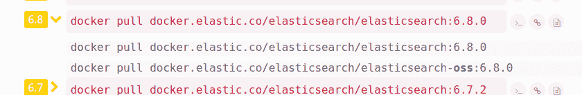
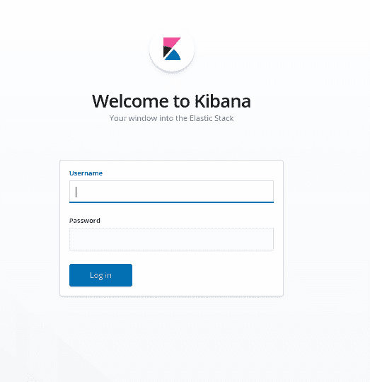
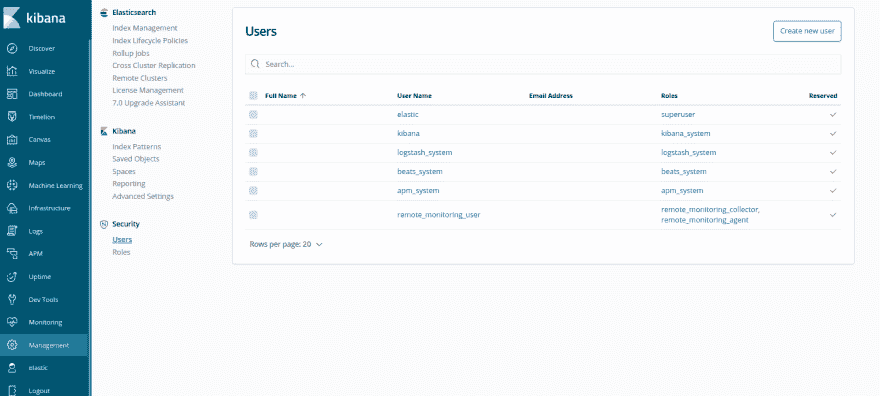

# 在启用 X-Pack 安全性的情况下在 Docker 上设置 Elasticsearch 和 Kibana

> 原文:[https://dev . to/mande EPM 91/setting-up-elastic search-and-kibana-on-docker-with-x-pack-security-enabled-48dm](https://dev.to/mandeepm91/setting-up-elasticsearch-and-kibana-on-docker-with-x-pack-security-enabled-48dm)

本教程假设你熟悉 Elasticsearch 和 Kibana，并对 Docker 有所了解。在深入本文的目标之前，我想简单介绍一下 X-Pack，并回顾一下 Elasticsearch 版本 6.8 中的一些最新变化，这些变化允许我们通过基本许可免费使用 X-Pack 的安全特性。

## [](#xpack-security-and-elasticsearch-68)X-Pack 安全性和弹性搜索 6.8

X-Pack 是一组扩展了 Elastic Stack 的功能，即 Elasticsearch、Kibana、Logstash 和 Beats。这包括安全、监控、机器学习、报告等功能。在本文中，我们主要关注 X-Pack 的安全特性。

X-Pack security 使保护您的 Elasticsearch 群集变得非常容易且高度可定制。它允许您为您的 Elasticsearch 集群设置身份验证，创建具有不同凭证和不同访问级别的不同用户。它还允许您创建不同的角色，并将相似的用户分配给相同的角色。例如，如果您希望授予某些用户对您的群集的某些索引的只读访问权限，但希望确保他们无法写入这些索引，那么您可以使用 X-pack security 轻松实现这一点。而这只是冰山一角。你可以点击查看[安全 API，更详细地了解你可以用它做什么。](https://www.elastic.co/guide/en/elasticsearch/reference/current/security-api.html)

但是所有这些功能并不总是免费的。在 6.8 版之前，安全性不是基本许可证的一部分。我会很快解释这是什么意思。弹性堆栈有 4 种不同类型的许可证，您可以在这里看到

*   开放源码
*   基础
*   金色的
*   铂

黄金和白金是付费许可，而开源和基本是免费的。如果您访问上面提到的链接，您可以看到在哪个许可证下所有的功能都可用。如果您在该页面上看到安全性下拉菜单，您可以看到一些安全性功能作为基本许可证的一部分提供。在撰写本文时，基本许可证提供了以下安全特性:

[T2】](https://res.cloudinary.com/practicaldev/image/fetch/s--qLonY02V--/c_limit%2Cf_auto%2Cfl_progressive%2Cq_auto%2Cw_880/http://codingfundas.com/conteimg/2019/06/Screenshot-from-2019-06-09-12-00-52.png)

现在这个列表反映了 Elastic Stack 的最新版本，在撰写本文时是 7.1 版。**从版本 6.8 开始，安全性在基本许可证下可用**。这一点很重要，因为这意味着如果你想免费使用 Elasticsearch 设置中的安全功能，你需要 6.8 以上的版本。

这就是我们将在这篇文章中使用的。

## [](#objective)目标

本文的目标是使用启用了安全特性的 Docker Compose 来设置 Elasticsearch 和 Kibana。我们将在 Elasticsearch 上设置基本身份验证，以便所有 API 调用都需要包含不记名令牌。此外，Kibana UI 将需要用户名和密码来登录。对于我们的设置，我们将使用 Docker Compose，这使得我们的整个设置非常容易在任何地方部署和扩展。在本教程中，我将使用 Ubuntu 18.04，但是这些步骤在任何其他基于 unix 的系统上都或多或少是相同的，在基于 Windows 的系统上也不会有太大的不同。我们将在本文中编写的唯一一段代码是一个`docker-compose.yml`文件。我们将从一个最小的`docker-compose.yml`文件开始设置和运行 elasticsearch 和 kibana，然后我们将逐步调整它以启用安全特性。

## [](#pre-requisites)先决条件

*   基于 Linux 操作系统
*   Docker 和 Docker Compose 已安装
*   对 Docker 和 Docker Compose 的基本理解
*   弹性研究和基巴纳知识
*   使用 Linux 命令行的经验

如果您使用的是其他操作系统，您可以按照特定于该操作系统的说明进行操作，但过程大致相同。

### [](#step-1-create-a-basic-dockercomposeyml-file-for-elasticsearch-and-kibana)步骤 1 -为 Elasticsearch 和 Kibana 创建一个基本的 docker-compose.yml 文件

在这一步中，我们将使用两个服务`elasticsearch`和`kibana`创建我们的`docker-compose.yml`文件，并将它们各自的端口映射到主机操作系统

让我们首先为我们的项目创建一个目录。打开您的终端，键入以下内容

```
$ cd
$ mkdir elasticsearch-kibana-setup
$ cd elasticsearch-kibana-setup
$ touch docker-compose.yml 
```

<svg width="20px" height="20px" viewBox="0 0 24 24" class="highlight-action crayons-icon highlight-action--fullscreen-on"><title>Enter fullscreen mode</title></svg> <svg width="20px" height="20px" viewBox="0 0 24 24" class="highlight-action crayons-icon highlight-action--fullscreen-off"><title>Exit fullscreen mode</title></svg>

然后打开新创建的`docker-compose.yml`文件，并在其中粘贴以下几行:

```
version: '3'
services:
  elasticsearch:
    image: docker.elastic.co/elasticsearch/elasticsearch:6.8.0
    ports:
      - 9200:9200

  kibana:
    depends_on:
      - elasticsearch  
    image: docker.elastic.co/kibana/kibana:6.8.0
    ports:
      - 5601:5601 
```

<svg width="20px" height="20px" viewBox="0 0 24 24" class="highlight-action crayons-icon highlight-action--fullscreen-on"><title>Enter fullscreen mode</title></svg> <svg width="20px" height="20px" viewBox="0 0 24 24" class="highlight-action crayons-icon highlight-action--fullscreen-off"><title>Exit fullscreen mode</title></svg>

弹性堆栈的官方 docker 图片可以在[这里](https://www.docker.elastic.co/#)找到

正如本文开头所讨论的，我们将使用 6.8 版本进行设置。如果你访问上面的链接，点击 Elasticsearch image 6.8 展开，你会看到两张图片:

```
docker pull docker.elastic.co/elasticsearch/elasticsearch:6.8.0   
docker pull docker.elastic.co/elasticsearch/elasticsearch-oss:6.8.0 
```

<svg width="20px" height="20px" viewBox="0 0 24 24" class="highlight-action crayons-icon highlight-action--fullscreen-on"><title>Enter fullscreen mode</title></svg> <svg width="20px" height="20px" viewBox="0 0 24 24" class="highlight-action crayons-icon highlight-action--fullscreen-off"><title>Exit fullscreen mode</title></svg>

[T2】](https://res.cloudinary.com/practicaldev/image/fetch/s--oQF54FOK--/c_limit%2Cf_auto%2Cfl_progressive%2Cq_auto%2Cw_880/http://codingfundas.com/conteimg/2019/06/Screenshot-from-2019-06-09-15-29-52.png)

你可以看到其中一个有`oss`标签，而另一个没有。这两个图像的区别在于许可证。oss 带有开源许可，而非 oss 带有基本许可。由于 x-pack 安全特性仅在基本许可下可用，我们将使用非 oss 版本。请注意，正如文章开头所解释的，这也是免费的。

除了指定映像，我们还将容器的端口映射到主机上的端口。Elasticsearch 在端口 9200 上运行，Kibana 在端口 5601 上运行，因此我们将这两个端口都映射到主机上相应的端口。您也可以将它们映射到其他端口。语法保持不变:

```
<Host Port>:<Container Port> 
```

<svg width="20px" height="20px" viewBox="0 0 24 24" class="highlight-action crayons-icon highlight-action--fullscreen-on"><title>Enter fullscreen mode</title></svg> <svg width="20px" height="20px" viewBox="0 0 24 24" class="highlight-action crayons-icon highlight-action--fullscreen-off"><title>Exit fullscreen mode</title></svg>

因此，举例来说，如果您想在主机的端口 8080 上访问 elasticsearch，您需要将配置指定为:

```
8080:9200 
```

<svg width="20px" height="20px" viewBox="0 0 24 24" class="highlight-action crayons-icon highlight-action--fullscreen-on"><title>Enter fullscreen mode</title></svg> <svg width="20px" height="20px" viewBox="0 0 24 24" class="highlight-action crayons-icon highlight-action--fullscreen-off"><title>Exit fullscreen mode</title></svg>

目前，在本文中，我们将把它映射到 9200。另外，`kibana`服务中的`depends_on`设置确保在`elasticsearch`服务启动并运行之前不会启动。因此，让我们通过运行下面的命令来尝试使用上面的设置启动我们的设置:

```
$ docker-compose up 
```

<svg width="20px" height="20px" viewBox="0 0 24 24" class="highlight-action crayons-icon highlight-action--fullscreen-on"><title>Enter fullscreen mode</title></svg> <svg width="20px" height="20px" viewBox="0 0 24 24" class="highlight-action crayons-icon highlight-action--fullscreen-off"><title>Exit fullscreen mode</title></svg>

这将开始从 docker 注册表中提取图像并创建容器。这可能需要一段时间，取决于你的机器上是否已经有图像，也取决于你的网速。提取图像后，您将开始看到容器日志，这将需要几秒钟的时间。一旦 Elasticsearch 和 Kibana 都准备好了，您将在您的控制台中看到类似这样的内容:

```
elasticsearch_1  | [2019-06-09T10:14:21,167][INFO ][o.e.c.r.a.AllocationService] [pKPbPLz] Cluster health status changed from [YELLOW] to [GREEN] (reason: [shards started [[.kibana_1][0]] ...]).
kibana_1         | {"type":"log","@timestamp":"2019-06-09T10:14:21Z","tags":["info","migrations"],"pid":1,"message":"Pointing alias .kibana to .kibana_1."}
kibana_1         | {"type":"log","@timestamp":"2019-06-09T10:14:21Z","tags":["info","migrations"],"pid":1,"message":"Finished in 175ms."}
kibana_1         | {"type":"log","@timestamp":"2019-06-09T10:14:21Z","tags":["listening","info"],"pid":1,"message":"Server running at http://0:5601"}
elasticsearch_1  | [2019-06-09T10:14:21,282][INFO ][o.e.c.m.MetaDataIndexTemplateService] [pKPbPLz] adding template [kibana_index_template:.kibana] for index patterns [.kibana]
elasticsearch_1  | [2019-06-09T10:14:21,326][INFO ][o.e.c.m.MetaDataIndexTemplateService] [pKPbPLz] adding template [kibana_index_template:.kibana] for index patterns [.kibana]
elasticsearch_1  | [2019-06-09T10:14:21,343][INFO ][o.e.c.m.MetaDataIndexTemplateService] [pKPbPLz] adding template [kibana_index_template:.kibana] for index patterns [.kibana]
kibana_1         | {"type":"log","@timestamp":"2019-06-09T10:14:22Z","tags":["status","plugin:spaces@6.8.0","info"],"pid":1,"state":"green","message":"Status changed from yellow to green - Ready","prevState":"yellow","prevMsg":"Waiting for Elasticsearch"} 
```

<svg width="20px" height="20px" viewBox="0 0 24 24" class="highlight-action crayons-icon highlight-action--fullscreen-on"><title>Enter fullscreen mode</title></svg> <svg width="20px" height="20px" viewBox="0 0 24 24" class="highlight-action crayons-icon highlight-action--fullscreen-off"><title>Exit fullscreen mode</title></svg>

查找显示状态已更改为`green`的行。这意味着我们的设置已经就绪。如果您没有看到这样的行，也没有看到任何错误消息，这意味着出现了问题。您需要调试问题并解决它。

一旦服务启动并运行，打开你的浏览器并打开网址 [http://localhost:9200/](http://localhost:9200/) ，你会看到类似这样的内容:

```
{
  "name" : "pKPbPLz",
  "cluster_name" : "docker-cluster",
  "cluster_uuid" : "AjqbFZ0qRF-X0_TQZqWIZA",
  "version" : {
    "number" : "6.8.0",
    "build_flavor" : "default",
    "build_type" : "docker",
    "build_hash" : "65b6179",
    "build_date" : "2019-05-15T20:06:13.172855Z",
    "build_snapshot" : false,
    "lucene_version" : "7.7.0",
    "minimum_wire_compatibility_version" : "5.6.0",
    "minimum_index_compatibility_version" : "5.0.0"
  },
  "tagline" : "You Know, for Search"
} 
```

<svg width="20px" height="20px" viewBox="0 0 24 24" class="highlight-action crayons-icon highlight-action--fullscreen-on"><title>Enter fullscreen mode</title></svg> <svg width="20px" height="20px" viewBox="0 0 24 24" class="highlight-action crayons-icon highlight-action--fullscreen-off"><title>Exit fullscreen mode</title></svg>

这就是 elasticsearch。此外，如果您导航到 [http://localhost:5601/](http://localhost:5601/) ，您应该会看到基巴纳控制台。因此，在您的`docker-compose.yml`文件中只有 13 行代码，您就建立了一个 Elasticsearch 和 Kibana 的单节点集群。

现在，尽管这是可行的，但如果您想将其部署到生产环境中，则存在安全挑战。如果您的服务器不是 VPC(虚拟私有云)的一部分，并且端口 9200 和 5601 对全世界开放，那么任何人都可以访问您的 Elasticsearch 和 Kibana 服务。没有授权，所以任何人都可以直接或通过 Kibana UI 使用 Elasticsearch API 对您的集群进行任何更改。如果我们希望保持这些端口的可访问性，但需要某种认证，以便只有那些拥有正确凭证的人才能访问我们的 Elasticsearch 实例或登录到 Kibana UI，该怎么办？此外，如果我们希望确保某些用户只拥有有限的特权集，该怎么办呢？例如，我们希望某些用户能够搜索我们的 Elasticsearch 集群中的任何索引，但不能创建任何新的索引或删除任何索引或更改任何映射或写入索引。或者说，你不希望你的 Elasticsearch 实例被世界上的其他人直接访问，但希望保持 Kibana UI 的可访问性和身份验证，你希望 Kibana UI 的不同用户有不同的访问级别。所有这些都可以通过 X-Pack security 实现，这也是我们接下来要探索的。

回到运行`docker-compose up`命令的终端窗口，按下`CTRL+C`停止容器并拆除设置。

### [](#step-2-customize-elasticsearch-and-kibana-services-with-environment-variables)步骤 2 -使用环境变量定制 Elasticsearch 和 Kibana 服务

为了启用 X-Pack 安全性，我们需要定制我们的 elasticsearch 和 kibana 服务。Elasticsearch 设置可通过`elasticsearch.yml`文件定制，Kibana 设置可通过`kibana.yml`文件定制。使用 docker 时，有许多方法可以改变这一点。我们可以通过我们的`docker-compose.yml`文件传递环境变量。虽然这通常是一种理想的方式，但是传递 Elasticsearch 和 Kibana env 变量的方式并不相同，在某些部署环境中可能会导致问题。你可以在这里阅读更多信息[。在本教程中，我们将创建定制的`elasticsearch.yml`和`kibana.yml`文件，并将它们绑定到各自的容器中，覆盖这些容器中的默认文件。](https://github.com/elastic/elasticsearch-docker/issues/135#issuecomment-346227008)

这将在接下来的步骤中变得更加清楚。首先，在与我们的`docker-compose.yml`文件:
相同的目录下创建两个文件`elasticsearch.yml`和`kibana.yml`

```
$ touch elasticsearch.yml
$ touch kibana.yml 
```

<svg width="20px" height="20px" viewBox="0 0 24 24" class="highlight-action crayons-icon highlight-action--fullscreen-on"><title>Enter fullscreen mode</title></svg> <svg width="20px" height="20px" viewBox="0 0 24 24" class="highlight-action crayons-icon highlight-action--fullscreen-off"><title>Exit fullscreen mode</title></svg>

然后打开`elasticsearch.yml`并在其中粘贴以下几行:

```
cluster.name: my-elasticsearch-cluster
network.host: 0.0.0.0
xpack.security.enabled: true 
```

<svg width="20px" height="20px" viewBox="0 0 24 24" class="highlight-action crayons-icon highlight-action--fullscreen-on"><title>Enter fullscreen mode</title></svg> <svg width="20px" height="20px" viewBox="0 0 24 24" class="highlight-action crayons-icon highlight-action--fullscreen-off"><title>Exit fullscreen mode</title></svg>

在这里，我们将集群的名称设置为`my-elasticsearch-cluster`。设置`network.host: 0.0.0.0`意味着如果主机有多个网络接口，那么主机上的所有 IP 地址都可以访问 elasticsearch。最后一项设置是启用 X-Pack 安全性。这确保了任何试图访问我们的 Elasticsearch 实例的人都必须提供认证令牌。

现在打开`kibana.yml`文件，将下面几行粘贴到其中:

```
server.name: kibana
server.host: "0"
elasticsearch.hosts: [ "http://elasticsearch:9200" ] 
```

<svg width="20px" height="20px" viewBox="0 0 24 24" class="highlight-action crayons-icon highlight-action--fullscreen-on"><title>Enter fullscreen mode</title></svg> <svg width="20px" height="20px" viewBox="0 0 24 24" class="highlight-action crayons-icon highlight-action--fullscreen-off"><title>Exit fullscreen mode</title></svg>

我们在这里设置服务器名称。`server.host: "0"`意味着如果主机有不止一个网络接口，那么主机上的所有 IP 地址都可以访问 Kibana 实例。最后一个设置`elasticsearch.hosts`包括 Elasticsearch 节点的地址列表。Kibana 实例可以通过使用地址`http://elasticsearch:9200`来访问 Elasticsearch 实例。这是由 Docker Compose 实现的。如果您的合成文件中有多个服务，则属于一个服务的容器可以通过使用其他服务的名称来访问其他服务的容器。为此，您甚至不需要公开端口。因此，在我们的`docker-compose.yml`文件中，即使我们没有为 Elasticsearch 映射端口，我们的 Kibana 实例仍然能够访问位于`http://elasticsearch:9200`的 Elasticsearch 实例。然而，在这种情况下，我们将无法从我们的主机连接到我们的 Elasticsearch 实例。我不会深入探讨 Docker 中网络如何工作的细节，因为这超出了本文的范围。但是我肯定会建议你查阅官方文件，以便更好地理解。

好了，现在我们已经准备好了配置文件，我们需要将它们绑定挂载到我们的`docker-compose.yml`文件中它们各自的容器。所以打开`docker-compose.yml`文件，把它改成这样:

```
version: '3'
services:
  elasticsearch:
    image: docker.elastic.co/elasticsearch/elasticsearch:6.8.0
    ports:
      - 9200:9200
    volumes:
      - ./elasticsearch.yml:/usr/share/elasticsearch/config/elasticsearch.yml

  kibana:
    depends_on:
      - elasticsearch  
    image: docker.elastic.co/kibana/kibana:6.8.0
    ports:
      - 5601:5601
    volumes:
      - ./kibana.yml:/usr/share/kibana/config/kibana.yml 
```

<svg width="20px" height="20px" viewBox="0 0 24 24" class="highlight-action crayons-icon highlight-action--fullscreen-on"><title>Enter fullscreen mode</title></svg> <svg width="20px" height="20px" viewBox="0 0 24 24" class="highlight-action crayons-icon highlight-action--fullscreen-off"><title>Exit fullscreen mode</title></svg>

我们在这里所做的唯一更改是添加了`volumes`部分。通过使用`volumes`,我们可以将主机上的一个目录或单个文件映射到容器上的一个目录或文件。这里我们只映射单个文件。Elasticsearch 容器中配置文件的默认位置是`/usr/share/elasticsearch/config/elasticsearch.yml`，我们用之前创建的`elasticsearch.yml`文件替换它。类似地，我们用新创建的文件替换默认的`/usr/share/kibana/config/kibana.yml`的`kibana.yml`文件。做了这些更改后，让我们通过运行命令:
再次尝试启动 docker 编写设置

```
$ docker-compose up 
```

<svg width="20px" height="20px" viewBox="0 0 24 24" class="highlight-action crayons-icon highlight-action--fullscreen-on"><title>Enter fullscreen mode</title></svg> <svg width="20px" height="20px" viewBox="0 0 24 24" class="highlight-action crayons-icon highlight-action--fullscreen-off"><title>Exit fullscreen mode</title></svg>

这很可能会给你一个错误。如果您看到 elasticsearch 日志(以`elasticsearch_1 |`开头的行)，您可能会看到如下错误:

```
elasticsearch_1  | [1]: Transport SSL must be enabled if security is enabled on a [basic] license. Please set [xpack.security.transport.ssl.enabled] to [true] or disable security by setting [xpack.security.enabled] to [false] 
```

<svg width="20px" height="20px" viewBox="0 0 24 24" class="highlight-action crayons-icon highlight-action--fullscreen-on"><title>Enter fullscreen mode</title></svg> <svg width="20px" height="20px" viewBox="0 0 24 24" class="highlight-action crayons-icon highlight-action--fullscreen-off"><title>Exit fullscreen mode</title></svg>

这意味着 Elasticsearch 不会启动，因为初始检查已经失败。因此，Kibana 将无法连接到它，您将在 Kibana 日志中看到类似这样的内容:

```
kibana_1         | {"type":"log","@timestamp":"2019-06-11T17:31:14Z","tags":["warning","elasticsearch","admin"],"pid":1,"message":"No living connections"} 
```

<svg width="20px" height="20px" viewBox="0 0 24 24" class="highlight-action crayons-icon highlight-action--fullscreen-on"><title>Enter fullscreen mode</title></svg> <svg width="20px" height="20px" viewBox="0 0 24 24" class="highlight-action crayons-icon highlight-action--fullscreen-off"><title>Exit fullscreen mode</title></svg>

按`Ctrl+C`停止容器并拆除设置，因为这不起作用，我们必须修复它。

为了让 elasticsearch 正常工作，我们需要启用 SSL，并在我们的 elasticsearch 容器中安装 SSL 证书。我将逐步完成创建新证书并使用它的过程。如果您已经有一个证书文件，您可以跳过这一部分。为此，我们需要后退一步，在我们的 elasticsearch 实例上禁用 x-pack 安全性，以便我们可以启动并运行它，然后我们将进入我们的容器外壳并生成证书。

### [](#step-3-create-ssl-certificate-for-elasticsearch-and-enable-ssl)步骤 3 -为 Elasticsearch 创建 SSL 证书并启用 SSL

首先，我们需要暂时禁用 x-pack 安全性，以便我们可以启动并运行我们的 Elasticsearch 容器。因此，打开`elasticsearch.yml`文件，通过修改下面一行来禁用 x-pack 安全性:

```
xpack.security.enabled: false 
```

<svg width="20px" height="20px" viewBox="0 0 24 24" class="highlight-action crayons-icon highlight-action--fullscreen-on"><title>Enter fullscreen mode</title></svg> <svg width="20px" height="20px" viewBox="0 0 24 24" class="highlight-action crayons-icon highlight-action--fullscreen-off"><title>Exit fullscreen mode</title></svg>

然后通过运行:
再次打开容器

```
$ docker-compose up 
```

<svg width="20px" height="20px" viewBox="0 0 24 24" class="highlight-action crayons-icon highlight-action--fullscreen-on"><title>Enter fullscreen mode</title></svg> <svg width="20px" height="20px" viewBox="0 0 24 24" class="highlight-action crayons-icon highlight-action--fullscreen-off"><title>Exit fullscreen mode</title></svg>

现在应该可以正常工作了，并像以前一样调出我们的 Elasticearch 和 Kibana 服务。现在，我们需要生成证书，我们将使用`elasticsearch-certutil`实用程序。为此，我们需要进入运行 elasticsearch 服务的 docker 容器。使用`docker-compose`真的很简单。可以这样想，我们可以使用命令:
来执行 docker 容器中的任何命令

```
$ docker-compose exec <service name> <command> 
```

<svg width="20px" height="20px" viewBox="0 0 24 24" class="highlight-action crayons-icon highlight-action--fullscreen-on"><title>Enter fullscreen mode</title></svg> <svg width="20px" height="20px" viewBox="0 0 24 24" class="highlight-action crayons-icon highlight-action--fullscreen-off"><title>Exit fullscreen mode</title></svg>

如果我们想进入容器的外壳，我们基本上想在我们的容器上执行`bash`命令。所以，我们的命令变成:

```
$ docker-compose exec elasticsearch bash 
```

<svg width="20px" height="20px" viewBox="0 0 24 24" class="highlight-action crayons-icon highlight-action--fullscreen-on"><title>Enter fullscreen mode</title></svg> <svg width="20px" height="20px" viewBox="0 0 24 24" class="highlight-action crayons-icon highlight-action--fullscreen-off"><title>Exit fullscreen mode</title></svg>

这里`elasticsearch`是我们的服务，`bash`是我们的命令。我们需要在容器运行时这样做，所以打开另一个终端窗口，粘贴上面的命令(确保从你的`docker-compose.yml`文件所在的同一个目录运行这个命令)

一旦您进入容器，您的 shell 提示符应该看起来像这样:

```
[root@c9f915e86309 elasticsearch]# 
```

<svg width="20px" height="20px" viewBox="0 0 24 24" class="highlight-action crayons-icon highlight-action--fullscreen-on"><title>Enter fullscreen mode</title></svg> <svg width="20px" height="20px" viewBox="0 0 24 24" class="highlight-action crayons-icon highlight-action--fullscreen-off"><title>Exit fullscreen mode</title></svg>

现在在这里运行下面的命令:

```
[root@c9f915e86309 elasticsearch]# bin/elasticsearch-certutil ca 
```

<svg width="20px" height="20px" viewBox="0 0 24 24" class="highlight-action crayons-icon highlight-action--fullscreen-on"><title>Enter fullscreen mode</title></svg> <svg width="20px" height="20px" viewBox="0 0 24 24" class="highlight-action crayons-icon highlight-action--fullscreen-off"><title>Exit fullscreen mode</title></svg>

这将生成一些警告，描述它将要做什么。我建议你读一下。它会提示您输入文件名和密码。只需按下`ENTER`即可继续:

```
Please enter the desired output file [elastic-stack-ca.p12]: 
Enter password for elastic-stack-ca.p12 : 
```

<svg width="20px" height="20px" viewBox="0 0 24 24" class="highlight-action crayons-icon highlight-action--fullscreen-on"><title>Enter fullscreen mode</title></svg> <svg width="20px" height="20px" viewBox="0 0 24 24" class="highlight-action crayons-icon highlight-action--fullscreen-off"><title>Exit fullscreen mode</title></svg>

这将在您运行上述命令的目录中创建一个文件`elastic-stack-ca.p12`。您可以通过运行`ls`命令进行检查。这是我们将用来创建证书的证书颁发机构。现在，运行命令:

```
[root@c9f915e86309 elasticsearch]# bin/elasticsearch-certutil cert --ca elastic-stack-ca.p12 
```

<svg width="20px" height="20px" viewBox="0 0 24 24" class="highlight-action crayons-icon highlight-action--fullscreen-on"><title>Enter fullscreen mode</title></svg> <svg width="20px" height="20px" viewBox="0 0 24 24" class="highlight-action crayons-icon highlight-action--fullscreen-off"><title>Exit fullscreen mode</title></svg>

这将再次引发一些警告，并描述它将要做什么。我建议你也读一下。它会提示您输入密码和文件名。在所有步骤中按下`ENTER`继续:

```
Enter password for CA (elastic-stack-ca.p12) : 
Please enter the desired output file [elastic-certificates.p12]: 
Enter password for elastic-certificates.p12 : 
```

<svg width="20px" height="20px" viewBox="0 0 24 24" class="highlight-action crayons-icon highlight-action--fullscreen-on"><title>Enter fullscreen mode</title></svg> <svg width="20px" height="20px" viewBox="0 0 24 24" class="highlight-action crayons-icon highlight-action--fullscreen-off"><title>Exit fullscreen mode</title></svg>

这将创建我们所需要的`elastic-certificates.p12`。我们需要这个文件在主机上的容器之外，因为一旦我们销毁了容器，它就会消失。该文件采用 PKCS12 格式，包括证书和私钥。为了将容器外的这个文件复制到主机上，先按下`CTRL+D`退出容器

然后在您的主机上运行以下命令(从`docker-compose.yml`文件所在的同一目录)

```
$ docker cp "$(docker-compose ps -q elasticsearch)":/usr/share/elasticsearch/elastic-certificates.p12 . 
```

<svg width="20px" height="20px" viewBox="0 0 24 24" class="highlight-action crayons-icon highlight-action--fullscreen-on"><title>Enter fullscreen mode</title></svg> <svg width="20px" height="20px" viewBox="0 0 24 24" class="highlight-action crayons-icon highlight-action--fullscreen-off"><title>Exit fullscreen mode</title></svg>

上面的命令对某些人来说可能有点复杂，所以我在这里补充一点解释。如果你知道它是如何工作的，你可以进行第四步。

让我们先看看`docker-compose ps`是做什么的。如果您运行该命令，您将看到如下输出:

```
 Name                                    Command               State                Ports              
----------------------------------------------------------------------------------------------------------------------------
elasticsearch-kibana-setup_elasticsearch_1   /usr/local/bin/docker-entr ...   Up      0.0.0.0:9200->9200/tcp, 9300/tcp
elasticsearch-kibana-setup_kibana_1          /usr/local/bin/kibana-docker     Up      0.0.0.0:5601->5601/tcp 
```

<svg width="20px" height="20px" viewBox="0 0 24 24" class="highlight-action crayons-icon highlight-action--fullscreen-on"><title>Enter fullscreen mode</title></svg> <svg width="20px" height="20px" viewBox="0 0 24 24" class="highlight-action crayons-icon highlight-action--fullscreen-off"><title>Exit fullscreen mode</title></svg>

这显示了由我们的`docker-compose.yml`文件管理的所有正在运行或停止的 docker 容器。

如果您查看该命令的帮助:

```
$ docker-compose ps --help 
```

<svg width="20px" height="20px" viewBox="0 0 24 24" class="highlight-action crayons-icon highlight-action--fullscreen-on"><title>Enter fullscreen mode</title></svg> <svg width="20px" height="20px" viewBox="0 0 24 24" class="highlight-action crayons-icon highlight-action--fullscreen-off"><title>Exit fullscreen mode</title></svg>

您将看到这样的输出:

```
List containers.

Usage: ps [options] [SERVICE...]

Options:
    -q, --quiet          Only display IDs
    --services           Display services
    --filter KEY=VAL     Filter services by a property 
```

<svg width="20px" height="20px" viewBox="0 0 24 24" class="highlight-action crayons-icon highlight-action--fullscreen-on"><title>Enter fullscreen mode</title></svg> <svg width="20px" height="20px" viewBox="0 0 24 24" class="highlight-action crayons-icon highlight-action--fullscreen-off"><title>Exit fullscreen mode</title></svg>

您可以看到，通过使用`-q`标志，我们可以获得容器的 id。您还可以看到，通过提供服务名，我们可以将输出限制为我们感兴趣的服务。因此，如果我们想获得 elasticsearch 容器的 id，我们需要运行命令:

```
$ docker-compose ps -q elasticsearch 
```

<svg width="20px" height="20px" viewBox="0 0 24 24" class="highlight-action crayons-icon highlight-action--fullscreen-on"><title>Enter fullscreen mode</title></svg> <svg width="20px" height="20px" viewBox="0 0 24 24" class="highlight-action crayons-icon highlight-action--fullscreen-off"><title>Exit fullscreen mode</title></svg>

这应该能让你得到 elasticsearch 容器的 id。

现在，如果我们回到上面的`docker cp`命令，您可以通过再次使用帮助来检查该命令的语法:

```
$ docker cp --help 
```

<svg width="20px" height="20px" viewBox="0 0 24 24" class="highlight-action crayons-icon highlight-action--fullscreen-on"><title>Enter fullscreen mode</title></svg> <svg width="20px" height="20px" viewBox="0 0 24 24" class="highlight-action crayons-icon highlight-action--fullscreen-off"><title>Exit fullscreen mode</title></svg>

这将显示帮助:

```
 Usage:  docker cp [OPTIONS] CONTAINER:SRC_PATH DEST_PATH|-
    docker cp [OPTIONS] SRC_PATH|- CONTAINER:DEST_PATH

Copy files/folders between a container and the local filesystem

Options:
  -a, --archive       Archive mode (copy all uid/gid information)
  -L, --follow-link   Always follow symbol link in SRC_PATH 
```

<svg width="20px" height="20px" viewBox="0 0 24 24" class="highlight-action crayons-icon highlight-action--fullscreen-on"><title>Enter fullscreen mode</title></svg> <svg width="20px" height="20px" viewBox="0 0 24 24" class="highlight-action crayons-icon highlight-action--fullscreen-off"><title>Exit fullscreen mode</title></svg>

你可以看到我们需要指定命令为:

```
docker cp <container id>:<src path> <dest path on host> 
```

<svg width="20px" height="20px" viewBox="0 0 24 24" class="highlight-action crayons-icon highlight-action--fullscreen-on"><title>Enter fullscreen mode</title></svg> <svg width="20px" height="20px" viewBox="0 0 24 24" class="highlight-action crayons-icon highlight-action--fullscreen-off"><title>Exit fullscreen mode</title></svg>

在这种情况下，我们的源路径是 elasticsearch 容器上的`/usr/share/elasticsearch/elastic-certificates.p12`。我们通过使用`docker-compose ps -q elasticsearch`命令来获取 elasticsearch 容器的 id。我们需要将文件复制到主机上的当前目录，因此我们的目标路径是`.`。因此，该命令变成:

```
$ docker cp "$(docker-compose ps -q elasticsearch)":/usr/share/elasticsearch/elastic-certificates.p12 . 
```

<svg width="20px" height="20px" viewBox="0 0 24 24" class="highlight-action crayons-icon highlight-action--fullscreen-on"><title>Enter fullscreen mode</title></svg> <svg width="20px" height="20px" viewBox="0 0 24 24" class="highlight-action crayons-icon highlight-action--fullscreen-off"><title>Exit fullscreen mode</title></svg>

我们还将通过运行命令来复制 CA 文件:

```
$ docker cp "$(docker-compose ps -q elasticsearch)":/usr/share/elasticsearch/elastic-stack-ca.p12 . 
```

<svg width="20px" height="20px" viewBox="0 0 24 24" class="highlight-action crayons-icon highlight-action--fullscreen-on"><title>Enter fullscreen mode</title></svg> <svg width="20px" height="20px" viewBox="0 0 24 24" class="highlight-action crayons-icon highlight-action--fullscreen-off"><title>Exit fullscreen mode</title></svg>

现在我们的主机上已经有了我们的证书文件，我们将把它绑定到我们的容器上，就像我们对`elasticsearch.yml`文件所做的那样。所以，如果你已经有一个 SSL 证书，你也可以用它来代替这个证书。

### [](#step-4-installing-the-ssl-certificate-on-elasticsearch-and-enabling-tls-in-config)步骤 4 -在 Elasticsearch 上安装 SSL 证书并在配置中启用 TLS

现在我们有了可用的 SSL 证书，我们可以在 elasticsearch 节点上启用 x-pack 安全性，还可以启用 TLS。首先，我们需要将证书从主机绑定到容器。首先，回到运行`docker-compose up`命令的终端，按`CTRL+C`停止容器。然后打开`docker-compose.yml`文件并修改它，使它看起来像这样:

```
version: '3'
services:
  elasticsearch:
    image: docker.elastic.co/elasticsearch/elasticsearch:6.8.0
    ports:
      - 9200:9200
    volumes:
      - ./elasticsearch.yml:/usr/share/elasticsearch/config/elasticsearch.yml
      - ./elastic-certificates.p12:/usr/share/elasticsearch/config/elastic-certificates.p12

  kibana:
    depends_on:
      - elasticsearch
    image: docker.elastic.co/kibana/kibana:6.8.0
    ports:
      - 5601:5601
    volumes:
      - ./kibana.yml:/usr/share/kibana/config/kibana.yml 
```

<svg width="20px" height="20px" viewBox="0 0 24 24" class="highlight-action crayons-icon highlight-action--fullscreen-on"><title>Enter fullscreen mode</title></svg> <svg width="20px" height="20px" viewBox="0 0 24 24" class="highlight-action crayons-icon highlight-action--fullscreen-off"><title>Exit fullscreen mode</title></svg>

现在，打开您的`elasticsearch.yml`文件，并将其更改为:

```
cluster.name: my-elasticsearch-cluster
network.host: 0.0.0.0
xpack.security.enabled: true
xpack.security.transport.ssl.enabled: true
xpack.security.transport.ssl.keystore.type: PKCS12
xpack.security.transport.ssl.verification_mode: certificate
xpack.security.transport.ssl.keystore.path: elastic-certificates.p12
xpack.security.transport.ssl.truststore.path: elastic-certificates.p12
xpack.security.transport.ssl.truststore.type: PKCS12 
```

<svg width="20px" height="20px" viewBox="0 0 24 24" class="highlight-action crayons-icon highlight-action--fullscreen-on"><title>Enter fullscreen mode</title></svg> <svg width="20px" height="20px" viewBox="0 0 24 24" class="highlight-action crayons-icon highlight-action--fullscreen-off"><title>Exit fullscreen mode</title></svg>

前 3 行与之前相同(我们再次将`xpack.security.enabled`改为`true`)。其余的行表示 SSL 设置以及我们的证书和私钥的位置，这是相同的。你可以在这里查看所有的[安全设置](https://www.elastic.co/guide/en/elasticsearch/reference/current/security-settings.html)。

完成后，返回终端，再次打开集装箱

```
$ docker-compose up 
```

<svg width="20px" height="20px" viewBox="0 0 24 24" class="highlight-action crayons-icon highlight-action--fullscreen-on"><title>Enter fullscreen mode</title></svg> <svg width="20px" height="20px" viewBox="0 0 24 24" class="highlight-action crayons-icon highlight-action--fullscreen-off"><title>Exit fullscreen mode</title></svg>

你看到了什么？还是不行吗？这是因为现在 Kibana 无法连接到我们的 Elasticsearch 实例，因为现在我们已经启用了安全性，但还没有在 Kibana 上配置凭证。所以，你会看到这样的连续日志:

```
kibana_1         | {"type":"log","@timestamp":"2019-06-11T19:03:35Z","tags":["warning","task_manager"],"pid":1,"message":"PollError [security_exception] missing authentication token for REST request [/_template/.kibana_task_manager?include_type_name=true&filter_path=*.version], with { header={ WWW-Authenticate=\"Basic realm=\\\"security\\\" charset=\\\"UTF-8\\\"\" } }"} 
```

<svg width="20px" height="20px" viewBox="0 0 24 24" class="highlight-action crayons-icon highlight-action--fullscreen-on"><title>Enter fullscreen mode</title></svg> <svg width="20px" height="20px" viewBox="0 0 24 24" class="highlight-action crayons-icon highlight-action--fullscreen-off"><title>Exit fullscreen mode</title></svg>

此外，如果你打开你的网络浏览器，进入 [http://localhost:9200](http://localhost:9200) ，你会看到一个用户名和密码的提示。如果你按下`ESC`，你会得到这个错误:

```
{
  "error": {
    "root_cause": [
      {
        "type": "security_exception",
        "reason": "missing authentication token for REST request [/]",
        "header": {
          "WWW-Authenticate": "Basic realm=\"security\" charset=\"UTF-8\""
        }
      }
    ],
    "type": "security_exception",
    "reason": "missing authentication token for REST request [/]",
    "header": {
      "WWW-Authenticate": "Basic realm=\"security\" charset=\"UTF-8\""
    }
  },
  "status": 401
} 
```

<svg width="20px" height="20px" viewBox="0 0 24 24" class="highlight-action crayons-icon highlight-action--fullscreen-on"><title>Enter fullscreen mode</title></svg> <svg width="20px" height="20px" viewBox="0 0 24 24" class="highlight-action crayons-icon highlight-action--fullscreen-off"><title>Exit fullscreen mode</title></svg>

如果你尝试访问 http://localhost:5601 ，你会得到错误:

```
Kibana server is not ready yet 
```

<svg width="20px" height="20px" viewBox="0 0 24 24" class="highlight-action crayons-icon highlight-action--fullscreen-on"><title>Enter fullscreen mode</title></svg> <svg width="20px" height="20px" viewBox="0 0 24 24" class="highlight-action crayons-icon highlight-action--fullscreen-off"><title>Exit fullscreen mode</title></svg>

所以，我们已经解决了问题的一部分。我们已经保护了我们的 Elasticsearch 实例，如果不提供正确的凭证，任何人都无法访问它。但是我们不知道正确的凭证是什么。我们将在下一步设置它们，并配置 Kibana 来使用它们。现在，保持`docker-compose up`命令运行，因为我们需要再次进入 Elasticsearch 容器

### [](#step-5-generate-default-passwords-and-configure-the-credentials-in-kibana)步骤 5 -生成默认密码，并在 Kibana 中配置凭证

在我们为 Elastic stack 的内置帐户生成密码之前，我们首先需要更改我们的`docker-compose.yml`文件来绑定安装 Elasticsearch 的数据量。到目前为止，我们集装箱的储存都是临时性的。这意味着一旦我们销毁了容器，里面的所有数据也会被销毁。因此，如果你在 Elasticsearch 中创建了任何指数、用户等，一旦你关闭服务，它们将不再存在。这不是我们在生产中想要的。我们希望确保数据更改在容器重启之间保持不变。为此，我们需要将 elasticsearch 容器中的数据目录绑定到主机上的一个目录。

首先，通过执行以下命令关闭所有正在运行的容器:

```
docker-compose down 
```

<svg width="20px" height="20px" viewBox="0 0 24 24" class="highlight-action crayons-icon highlight-action--fullscreen-on"><title>Enter fullscreen mode</title></svg> <svg width="20px" height="20px" viewBox="0 0 24 24" class="highlight-action crayons-icon highlight-action--fullscreen-off"><title>Exit fullscreen mode</title></svg>

然后在您的`docker-compose.yml`文件所在的目录中创建一个名为`docker-data-volumes`的目录。你可以给它取任何其他的名字，但是在本教程中，我们称它为`docker-data-volumes`。在该目录中，创建另一个名为`elasticsearch`
的目录

```
mkdir docker-data-volumes
mkdir docker-data-volumes/elasticsearch 
```

<svg width="20px" height="20px" viewBox="0 0 24 24" class="highlight-action crayons-icon highlight-action--fullscreen-on"><title>Enter fullscreen mode</title></svg> <svg width="20px" height="20px" viewBox="0 0 24 24" class="highlight-action crayons-icon highlight-action--fullscreen-off"><title>Exit fullscreen mode</title></svg>

现在，在您的`docker-compose.yml`文件中的`elasticsearch`服务的`volumes`部分下，添加下面一行:

```
 - ./docker-data-volumes/elasticsearch:/usr/share/elasticsearch/data 
```

<svg width="20px" height="20px" viewBox="0 0 24 24" class="highlight-action crayons-icon highlight-action--fullscreen-on"><title>Enter fullscreen mode</title></svg> <svg width="20px" height="20px" viewBox="0 0 24 24" class="highlight-action crayons-icon highlight-action--fullscreen-off"><title>Exit fullscreen mode</title></svg>

如前所述，当我们需要将文件或目录从主机绑定挂载到容器时，我们指定了`<host path>:<container path>`。elasticsearch 容器中数据的默认路径是`/usr/share/elasticsearch/data`,我们将它绑定到主机上的目录`./docker-data-volumes/elasticsearch`。所以您的`docker-compose.yml`文件现在应该看起来像这样:

```
version: '3'
services:
  elasticsearch:
    image: docker.elastic.co/elasticsearch/elasticsearch:6.8.0
    ports:
      - 9200:9200
    volumes:
      - ./elasticsearch.yml:/usr/share/elasticsearch/config/elasticsearch.yml
      - ./elastic-certificates.p12:/usr/share/elasticsearch/config/elastic-certificates.p12
      - ./docker-data-volumes/elasticsearch:/usr/share/elasticsearch/data

  kibana:
    depends_on:
      - elasticsearch
    image: docker.elastic.co/kibana/kibana:6.8.0
    ports:
      - 5601:5601
    volumes:
      - ./kibana.yml:/usr/share/kibana/config/kibana.yml 
```

<svg width="20px" height="20px" viewBox="0 0 24 24" class="highlight-action crayons-icon highlight-action--fullscreen-on"><title>Enter fullscreen mode</title></svg> <svg width="20px" height="20px" viewBox="0 0 24 24" class="highlight-action crayons-icon highlight-action--fullscreen-off"><title>Exit fullscreen mode</title></svg>

运行
调出容器

```
docker-compose up 
```

<svg width="20px" height="20px" viewBox="0 0 24 24" class="highlight-action crayons-icon highlight-action--fullscreen-on"><title>Enter fullscreen mode</title></svg> <svg width="20px" height="20px" viewBox="0 0 24 24" class="highlight-action crayons-icon highlight-action--fullscreen-off"><title>Exit fullscreen mode</title></svg>

当`docker-compose up`在一个终端中运行时，通过运行命令:
打开另一个终端进入 elasticsearch 容器

```
$ docker-compose exec elasticsearch bash 
```

<svg width="20px" height="20px" viewBox="0 0 24 24" class="highlight-action crayons-icon highlight-action--fullscreen-on"><title>Enter fullscreen mode</title></svg> <svg width="20px" height="20px" viewBox="0 0 24 24" class="highlight-action crayons-icon highlight-action--fullscreen-off"><title>Exit fullscreen mode</title></svg>

然后运行以下命令为所有内置用户生成密码:

```
[root@c9f915e86309 elasticsearch]# bin/elasticsearch-setup-passwords auto 
```

<svg width="20px" height="20px" viewBox="0 0 24 24" class="highlight-action crayons-icon highlight-action--fullscreen-on"><title>Enter fullscreen mode</title></svg> <svg width="20px" height="20px" viewBox="0 0 24 24" class="highlight-action crayons-icon highlight-action--fullscreen-off"><title>Exit fullscreen mode</title></svg>

把它们记下来，放在安全的地方。按下`CTRL+D`退出容器

现在打开`kibana.yml`文件，将其更改为:

```
server.name: kibana
server.host: "0"
elasticsearch.hosts: [ "http://elasticsearch:9200" ]
elasticsearch.username: kibana
elasticsearch.password: <kibana password> 
```

<svg width="20px" height="20px" viewBox="0 0 24 24" class="highlight-action crayons-icon highlight-action--fullscreen-on"><title>Enter fullscreen mode</title></svg> <svg width="20px" height="20px" viewBox="0 0 24 24" class="highlight-action crayons-icon highlight-action--fullscreen-off"><title>Exit fullscreen mode</title></svg>

您需要在`elasticsearch.password`设置中输入 kibana 用户的密码。

前往运行`docker-compose up`的终端，按下`CTRL+C`将容器放下。然后再次运行命令

```
$ docker-compose up 
```

<svg width="20px" height="20px" viewBox="0 0 24 24" class="highlight-action crayons-icon highlight-action--fullscreen-on"><title>Enter fullscreen mode</title></svg> <svg width="20px" height="20px" viewBox="0 0 24 24" class="highlight-action crayons-icon highlight-action--fullscreen-off"><title>Exit fullscreen mode</title></svg>

这应该会调出两个服务，elasticsearch 和 kibana。现在，如果你打开浏览器，访问 [http://localhost:9200](http://localhost:9200) ，它会再次提示你输入用户名和密码。在这里，输入用户名`elastic`并输入您之前获得的用户`elastic`的密码。您应该能够看到成功认证后的输出如下:

```
{
  "name" : "1mG1JlU",
  "cluster_name" : "my-elasticsearch-cluster",
  "cluster_uuid" : "-mEbLeYVRb-XqA24yq6D1w",
  "version" : {
    "number" : "6.8.0",
    "build_flavor" : "default",
    "build_type" : "docker",
    "build_hash" : "65b6179",
    "build_date" : "2019-05-15T20:06:13.172855Z",
    "build_snapshot" : false,
    "lucene_version" : "7.7.0",
    "minimum_wire_compatibility_version" : "5.6.0",
    "minimum_index_compatibility_version" : "5.0.0"
  },
  "tagline" : "You Know, for Search"
} 
```

<svg width="20px" height="20px" viewBox="0 0 24 24" class="highlight-action crayons-icon highlight-action--fullscreen-on"><title>Enter fullscreen mode</title></svg> <svg width="20px" height="20px" viewBox="0 0 24 24" class="highlight-action crayons-icon highlight-action--fullscreen-off"><title>Exit fullscreen mode</title></svg>

此外，如果您打开 [http://localhost:5601](http://localhost:5601) ，您将看到 Kibana 控制台，但现在它会要求输入用户名和密码:

[T2】](https://res.cloudinary.com/practicaldev/image/fetch/s--m6tqI8Sf--/c_limit%2Cf_auto%2Cfl_progressive%2Cq_auto%2Cw_880/http://codingfundas.com/conteimg/2019/06/Screenshot-from-2019-06-12-01-00-10.png)

这里也输入用户名`elastic`和密码。成功认证后，您将看到 Kibana 控制台。

如果到目前为止您正确地遵循了所有步骤，您现在应该能够登录到 Kibana 控制台。

现在，如果您点击侧边栏中的**管理**选项卡，您将在右侧面板上看到**安全**部分。

[T2】](https://res.cloudinary.com/practicaldev/image/fetch/s--7Xh0h64g--/c_limit%2Cf_auto%2Cfl_progressive%2Cq_auto%2Cw_880/http://codingfundas.com/conteimg/2019/07/Screenshot-from-2019-07-27-16-15-10.png)

您可以在这里看到用户、角色、创建新角色或创建新用户。在这里你可以做很多事情，我建议你玩一会儿，感受一下。

## [](#conclusion)结论

这就完成了我们的教程，以及使用 docker-compose 和启用了 X-Pack 安全性的基本许可(免费)的 Elasticsearch 和 Kibana 集群的设置。我希望它对你有所帮助，如果你有任何建议或发现任何错误，欢迎在下面评论。

快乐编码:-)