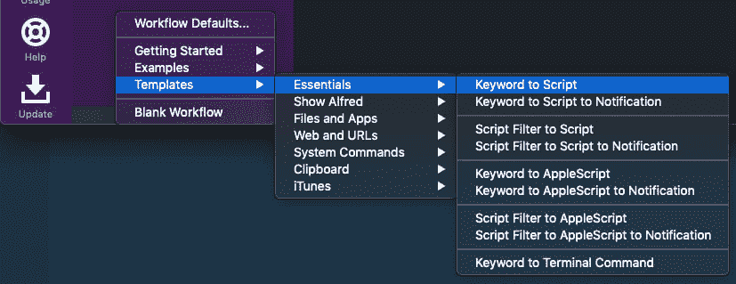
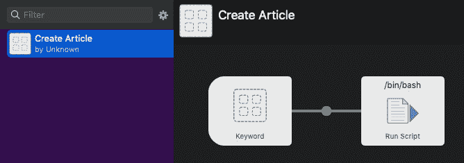
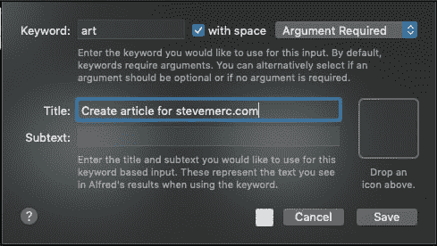
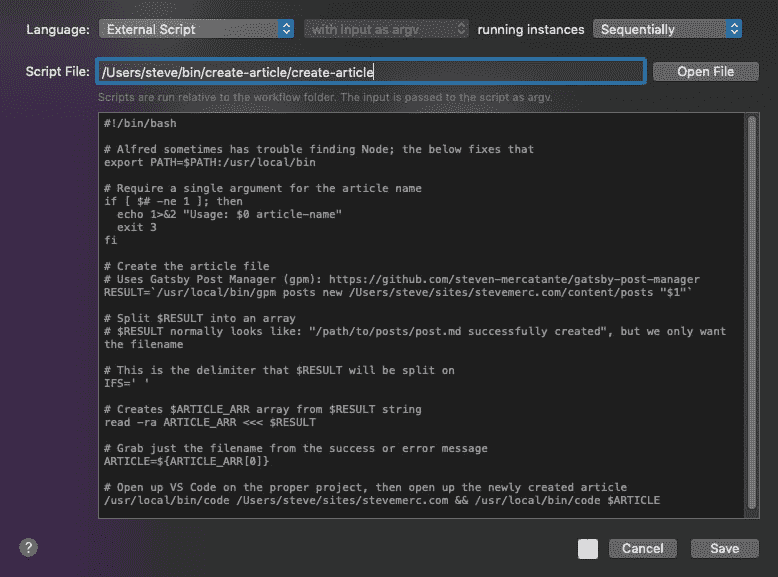
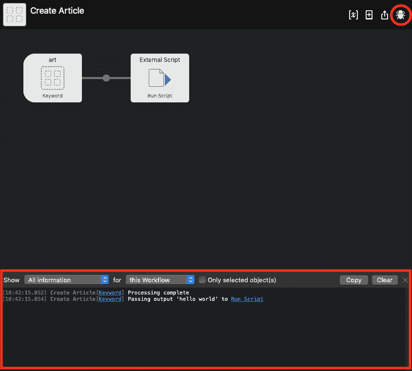

# 自动化盖茨比职位创建

> 原文:[https://dev . to/mercantte/automating-Gatsby-post-creation-1 bnd](https://dev.to/mercatante/automating-gatsby-post-creation-1bnd)

我是一个懒惰的程序员。我喜欢建筑材料，但我讨厌重复自己。每当我为我的网站写一篇新文章时，我会做以下事情:

*   在“终端”中导航到“我的网站”目录
*   开放 VS 代码
*   创建新文件
*   设置标题
*   设置废料浆
*   设定日期
*   将其发布标志设置为 false

这绝不意味着工作量很大，但是当我有了要写的东西的想法时，我想立刻开始写。所以，像任何有自尊的懒惰程序员一样，我整理了一个过程来尽可能地消除摩擦。老实说，我用这个例子来学习更多关于 [Alfred workflows](https://www.alfredapp.com/workflows/) 和 bash 脚本的知识。

## [](#so-whats-the-goal)那么，目标是什么呢？

我一直使用 Alfred，所以我认为这将是我的新流程的完美界面。我想简单地打开 Alfred
提示符，键入`art <some article title>`，让它执行上面列出的步骤。

[T2】](https://res.cloudinary.com/practicaldev/image/fetch/s--bccenurt--/c_limit%2Cf_auto%2Cfl_progressive%2Cq_auto%2Cw_880/https://thepracticaldev.s3.amazonaws.com/i/8k4fg2cqcmw2lbc5woqh.png)

## [](#the-implementation)实现

[Gatsby Post Manager](https://github.com/steven-mercatante/gatsby-post-manager) 有一个`posts new`命令，我可以用它来创建实际的文件。命令本身看起来是这样的:

```
$ gpm posts new path/to/posts "hello world" 
```

这个命令自动创建文件，并给它分配标题、slug 和日期，但是我仍然需要把文章的路径传递给它。这个路径对我来说永远不会改变，所以我不需要每次都输入它。

我首先想到的是创建一个 Alfred 工作流，将命令传递给终端。这是可行的，但是它有两个缺点:

*   每当我调用该命令时，Alfred 都会打开一个新的终端窗口
*   我仍然需要打开 VS 代码来实际编写文章，这意味着我需要将`gpm`的输出传输到`code`

更好的方法是编写一个 bash 脚本，调用`gpm`，然后打开 VS 代码。

## Bash 脚本

```
#!/bin/bash

# Alfred sometimes has trouble finding Node; the below fixes that
export PATH=$PATH:/usr/local/bin

# Require a single argument for the article name
if [ $# -ne 1 ]; then echo 1>&2 "Usage: $0 article-name"
  exit 3
fi

# Create the article file
# Uses Gatsby Post Manager (gpm): https://github.com/steven-mercatante/gatsby-post-manager
RESULT=`/usr/local/bin/gpm posts new /Users/steve/sites/stevemerc.com/content/posts "$1"`

# Split $RESULT into an array
# $RESULT normally looks like: "/path/to/posts/post.md successfully created", but we only want the filename

# This is the delimiter that $RESULT will be split on
IFS=' '

# Creates $ARTICLE_ARR array from $RESULT string
read -ra ARTICLE_ARR <<< $RESULT

# Grab just the filename from the success or error message
ARTICLE=${ARTICLE_ARR[0]}

# Open up VS Code on the proper project, then open up the newly created article
/usr/local/bin/code /Users/steve/sites/stevemerc.com && /usr/local/bin/code $ARTICLE 
```

这里有一个[到回购](https://github.com/steven-mercatante/create-article-script)的链接。

我已经尽了最大努力来记录这个脚本做了什么。如果你有任何问题，请发微博给我。

现在我们已经有了编排一切的脚本，我们需要把它连接到阿尔弗雷德。

## [](#creating-the-alfred-workflow)创建阿尔弗雷德工作流

我使用的是 Alfred v4，因此您的设置可能与我的略有不同。但是要点是:

*   打开阿尔弗雷德的偏好设置
*   导航至`Workflows`部分
*   点击底部附近的`+`按钮，选择`Templates > Essentials > Keyword to Script`

[T2】](https://res.cloudinary.com/practicaldev/image/fetch/s--k_dvKI3u--/c_limit%2Cf_auto%2Cfl_progressive%2Cq_auto%2Cw_880/https://thepracticaldev.s3.amazonaws.com/i/4agts11vw8m7wffvhfi9.png)

随意命名您的工作流程，然后点击`Create`按钮。就我而言，我称之为“创造文章”。这用于组织目的。

然后，您应该会看到新创建的工作流和两个节点:

[T2】](https://res.cloudinary.com/practicaldev/image/fetch/s--8QptvlDk--/c_limit%2Cf_auto%2Cfl_progressive%2Cq_auto%2Cw_880/https://thepracticaldev.s3.amazonaws.com/i/0hdqrrohwwiua72wgm8t.png)

双击`Keyword`节点，会提示您定义命令名和标题。

[T2】](https://res.cloudinary.com/practicaldev/image/fetch/s--GVffwYc8--/c_limit%2Cf_auto%2Cfl_progressive%2Cq_auto%2Cw_880/https://thepracticaldev.s3.amazonaws.com/i/gsujb4el3ejiwd9su78t.png)

接下来，双击`Run Script`节点，系统会提示您要么在这里编写 bash 脚本，要么选择`External Script` ( < -这样做)。

[T2】](https://res.cloudinary.com/practicaldev/image/fetch/s--HD55vVxB--/c_limit%2Cf_auto%2Cfl_progressive%2Cq_auto%2Cw_880/https://thepracticaldev.s3.amazonaws.com/i/c14sbai1l3ot6qr59m99.png)

一旦在`Script File:`输入中输入一个现有 bash 脚本的路径，它的内容就会出现在下面。

现在一切都应该设置好了，您可以在 Alfred 提示符下键入`art hello world`来创建您的新文章。

这是新创建的`hello-world.md`文件的内容:

```
---
title: Hello World
slug: 'hello-world'
tags: []
published: false
date: '2019-09-24'
---
Add your content here 
```

## [](#debugging)调试

我很难让 bash 脚本和 Alfred 一起工作。与路径有关...谁知道呢。幸运的是，阿尔弗雷德让我们调试我们的工作流程。

[T2】](https://res.cloudinary.com/practicaldev/image/fetch/s--5iysjRUc--/c_limit%2Cf_auto%2Cfl_progressive%2Cq_auto%2Cw_880/https://thepracticaldev.s3.amazonaws.com/i/ettczhexmx74t82jalbt.png)

单击这个小 bug 图标后，它会打开一个控制台窗口，打印出 Alfred 执行的步骤，以及 bash 脚本的任何输出或错误。如果没有调试器，让这个过程正常工作肯定会花费更长的时间。

## [](#wrapping-up)包装完毕

我不期望很多人想解决我刚刚解决的同样的问题，*但是*，知道如何连接命令行工具、bash 脚本和 Alfred 来编排常见和重复的任务是一项有价值的技能。

👋喜欢这篇文章吗？

加入我的[时事通讯](https://stevemerc.com/newsletter/?r=dev)并在 Twitter[@ mercantate](https://twitter.com/mercatante)上关注我以获得更多类似的内容。