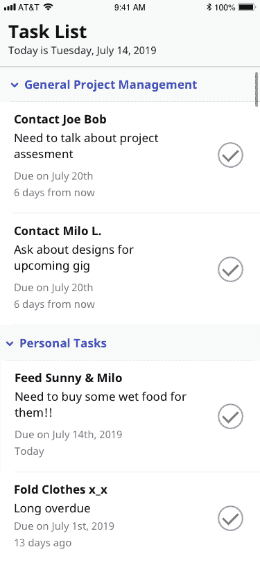
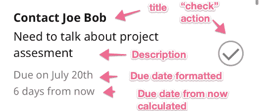

# 使用 FlatList 或 SectionList 时的最佳实践

> 原文：<https://dev.to/m4rcoperuano/react-native-best-practices-when-using-flatlist-or-sectionlist-4j41>

在使用 React Native [SectionList](https://facebook.github.io/react-native/docs/sectionlist) 或 [FlatList](https://facebook.github.io/react-native/docs/flatlist) 时，您遇到过性能问题吗？我知道我做到了。我花了很多时间，有一次几乎花了整整一周才弄明白为什么我的列表视图性能如此之差(说真的，我以为我会失去它，再也不用 React Native 了)。所以让我帮你解决一些头疼的问题(或者帮助你解决现有的头疼问题😊)通过提供一些关于如何以一种高性能的方式使用 SectionLists 和 FlatLists 的技巧！

(本文假设您已经有了一些 React Native 的经验)。

## 章节列表示例

[](https://res.cloudinary.com/practicaldev/image/fetch/s--2aSbQcXe--/c_limit%2Cf_auto%2Cfl_progressive%2Cq_auto%2Cw_880/https://thepracticaldev.s3.amazonaws.com/i/bpfrrwuna192gjre5aub.png)

上面是一个简单的应用程序示例，用户在其中管理他们的任务。标题代表每个任务的“类别”，行代表用户必须在什么日期之前完成的“任务”，复选标记是一个将任务标记为“完成”的按钮——很简单！

从前端的角度来看，这些将是我要设计的组件:

*   **分类标题**

    *   包含标题及其左侧的箭头图标。
*   **任务行**

    *   包含任务的标题、详细信息和用户可以与之交互的复选按钮。
*   **TaskWidget**

    *   包含设置任务数据格式的逻辑。

这也使用 React Native 的 SectionList 组件来呈现这些任务。
下面是我的**部分列表**在我的**任务小工具** :
中的写法

```
<SectionList
    backgroundColor={ThemeDefaults.contentBackgroundColor}
    contentContainerStyle={styles.container}
    renderSectionHeader={( event ) => {
        return this.renderHeader( event ); //This function returns my `CategoryHeader` component
    }} 
    sections={[
       {title: 'General Project Management', data: [ {...taskObject}, ...etc ]},
       ...additional items omitted for simplicity
     ]}
    keyExtractor={( item ) => item.key}
/> 
```

<svg width="20px" height="20px" viewBox="0 0 24 24" class="highlight-action crayons-icon highlight-action--fullscreen-on"><title>Enter fullscreen mode</title></svg> <svg width="20px" height="20px" viewBox="0 0 24 24" class="highlight-action crayons-icon highlight-action--fullscreen-off"><title>Exit fullscreen mode</title></svg>

很直接，对吧？接下来要关注的是每个组件负责什么(这也是让我头疼的原因)。

## 性能问题

如果我们查看 **TaskRow** ，我们会发现我们有几条信息需要显示和计算:

[](https://res.cloudinary.com/practicaldev/image/fetch/s--AYb2whOE--/c_limit%2Cf_auto%2Cfl_progressive%2Cq_auto%2Cw_880/https://thepracticaldev.s3.amazonaws.com/i/9mtvbm9xi57dtr1e9pig.png)

1.  标题
2.  描述
3.  到期日格式
4.  从现在开始计算到期日
5.  “检查”按钮动作

以前，我会将一个 javascript 对象作为“道具”传递给我的 **TaskRow** 组件。也许一个看起来像这样的物体:

```
{  "title":  "Contact Joe Bob",  "description:":  "Need to talk about project assesment",  "due_date":  "2019-07-20"  } 
```

<svg width="20px" height="20px" viewBox="0 0 24 24" class="highlight-action crayons-icon highlight-action--fullscreen-on"><title>Enter fullscreen mode</title></svg> <svg width="20px" height="20px" viewBox="0 0 24 24" class="highlight-action crayons-icon highlight-action--fullscreen-off"><title>Exit fullscreen mode</title></svg>

然后，我会让我的 **TaskRow** 显示前两个属性，不做任何修改，并动态计算到期日(所有这些都将在组件的“render”函数中发生)。在上面这样一个简单的任务列表中，这可能没问题。但是当你的组件开始做不仅仅是显示数据的事情时，**遵循这种模式会显著影响你的列表的性能并导致反模式**。我很乐意花时间描述节列表和平面列表是如何工作的，但是为了简洁起见，让我告诉你更好的方法。

## 性能提升

以下是一些可以遵循的规则，可以帮助您避免列表中的性能问题:

#### I .停止在您的 SectionList/FlatList 表头或行组件中进行计算。

每当用户在列表中向上或向下滚动时，都会呈现部分列表项。当列表回收你的行时，进入视图的新行将执行它们的`render`函数。考虑到这一点，您可能不希望在您的节列表项的`render`函数中进行任何昂贵的计算。

> 快速故事
> 
> 在我的任务组件的 render 函数中，我在实例化`moment()`时犯了一个错误(`moment`是 javascript 的一个日期实用程序库)。我使用这个库，这样我就可以计算从“现在”开始我的任务还有多少天到期。在另一个项目中，我在每个 SectionList 行组件中进行货币计算和日期格式化(也使用`moment`进行日期格式化)。在这两个例子中，我看到 Android 设备的性能显著下降。旧款 iPhone 也受到了影响。我简直是在拔自己的头发，试图找出原因。我甚至实现了纯组件，但是(我将在后面描述)我没有做好。

那么，什么时候应该进行这些昂贵的计算呢？在呈现任何行之前完成，就像在父组件的`componentDidMount()`方法中一样(异步完成)。创建一个为区段列表组件“准备”数据的函数。而不是在组件中“准备”数据。

#### 二世。让你的节列表的标题和行组件非常简单。

现在你把计算工作从组件中去掉了，那么组件应该有什么道具呢？嗯，这些组件应该只是在屏幕上显示文本，做很少的计算工作。发生在组件内部的任何操作(如影响存储数据的 API 调用或内部状态更改)都应该“向上”推送到父组件。因此，与其像这样构建一个组件(接受一个 javascript 对象):

```
<TaskRow task={taskObject} /> 
```

<svg width="20px" height="20px" viewBox="0 0 24 24" class="highlight-action crayons-icon highlight-action--fullscreen-on"><title>Enter fullscreen mode</title></svg> <svg width="20px" height="20px" viewBox="0 0 24 24" class="highlight-action crayons-icon highlight-action--fullscreen-off"><title>Exit fullscreen mode</title></svg>

编写一个组件，它接受需要显示的所有值:

```
<TaskRow 
   title={taskObject.title}
   description={taskObject.description}
   dueDateFormatted={taskObject.dueDateFormatted}
   dueDateFormattedFromNow={taskObject.dueDateFormattedFromNow}
   onCheckButtonPress={ () => this.markTaskAsDone(taskObject) }
/> 
```

<svg width="20px" height="20px" viewBox="0 0 24 24" class="highlight-action crayons-icon highlight-action--fullscreen-on"><title>Enter fullscreen mode</title></svg> <svg width="20px" height="20px" viewBox="0 0 24 24" class="highlight-action crayons-icon highlight-action--fullscreen-off"><title>Exit fullscreen mode</title></svg>

注意`onCheckButtonPress`只是一个回调函数。这允许使用 TaskRow 的组件处理任何 TaskRow 函数。**像这样简化你的节列表组件将会提高你的节列表的性能，并且使你的组件的功能易于理解**。

#### 三世。利用纯组件

这需要一段时间来理解。我们的大多数 React 组件都是从`React.Component`开始扩展的。但是使用列表，我一直看到关于使用`React.PureComponent`的文章，他们都说了同样的话:

> 当道具或状态发生变化时，PureComponent 会对道具和状态进行浅层比较
> 
> [https://code burst . io/when-to-use-component-or-pure component-a 60 cfad 01 a 81](https://codeburst.io/when-to-use-component-or-purecomponent-a60cfad01a81)等很多 React 原生帖子

老实说，我很长时间都不明白这意味着什么。但是现在我明白了，我想用我自己的话解释一下这意味着什么。

让我们首先来看看我们的 TaskRow 组件:

```
class TaskRow extends React.PureComponent {
   ...prop definitions...
   ...methods...
   etc.
}

<TaskRow 
   title={taskObject.title}
   description={taskObject.description}
   dueDateFormatted={taskObject.dueDateFormatted}
   dueDateFormattedFromNow={taskObject.dueDateFormattedFromNow}
   onCheckButtonPress={ () => this.markTaskAsDone(taskObject) }
/> 
```

<svg width="20px" height="20px" viewBox="0 0 24 24" class="highlight-action crayons-icon highlight-action--fullscreen-on"><title>Enter fullscreen mode</title></svg> <svg width="20px" height="20px" viewBox="0 0 24 24" class="highlight-action crayons-icon highlight-action--fullscreen-off"><title>Exit fullscreen mode</title></svg>

**TaskRow** 已经被赋予了全部都是原语的道具(除了`onCheckButtonPress`)。PureComponent 所做的是查看所有给它的属性，然后判断这些属性是否发生了变化(在上面的例子中:`description`是否与之前的描述有所不同？`title`变了吗？).如果是，它将重新呈现该行。如果没有，就不会！而且它也不会在意 onCheckButtonPress 函数。它只关心比较原语(字符串、数字等。).

我的错误是不理解他们所说的“肤浅的比较”是什么意思。因此，即使在我扩展了 PureComponent 之后，我仍然向我的 TaskRow 发送了一个对象作为道具，由于对象不是原语，它没有像我预期的那样重新呈现。有时，它会导致我的其他列表行组件重新呈现，即使什么都没有改变！所以不要犯我的错误。使用纯组件，并确保为你的道具使用图元，以便它可以有效地重新渲染。

## 总结，TLDR

从列表组件中移除昂贵的计算，简化列表组件，以及使用纯组件对提高我的 React 原生应用程序的性能大有帮助。在表演方面，这真的感觉像是白天和黑夜的差异，并重新点燃了我对 React Native 的热爱。

我一直是原生第一类型的移动开发人员(用 Objective C、Swift 或 Java 编码)。我喜欢用很酷的动画创造流畅的体验，正因为如此，我一直对跨平台的移动解决方案非常挑剔/谨慎。但 React Native 是唯一一个能够改变我想法的软件，它让我开始质疑为什么我还想用 Swift 或 Java 编程。