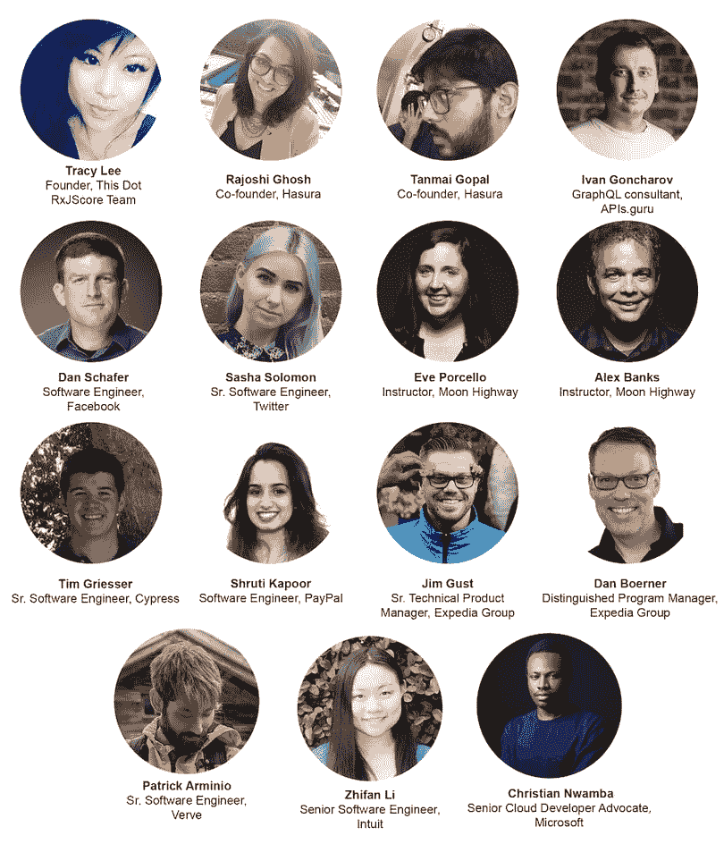

# GraphQL 贡献者日-2019 年 11 月 1 日

> 原文:[https://dev . to/this dot media/graph QL-contributor-days-2019-11-1-gcg](https://dev.to/thisdotmedia/graphql-contributor-days-november-1st-2019-gcg)

**GraphQL 贡献者的日子又回来了！**我们很高兴能在 2019 年 11 月 1 日上午 10 点至下午 3 点(太平洋标准时间)在加利福尼亚州旧金山举行的 GraphQL 峰会几天后举办一场特殊的 GraphQL 贡献者活动。

该活动与 [Hasura](https://hasura.io) 合作，欢迎所有对 GraphQL 感兴趣的人加入对话！

该活动的目的是让 GraphQL 社区聚集在一起，讨论 GraphQL 生态系统中的一些关键话题，并促进社区内的交叉协作。

我们的特邀嘉宾有:
李美玲- *创始人、本 Dot & RxJS 核心团队*
拉乔希·戈什- *联合创始人、哈苏拉*
坦迈·戈帕尔- *创始人、哈苏拉*
伊万·冈查罗夫- *GraphQL 顾问、APIs.guru*
丹·斯查费- *软件工程师、脸书*
萨沙·所罗门- *高级软件工程师、推特【T17 月球公路*
蒂姆·格里瑟- *高级软件工程师、赛普拉斯*
舒鲁蒂·卡普尔- *软件工程师、贝宝*
吉姆·古斯特- *高级技术产品经理、Expedia*
丹·博纳- *杰出项目经理、Expedia 集团*
帕特里克·阿米尼奥- *高级软件工程师、神威*
李之繁- *高级软件工程师*

[T2】](https://res.cloudinary.com/practicaldev/image/fetch/s--EqX4Cw9d--/c_limit%2Cf_auto%2Cfl_progressive%2Cq_auto%2Cw_880/https://thepracticaldev.s3.amazonaws.com/i/rx7b8li3nsqq7itfrtfa.png)

&更多内容有待公布！

如果你有兴趣参加，请在这里注册邀请。

有你想让我们谈论的话题吗？在下面给我们留下评论，让我们知道！

*别忘了在推特上关注我们所有活动的更新 [@ThisDotMedia](https://twitter.com/ThisDotMedia) ！*