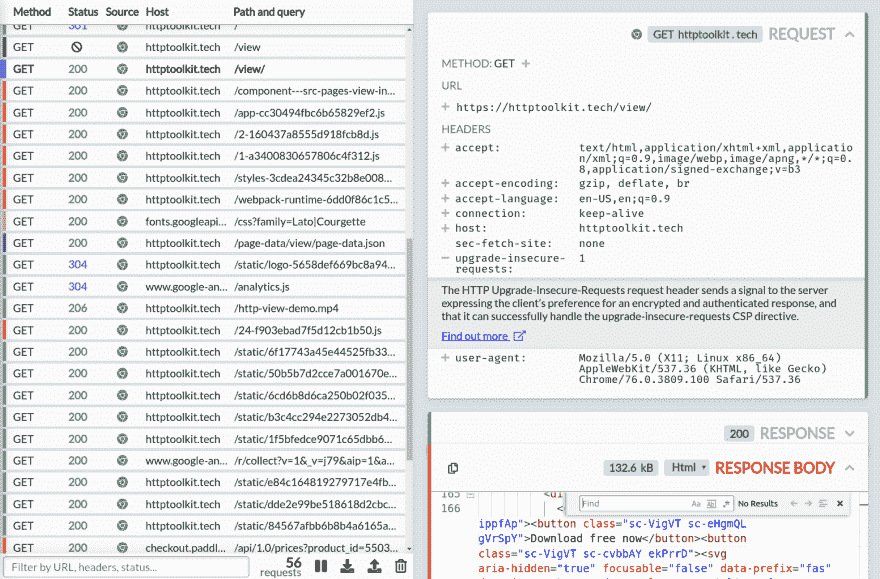
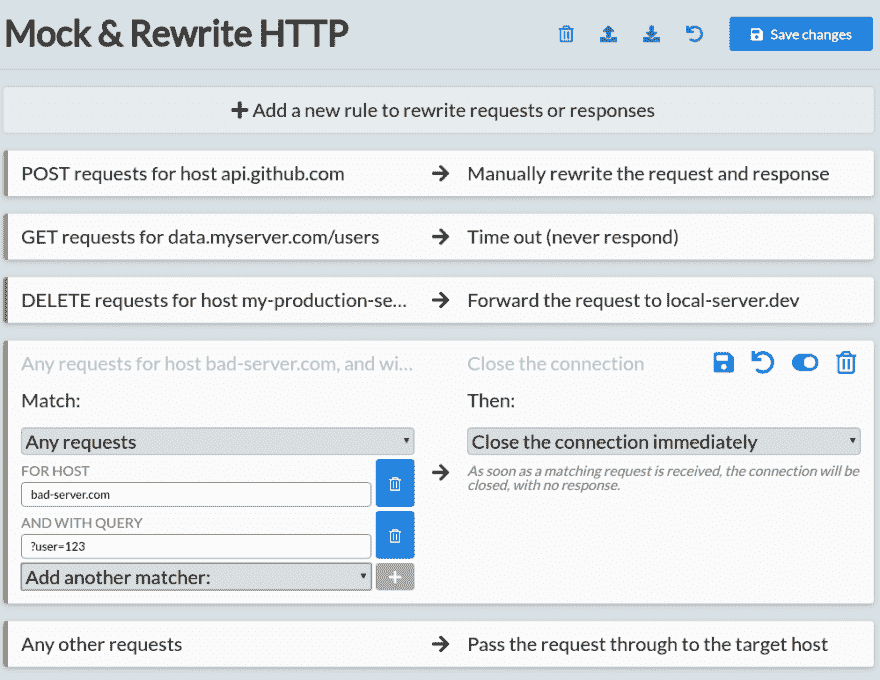

# HTTP 模拟简介

> 原文:[https://dev.to/pimterry/introducing-http-mock-530f](https://dev.to/pimterry/introducing-http-mock-530f)

你好戴夫.托。

我非常兴奋地向大家展示我最新发布的 HTTP 工具包: [HTTP Mock](https://httptoolkit.tech/mock/) 。

这是一个 HTTP 调试、测试和开发工具，类似于 Fiddler & Charles 等其他工具，但它是跨平台的、100%开源的，并且非常现代化。

最神奇的是:一键设置。点击一个按钮，打开一个 Chrome 或 Firefox 窗口，或者一个命令行，并开始查看由该特定窗口发送的所有 HTTP 或 HTTPS。在浏览器中打开页面，运行 CLI 工具，启动 Node.js 服务器、Python 脚本或 Ruby 应用程序，你会立即看到他们发送的所有 HTTP & HTTPS。

对于复杂的微服务调试非常有用，但如果您只是想了解代码库中一些简单的通信实际上是如何工作的，也非常有用。我还为所有标准方法、状态和标题添加了来自 Mozilla Developer Network 的内嵌文档，这有助于让一切更容易理解。

[T2】](https://res.cloudinary.com/practicaldev/image/fetch/s--zI8tYywR--/c_limit%2Cf_auto%2Cfl_progressive%2Cq_auto%2Cw_880/https://thepracticaldev.s3.amazonaws.com/i/lju30o9lxxv8ki7uheje.png)

从那里，有一个新的“模拟”标签，让您模拟和重写 HTTP。

您可以匹配请求和断点，以便更仔细地查看，并编辑请求或响应，或者直接提供您自己的响应。您可以匹配请求并提供自动响应，模拟端点或整个服务器，或者注入错误响应、超时和连接重置来测试您的错误处理。

甚至将流量从一台主机转发到另一台主机，用本地数据库替换您的生产数据库，或者任何您能想到的事情。

像这样:

[T2】](https://res.cloudinary.com/practicaldev/image/fetch/s--AAaIMPgi--/c_limit%2Cf_auto%2Cfl_progressive%2Cq_auto%2Cw_880/https://thepracticaldev.s3.amazonaws.com/i/qjksth4i9qv3sm2dxnh4.png)

听起来不错吧？这是从 httptoolkit.tech/mock 免费下载的。试试吧，让我知道你的想法！