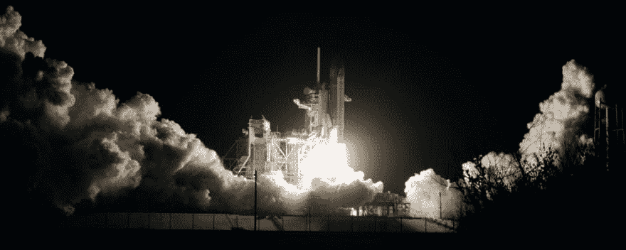
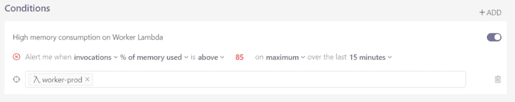

# 控制后端成本

> 原文:[https://dev . to/dash bird/keeping-back end-costs-under-control-401 f](https://dev.to/dashbird/keeping-backend-costs-under-control-401f)

当我们租用服务器时，可用资源是有上限的:CPU、RAM、本地存储。如果我们使用 10%或 100%的那部分，并不重要。月底的账单总是一样的(除非你释放一个*自动缩放器*来实例化服务器到屋顶)。

例如，由于错误或设计不良的代码导致的内存或执行持续时间的峰值不会使成本飙升。虽然我们的用户可能会对降级的体验感到恼火，但许多人并不害怕账单，因为它多少是可以预测的。

但是这种行为是不好的...

[T2】](https://res.cloudinary.com/practicaldev/image/fetch/s--sHP8eEWr--/c_limit%2Cf_auto%2Cfl_progressive%2Cq_auto%2Cw_880/https://thepracticaldev.s3.amazonaws.com/i/mqc803cqrry18r07fhwb.jpg)

### 对现代云基础设施的影响

从几年前开始，我就开始深入 AWS 无服务器堆栈: [Lambda](https://aws.amazon.com/lambda/) 、 [S3](https://aws.amazon.com/s3/) 、 [DynamoDB](https://aws.amazon.com/dynamodb/) 、 [Athena](https://aws.amazon.com/athena/) 等。这些服务是野兽。它们可以相对快速地扩展，以吸收非常大的负载。

出于各种各样的原因，许多团队正在采用无服务器。因为这些服务可以轻松快速地扩展，所以不担心的行为会成为一个大问题。

*   如果一个 Lambda 函数的执行时间增加了 3 倍，会发生什么？
*   我应该给一个函数分配多少内存？
*   如果我的 Lambda 与 S3 或另一个集成服务进入一个无限循环怎么办？

云账单很容易暴涨，在这种情况下我们可能会浪费金钱。

[T2】](https://res.cloudinary.com/practicaldev/image/fetch/s--jLmf4zIs--/c_limit%2Cf_auto%2Cfl_progressive%2Cq_auto%2Cw_880/https://thepracticaldev.s3.amazonaws.com/i/yj75s3xup2zk8ygsen7q.jpg)

### 大负荷有两种口味

1.  app 人气在飞，理论上也会带来大收益；
2.  业绩与预期不符；

我们需要的是避免第二点。很简单，只需仔细检查以确保代码是可执行的。好吧，但是那些我们无法控制的、会影响整体资源消耗的事情呢？

这是我在开发一个严重依赖 AWS Lambda 的自然语言处理项目时学到的一课。该过程的一部分涉及从公共来源收集和挖掘数据，以及从第三方 API 检索大量信息以丰富数据。

### 这意味着大量依赖第三方系统的 IO 绑定任务！

[T2】](https://res.cloudinary.com/practicaldev/image/fetch/s--IillHmpn--/c_limit%2Cf_auto%2Cfl_progressive%2Cq_auto%2Cw_880/https://thepracticaldev.s3.amazonaws.com/i/zi0ybxu4ge50pmsdaloo.jpg)

你可以明白我的意思:AWS 的成本很大程度上取决于这些资源能够多快(或多慢)地响应我们的请求。是的，如果他们开始表现不好…哎哟，我的 AWS 法案将受到伤害。

好吧，所以我不能控制第三方系统，但至少我们需要知道事情是否以及何时会变糟，以便我们可以预测适当的对策。

AWS 提供 CloudWatch 日志和指标。这些都是很好的服务，但是它们只提供了我需要的一半的可见性。我[后来发现了一个建立在 AWS 基础上的服务](https://dashbird.io/?utm_source=dev.to&utm_medium=referral&utm_campaign=article&utm_content=educational),完美地填补了缺失的空白。

[T2】](https://res.cloudinary.com/practicaldev/image/fetch/s--ohrFXo_x--/c_limit%2Cf_auto%2Cfl_progressive%2Cq_auto%2Cw_880/https://thepracticaldev.s3.amazonaws.com/i/1mk81hz1ujwaep3j2jp3.jpg)

一个很大的区别是，CloudWatch 是为 EC2、RDS、传统服务器基础设施设计的。我上面提到的那个是为无服务器堆栈而从头开始构建的。所以，是的，有点不公平的比较...

通过从 CloudWatch 中已经可用的数据中提取更多价值，它以一种非常方便的方式提供了我需要的一切。我喜欢这个工具的一点是，我可以轻松地设置多个性能阈值。

[T2】](https://res.cloudinary.com/practicaldev/image/fetch/s--JhF9Qwmr--/c_limit%2Cf_auto%2Cfl_progressive%2Cq_auto%2Cw_880/https://thepracticaldev.s3.amazonaws.com/i/361efavthg4lbgx2uvo1.png)

# 这些无服务器性能策略将我置于我的堆栈之上。

我可以跟踪是否:

*   我的函数被调用的频率比预期的要高；
*   执行时间太长；
*   错误的百分比异常高；
*   内存消耗过高或过低；
*   以及开发人员可能需要监控的任何东西...

这些项目中的每一项都会对 AWS 账单产生重大影响，让这个自动监控系统代表我运行，应用为我的用例定制的阈值，让我可以安心睡觉。

[T2】](https://res.cloudinary.com/practicaldev/image/fetch/s--e51NZJ-f--/c_limit%2Cf_auto%2Cfl_progressive%2Cq_auto%2Cw_880/https://thepracticaldev.s3.amazonaws.com/i/1tnxzs1tzjfiztuz8srl.jpg)

自动警报也是非常宝贵的。每当我的应用程序显示出第一个糟糕的迹象时，我就会被主动提醒采取行动。由于它集成了日志、X 射线跟踪和指标，我可以在一个地方完成所有工作:

*   确定问题；
*   理解它的反响；
*   找到根本原因；
*   修补修复或缓解措施；

您如何监控无服务器堆栈的性能？或者，如果不是，你怎么睡，我的朋友？请在评论中分享。

全面披露:我非常喜欢 Dashbird 服务，现在我是它的支持者。；)

照片致谢:

*   封面图片:由[克里斯·莱佩尔特](https://unsplash.com/@cleipelt?utm_source=unsplash&utm_medium=referral&utm_content=creditCopyText)在 [Unsplash](https://unsplash.com/s/photos/control?utm_source=unsplash&utm_medium=referral&utm_content=creditCopyText) 上拍摄的照片
*   走在绳索上的女人:照片由[莱奥·麦克拉伦(@leiomclaren)](https://unsplash.com/@leio?utm_source=unsplash&utm_medium=referral&utm_content=creditCopyText) 在 [Unsplash](https://unsplash.com/s/photos/walking-rope?utm_source=unsplash&utm_medium=referral&utm_content=creditCopyText) 上拍摄
*   太空火箭:照片由 [NASA](https://unsplash.com/@nasa?utm_source=unsplash&utm_medium=referral&utm_content=creditCopyText) 在 [Unsplash](https://unsplash.com/s/photos/space-rocket?utm_source=unsplash&utm_medium=referral&utm_content=creditCopyText) 上拍摄
*   电线连接:约翰·巴克利在 [Unsplash](https://unsplash.com/s/photos/wire-connections?utm_source=unsplash&utm_medium=referral&utm_content=creditCopyText) 上拍照
*   黑暗中的人:照片由[артёммякинник](https://unsplash.com/@htota?utm_source=unsplash&utm_medium=referral&utm_content=creditCopyText)在 [Unsplash](https://unsplash.com/s/photos/fog?utm_source=unsplash&utm_medium=referral&utm_content=creditCopyText) 上拍摄
*   猫在睡觉:凯特·斯通·马西森在 [Unsplash](https://unsplash.com/s/photos/sleep?utm_source=unsplash&utm_medium=referral&utm_content=creditCopyText) 上拍摄的照片