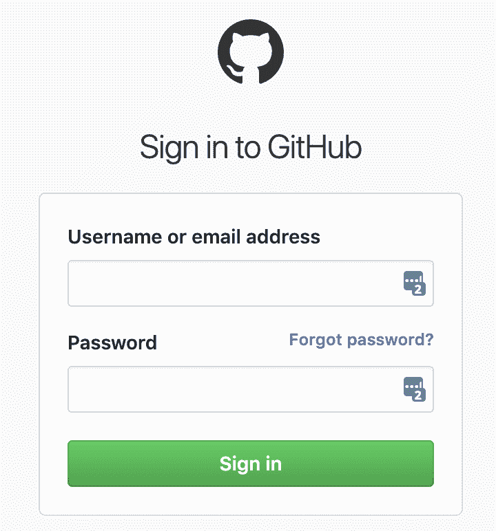

# webhunt 现在可以分析受密码保护的网站

> 原文:[https://dev . to/web hint/web hint-can-now-analyze-password-protected-sites-2p4i](https://dev.to/webhint/webhint-can-now-analyze-password-protected-sites-2p4i)

### [](#analyzing-passwordprotected-sites-with-webhint)使用 webhint 分析受密码保护的站点

该团队收到的两个最受欢迎的功能是在 Chrome 以外的浏览器中运行 webhint 和分析密码保护网站的能力。直到最近这还是不可能的，但是事情已经改变了！

最新版本的 webhint 带有新的连接器-puppeter，它允许 webhint 与任何实现由[puppeter](http://pptr.dev)使用的调试协议子集的浏览器对话。现在，这是任何现代的基于 Chromium 的浏览器，但是 [Firefox 在不久的将来也会支持它](https://bugzilla.mozilla.org/show_bug.cgi?id=1545057)👏。

这个新软件包有一些不错的功能。例如，它会自动搜索一个有效的基于 Chromium 的可执行文件。如果你安装了多个，优先级是 Chrome > Chromium > Edge。

如果您想要指定一个，您有两个选项:

1.  使用浏览器选项和一个快捷键:

```
{
  "connector": {
    "name": "puppeteer",
    "options": {
      "browser": "Chrome|Chromium|Edge"
    }
  },
  ...
} 
```

1.  通过 puppeter-options 直接指定可执行路径:

```
{
  "connector": {
    "name": "puppeteer",
    "options": {
      "puppeteer-options": {
        "executablePath": "path/to/browser"
      }
    }
  },
  ...
} 
```

连接器支持更多配置(查看本页上的[所有配置)，但最令人兴奋的可能是分析密码保护网站🕵的可能性🏽‍♀️.](https://webhint.io/docs/user-guide/connectors/connector-puppeteer/)

### 您现在可以使用 webhint 分析受密码保护的网站

这是最受欢迎的功能之一，虽然有时有一些黑客让它工作，但体验远非理想。

这花费了我们比预期更多的时间，但对这一功能的支持终于登陆了，我们非常兴奋！🎉

为了测试它，您需要提供用户、密码、输入选择器，并在您的[中提交输入选择器。hintrc 文件](https://webhint.io/docs/user-guide/configuring-webhint/summary/) :

```
{
    "connector": {
        "name": "puppeteer",
        "options": {
            "auth": {
                "user": {
                    "selector": "string",
                    "value": "string"
                },
                "password": {
                    "selector": "string",
                    "value": "string"
                },
                "submit": {
                    "selector": "string"
                }
            }
        }
    },
    ...
} 
```

webhint 将:

1.  导航到你的目标 URL([https://example.com](https://example.com))/secured)，它应该重定向到一个登录页面(【https://example.com/login】T2)，
2.  使用 auth 属性中提供的信息来填写表单并提交它，以及
3.  分析提交表单导航后出现的页面([https://example.com/secured](https://example.com/secured))。

[](https://res.cloudinary.com/practicaldev/image/fetch/s--UnkHkipg--/c_limit%2Cf_auto%2Cfl_progressive%2Cq_auto%2Cw_880/https://cdn-images-1.medium.com/max/720/1%2Ab4LW4Qq3h9HyWY9_pAli-Q.png) 

<figcaption>GitHub 的登录表单</figcaption>

如果你的网站使用基本的 HTTP 认证，那也是受支持的！用户和密码字段只能是一个字符串:

```
{
    "connector": {
        "name": "puppeteer",
        "options": {
            "auth": {
                "user": "string",
                "password": "string"
            }
        }
    },
    ...
} 
```

#### [](#how-do-i-integrate-auth-in-ci-without-writing-the-credentials)如何在不写凭证的情况下将 auth 集成到 CI 中？

众所周知，将您的凭证存储在纯文本文件中并不是一个好主意。要解决这个问题，您可以使用环境变量。从 webhint v5.1.0 开始，您可以通过环境变量传递特定的配置。例如:

web hint _ connector _ options _ auth _ user _ value = John doe

web hint _ connector _ options _ auth _ password _ value = P @ ss w0 rd！

被转换成:

```
{
    "connector": {
        "options": {
            "auth": {
                "user": {                    
                    "value": "string"
                },
                "password": {                  
                    "value": "string"
                }
            }
        }
    }
} 
```

然后，它将与。hintrc 文件。(对于这种特殊情况，您的。hintrc 文件应该有选择器。)

中定义的属性。在重复情况下，hintrc 文件比环境变量中的文件具有更高的优先级。

[Azure Pipelines 有 secrets 的概念](https://docs.microsoft.com/en-us/azure/devops/pipelines/process/variables?view=azure-devops&tabs=yaml%2Cbatch#secret-variables)， [Travis CI 有加密的环境变量](https://docs.travis-ci.com/user/environment-variables/#defining-encrypted-variables-in-travisyml)，其他 CI 系统也有类似的特性，一定要使用它们不要泄露任何信息！

#### [](#how-can-i-run-a-quick-test)如何进行快速测试？

最快的方法是创建一个类似上面的. hintrc 文件，并通过 npx:
运行 webhint

```
npx hint https://mysecuresite.com/secure/page 
```

您应该看到您的浏览器打开，认证，并导航到最终的网址。

### 我们需要您的反馈！

请让我们知道您对这项新功能的看法，以及我们可以在哪些方面进行改进。你可以在这个帖子里分享你的想法， [GitHub](https://github.com/webhintio/hint/issues/new/choose) ， [Twitter](https://twitter.com/webhintio) 或者 [Gitter](https://gitter.im/webhintio/Lobby) 。

谢谢大家！🙏

* * *