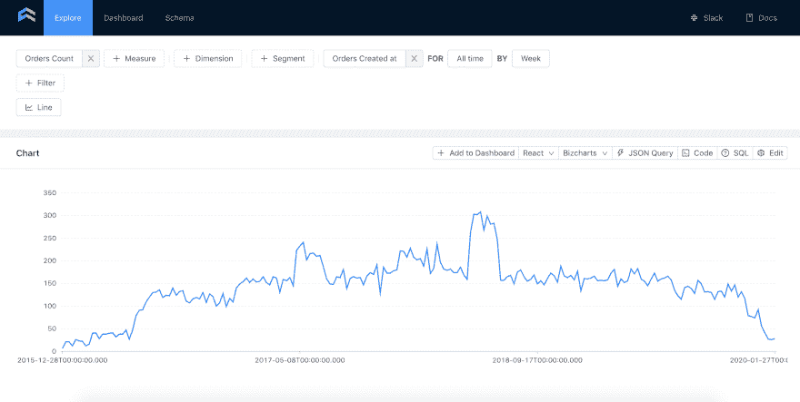

# 带有动态数据集的 Chart.js 示例

> 原文:[https://dev . to/keydunov/chart-js-example-with-dynamic-dataset-3j4o](https://dev.to/keydunov/chart-js-example-with-dynamic-dataset-3j4o)

我已经在本教程的[中讲述了用](https://cube.dev/blog/node-express-analytics-dashboard-with-cubejs/) [Cube.js](https://github.com/cube-js/cube.js) 和 Chart.js 构建一个静态仪表板。现在，我将向您展示如何根据用户的输入动态更改底层图表的数据。我们将让用户选择一个日期范围，并基于此重新加载图表。当用户选择一组新的日期时，一个新的请求将被发送到 Cube.js 服务器。Cube.js 服务器将生成新的 SQL 代码，对数据库执行该代码，并将结果发送回客户端。最后，客户端用新数据重新呈现一个图表。

这是我们将要构建的代码沙盒演示。可以点击“在编辑器中打开”查看源代码。

[https://codesandbox.io/embed/chartjs-dynamic-data-example-yebll](https://codesandbox.io/embed/chartjs-dynamic-data-example-yebll)

## [](#setting-up-a-backend)设置后端

我们将使用示例电子商务 Postgres 数据集。使用以下命令将其下载并导入到`ecom`数据库中。

```
$ curl http://cube.dev/downloads/ecom-dump.sql > ecom-dump.sql
$ createdb ecom
$ psql --dbname ecom -f ecom-dump.sql 
```

接下来，如果您还没有安装 Cube.js CLI，请安装它并生成一个新的应用程序。

```
$ npm install -g cubejs-cli
$ cubejs create chartjs-dynamic-data -d postgres 
```

Cube.js 使用环境变量进行配置。要配置到数据库的连接，我们需要指定数据库类型和名称。在 Cube.js 项目文件夹中，替换。包含以下内容的 env 文件:

```
CUBEJS_API_SECRET=SECRET
CUBEJS_DB_TYPE=postgres
CUBEJS_DB_NAME=ecom 
```

现在，启动开发服务器并在浏览器中打开 [localhost:4000](https://localhost:4000) 。

```
$ npm run dev 
```

您可以在 schema 选项卡下为`ecom`数据库中的表生成一个模式。我们将只使用一个表中的数据— `orders`。一旦生成了这个模式，就可以使用 Explore 部分中的数据了。

[T2】](https://res.cloudinary.com/practicaldev/image/fetch/s--uGQuWuG5--/c_limit%2Cf_auto%2Cfl_progressive%2Cq_auto%2Cw_880/https://media.graphcms.com/6qLZzSIzQxWEMI4dxIDr)

部署 Cube.js 有多种方式:Docker、serverless 和 Heroku。你可以在这里阅读所有的[。在本教程中，我们将使用部署在 https://cubejs-ecom.herokuapp.com/cubejs-api/v1](https://cube.dev/docs/deployment)[的 Heroku 上的 Cube.js 应用程序。](https://cubejs-ecom.herokuapp.com/cubejs-api/v1)

## [](#simple-chart)简单图表

为了简单起见，我们将在 Codesandox 上构建我们的前端。它将从 Heroku 上部署的 Cube.js 后端加载数据。您可以在这里查看最终的源代码和演示应用程序。随便叉，随便玩。

我们使用 Codesanbox 的 Vanilla 模板，不打算添加任何框架，如 React 或 Vue，以保持简单。第一步是包含 Cube.js 客户端和 Chart.js 库。在`<head>`标签中插入以下代码。

```
<script src="https://unpkg.com/@cubejs-client/core@0.10.16/dist/cubejs-client-core.umd.js"></script>
<script src="https://cdnjs.cloudflare.com/ajax/libs/Chart.js/2.7.2/Chart.bundle.min.js"></script> 
```

要初始化 Cube.js 客户端，您需要传递一个 API URL 和秘密。

```
const cubejsApi = cubejs(
"eyJhbGciOiJIUzI1NiIsInR5cCI6IkpXVCJ9.e30.K9PiJkjegbhnw4Ca5pPlkTmZihoOm42w8bja9Qs2qJg",
  { apiUrl: "https://cubejs-ecom.herokuapp.com/cubejs-api/v1" }
); 
```

一旦客户端被初始化，我们就可以从后端请求数据并将其可视化。`load`函数接受一个普通 javascript 对象的查询，并返回一个承诺。你可以在这里了解更多关于[查询格式的信息。](https://cube.dev/docs/query-format#top) 

```
cubejsApi
    .load({
      measures: ["Orders.count"],
      timeDimensions: [
        {
          dimension: "Orders.createdAt",
          granularity: `day`,
          dateRange: [`08/01/2019`,`09/01/2019`]
        }
      ]
    })
    .then(resultSet => {
      new Chart(document.getElementById("chart"), {
        type: "line",
        options: options,
        data: chartJsData(resultSet)
      });
    }); 
```

我们正在加载`Orders.count`，它按照创建的日期分组，绘制成折线图。为了让这个代码工作，我们需要做一些事情。首先，在你的 html `<body>`里面添加`<canvas>`标签。

```
<canvas id="chart-canvas"></canvas> 
```

接下来，我们需要定义一个`chartJsData`函数，它应该接受从 Cube.js 返回的[结果集](https://cube.dev/docs/@cubejs-client-core#result-set)，并将其格式化为 Chart.js.

```
var chartJsData = function(resultSet) {
  return {
    datasets: [
      {
        label: "Orders Count",
        data: resultSet.chartPivot().map(function(r) {
          return r["Orders.count"];
        }),
        backgroundColor: "rgb(255, 99, 132)"
      }
    ],
    labels: resultSet.categories().map(function(c) {
      return c.x;
    })
  };
}; 
```

最后，我们声明了一些附加的 Chart.js 选项，用于漂亮的轴格式化。

```
var options = {
  scales: {
    xAxes: [
      {
        type: "time",
        time: {
          displayFormats: {
            hour: "MMM DD"
          },
          tooltipFormat: "MMM D"
        }
      }
    ],
    yAxes: [
      {
        ticks: {
          beginAtZero: true
        }
      }
    ]
  }
}; 
```

这就是我们加载静态折线图所需的全部内容。接下来，我们将添加一个日期范围选择器，并根据用户选择的日期范围动态加载数据。

## [](#dynamic-data)动态数据

将 Jquery、日期范围选择器和 Moment.js 库添加到您的`<head>`标签中。

```
<script src="https://cdn.jsdelivr.net/jquery/latest/jquery.min.js"></script>
<script src="https://cdn.jsdelivr.net/momentjs/latest/moment.min.js"></script>
<script src="https://cdn.jsdelivr.net/npm/daterangepicker/daterangepicker.min.js"></script>
<link rel="stylesheet" href="https://cdn.jsdelivr.net/npm/daterangepicker/daterangepicker.css"/> 
```

接下来，让我们将呈现图表的代码包装到`drawChart`函数中，该函数将接受两个参数:开始日期和结束日期。

```
var drawChart = function(startDate, endDate) {
  cubejsApi
    .load({
      measures: ["Orders.count"],
      timeDimensions: [
        {
          dimension: "Orders.createdAt",
          granularity: `day`,
          dateRange: [startDate, endDate]
        }
      ]
    })
    .then(resultSet => {
      if (window.chart) {
        window.chart.data = data;
        window.chart.update();
      } else {
        window.chart = new Chart(document.getElementById("chart-canvas"), 
        {
          type: "line",
          options: options,
          data: data
        });
      }
    });
}; 
```

除了使`dateRange`动态化之外，我们还将当前的图表保存到`windows.chart`中，这样我们可以在以后需要重新呈现图表时更新它。

最后，我们可以向 html 主体添加一个输入，并使它成为一个日期范围选择器:

```
<input name="dates" /> 
```

```
const START_DATE = "08/01/2019";
const END_DATE = "09/01/2019";

$('input[name="dates"]').daterangepicker(
  {
    startDate: START_DATE,
    endDate: END_DATE
  },
  function(start, end) {
    drawChart(start, end);
  }
);
drawChart(START_DATE, END_DATE); 
```

就是这样！现在我们有了一个完全工作的动态交互式图表。您可以从日期选择器中选择不同的日期，并查看图表如何变化。

[https://codesandbox.io/embed/chartjs-dynamic-data-example-yebll](https://codesandbox.io/embed/chartjs-dynamic-data-example-yebll)

如果你对本教程或 Cube.js 有任何疑问，欢迎在 [Slack Cube.js 社区](https://slack.cube.dev/)联系我。