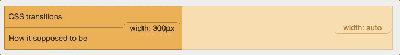
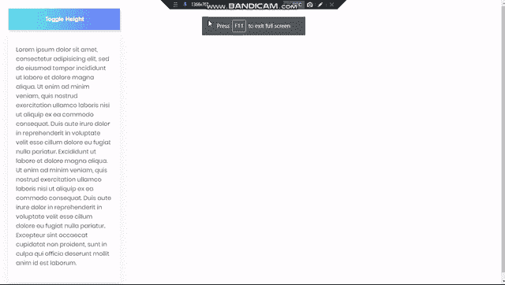

# 用 Javascript 在动态容器上强制 CSS 动画

> 原文:[https://dev . to/frontend _ io/forcing-CSS-animation-on-dynamic-containers-with-JavaScript-1j2b](https://dev.to/frontend_io/forcing-css-animation-on-dynamic-containers-with-javascript-1j2b)

你好。最近我发表了一篇关于如何让内容容器切换高度或宽度的文章，这是这篇文章的更新。

大多数时候，当我们试图构建像手风琴、可折叠导航条或任何切换高度或宽度的东西时，我们经常发现当我们试图将高度或宽度设置为 auto 时，动画从不工作。所以它不是平滑地前后伸展，而是突然断裂。呸！作为一种选择，有时我们使用固定值。但是使用固定值有其缺点，因为如果容器是动态的，它会截断溢出的内容。

[T2】](https://res.cloudinary.com/practicaldev/image/fetch/s--HOuzd5yJ--/c_limit%2Cf_auto%2Cfl_progressive%2Cq_66%2Cw_880/https://thepracticaldev.s3.amazonaws.com/i/ztykh46araouxv0n084l.gif)

w3 在这里很好地解释了动画问题背后的原因:[https://developer . Mozilla . org/en-US/docs/Web/CSS/CSS _ Transitions/Using _ CSS _ Transitions # Specifications](https://developer.mozilla.org/en-US/docs/Web/CSS/CSS_Transitions/Using_CSS_transitions#Specifications)
所以让我们跳过所有这些它不应该工作的原因，让我们看看如何修复它！
我们开始添加一些 HTML 来填充容器:

```
//The button element would be used as our toggle 
<div class="navigation">
   <button class="knob">Toggle Height</button>
   <div class="content">
    <p>
       Lorem ipsum dolor sit amet, consectetur adipisicing elit, sed do eiusmod
tempor incididunt ut labore et dolore magna aliqua. Ut enim ad minim veniam,
quis nostrud exercitation ullamco laboris nisi ut aliquip ex ea commodo
consequat. Duis aute irure dolor in reprehenderit in voluptate velit esse
cillum dolore eu fugiat nulla pariatur. Excididunt ut labore et dolore magna aliqua. Ut enim ad minim veniam,
quis nostrud exercitation ullamco laboris nisi ut aliquip ex ea commodo
consequat. Duis aute irure dolor in reprehenderit in voluptate velit esse
cillum dolore eu fugiat nulla pariatur. Excepteur sint occaecat cupidatat non
proident, sunt in culpa qui officia deserunt mollit anim id est laborum.

    </p>
   </div>
</div> 
```

然后一点造型

```
.navigation{
        max-width: 300px;
        font-family: poppins;
        padding: 15px;
        border-radius: 50px;
        transition: .5s;
    }
    .navigation .knob{
        width: 100%;
        border: none;
        background: -webkit-linear-gradient(left, #5efce8, #736efe);
        color: #fff;
        font-size: 16px;
        font-weight: 600;
        padding: 20px;
        text-align: center;
        box-shadow: 3px 5px 3px rgba(0,0,0,.09) ;
        transition: .5s;
    }
    .navigation .content{
        overflow: hidden;
        transition: .5s ease-out;
        background: #fff;
        box-shadow: 0px 20px 20px rgba(0,0,0,.05);
    }
    .navigation .content p{
        overflow: hidden;
        color: #555;
        background: #fff;
        margin: 20px 0px;
        box-sizing: border-box;
        padding: 20px;
    } 
```

然后我们添加 JavaScript

```
 //Get the elements
    let knob = document.querySelector(".knob");
    let content = knob.nextElementSibling;
    // Get the full height of the container
    let defaultHeight = content.scrollHeight;

    knob.addEventListener("click", () => {
        // Check if the current height of the container is same as it's original height
        (content.style.height == defaultHeight + "px") ? 

        // If the condition above is true, set the height to zero (toggle close)
        content.style.height = "0px" : 

        // Else make the height stretch to its full height ( toggle open) 
        content.style.height = defaultHeight  + "px";
    }) 
```

瞧啊。仅此而已。有了这些小代码，我们就有了一个全功能的切换动态容器。这里使用的相同原理也适用于宽度:
，所以我们用 `scrollWidth`代替`scrollHeight`。

```
 //Get the elements
    let knob = document.querySelector(".knob");
    let content = knob.nextElementSibling;
    // Get the full width of the container
    let defaultWidth = content.scrollWidth;

    knob.addEventListener("click", ()=>{
        // Check if the current width of the container is same as its original width
        (content.style.width == defaultWidth + "px") ? 
        // If the condition above is true, set the width to zero (toggle close)
        content.style.width= "0px" : 
        // Else make the width stretch to its full width ( toggle open) 
        content.style.width = defaultWidth  + "px";
    }) 
```

[](https://res.cloudinary.com/practicaldev/image/fetch/s--Sm1HdLre--/c_limit%2Cf_auto%2Cfl_progressive%2Cq_66%2Cw_880/https://thepracticaldev.s3.amazonaws.com/i/p33hxbrqw6neq29u2rch.gif)
-决赛

我希望这能帮助你克服高度和宽度的问题。如果你发现这个模糊的任何部分，请随时提问:)