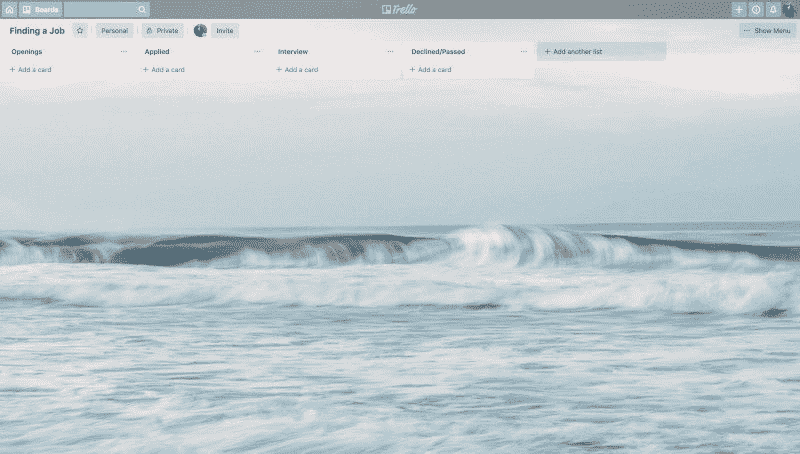
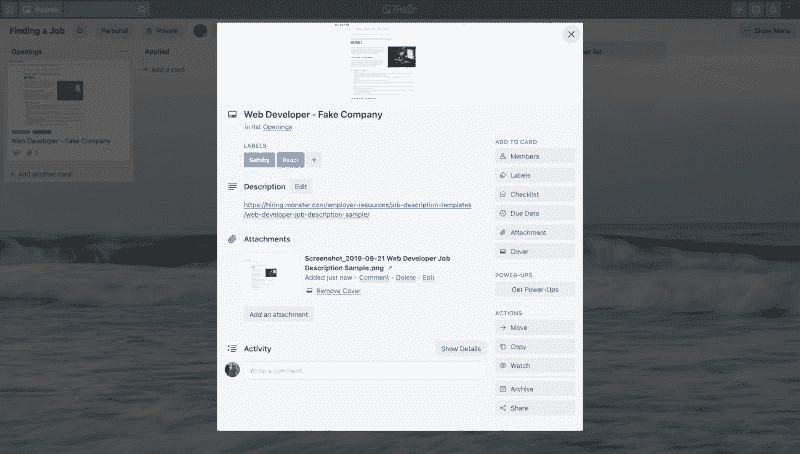

# 使用看板工作流查找工作

> 原文：<https://dev.to/iam_timsmith/finding-a-job-while-using-a-kanban-workflow-4fd1>

在 web 开发行业找工作可能相当困难。在应用流程中使用看板工作流程有助于保持您的组织性和效率。

在编程领域，本地和全球都有很多工作机会。找工作可能意味着与住在同一个城镇的其他开发人员以及住在世界另一端的开发人员竞争。因为每个职位都有大量的申请人竞争，所以尽可能地简化你的流程是非常必要的。

我在以前的博客中讨论过什么是看板，以及如何在自由职业者的环境中将其应用到项目中。在这篇文章中，我将讨论我的一些想法，如何利用它来使找工作的过程变得更加容易。

## 看板工作流程可以使用哪些工具？

虽然不是所有的工具都能满足你找工作的需要，但是有一些工具非常适合这个应用程序(双关语)。以下是可供您选择的几个选项:

### 索引卡片&便利贴

说到求职，我不得不承认这是我最不喜欢的管理看板板的方式。最大的原因是无法添加附件和缺少复制/粘贴功能。当然，你可以把你想要的附件打印出来，然后粘在卡片上，但是那样会很快变得很乱，而且会用很多纸。

### 特雷罗

Trello 是管理看板板的好选择。尤其是因为它有不同类型的集成，如 Google Drive。这些整合使得在名片上添加简历、求职信或任何其他文档变得轻而易举。另外，你可以为你的董事会设置一个好的背景来激励你，或者提醒你你的目标是什么，为什么你想要一份新工作。

### 观念

我使用这个工作流程的首选工具是 idea。idea 提供了一些功能，让事情变得简单。首先是在列表视图和面板视图之间切换的能力。有了这种能力，就可以很容易地添加新的工作列表，并根据它们在流程中的位置筛选出您的申请。此外，概念允许您创建各种类型的内容，这些内容可用作申请工作时的参考。

## 如何设置求职板

无论您选择哪种工具，设置电路板都应该相对简单。你的板的列数实际上取决于你，但至少我会有下图所示的列数:

## 看板板设置找工作

我将为您分解这些列，您可以添加或删除任何对您的目的不必要的列。

### 开口

此栏的功能与待办事项栏的功能相同。找工作时，这一栏应该是你想申请的职位空缺列表。如果你在移动设备上找到一份你喜欢的工作，但没有工具、文件或时间立即申请，这就很方便了。在这个栏目中添加一张卡片，既可以作为一个提醒，也可以在你确实有申请所需的资源时，作为一种再次找到该职位的方法。

### 应用

虽然我相信你已经猜到这个专栏是干什么的了，但是一旦你提交了简历和求职信，这里就是你放名片的地方。当使用 Trello 或 impression 等看板工具时，会记录卡片的移动时间，因此在申请后将卡片移动到“已申请”栏会为您提供一个很好的参考，帮助您确定何时发送后续电子邮件或电话。

### 面试

如果未来的雇主叫你去面试，一张名片会被移到面试栏。一张卡可能不会进入此栏，而是会进入“拒绝/通过”栏。

> 请注意:这完全没问题。如果你的采访专栏没有进展，不要气馁。找工作需要时间。本专栏的目的是跟踪各种申请以及它们在申请过程中的位置，而不是反映你的价值。

### 拒绝/通过

就正常看板设置而言，此列可以充当“完成”列。如果你因为不适合这个职位而拒绝了这个职位，或者你已经有 3-4 周或更长时间没有收到未来雇主的消息，或者你收到通知说你没有进展，这就是你的底牌所在。如果看到这个列表让你不舒服，你可以把这些卡片存档，或者如果你使用了概念的话，可以把它们藏起来。通过这样做，你仍然有一个记录，但它不会把你打倒。

## 应该进什么牌？

好问题！卡片的内容实际上是开发这个工作流程的主要原因。在我申请几周后做面试时，我真的很痛苦，我不记得我的求职信上写了什么，所以我无法查阅它。这也是一个麻烦，当我试图在面试前看一下招聘启事，但它已经被删除了。

我将分析卡片通过每一列时应该发生的事情。和以前一样，这是我过去的做法。如果您想添加更多信息，或者如果这对您的需求来说太多，请随意更改以满足您的需求。

### 当卡在开口栏时

卡片应该从空缺栏开始，因为这将作为你想申请的工作的清单。在制作名片时，我建议用未来雇主的头衔来命名名片，比如网站开发者-假冒公司。此外，你可以使用标签来突出工作所需的技能。这样，你就很容易知道这份工作想要什么，而不用翻遍职位描述。这也有助于突出你正在寻找的工作类型，这可能有助于改善你的求职。

为了防止我前面提到的工作列表被删除的问题，我还建议您截屏列表并将其上传到卡上。如果你需要参考的话，包含一个工作列表的链接也是有帮助的(假设它没有被删除)。

你的卡片在开始栏应该是什么样子:

### 当卡在已应用栏时

一旦你提交了你的求职信和简历，卡片应该被移到申请栏。移动名片时，我喜欢附上一份简历和求职信的复印件，以备将来需要时参考。我发现在准备面试时能够参考这些文件。这让我想到了下一个专栏:面试。

### 面试结束后

如果你收到一封电子邮件、一封信或一个电话，邀请你去面试，恭喜你！你可以把卡片移到下一栏！至少，我会把你面试的日期和时间作为笔记的一部分或作为评论。在面试中做笔记也很有帮助，这些笔记也可以添加到卡片上。如果你做了关于公司的笔记，或者甚至在第二次或第三次面试前参考，把笔记放在一个容易找到的地方可以成为一个简单的资源。

### 拒绝/通过列

当你决定一份工作不适合你，未来的雇主在 3-4 周内没有回复你，或者如果你得到了回复，他们决定放弃你作为候选人时，名片应该被移到拒绝/通过一栏。因此，在将卡片移动到此栏时，您不需要添加太多内容。如果你认为这份工作不适合你，那么写下你认为这份工作不适合你的原因可能是个好主意。

### 您可以包括的其他列

您可以在看板中使用其他一些列。过去，我曾使用“跟进”和“感谢”等栏目来帮助记录我回复了哪些职位。你也可以为你参加的每一组面试增加一个专栏。如果您能想到任何其他有益的专栏，我鼓励您添加它们。随着你发现什么对你有用，什么对你没用，这个过程会不断发展。

## 包装完毕

有很多方法可以让你在找工作的时候保持有条理。这是一个在过去对我最有效的方法，我建议尝试一下。它可以很容易地告诉你每个应用程序在你的“工作漏斗”中的位置。把所有东西都放在一个地方会让你在准备面试或试图回忆你为什么做某事时很容易记住事情。

有想法或问题吗？请随时在 Twitter 上联系我。