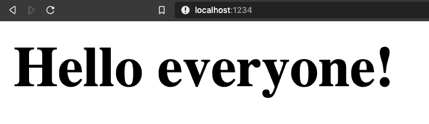

# 轻松的应用程序捆绑:在 2 分钟内完成反应+包裹

> 原文：<https://dev.to/ryanlanciaux/effortless-application-bundling-parcel-react-in-under-2-33i8>

## 轻松捆绑网络应用

Bundlers 用于获取我们的各种源文件(JavaScript、CSS、Sass 等)。并准备在浏览器中使用它们。本文假设您已经接受了为您的 JavaScript 应用程序使用 bundler。想了解更多关于捆扎机及其工作原理的信息，请查看阿尔贝托·吉梅诺
的帖子

有很多很棒的工具可以用来捆绑我们的应用，比如 [webpack](https://webpack.js.org/) 、 [rollup](https://rollupjs.org/guide/en/) 等等。然而，今天我想重点谈谈包裹。

## 入门

虽然 package 的开销很小，但我们需要采取两个步骤([如 package 文档](https://parceljs.org)中所述)。

首先，我们必须将包作为一个全局依赖项安装:`npm install -g parcel-bundler`或`yarn global add parcel-bundler`

从那里，我们需要创建一个项目文件夹并初始化项目(用一个 package.json 文件):`npm init -y`或`yarn init -y`(如果您更愿意完成初始化向导，请删除`-y`标志)。

## 一点代码

此时，我们应该可以开始编写一些代码了。我们将从编写一个“Hello world”类型的 React 组件开始。在视频中，我将此命名为 SayHello.js，并在项目文件夹的根目录中创建它。在一个不太复杂的项目中，我们可能需要更多的组织(例如，我们可以将 JavaScript 文件放在`/src/`下)。

`SayHello.js`

```
import React from "react";

export default function SayHello({ name }) {
  return <h1>Hello {name}!</h1>; } 
```

<svg width="20px" height="20px" viewBox="0 0 24 24" class="highlight-action crayons-icon highlight-action--fullscreen-on"><title>Enter fullscreen mode</title></svg> <svg width="20px" height="20px" viewBox="0 0 24 24" class="highlight-action crayons-icon highlight-action--fullscreen-off"><title>Exit fullscreen mode</title></svg>

接下来，我们将创建一个 index.js 文件。我们将把这个文件视为连接 React 组件和 DOM 元素的位置。我们还没有创建 HTML 文件，但是让我们假设我们最终会有一个 id 为“main”的元素，我们希望将我们的组件呈现到这个元素中。

`index.js`

```
import React from "react";
import ReactDOM from "react-dom";
import SayHello from "./SayHello";

ReactDOM.render(
  <SayHello name="everyone" />, 
  document.getElementById("main")
); 
```

<svg width="20px" height="20px" viewBox="0 0 24 24" class="highlight-action crayons-icon highlight-action--fullscreen-on"><title>Enter fullscreen mode</title></svg> <svg width="20px" height="20px" viewBox="0 0 24 24" class="highlight-action crayons-icon highlight-action--fullscreen-off"><title>Exit fullscreen mode</title></svg>

最后，我们将创建 HTML 文件，作为应用程序的入口点。请注意:在这个例子中，我们使用了一些人为的标记。理想情况下，我们的 HTML 文件中应该有更多的内容(比如 doctype、title 等)，但是为了清晰起见，我们将保持它的简洁。

`index.html`

```
<html>
  <body>
    <div id="main"></div>
    <script src="./index.js"></script>
  </body>
</html> 
```

<svg width="20px" height="20px" viewBox="0 0 24 24" class="highlight-action crayons-icon highlight-action--fullscreen-on"><title>Enter fullscreen mode</title></svg> <svg width="20px" height="20px" viewBox="0 0 24 24" class="highlight-action crayons-icon highlight-action--fullscreen-off"><title>Exit fullscreen mode</title></svg>

## 运行应用程序

现在我们可以跳回命令行，从项目目录中键入`parcel index.html`,我们应该会看到类似下面的提示，表明我们的项目正在运行。

```
➜  testParcel parcel index.html 
Server running at http://localhost:1234 
⠼ Packaging
✨  Built in 1.52s. 
```

<svg width="20px" height="20px" viewBox="0 0 24 24" class="highlight-action crayons-icon highlight-action--fullscreen-on"><title>Enter fullscreen mode</title></svg> <svg width="20px" height="20px" viewBox="0 0 24 24" class="highlight-action crayons-icon highlight-action--fullscreen-off"><title>Exit fullscreen mode</title></svg>

在浏览器中导航到 localhost:1234，我们应该会看到正在运行的应用程序。

[](https://res.cloudinary.com/practicaldev/image/fetch/s--VeZZjmot--/c_limit%2Cf_auto%2Cfl_progressive%2Cq_auto%2Cw_880/https://thepracticaldev.s3.amazonaws.com/i/ouo112tx6f26thc9ve0r.png)

请[查看包裹文件了解更多信息](https://parceljs.org/)。