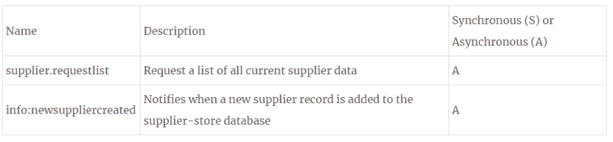

# 向现有微服务添加功能

> 原文:[https://dev.to/jeastham1993/adding-functionality-1gi8](https://dev.to/jeastham1993/adding-functionality-1gi8)

继第一篇关于我的微服务架构设计过程的文章之后，今天我将着眼于添加功能。

传统上，在一个整体中，新的特征会引起关注。

如果我添加了一个特性，它破坏了一个看似不相关的系统功能，该怎么办？

如果我修改了一段我不应该修改的代码，整个系统就会崩溃，怎么办？

我害怕错误地推动部署并导致停机？

所有合理的考虑，特别是当你的系统功能的每一部分都包装在一个应用程序中的时候。

微服务给出了更好的办法。

## 添加功能的更好方式

快速总结一下我们在上一篇文章末尾留下的当前系统功能。我们目前有七种微服务:

处理包含电子邮件数据和必要附件的 POST 请求
将附件上传到 OCR 引擎(ABBYY Flexicapture Cloud)
从 ABBYY 接收已识别的索引数据
将这些数据发布到第三方 API
事实证明，我们在最初的规范中遗漏了一项重要的功能。

电子邮件来自多个不同的供应商，我们需要在发送到 OCR 引擎之前确定供应商是谁。查找本身很好也很简单，它完全基于发送电子邮件的电子邮件地址。简单…对。

## 从消息开始

**在任何微服务架构中，消息都是一等公民**

记住微服务是微服务之地的一等公民，我们有什么新消息。

[T2】](https://res.cloudinary.com/practicaldev/image/fetch/s--urEMZ0Gh--/c_limit%2Cf_auto%2Cfl_progressive%2Cq_auto%2Cw_880/https://thepracticaldev.s3.amazonaws.com/i/akn0bere5ep9i9khppco.PNG)

接下来是所需的活动，以及对现有发送 OCR 活动的修改。

[T2】](https://res.cloudinary.com/practicaldev/image/fetch/s--X-u4Q2cO--/c_limit%2Cf_auto%2Cfl_progressive%2Cq_auto%2Cw_880/https://thepracticaldev.s3.amazonaws.com/i/o77cvs6h1uows1cij28i.PNG)

最后，任何需要的新服务。这里的逻辑分组简单明了:

[T2】](https://res.cloudinary.com/practicaldev/image/fetch/s--JGR7L11L--/c_limit%2Cf_auto%2Cfl_progressive%2Cq_auto%2Cw_880/https://thepracticaldev.s3.amazonaws.com/i/lc57wsyil22z8m82zhds.PNG)

## 开始生产

所以我们继续创建新的供应商服务。它使用一个非常简单的 NoSQL 数据库来存储电子邮件地址的键值对以及相应的供应商名称。

然后，我们将该服务部署到我的 Kubernetes 集群中。由于系统完全解耦的特性，我们可以做到这一点，而不用担心系统中断。

就当前体系的其余部分而言，一切都没有改变。系统继续正常运行。

一旦我们确定供应商商店启动并运行，我们就可以对我的 OCR 服务进行更改，以构建供应商查找。

在添加了挂钩到供应商商店的代码之后(目前，假设这是一个简单的 RESTful GET 请求)，将更改推送到 OCR 服务稍微有点困难。这是一个生产流程，服务中断是不好的。

但是唉，微服务有答案。它来自黑暗和病态的煤矿世界。

## 金丝雀放飞

早期的煤矿没有任何类型的通风系统，所以矿工在井下时总是带着一只金丝雀。金丝雀对甲烷和一氧化碳极其敏感，所以一只死金丝雀=撤离矿井。

对 20 世纪的金丝雀来说，这是一个短暂但极有意义的一生。

根据同样的原则，我们将把我们的新 OCR 服务部署到生产中，但只允许它占用生产流量的一小部分(我通常从 1%开始)。

一旦我们知道系统运行正常，我们就可以按比例增加新服务的流量百分比，直到它达到 100%。如果在任何时候金丝雀“死了”，我们可以迅速恢复到最小的功能损失。

这难道不比单片替代方案好得多吗？

## 扩展特性

部署了新的 OCR 服务后，一切都很好，我们很快就可以在生产中无缝地运行供应商查找。

然而，我们很快意识到，通过 HTTP 进行查找的速度会导致系统变慢，这是最初没有计划到的。

那么我们能做什么呢？

最初，您可能想让 OCR 服务直接访问供应商数据库。虽然这是一种完全有效的做事方式，但它打破了微服务的核心规则之一。

每个微服务都应该有自己的数据库，只有它可以访问。

将两个独立的服务耦合到同一个数据库开始构建一个分布式的整体，这对两个世界来说都是最坏的。

记住每个微服务应该有自己的数据库，我们决定在每个 OCR 服务中实现一个简单的缓存。

那看起来像什么？

当 OCR 服务启动时，它向事件总线发布一个请求，请求尽可能多的供应商信息。

supplier-store 用所有当前供应商的列表进行响应，OCR 服务将这些列表存储在 Redis 缓存实例中。供应商商店还在每次添加新供应商时发布一个事件，OCR 服务订阅了该事件。

OCR 服务中的供应商查找代码被修改为在直接向供应商商店发出 HTTP 请求之前，首先检查其内部缓存。

保持两个独立的数据存储同步但不是实时的过程称为最终一致性。

## 对我们消息的影响

这给我们的消息表添加了一些额外的消息

[T2】](https://res.cloudinary.com/practicaldev/image/fetch/s--0Vru27NE--/c_limit%2Cf_auto%2Cfl_progressive%2Cq_auto%2Cw_880/https://thepracticaldev.s3.amazonaws.com/i/800dfvthpuiydfqpwat4.PNG)

它还改变了我们的供应商创造的活动:

[T2】](https://res.cloudinary.com/practicaldev/image/fetch/s--2lQIDV_j--/c_limit%2Cf_auto%2Cfl_progressive%2Cq_auto%2Cw_880/https://thepracticaldev.s3.amazonaws.com/i/6tb2uujicge4p260b0th.PNG)

### 那么，微服务在这种情况下起到了怎样的帮助呢？

嗯，在生产中运行的七个服务中，我们只接触其中一个，就添加了一个全新的系统功能。

这意味着，随着新功能的部署，我们可以非常自信地认为系统的其余部分将继续工作。这也意味着，如果有问题，我们要调试的代码要少得多。

在微服务部署的世界里，每个人都是赢家，当然除了 canaries。他们似乎总是过得不好。

[T2】](https://res.cloudinary.com/practicaldev/image/fetch/s--80XAkrMl--/c_limit%2Cf_auto%2Cfl_progressive%2Cq_auto%2Cw_880/https://thepracticaldev.s3.amazonaws.com/i/1umaeuzmd1qsdcfg0hyr.png)