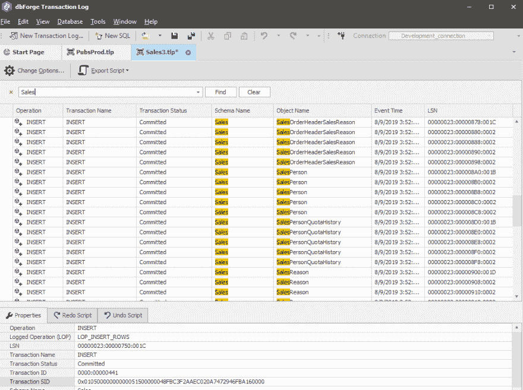

# dbForge 事务日志 Devart 的新工具

> 原文:[https://dev . to/devart software/db forge-transaction-log-a-new-tool-made-by-devart-2e7d](https://dev.to/devartsoftware/dbforge-transaction-log-a-new-tool-made-by-devart-2e7d)

*Devart 宣布发布一款新工具——db forge Transaction Log for SQL Server，它允许查看审计变更并执行回滚事务。*

[T2】](https://res.cloudinary.com/practicaldev/image/fetch/s--UupNMkOf--/c_limit%2Cf_auto%2Cfl_progressive%2Cq_auto%2Cw_880/https://i.ibb.co/zVpWgkJ/Transaction-Log.png)

Devart 是公认的面向开发人员和 DBA 的专业数据库管理软件供应商，它发布了全新的产品—[db forge Transaction Log for SQL Server](https://www.devart.com/dbforge/sql/transaction-log/)。解决方案是一个强大的事务日志阅读器工具。ldf 文件查看器，提供数据库中所有数据更改的详细信息。因此，它允许根据用户需求在不同级别上恢复不需要的事务。

核心事务日志的特性和功能:

◘ **导出输出**–事务日志信息可以显示在网格中，或者导出到 SQL 脚本、SQL 批量文件，或者直接导出到数据库；
◘ **详细的日志信息**–可以跟踪更改以及提交更改的时间，即使更改发生在事务日志安装之前；
◘ **交易可视化**–交易在一个定制的高性能网格中显示、分组和存储，该网格具有高级过滤选项。
◘ **数据恢复**–无意或恶意的数据库事务可以被逆转，以修复数据/从特定的数据丢失中恢复；
◘ **撤销或重做**–有选择地查看事务中的一个或所有操作，并创建相应的重放或重新滚动脚本。
◘ **事务隔离**–特定的 SQL Server 事务可以按照用户、日期、对象变更类型等进行隔离。

此外，Devart 声明它是产品的测试版，所以非常欢迎用户的反馈。开发人员认为，所有的建议都将在未来的版本中得到考虑。在 Devart 官方博客上了解有关事务日志的更多信息-[https://blog . Devart . com/performing-audit-changes-and-roll back-transactions-is-now-simple-than-ever . html](https://blog.devart.com/performing-audit-changes-and-rollback-transactions-is-now-simpler-than-ever.html)

**关于德瓦特**

Devart 是数据库工具和管理软件、ALM 解决方案、各种数据库服务器的数据提供商、数据集成和备份解决方案的领先开发商之一。该公司还实施网络和移动开发项目。
欲了解更多关于德瓦特的信息，请访问[https://www.devart.com/](https://www.devart.com/)