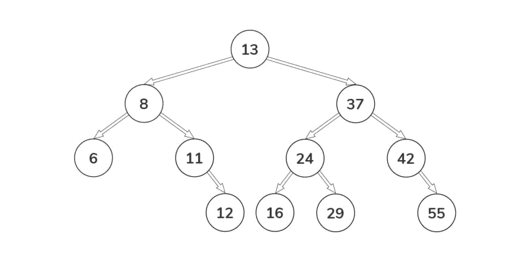
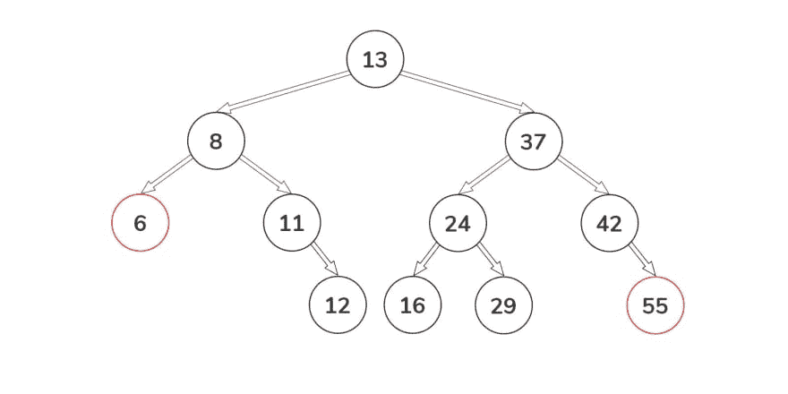

# 数据结构。JavaScript 中的二叉查找树(第 2 部分:实践)

> 原文：<https://dev.to/alexandrshy/data-structures-binary-search-tree-in-javascript-part-2-practice-18ei>

在之前的帖子[JavaScript 中的二叉查找树](https://dev.to/alexandrshy/data-structures-binary-search-tree-in-javascript-3om9)中，我们用 JavaScript 编写了自己的实现，并提供了一个基本接口。现在我们将尝试扩展它。

## 遍历

不像线性数据结构(数组、链表、栈等。)，它们只有一种逻辑遍历方式，所以可以用不同的方式遍历树。穿越二叉查找树的方式:

*   有序遍历
*   后序遍历
*   前序遍历

让我们更详细地关注每一个。

### 按顺序遍历

树遍历算法:

1.  遍历左边的子树
2.  拜访树根
3.  遍历右边的子树

对于所有的例子，我们将使用上一部分的二叉树

[](https://res.cloudinary.com/practicaldev/image/fetch/s--lnac2f-S--/c_limit%2Cf_auto%2Cfl_progressive%2Cq_auto%2Cw_880/https://thepracticaldev.s3.amazonaws.com/i/ybacgegn1ccjxh5d3xh7.jpg)

对于这个二叉查找树，这个方法应该返回这样一个数组`[6, 8, 11, 12, 13, 24, 29, 37, 42, 55]`

```
inOrder() {
  if (this.root === null) return null;
  const nodeList = [];
  const traverse = function(current) {
    if (current.left) traverse(current.left);
    nodeList.push(current.data);
    if (current.right) traverse(current.right);
  };
  traverse(this.root);
  return nodeList;
}; 
```

#### 算法

1.  如果根属性为空，则返回`null`
2.  创建变量`nodeList`来存储节点值
3.  创建方法`traverse`，该方法以一个节点作为参数
4.  根据我们之前宣布的算法，对树的所有元素递归调用`traverse`方法
5.  结果，我们返回了`nodeList`变量

检查结果

```
tree.inOrder(); // [6, 8, 11, 12, 13, 16, 24, 29, 37, 42, 55] 
```

### 后序遍历

树遍历算法:

1.  遍历左边的子树
2.  遍历右边的子树
3.  拜访树根

对于之前使用的二叉查找树，这个方法应该会返回这样一个数组`[6, 12, 11, 8, 16, 29, 24, 55, 42, 37, 13]`。

```
postOrder() {
  if (this.root === null) return null;
  const nodeList = [];
  const traverse = function(current) {
    if (current.left) traverse(current.left);
    if (current.right) traverse(current.right);
    nodeList.push(current.data);
  };
  traverse(this.root);
  return nodeList;
}; 
```

#### 算法

1.  如果根属性为空，则返回`null`
2.  创建变量`nodeList`来存储节点值
3.  创建方法`traverse`，该方法以一个节点作为参数
4.  根据我们之前宣布的算法，对树的所有元素递归调用`traverse`方法
5.  结果，我们返回了`nodeList`变量

检查结果

```
tree.postOrder(); // [6, 12, 11, 8, 16, 29, 24, 55, 42, 37, 13] 
```

### 前序遍历

树遍历算法:

1.  拜访树根
2.  遍历左边的子树
3.  遍历右边的子树

对于之前使用的二叉查找树，这个方法应该会返回这样一个数组`[13, 8, 6, 11, 12, 37, 24, 16, 29, 42, 55]`。

```
preOrder() {
  if (this.root === null) return null;
  const nodeList = [];
  const traverse = function(current) {
    nodeList.push(current.data);
    if (current.left) traverse(current.left);
    if (current.right) traverse(current.right);
  };
  traverse(this.root);
  return nodeList;
} 
```

#### 算法

1.  如果根属性为空，则返回`null`
2.  创建变量`nodeList`来存储节点值
3.  创建方法`traverse`，该方法以一个节点作为参数
4.  根据我们之前宣布的算法，对树的所有元素递归调用`traverse`方法
5.  结果，我们返回了`nodeList`变量

检查结果

```
console.log(tree.preOrder()); // [13, 8, 6, 11, 12, 37, 24, 16, 29, 42, 55] 
```

我们已经考虑了三种遍历二叉树的方法。这三种方法的主要思想是恰好访问每个节点一次。如您所见，这些方法的实现彼此非常相似，我们只访问每个节点一次。

## 查找最大和最小节点值

寻找二叉查找树中的最大或最小节点是一项非常常见的任务。

让我们再看看我们的树

[](https://res.cloudinary.com/practicaldev/image/fetch/s--eqXbZUsr--/c_limit%2Cf_auto%2Cfl_progressive%2Cq_auto%2Cw_880/https://thepracticaldev.s3.amazonaws.com/i/xb9u1gacmyytrjszjjgk.jpg)

对于此二叉查找树，最小值为 6，最大值为 55。我想你已经看到模式了🙂

### 找到最大值

因为在二叉查找树中，值已经被排序以获得最大值，所以我们需要获得正确子节点的值。

```
findMax() {
  if (this.root === null) return null;
  let current = this.root;
  if (!current) return null;
  while (current.right) {
    current = current.right;
  }
  return current.data;
}; 
```

#### 算法

1.  如果根属性为空，则返回`null`
2.  创建变量`current`这里我们将存储当前节点
3.  虽然当前节点有正确的子节点，但我们需要将值更新为`current`
4.  返回`current`值

检查之前考虑的树的结果。

```
console.log(tree.findMax()); // 55 
```

### 求最小值

现在让我们对左边的子节点做同样的事情，我们将得到最小值。真的就这么简单🙂

```
findMin() {
  if (this.root === null) return null;
  let current = this.root;
  if (!current) return null;
  while (current.left) {
    current = current.left;
  }
  return current.data;
}; 
```

#### 算法

1.  如果根属性为空，则返回`null`
2.  创建变量`current`这里我们将存储当前节点
3.  当当前节点有左子节点时，我们需要将值更新为`current`
4.  返回`current`值

检查之前考虑的树的结果。

```
console.log(tree.findMin()); // 6 
```

为了练习，您可以实现自己的附加方法。我将进入实际的部分。我接受 [LeetCode](http://leetcode.com/) 中的所有任务对于那些想在面试前练习解决问题的人来说，这是一个很好的服务。

## 同一棵树

### 问题

给定两个二叉树，写一个函数来检查它们是否相同。

两个二叉树被认为是相同的，如果它们在结构上是相同的，并且节点有相同的值。

### 举例

```
Input:     1         1
          / \       / \
         2   3     2   3

        [1,2,3],   [1,2,3]

Output: true 
```

### 例 2

```
Input:     1       1
          /         \
         2           2

        [1,2],   [1,null,2]

Output: false 
```

### 例 3

```
Input:     1         1
          / \       / \
         2   1     1   2

        [1,2,1],   [1,1,2]

Output: false 
```

### 解

解决这个问题最简单的策略是使用递归。我们需要比较两棵树的每个节点，如果它们相等就返回`true`。

```
/**
 * @param {TreeNode} tree1
 * @param {TreeNode} tree2
 * @returns {boolean}
 **/
const isSameTree = (tree1, tree2) => {
  if (!tree1 && !tree2) return true;
  if (!tree1 || !tree2) return false;
  return (
    tree1.data === tree2.data &&
    isSameTree(tree1.left, tree2.left) &&
    isSameTree(tree1.right, tree2.right)
  );
}; 
```

恭喜，我们解决了第一个问题🙂

*   [链接到 LeetCode](https://leetcode.com/problems/same-tree/) 注意:我们实现中的二叉树接口和网站上的是不同的
*   [链接到 js dild](https://jsfiddle.net/alexandrshy/tb50p8h3/15/)
*   [链接到 GitHub](https://github.com/Alexandrshy/articles/blob/master/algorithms/binary-search-tree-part-2/same-tree/same-tree.js)

## 合并两棵二叉树

### 问题

给定两个二叉树，想象当你把其中一个覆盖到另一个上时，两棵树的一些节点是重叠的，而另一些不是。

你需要把它们合并成一棵新的二叉树。合并规则是，如果两个节点重叠，则将节点值相加，作为合并节点的新值。否则，非空节点将被用作新树的节点。

### 例 1

```
Input:
    Tree 1           Tree 2
          1               2
         / \             / \
        3   2           1   3
       /                 \   \
      5                   4   7
Output:
Merged tree:
         3
        / \
       4   5
      / \   \
     5   4   7 
```

### 解

为了解决这个问题，我们需要完全遍历这两个二叉树。在每次迭代中，我们将创建一个新的节点，并检查是否有树`tree1`和`tree2`的节点。如果这是真的，我们向当前节点添加一个新值(两个节点的和)。然后，对于左右节点，我们调用`mergeTrees`函数。如果在任何一步，其中一棵树是空的，我们将返回另一棵树的子节点。在两棵树的所有节点都被完全遍历后，我们返回一棵新的二叉树。

```
/**
 * @param {TreeNode} tree1
 * @param {TreeNode} tree2
 * @returns {TreeNode}
 **/
const mergeTrees = (tree1, tree2) => {
  if (!tree1) return tree2;
  if (!tree2) return tree1;
  const root = new Node(tree1.data + tree2.data);
  root.left = mergeTrees(tree1 ? tree1.left : null, tree2 ? tree2.left : null);
  root.right = mergeTrees(
    tree1 ? tree1.right : null,
    tree2 ? tree2.right : null
  );
  return root;
}; 
```

注意:任务的所有条件都已经完成，LeetCode 接受这个决定，但是合并结果有问题。当合并两棵树时，会破坏右边子节点的逻辑。如果一棵树包含右子节点，而另一棵树不包含，则在合并后，右子节点可能会变得比父节点小。作为练习，你可以解决这个问题😉

*   [链接到 LeetCode](https://leetcode.com/problems/merge-two-binary-trees/)
*   [链接到 js dild](https://jsfiddle.net/alexandrshy/ke74fcsp/2/)
*   [链接到 GitHub](https://github.com/Alexandrshy/articles/blob/master/algorithms/binary-search-tree-part-2/merge-two-binary-trees/merge-two-binary-trees.js)

## 二叉树的直径

### 问题

给定一棵二叉树，你需要计算树的直径的长度。二叉树的直径是树中任意两个节点之间最长路径的长度。该路径可能通过也可能不通过根。

### 例 1

给定一棵二叉树

```
 4
      / \
     2   5
    / \
   1   3 
```

返回 3，这是路径`[1, 2, 4, 5]`或`[3, 2, 4, 5]`的长度。

注意:两个节点之间的路径长度由它们之间的边数表示。

### 解

在这个例子中，最长的路径穿过根。要计算这样一条路径的长度，只需查看左右分支的最大长度。为此，我们创建了`countDiameter`函数。这个函数将被递归调用，并计算每条路径的长度。但是最长的路径可能不经过中心，例如:

```
 9
      /
     8
    / \
   4   6
  /     \
 3       7
  \
    5 
```

这里最长的路径`[5, 3, 4, 8, 6, 7]`不经过中心。为此，我们将为树的每个元素递归调用`diameterOfBinaryTree`方法，然后使用`Math.max`找到最长的路径。这不是最好的选择，因为我们将不得不遍历每个节点很多次，但我认为这是直观的。

```
/**
 * Calculate diameter with center `root`
 * @param {TreeNode} root
 * @returns {number}
 */
const countDiameter = root => {
  if (!root) return 0;

  return 1 + Math.max(countDiameter(root.left), countDiameter(root.right));
};

/**
 * @param {TreeNode} root
 * @returns {number}
 */
const diameterOfBinaryTree = root => {
  if (!root) return 0;

  const center = countDiameter(root.left) + countDiameter(root.right);
  const left = diameterOfBinaryTree(root.left);
  const right = diameterOfBinaryTree(root.right);

  return Math.max(center, left, right);
}; 
```

实现已经准备好了，可以测试了👏

*   [链接到 LeetCode](https://leetcode.com/problems/diameter-of-binary-tree/)
*   [链接到 js dild](https://jsfiddle.net/alexandrshy/r0qz2nc9/)
*   [链接到 GitHub](https://github.com/Alexandrshy/articles/blob/master/algorithms/binary-search-tree-part-2/diameter-of-binary-tree/diameter-of-binary-tree.js)

我们已经分析了几个问题，我希望你明白如何与二分搜索法树合作以及如何解决类似的问题。在网站 [LeetCode](https://leetcode.com/) 和 [Hackerrank](https://hackerrank.com) 上，你可以找到各种主题的更有趣的挑战。我列了一个小任务清单，可以帮助你记住关于树的信息:

*   [二叉树的有序遍历](https://leetcode.com/problems/binary-tree-inorder-traversal/)
*   [对称树](https://leetcode.com/problems/symmetric-tree/)
*   [单值二叉树](https://leetcode.com/problems/univalued-binary-tree/)
*   [平衡二叉树](https://leetcode.com/problems/balanced-binary-tree/)

你可以在评论中分享你的决定或问题😀

感谢您的关注，祝您愉快👋