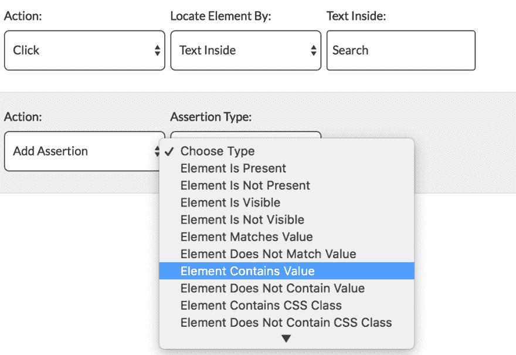
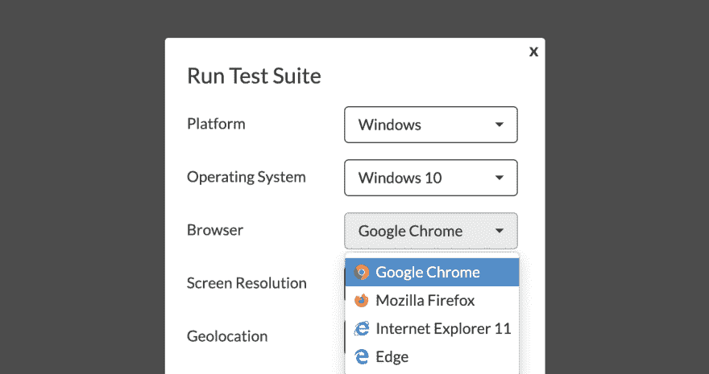
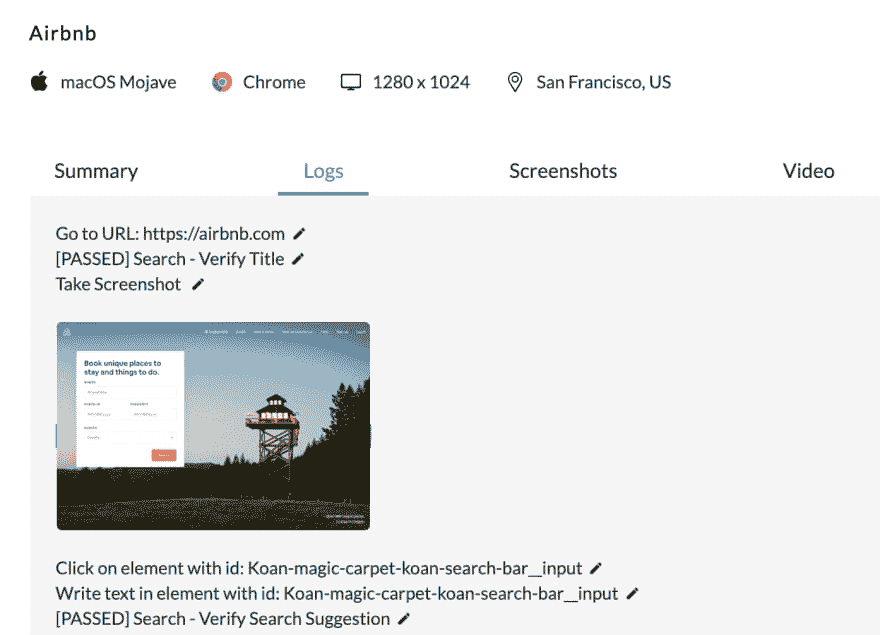
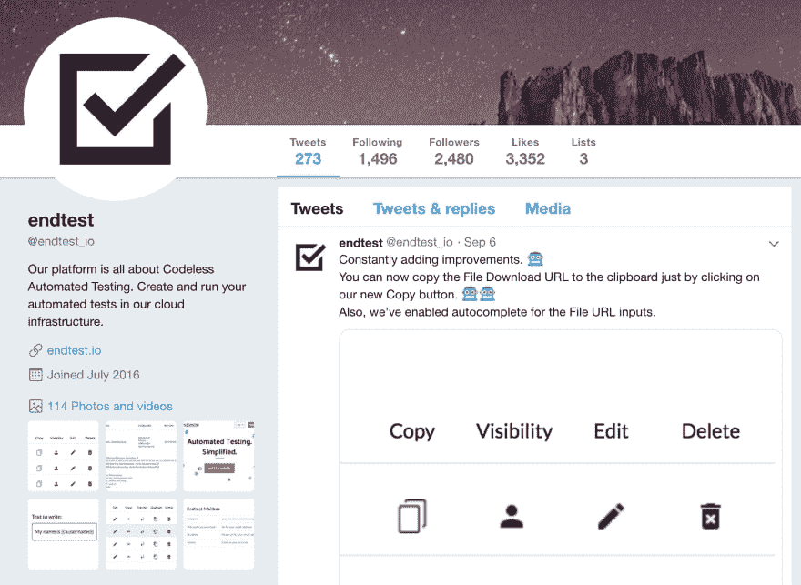
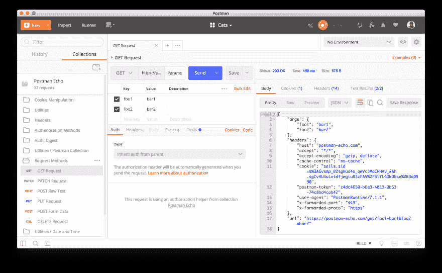
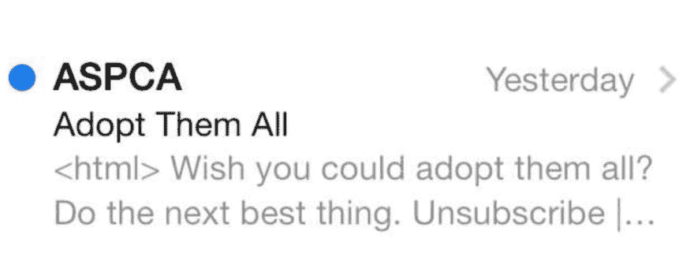
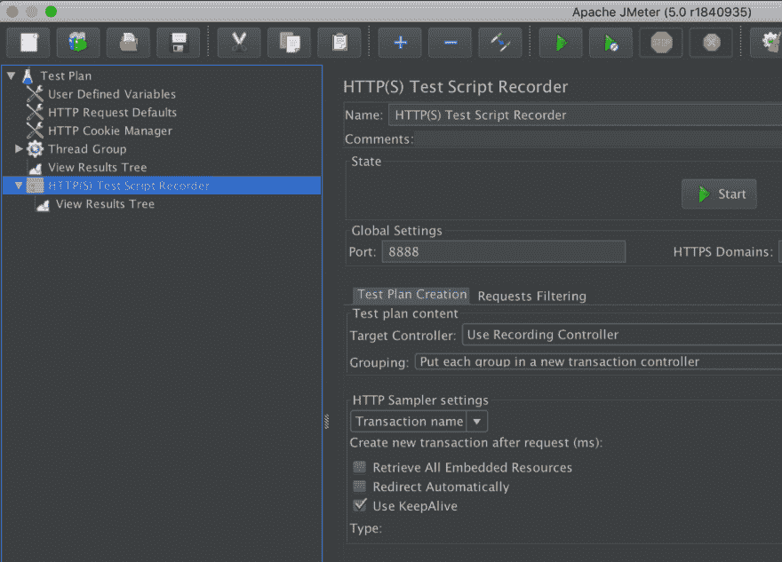
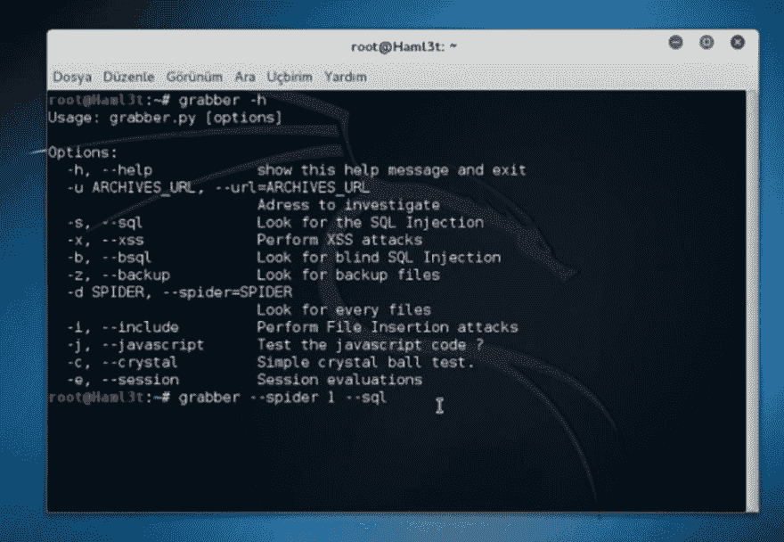

# 想要测试的开发人员的 5 个神奇工具

> 原文:[https://dev . to/razgandeanu/5-abilitic-tools-for-devs-who-want-to-test-2688](https://dev.to/razgandeanu/5-miraculous-tools-for-devs-who-want-to-test-2688)

众所周知，测试可以省去我们很多麻烦。但是，并不是每个人都在使用相同的工具，或者知道所有能帮助你的测试更加成功的优秀工具。

不要陷入顽固的开发人员的刻板印象中，他们完全依赖单元测试。你可能会后悔，比你想象的要快。

## **1。[Endtest](https://endtest.io)T5】**

一个允许你创建、管理和运行 Web 应用和本地移动应用(Android & iOS)的自动化测试的平台，而无需编写任何代码。
[https://www.youtube.com/embed/4DIVKcs--TA](https://www.youtube.com/embed/4DIVKcs--TA)
部分功能:
·跨浏览器网格、 在 Windows 和 macOS 机器上运行
自动化测试的无代码编辑器
支持 web 应用
支持原生和混合 Android 和 iOS 应用
测试执行的视频记录
详细日志
记录 Web 测试的 Chrome 扩展
移动应用的 Element Inspector
截图比较
CSV 文件的数据驱动测试
地理定位
电子邮件， Slack 和 Webhook 通知
If 语句和循环
变量和可重用组件
支持测试中的文件上传
end test API，用于与 CI/CD 系统集成
高级断言
end test 邮箱，用于测试电子邮件
自我修复测试

这是无代码测试编辑器:

当你想执行一个测试时，它看起来是这样的:

这些是测试执行的详细日志:

他们的[文档](https://endtest.io/guides/docs/how-to-create-web-tests/)棒极了。很多例子和视频。

您甚至可以在真实的移动设备上运行自动化测试:

[T2】](https://res.cloudinary.com/practicaldev/image/fetch/s--qLDt6iL9--/c_limit%2Cf_auto%2Cfl_progressive%2Cq_auto%2Cw_880/https://i.imgur.com/hxu10zo.png)

根据他们的 Twitter 账户，他们似乎每周都在增加新功能:

[T2】](https://res.cloudinary.com/practicaldev/image/fetch/s--TkG6nRqe--/c_limit%2Cf_auto%2Cfl_progressive%2Cq_auto%2Cw_880/https://thepracticaldev.s3.amazonaws.com/i/anwh5kg0qpnpmc29jshf.png)

## **2。[邮递员](https://www.getpostman.com/.io)T5】**

测试任何 API 的最简单方法。
[https://www.youtube.com/embed/YKalL1rVDOE](https://www.youtube.com/embed/YKalL1rVDOE)T2】

Postman 在过去几年中不断发展，现已成为监控 API 健康状况的完整解决方案。

一些特性:
·API 客户端
·请求链
·数据安全
·流量控制
·编排
·日志/文档
·API 监控
·货币化

[T2】](https://res.cloudinary.com/practicaldev/image/fetch/s--ZvbZMNLP--/c_limit%2Cf_auto%2Cfl_progressive%2Cq_auto%2Cw_880/https://thepracticaldev.s3.amazonaws.com/i/azzzrbaaf4j1zaq1zpjn.png)

## **3。[石蕊](https://litmus.com/)**

您可以使用 Litmus 来构建、测试和监控电子邮件。
[https://www.youtube.com/embed/fbyGwZtaeKo](https://www.youtube.com/embed/fbyGwZtaeKo)T2】

对我们来说，有趣的是在他们的众多电子邮件客户端中打开电子邮件的能力。

想知道您的电子邮件在 Outlook 2013 或 Apple Mail 中的外观吗？

你所要做的就是从 [Litmus](https://litmus.com/) 获取一个临时电子邮件地址，然后把你的邮件发送到那里。

你可以在电子邮件客户端的网站上直接看到。

测试你的电子邮件，你可能会避免这样的尴尬局面:

[T2】](https://res.cloudinary.com/practicaldev/image/fetch/s--yVH2Uci4--/c_limit%2Cf_auto%2Cfl_progressive%2Cq_auto%2Cw_880/https://thepracticaldev.s3.amazonaws.com/i/787p9rscf7xz2h8ghvrj.png)

[T2】](https://res.cloudinary.com/practicaldev/image/fetch/s--wSIfqo0o--/c_limit%2Cf_auto%2Cfl_progressive%2Cq_auto%2Cw_880/https://thepracticaldev.s3.amazonaws.com/i/cs786ev6r5yg5228rtv8.png)

## **4。[阿帕奇 JMeter](https://jmeter.apache.org/)T5】**

执行负载测试和测量性能的最佳工具。
[https://www.youtube.com/embed/mXGcBvWYl-U](https://www.youtube.com/embed/mXGcBvWYl-U)T2】

它最初是为测试 Web 应用程序而设计的，但后来扩展到了其他测试功能。

你可以用它来测试 SOAP，REST，FTP，数据库，LDAP，TCP，SMPT 等。

其他特性包括:
·全功能测试 IDE
·能够对多种不同的应用/服务器/协议类型进行负载测试
·完整且随时可呈现的动态 HTML 报告
·从流行的响应格式(HTML、JSON、XML 等)中提取数据

[T2】](https://res.cloudinary.com/practicaldev/image/fetch/s--utthSrlC--/c_limit%2Cf_auto%2Cfl_progressive%2Cq_auto%2Cw_880/https://thepracticaldev.s3.amazonaws.com/i/8v2yw2h743hkb58cofqg.png)

## **5。[抓取器](https://tools.kali.org/web-applications/grabber)T5】**

一个有用的 web 应用程序扫描器。现在，您可以将安全测试添加到您的清单中。
[https://www.youtube.com/embed/n52xTEogjEc](https://www.youtube.com/embed/n52xTEogjEc)

特性包括:
跨站点脚本
SQL 注入
文件包含
备份文件检查
简单 AJAX 检查
使用 PHP-SAT 对 PHP 应用程序进行混合分析/水晶球测试
JavaScript 源代码分析器
带 JavaScript Lint 的 JavaScript

[T2】](https://res.cloudinary.com/practicaldev/image/fetch/s--L_Mw2zQf--/c_limit%2Cf_auto%2Cfl_progressive%2Cq_auto%2Cw_880/https://thepracticaldev.s3.amazonaws.com/i/j5dgpgoo77q5exz3x82o.png)